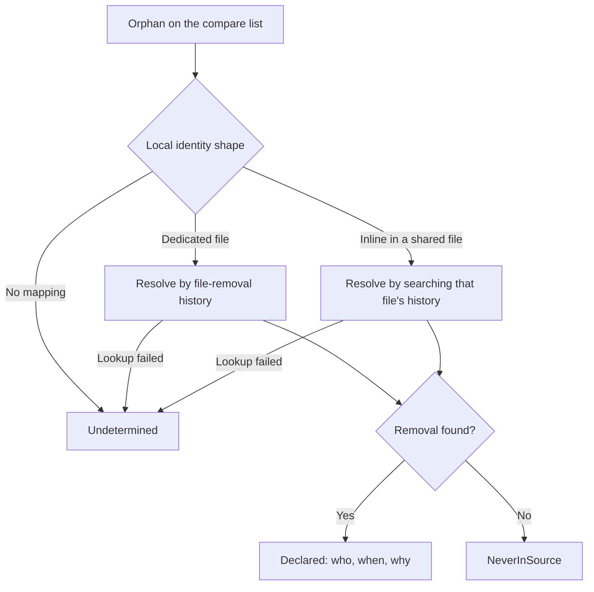
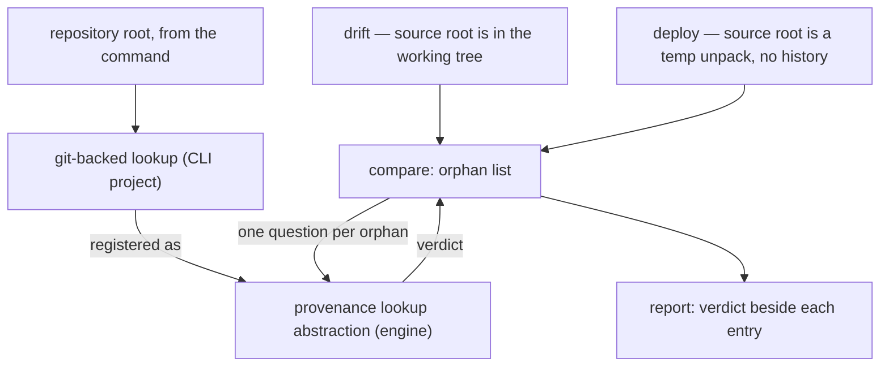

# Orphan Provenance - Plan

## Goal Capsule

- **Objective:** Attach a provenance verdict to every orphan Flowline reports — deliberately removed from source, never in the repository, or undeterminable — so the operator can decide on each one without relying on memory.
- **Product authority:** This plan owns the verdict and how it is surfaced. Turning verdicts into a confidence grade, and gating deletion on that grade, are not active scope.
- **Authority order:** Requirements win on behavior. Key Technical Decisions win on mechanism within those requirements. Units override neither.
- **Execution profile:** Additive change to a live deletion path. No component becomes newly deletable and no exit code moves (R9, R10) — a change that alters either is out of contract, not a judgement call.
- **Stop conditions:** Stop and surface rather than guess if resolving a verdict would require reading the target environment, if a unit cannot satisfy R9 or R10, or if the identity-shape mapping for a component type cannot be confirmed positively (KTD4).
- **Tail ownership:** This plan ends at a merged change with docs updated (U6). It does not carry a release.
- **Open blockers:** None.

---

## Product Contract

### Summary

Every orphan already on Flowline's compare list gains a provenance verdict: `Declared` (with the commit, author, date, and subject that removed it from source), `NeverInSource`, or `Undetermined`. Nothing changes about what Flowline deletes — the report gains a fact the operator currently supplies from memory.

### Problem Frame

Unmanaged solution imports are additive, so Dataverse never removes a component the source no longer declares. Flowline detects those orphans on every `drift` and `deploy`, but detection produces an ambiguous fact: the component is present in the environment and absent from source, and absence alone cannot distinguish *removed on purpose* from *never existed here*.

That ambiguity is why five of the eight handlers never delete. `RoleHandler` states the reason directly in its own header comment — Manual means human review before removal. Detection for those types is sound; the missing input is intent.

The operator already closes that gap by hand: they remove the component when they are sure it is no longer needed. Certainty is the bottleneck, not effort. When they are not sure, the orphan stays, and it accumulates.

The cost is not uniform across types. Removing a workflow or a connection reference is reversible from source. Removing a column destroys the values in it, so that decision needs the reason behind the deletion, not just the fact of it — and reason is the one thing a component-absent-from-source signal cannot carry.

### Key Decisions

- KD1. **Ask git per orphan; persist nothing.** (session-settled: user-approved — chosen over making the sync deletion record durable and machine-readable: a record only ever sees deletions made through `sync`, and the deletions an operator is least sure about are the other kind.) Governs R3.
- KD2. **No per-target deploy stamp.** `CompareAsync` already answers "what does this environment hold that source does not," live and per-environment, so a cached pointer to a prior deploy would be a staler proxy for a query that already runs.
- KD3. **Reasons now, grade later.** (session-settled: user-directed — chosen over shipping a confidence score in the same change: the score is the gate for auto-delete, and that is a separate decision.) Governs R1, R2.
- KD4. **The verdict is additive.** (session-settled: user-directed — nothing becomes newly deletable and no handler changes tier.) Governs R9, R10.
- KD5. **Behaviour splits by component type, not one policy.** (session-settled: user-directed — types whose deletion has no data side effect are the eventual auto-delete candidates; data-bearing types get the reason and the operator decides on cost.) This split is why the verdict must carry the removing commit's subject, not just a boolean. Governs R2.
- KD6. **`Undetermined` never collapses into `NeverInSource`.** A failed lookup rendered as "never yours" would mark a real deletion as safe to ignore, which is the inverted-safety failure the web-resource delete work already named for dependency lookups. Governs R8.

### Requirements

**The verdict**

- R1. Every orphan entry that reaches a report carries exactly one provenance verdict: `Declared`, `NeverInSource`, or `Undetermined`.
- R2. A `Declared` verdict carries the identity of the commit that removed the component from source: sha, author, date, and subject line.
- R3. The verdict is derived from the repository's existing history of the unpacked solution source. No deletion record is written, persisted, or read back.
- R4. Resolution follows the component's local-source identity shape: types with a dedicated file resolve by file-removal history, types declared inline within a shared file resolve by finding the commit whose diff removes the identifier from the component's own declaration.
- R12. The identity shape is declared by the handler that detected the orphan, not re-derived from its component type — several component types carry environment-assigned type codes that identify nothing on their own.

**Surfacing**

- R5. `drift` shows the verdict for every orphan it reports.
- R6. `deploy`'s orphan report shows the verdict using the same wording as `drift`.
- R7. A `Declared` orphan shows the removing commit's subject line as the stated reason for removal.
- R11. `deploy` states how far its verdicts can be trusted against the artifact it is importing, by route: a packed or cached build compares commits exactly; a supplied artifact inside a project matches its solution version against the versions in history and reports that the match is not proof; a supplied artifact in stand-alone mode skips resolution and says so.

**Boundaries and degradation**

- R8. Any lookup that fails, cannot run, or has no identity-shape mapping yields `Undetermined` — and so does an incomplete search, because `NeverInSource` requires affirmative evidence rather than the absence of a removal.
- R9. No handler changes its `HandlerStatus`, and no component type becomes newly deletable.
- R10. The verdict does not change the exit code of `drift` or `deploy`.

### Key Flows

- F1. Deciding on a reported orphan
  - **Trigger:** The operator runs `drift` against an environment and one or more orphans are reported.
  - **Steps:** Each orphan is listed with its verdict. For a `Declared` orphan the operator reads who removed it, when, and the commit subject. For a data-bearing type they weigh that reason against the cost of losing the data, then remove it or leave it. For a non-data-bearing type the reason is normally enough to remove it.
  - **Outcome:** Every reported orphan is either acted on or consciously left, with the basis for that decision visible in the report rather than recalled.
  - **Covered by:** R1, R2, R5, R7

- F2. An orphan nobody removed
  - **Trigger:** A component exists in the environment that was created outside the repository — in the Maker Portal, or before the project was cloned.
  - **Steps:** No removal exists in the source history, so the orphan is reported as `NeverInSource`.
  - **Outcome:** The operator can tell at a glance that this component was never theirs to delete, which today is indistinguishable from a deliberate removal.
  - **Covered by:** R1, R5

### Acceptance Examples

- AE1. Column removed from a table
  - **Covers R1, R2, R4, R7.**
  - **Given:** A column was removed from its table's entity definition in source and committed, and the column still exists in the target environment.
  - **When:** `drift` reports it as an orphan.
  - **Then:** The verdict is `Declared`, carrying the removing commit's sha, author, date, and subject.

- AE2. Component created outside the repository
  - **Covers R1, R5.**
  - **Given:** A web resource was created directly in the target environment and never existed in source.
  - **When:** `drift` reports it as an orphan.
  - **Then:** The verdict is `NeverInSource`.

- AE3. History not available
  - **Covers R8, KD6.**
  - **Given:** The repository has no history reaching the removal — a shallow CI clone, or a truncated checkout.
  - **When:** `drift` reports an orphan whose removal predates the available history.
  - **Then:** The verdict is `Undetermined`, and is neither rendered nor treated as `NeverInSource`.

- AE4. Consent flag is unaffected
  - **Covers R9, R10.**
  - **Given:** A web resource orphan with a `NeverInSource` verdict, and `--force delete-orphans` supplied.
  - **When:** `deploy` runs.
  - **Then:** The web resource is deleted exactly as it is today; the verdict is reported and changes nothing about the action or the exit code.

### Scope Boundaries

**Deferred for later**

- A confidence grade combining the verdict with signals the compare already computes (cross-solution membership, live dependents, running state).
- Auto-deleting orphans on a high-confidence verdict, and any promotion of a handler off `Report`.
- Structured (`--json`) output for `sync` and `drift`.

**Outside this work's identity**

- A persisted deletion record, in any form — including making the sync change summary machine-readable and reading it back. The blind spot is deletions that did not pass through `sync`.
- A per-target commit stamp written into the environment, and any git-tag-derived pointer standing in for one. See KD2.

<!-- ce-section: work-relationships -->
### How This Work Fits Together

This plan owns the provenance verdict and nothing else. The breakdown below is the current understanding, not a committed roadmap.

- Confidence grade over the verdict plus already-computed signals
  - Depends on this plan for its primary input.
- Auto-delete gated on high confidence
  - Depends on the grade. Still to decide which component types are ever eligible; data-bearing types are expected to stay out.
- Dependency-ordered deletion for orphan removal
  - Depends on the verdict as its declared-intent input, and on the confidence grade above for anything it deletes without asking. Does not share the orphan-to-source mapping this plan builds — it orders by the platform's dependency graph, keyed on object id and component type.
  - Still to decide: that work would replace the per-family handler set, so it has to carry the verdict through rather than re-derive it.

### Dependencies / Assumptions

- Assumes the project is a git repository whose history covers the removal. Flowline already requires a git repository for project commands, so the new failure mode is missing depth, not a missing repository.
- No mapping from an orphan entry back to a path in the unpacked solution source exists today. Building it is the substantive new surface. It is not simply the existing path-to-component parsing run backwards: that parser does not recognise every folder shape a handler can produce an orphan for, so the mapping has to cover shapes it never needed to.
- The three local-source identity shapes named in `CONCEPTS.md` are the complete set. A fourth shape, or a type whose local identity is not derivable from the orphan entry, resolves to `Undetermined` per R8.
- The **project** root is reachable at both command entry points — `RootFolder`, resolved by walking up for the `.flowline` config file. It is not the git repository root, and the two differ whenever the project sits below the repository root, so the lookup derives its working directory from it rather than treating it as the repository root outright. This is what lets KTD2 hold on the deploy path.
- The orphan-cleanup service is resolved through the type registrar before `RootFolder` is set, so the lookup cannot capture the root at construction from that field directly; a factory registration resolving the project root at container-build time is the expected shape.
- The verdict appears in the existing report with no new flag. Nothing in the dialogue asked for one, and the report has a single render path.

### Outstanding Questions

**Resolve before planning**

- None.

**Deferred to implementation**

- Reliability of the inline-shape search for short or common identifiers, where the searched string may appear in unrelated content in the same file. A type whose lookup cannot be trusted stays `Undetermined` per KTD5 rather than guessing.
- The exact git invocation per identity shape, and whether one lookup per orphan needs batching. Orphan lists are short in practice; the inline-shape search is the expensive path.
- Whether to warn once per run when the checkout cannot answer cheaply. This repository's CI checkout is treeless (`.github/workflows/ci.yml`: `filter: tree:0`), so history lookups there fetch on demand and fail without network. R8 already covers the outcome; the open question is only whether to say so.

### Sources / Research

- `src/Flowline.Core/OrphanCleanup/OrphanCleanupService.cs` — `CompareAsync` and its empty-source guards; `IsReportOnly`; the post-import re-evaluation and cross-solution action override.
- `src/Flowline.Core/OrphanCleanup/HandlerStatus.cs` and `src/Flowline.Core/OrphanCleanup/Handlers/` — the four-rung ladder and each handler's declared status. `RoleHandler` states the human-review rationale for `Report` in its header comment.
- `src/Flowline.Core/OrphanCleanup/DetectionContext.cs` — `DeleteOrphansConsent` and what `--force delete-orphans` promotes.
- `src/Flowline/Utils/SolutionChangeSummary.cs` — `ParseComponentPath` maps a source path to a component; the verdict lookup needs the inverse. `DiffEntityAttributes` and `GetHeadXmlAsync` show how sub-component changes are already recovered from git blobs.
- `src/Flowline.Core/WebResources/WebResourceDependencyChecker.cs` — the existing `RetrieveDependenciesForDeleteRequest` usage and its degrade-to-unchecked contract, the precedent KD6 follows.
- `CONCEPTS.md` — `Orphan component`, `Local-source identity shape`, `Handler status`. Canonical vocabulary for this work; use these terms rather than synonyms.
- `STRATEGY.md` — the "Drift detection + component cleanup" track, which names auto-delete as the reason teams reach for managed solutions.
- `docs/plans/2026-08-12-001-feat-webresource-delete-dependency-check-plan.md` — R11 there establishes the failed-lookup-degrades-to-unchecked rule this plan reuses.
- `docs/ideation/2026-08-08-flowline-capability-gaps-ideation.html` — ideas 4 and 6. This plan supersedes idea 4's stamped-pointer mechanism per KD2.
- `docs/solutions/design-patterns/reverse-relationship-inverts-what-orphaned-means.md` — "unknown is not absent, it is we lack evidence of ownership." The reason R8 requires affirmative evidence for `NeverInSource`.
- `docs/solutions/logic-errors/sync-overwrites-uncommitted-src-without-warning-2026-05-15.md` — the repo's git-invocation conventions: explicit working directory, split output on both `\r` and `\n`, non-zero exit throws by default.
- `docs/solutions/design-patterns/cached-advice-goes-stale-once-acted-on.md` — cache the input to a decision, never the decision. The basis for KTD6.
- `tests/Flowline.Tests/SolutionChangeSummaryTests.cs` — the only existing fixture that builds a real temporary git repository for a test, duplicated inline twice in that file.

---

## Planning Contract

**Product Contract preservation:** unchanged in scope. R8 gained one qualifier making the affirmative-evidence rule explicit, and three questions that were parked for planning are now resolved into KTD2, KTD5 and KTD6 plus two assumptions.

### Key Technical Decisions

- KTD1. **The engine declares the lookup; the CLI supplies it.** `Flowline.Core` owns a provenance-lookup abstraction and `Flowline` implements it with the existing git plumbing. Core has no subprocess library and the report renders from inside Core, so the verdict must be resolvable there without Core reaching across the one-way project boundary. (session-settled: user-approved — chosen over adding a subprocess package reference to `Flowline.Core`: keeps the boundary compiler-enforced and lets engine tests fake the lookup instead of building git repositories.) Governs R3, R5, R6.
- KTD2. **The lookup is anchored to the checkout, not to the solution source root it was handed.** On deploy the source root is a temp extraction of the packed artifact and has no history at all, so paths are rebased onto the checkout before any git command runs. (session-settled: user-directed — chosen over reporting verdicts on `drift` only, and over answering only when the artifact matches the checkout.) Governs R5, R6, R11.
- KTD3. **The verdict is an explicit three-case value on the orphan entry, not a nullable field.** The neighbouring dependents field overloads `null` to mean both "not applicable" and "lookup faulted"; R8 needs those distinguishable, and an unresolved entry must default to `Undetermined`. Governs R1, R8.
- KTD4. **The detecting handler declares the identity shape; the locator consumes it.** Connection references, copilots and the custom API family carry environment-assigned component-type codes, so a locator dispatching on the code has nothing to confirm against — but the handler that matched the orphan already knows what it matched. Declaring the shape at detection is the only positive answer available. Governs R4, R12.
- KTD5. **Types with a file of their own land first; inline-declared types read `Undetermined` until their lookup is trusted.** (session-settled: user-directed — chosen over holding the feature until columns work: R8 makes a partial rollout honest rather than misleading.) Governs R4, R8.
- KTD6. **No verdict is cached across runs.** Each run asks git fresh, so a failed lookup can never persist as an answer. Governs R3.
- KTD7. **The verdict renders beside the existing dependents block, through the one existing report path.** Governs R5, R6, R7.

### High-Level Technical Design

The seam is the whole design. Both commands reach the same compare and the same report; only the CLI-side adapter touches git, and it is anchored to the repository root rather than to whichever source root the command supplied.

### Sequencing

U1 defines the shared types, so it lands first. U2 and U3 are independent of each other and both depend only on U1 — the mapping is pure logic, the adapter is pure git. U4 joins them and is where R9 and R10 are proved. U5 is the user-facing surface and needs U4. U6 follows the behavior it documents.

---

## Implementation Units

### U1. Provenance verdict and lookup abstraction

- **Goal:** Introduce the verdict type and the lookup abstraction the engine will call, with no implementation behind it.
- **Requirements:** R1, R2, R12
- **Dependencies:** none
- **Files:** `src/Flowline.Core/OrphanCleanup/ComponentProvenance.cs` (new), `src/Flowline.Core/OrphanCleanup/IComponentProvenanceLookup.cs` (new), `src/Flowline.Core/OrphanCleanup/OrphanCleanupService.cs` (add the verdict and identity-shape fields to `OrphanEntry`)
- **Approach:**
  1. Model the verdict as three cases per KTD3, with the removed case carrying commit sha, author, date and subject.
  2. Add the identity-shape field the handlers declare and the locator consumes, per KTD4.
  3. Default the new verdict field to the undetermined case so an entry that never reaches the lookup can never read as never-in-repository.
  4. Keep the abstraction free of Dataverse types — it takes what identifies a component locally and returns a verdict.
- **Patterns to follow:** `OrphanEntry`'s existing optional-field shape (`Dependents`), and `HandlerStatus.cs` for a small engine-owned enum with per-case documentation.
- **Test expectation:** none — type and abstraction declarations only, exercised by U2 through U5.
- **Verification:** `Flowline.Core` still compiles with no new package reference.

### U2. Map an orphan to its local-source identity

- **Goal:** Resolve an orphan entry to the source location its declared identity shape implies, or to nothing.
- **Requirements:** R4, R8, R12
- **Dependencies:** U1
- **Files:** `src/Flowline.Core/OrphanCleanup/ComponentSourceLocator.cs` (new), `src/Flowline.Core/OrphanCleanup/Handlers/` (each handler declares its shape), `tests/Flowline.Core.Tests/OrphanCleanup/ComponentSourceLocatorTests.cs` (new)
- **Approach:**
  1. Each handler declares the identity shape — own file, schema-named folder, or inline declaration in a shared file — on the entries it produces, per KTD4. It already knows what it matched.
  2. The locator consumes the declared shape and returns which file to interrogate and, for the inline shape, the identifier to find inside it.
  3. Return the path **relative to the solution source root**; U3 rebases it onto the checkout. Do not build an absolute path here.
  4. An entry with no declared shape returns nothing rather than a best guess.
- **Patterns to follow:** `ComponentClassifier`'s per-shape scan methods encode where each type's local identity lives; the declared shape should name the same shapes rather than introduce a parallel vocabulary.
- **Test scenarios:**
  - A role resolves to its own file under the roles folder.
  - A web resource resolves to its file path under the web resources folder.
  - A connection reference resolves to the shared customizations file plus its logical name.
  - A copilot resolves to its schema-named folder.
  - A column resolves to its owning entity file plus its logical name.
  - An entry with no declared shape returns nothing, and does not fall through to another shape's path.
  - A connection-reference orphan resolves correctly under two different environment-assigned component-type codes, proving resolution does not depend on the numeric code.
  - Every returned path is relative to the solution source root, never absolute.
- **Verification:** every shape in `CONCEPTS.md` has a passing case in both directions — mapped correctly, and undeclared entries returning nothing.

### U3. Git-backed lookup in the CLI project

- **Goal:** Implement the abstraction against a real repository.
- **Requirements:** R2, R3, R8
- **Dependencies:** U1
- **Files:** `src/Flowline/Services/GitComponentProvenanceLookup.cs` (new), `tests/Flowline.Tests/GitComponentProvenanceLookupTests.cs` (new)
- **Approach:**
  1. Take the project root per KTD2 and run every git command with it as the explicit working directory. Rebase the source-root-relative path U2 returns onto the checkout's solution source before building a pathspec — on deploy the compare ran against a temp extraction, so an unrebased path points outside the repository entirely.
  2. Probe the checkout **once per run** for shallow or partial-clone state. When either holds, short-circuit every lookup to undetermined and issue no history queries at all — a partial clone would otherwise fetch every historical version of a shared file on demand.
  3. For a file-shaped location, ask git whether that path was removed and read the removing commit's identity.
  4. For an inline-shaped location, find the commit whose diff removes the identifier **from the component's own declaration element** — an occurrence-count change is not enough, because the same identifier appears in forms, views and ribbon definitions in the same file.
  5. Define complete: the checkout is not shallow or partial, the path was rebased successfully, and the search covered the file's full reachable history. Never-in-repository requires all three; every other not-found outcome is undetermined, as is any non-zero exit, ambiguous result, addition-only match, or more than one candidate commit.
  6. Cache nothing across runs, per KTD6.
- **Execution note:** Write the undetermined paths first. The failure modes are the requirement here, and they are the ones a happy-path-first implementation quietly gets backwards.
- **Patterns to follow:** `GitUtils` for CliWrap invocation and explicit working directory; split command output on both `\r` and `\n`; `SolutionChangeSummary.ResolveXmlNameAsync` for recovering information about a file that no longer exists on disk.
- **Test scenarios:**
  - A file committed then removed resolves to removed, with the removing commit's sha, author, date and subject.
  - A file that exists and was never removed, in a checkout whose history is complete, resolves to never-in-repository.
  - A file that never existed, in a checkout whose history is complete, resolves to never-in-repository.
  - A path the locator mapped incorrectly resolves to undetermined, never to never-in-repository.
  - An identifier removed from its own declaration in a shared file resolves to removed, with that commit's identity.
  - An identifier removed from a referencing element only — a view or form entry — resolves to undetermined, not to that commit.
  - An identifier whose only matching commit is an addition resolves to undetermined.
  - More than one candidate commit resolves to undetermined.
  - A shallow checkout resolves to undetermined without issuing any history query.
  - A partial-clone checkout resolves to undetermined with no network access.
  - A deploy-shaped lookup, where the compare source root is a temp directory, resolves against the checkout and never returns never-in-repository for a path it could not rebase.
  - A git invocation that fails resolves to undetermined and does not throw.
  - Two consecutive lookups for the same component both invoke git — no memoisation.
- **Verification:** the suite builds its own temporary repository and passes on a clean checkout with no network.

### U4. Resolve verdicts on the compare path

- **Goal:** Attach a verdict to every orphan before the report renders, on both commands.
- **Requirements:** R1, R5, R6, R9, R10
- **Dependencies:** U1, U2, U3
- **Files:** `src/Flowline.Core/OrphanCleanup/OrphanCleanupService.cs`, `src/Flowline.Core/OrphanCleanup/DetectionContext.cs`, `src/Flowline/Program.cs`, `src/Flowline/Commands/DriftCommand.cs`, `src/Flowline/Commands/DeployCommand.cs`, `tests/Flowline.Core.Tests/OrphanCleanupServiceTests.cs`
- **Approach:**
  1. Register the CLI adapter against the engine abstraction, constructed with the repository root each command already holds.
  2. Resolve verdicts for the compared entries after classification and before the report, so both commands inherit it from the one path.
  3. Treat an absent registration as undetermined for every entry rather than as a failure — the engine must stay runnable without a repository.
- **Patterns to follow:** the existing handler registration in `Program.cs`, which is how the engine already receives collaborators it does not construct.
- **Test scenarios:**
  - Every returned entry carries a verdict, including entries a handler marked report-only.
  - A fake lookup returning removed surfaces that verdict on the matching entry and no other.
  - With no lookup registered, every entry reads undetermined and the compare still succeeds.
  - A lookup that throws leaves the entry undetermined and does not fail the compare.
  - Covers R9. No entry's action or report-only flag differs from the same compare run without a lookup.
  - Covers R10. Drift's exit code for the same entry set is identical with and without verdicts.
  - Resolving the orphan-cleanup collaborators through the real command registration supplies a git-backed lookup — an unwired adapter fails this gate rather than degrading to undetermined on every run.
- **Verification:** an existing orphan-cleanup test run shows no change in actions, priorities or exit codes.

### U5. Render the verdict

- **Goal:** Show each entry's verdict, and the removing commit's subject as the stated reason.
- **Requirements:** R5, R6, R7, R8, R11
- **Dependencies:** U4
- **Files:** `src/Flowline.Core/OrphanCleanup/OrphanCleanupService.cs`, `src/Flowline/Commands/DeployCommand.cs`, `tests/Flowline.Core.Tests/OrphanCleanupServiceTests.cs`, `tests/Flowline.Tests/DeployCommandProvenanceTests.cs` (new — that suite is split per topic; there is no `DeployCommandTests.cs`)
- **Approach:**
  1. Add a render step called alongside the existing dependents render, so both the actionable and report-only branches carry it (KTD7).
  2. Render removed with who, when and the commit subject; render never-in-repository plainly; render undetermined as its own line that cannot be read as never-in-repository.
  3. Escape commit subjects before they reach the console — they are arbitrary user text.
  4. Satisfy R11 from the deploy command by route; the engine's report stays commit-agnostic. A packed or cached build compares commits exactly. A supplied artifact inside a project reads its solution version from the artifact manifest, looks for that version in the checkout's history, and reports the verdicts with a not-certain warning. A supplied artifact in stand-alone mode skips resolution and says so.
- **Patterns to follow:** `RenderWebResourceDependents`, including its dim treatment of the could-not-check case, which is the nearest existing precedent for a degraded state.
- **Test scenarios:**
  - A removed verdict renders the author, the date and the commit subject.
  - A never-in-repository verdict renders as such and mentions no commit.
  - An undetermined verdict renders its own wording, and that wording is not the never-in-repository wording.
  - A commit subject containing console markup characters renders literally.
  - Verdict lines appear under both the actionable and the report-only branch.
  - Covers R11. A packed or cached deploy whose commit matches says nothing extra; one whose commit differs states that verdicts describe the checkout.
  - Covers R11. A supplied artifact inside a project whose solution version is found in history resolves verdicts with a not-certain warning; one whose version is absent from history says the artifact could not be placed.
  - Covers R11. A supplied artifact in stand-alone mode skips resolution and says so.
- **Verification:** run `drift` from a Release build against a project with a known removed component and read the output; check the new lines against `docs/tone-of-voice.md`.

### U6. Document the verdict

- **Goal:** Update the user-facing documentation the change affects.
- **Requirements:** R5, R6, R7
- **Dependencies:** U5
- **Files:** `CHANGELOG.md`, `README.md` (only if it describes drift output), `../Flowline.wiki/Command-Reference.md`, `../Flowline.wiki/Known-Limitations.md`
- **Approach:**
  1. Describe the three verdicts and what each means for the operator's decision.
  2. Record in known limitations which identity shapes report undetermined for now (KTD5), and that a checkout without full history cannot answer.
- **Test expectation:** none — documentation.
- **Verification:** if the wiki checkout is not present alongside the repository, say so rather than skipping it silently.

---

## Verification Contract

| Gate | Command | Applies to |
|---|---|---|
| Build | `dotnet build Flowline.slnx` | U1–U5 |
| Engine tests | `dotnet test Flowline.slnx --filter FullyQualifiedName~Flowline.Core.Tests` | U1, U2, U4, U5 |
| CLI tests | `dotnet test Flowline.slnx --filter FullyQualifiedName~Flowline.Tests` | U3 |
| Full suite | `dotnet test Flowline.slnx` | before finishing — the change touches a shared path |
| Output check | `dotnet build Flowline.slnx -c Release`, then run `drift` against a real project | U5 |

The output check must use a Release build. A Debug build propagates exceptions instead of rendering them, so error output looks broken when it is not.

Three gates are behavioral rather than command-shaped. Two are regressions rather than features: the orphan actions and priorities produced for a given entry set must be identical before and after (R9), and drift's exit code for that set must be unchanged (R10). The third guards against an inert feature — the CLI test gate must fail when the lookup is not registered, so dropped wiring cannot ship as a run of undetermined verdicts (U4).

---

## Definition of Done

Global:

- Every orphan reaching a report carries a verdict, and no code path can leave one unset.
- No handler's status changed, no component type became newly deletable, and no exit code moved.
- Undetermined is never rendered or treated as never-in-repository, on any path.
- The engine project still has no subprocess package reference, and still does not reference the CLI project.
- Verdict lookups run against a real repository in tests, without network access.
- New user-facing lines follow `docs/tone-of-voice.md`.
- Documentation states which identity shapes are answerable today.
- No abandoned or experimental code from approaches that did not work out remains in the diff.

Per unit: each unit is done when its own test scenarios pass and the gates that apply to it are green.

---

## Deferred / Open Questions

### From 2026-08-14 review

- **The column acceptance example conflicts with the settled rollout order.** AE1 states unconditionally that a removed column resolves to `Declared`; KTD5 allows inline-declared types to read `Undetermined` until their lookup is trusted, and no unit holds that gate. An implementer either violates the rollout decision or watches the plan's lead example fail while the completion criteria still pass. Resolve before U2 and U3 begin: restate AE1 as deferred and promote a file-shaped example as the landing gate, or drop the inline deferral. (product-lens, adversarial)
