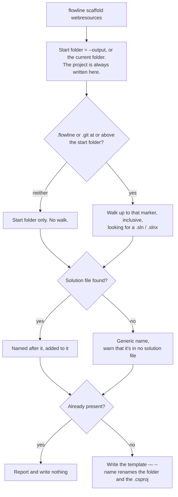
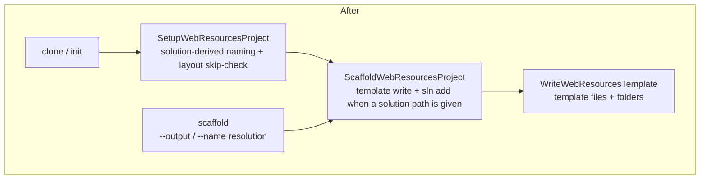

# Scaffold WebResources - Plan

## Goal Capsule

- **Objective:** Add `flowline scaffold webresources`, a command that writes the WebResources project template into a folder without touching Dataverse — added to the nearest solution file when there is one, standing alone when there isn't.
- **Product authority:** This plan owns the `scaffold` command, its `webresources` part, and its flags. `scaffold plugins` and `scaffold agents` are named as deferred, not active scope.
- **Authority order:** Requirements win on behavior. Key Decisions win on framing within those requirements. Key Technical Decisions win on mechanism within those requirements. Units override neither.
- **Execution profile:** Additive, with one behavior-preserving refactor of shared code (U1). `clone` and `init` must produce byte-identical scaffolds before and after — a change that alters either is out of contract, not a judgement call.
- **Stop conditions:** Stop and surface rather than guess if adding the project to a solution file would require a Dataverse call, if U1 cannot preserve `clone` and `init` behavior, or if skipping the prerequisite probe (KTD2) turns out to break an assumption the base command relies on later.
- **Tail ownership:** This plan ends at a merged change with README, wiki, and changelog updated (U6). It does not carry a release.
- **Product Contract preservation:** changed three times.

  *At implementation:* R15 added (refuse a template-file collision rather than truncating it). R14 (`--dry-run`) was added from the repo's agent-CLI contract and then removed at the user's direction: that rule's models write irreversibly to Dataverse, while scaffold writes deletable local files, so the preview earned nothing R3 and R12 did not already give. R15 is what it was standing in for. R7 and AE7 corrected: the finish message stays, but the claim that its push step runs for an unauthenticated user was false — `ProfileResolutionService.ResolveAsync` throws `NotAuthenticated` when no profile matches the URL. The blog-reader persona was dropped from the Problem Frame and F1 at the user's direction; the remaining audience is a user working outside project mode. Dependencies/Assumptions corrected: the two modes share an extracted template-writing core rather than the existing scaffold method unchanged (KTD1).

  *Post-ship, second pass (2026-08-16, user-directed):* the solution-file search became a bounded upward walk (R20, KTD7, KTD10, KTD11), the finish message dropped its command recipe in favour of reporting whether the project reached a solution file (R21 replaces R7), `--name` gained its own already-there rule plus a second-project refusal (R22, R23, KTD12), and the word "registered" was retired from this command's user-facing text because `CONCEPTS.md` gives it to plugin step registration (R24). `--dry-run` was refused a second time and is closed.

  *Post-ship, third pass (2026-08-16, user-directed):* KTD10 and KTD11 reversed — the project is written where the user is standing and `--output` needs no special case (R19). `flowline sln add` adopted the same bounded search (R25), which fixes a latent bug of its own. The one-WebResources-project rule was confirmed as universal rather than `--name`-only (R23).

  *Post-ship (2026-08-16, user-directed):* the two-mode design was removed. The mode split existed to pick a project **file name**, and that name turned out to be cosmetic — `WebResourcesProjectResolver` identifies the project by content signals, never by name, and the project emits no assembly. So R6, R8–R11, KD5, KD6, KD8, KTD4, AE6, AE8, AE9 are **superseded**: they are kept below, struck through, with what replaced them. R3 (announce the mode) falls with the modes it announced. Two flags were added — R16 (`--output`) and R17 (`--name`) — with AE12–AE19. Everything R2, R5, R7, R12, R13, R15 required still holds unchanged.
- **Open blockers:** None.

---

## Product Contract

### Summary

A new top-level `scaffold` command (alias `new`) whose first part is `webresources`. It writes the WebResources template into one folder and asks one question about it: where is the nearest solution file? If there is one, the project is named after it, written beside it, and added to it. If it doesn't, the template lands alone, so a reader can go from an empty directory to a buildable web resource project and push it with the standalone push that already exists. `--output` moves the target folder; `--name` names the project folder and its `.csproj`. Config is never read for the decision.

### Problem Frame

The WebResources project template is reachable today only as a side effect of `clone` or `init` — both of which connect to Dataverse, and both of which exist to bring a whole solution into a repo. Someone who wants the template itself has no command for it.

A user who works without project mode still wants the template's build setup, and today has to hand-copy files out of the Flowline repository.

There is a second, narrower gap on the same surface. An existing Flowline repo with no WebResources project — a plugin-only repo, or one migrated from spkl or Daxif — can only acquire one by re-running `clone`, which requires authentication and a live environment to do work that is entirely local.

### Key Decisions

- KD1. **A Flowline subcommand, not a published template package.** (session-settled: user-directed — chosen over shipping a `dotnet new` template: it promotes the CLI to a new reader, and avoids maintaining a second artifact.) Governs R1, R2.
- KD2. **The command is `scaffold`, with `new` as an alias.** (session-settled: user-directed — chosen over an `add` branch and over `init webresources`: first-level commands are verbs, `add` is too broad, and `init` already takes a solution name in the same positional slot.) Governs R1.
- KD3. **One command with a part positional, not a branch.** (session-settled: user-approved — chosen over a `scaffold` branch: Spectre's branch configurator exposes no description or examples.) `scaffold webresources` parses identically under either shape, so a later promotion to a branch leaves that invocation untouched; bare `scaffold` does change, from a missing-argument error to sub-help. Governs R1, R4.
- KD4. **Standalone writes templates and nothing else.** (session-settled: user-directed — chosen over also writing a solution file, or a `.flowline` stub: smallest surface, and the standalone push path already closes the loop without either.) Governs R5, R6.
- ~~KD5. **The command detects its mode rather than behaving uniformly.**~~ **Superseded by KD9.**
- ~~KD6. **The resolved mode is announced before anything is written.**~~ **Superseded by KD9** — with one path there is no mode to announce, and `--output` makes the target explicit where the upward walk made it a surprise.
- KD7. **No graduation path between the two modes.** (session-settled: user-directed.) Survives KD9 in the only form it still has: `scaffold` creates a WebResources project where there is none, and does not migrate, rename, or re-register one that already exists. Governs R12.
- ~~KD8. **Half a project fails; it does not degrade to standalone.**~~ **Superseded by KD9** — with `.flowline` out of the decision there is no "half a project" state to detect.
- KD9. **One path keyed on the solution file, not two modes keyed on `.flowline`.** (session-settled: user-directed, 2026-08-16 — chosen over keeping the mode split: the split's only output was a project **file name**, and that name is cosmetic. The WebResources project is `Microsoft.Build.NoTargets`, so no name escapes the repo, and `WebResourcesProjectResolver` identifies it by content signals rather than by name. A config read that buys a cosmetic prefix is not worth a branch, an enum, an announcement, and two failure paths.) The command asks one question — where is the solution file? — and adds the project to it when there is one. Governs R3, R6, R8, R9, R10, R11.
- KD10. **`--output` moves the whole target, lookup included.** (session-settled: user-directed — chosen over an output flag that only moves where files land: two rules that can disagree about which solution file a scaffold lands in is the ambiguity the mode split already cost us once.) **Narrowed by KTD11:** the lookup moves with it, but does not walk *above* it — a folder the user named outright is not second-guessed. Governs R16.
- KD11. **`--name` names the folder and the project file together.** (session-settled: user-directed — chosen over naming only the `.csproj`: a project file and the folder around it disagreeing is something someone has to decode later, and the name is cosmetic in both places anyway.) Governs R17.

### Requirements

**Command surface**

- R1. A top-level `scaffold` command, aliased `new`, takes one required positional naming the part to scaffold.
- R2. The command completes without a Dataverse connection, authentication, or network access.
- ~~R3. The command states which mode it resolved before it writes anything.~~ **Superseded by KD9** — no modes, nothing to announce.
- R4. `webresources` is the only accepted part value; any other value fails as a validation error that names the accepted values.
- R16. `--output <PATH>` scaffolds into that folder instead of the current one, and the solution-file lookup moves with it. The folder is created when missing.
- R17. `--name <NAME>` names both the project folder and its `.csproj`. A name Flowline would read as a test project, and a name that is a path rather than a folder name, are both refused as validation errors.

**What gets written**

- R5. The command writes the WebResources project folder: the project file, the build and lint configuration, the README, the example sources under `src/`, and empty `public/` and `dist/` folders. It writes nothing else — no solution file, no `.flowline`.
- ~~R6. The project file standalone mode writes is named `WebResources.csproj`.~~ **Superseded by R18.**
- R18. The project file is named after `--name` when given; otherwise after the solution file in the target folder; otherwise `WebResources.csproj`. The folder is `--name` when given, otherwise `WebResources`.
- ~~R7. When the target folder holds no `.flowline`, the finish message names the commands that take the user from the scaffolded folder to a pushed web resource.~~ **Superseded by R21** (user-directed: the recipe was more output than the moment warranted).
- R21. The run reports, without `--verbose`, whether the project reached a solution file: the project file and the solution file it was added to, or a warning that it is in none and what that costs, naming both the fix and the `push --webresources` form that needs no solution file. It closes with one line naming `push` as the next command, with no recipe.
- R24. User-facing text calls this act "added to the solution file", never "registered" — `CONCEPTS.md` gives that word to plugin step registration in Dataverse, and one term for two acts is what makes output ambiguous.

**Registration**

- ~~R8. Inside a Flowline project, the command names the project file after the configured solution and registers it in the solution file — the same result `clone` produces.~~ **Superseded by R19.**
- ~~R9. Project mode requires both a `.flowline` and a solution file.~~ **Superseded by R19** — the solution file alone is the trigger, and it also supplies the name.
- ~~R10. A folder holding a `.flowline` but no solution file fails rather than falling back to standalone mode.~~ **Superseded by KD9** — that folder now gets a generically-named project, the same as any other folder without a solution file.
- ~~R11. A folder holding a solution file but no `.flowline` is not a Flowline project, and gets standalone mode.~~ **Reversed by KD9** — that folder is exactly the registration case now.
- R19. The project is always written into the folder the run started from. When a solution file is found, the command adds the project to it and takes the project's name from it; when none is found, it writes the template and touches nothing else.
- R20. The solution file is searched for upward from the start folder, bounded by the nearest folder holding `.flowline` or `.git` — inclusive, and never past it. When neither marker exists anywhere above the start folder, there is no upward search at all and only the start folder is examined.
- R25. `flowline sln add` locates its solution file by the same rule as R20.
- R22. `--name` targets one specific project: whether that project already exists is decided by its own path, not by the default `WebResources/` folder.
- R23. One WebResources project per Flowline project. `--name` is refused when the solution file already records one; without `--name` the existing project is reported and the run converges instead.

**Safety**

- R12. When a WebResources project is already present, the command reports that and writes nothing. There is no flag to overwrite one.
- R15. When any file the template would write is already on disk without a project file beside it, the command refuses and names the colliding file rather than truncating it.

**Documentation**

- R13. The public command surface documentation records the new command: the README command list, the wiki command reference, and the changelog.



### Key Flows

- F1. Scaffold in an empty folder
  - **Trigger:** A user runs the command in an empty directory.
  - **Steps:** The command finds no solution file, writes the template folder under the generic project name, then names the build and push commands that follow.
  - **Outcome:** A buildable web resource project that can be pushed without ever creating a Flowline project.
  - **Covered by:** R2, R5, R7, R18

- F2. Existing repo missing the WebResources project
  - **Trigger:** A user runs the command in a repo — plugin-only, or migrated from another tool — that has a solution file but no WebResources project.
  - **Steps:** The command finds the solution file, writes the template folder under a name derived from it, and registers the project in it.
  - **Outcome:** The repo gains a WebResources project without any Dataverse round trip, whether or not it has a `.flowline`.
  - **Covered by:** R2, R18, R19, R20

### Acceptance Examples

- AE1. **Covers R5, R18.** Given an empty directory, when the command runs, then it leaves a `WebResources/` folder containing `WebResources.csproj`, with no solution file and no `.flowline` anywhere.
- AE2. **Covers R18, R19.** Given a folder holding `Contoso.slnx` and no WebResources project, when the command runs, then the solution file gains an entry for `Contoso.WebResources.csproj` — with no `.flowline` involved.
- AE3. **Covers R12.** Given a folder whose WebResources project already exists and whose template files have been edited, when the command runs, then it reports the project is already present and no file on disk changes.
- AE4. **Covers R2.** Given no PAC authentication profile and no network, when the command runs, then it succeeds.
- AE5. **Covers R4.** Given the part value `plugins`, when the command runs, then it fails as a validation error naming `webresources` as the accepted value.
- ~~AE6.~~ **Superseded by AE15** — there is no upward walk to surprise anyone with, and `--output` states the target instead.
- ~~AE7.~~ **Superseded by AE25.**
- ~~AE8.~~ **Superseded by KD9** — a `.flowline` with no solution file is no longer a failure case.
- ~~AE9.~~ **Reversed by AE2** — a solution file with no `.flowline` is the registration case.
- AE11. **Covers R15.** Given a `WebResources/` folder holding a `package.json` and no project file, when the command runs, then it refuses naming `package.json` and that file's contents are unchanged.
- AE12. **Covers R18.** Given no solution file in the target folder, when names are resolved, then the folder is `WebResources` and the project file is `WebResources.csproj`.
- AE13. **Covers R18.** Given `Contoso.sln` or `Contoso.slnx` in the target folder, when names are resolved, then the project file is `Contoso.WebResources.csproj` — taken from the solution file's name, not from config.
- AE14. **Covers R17.** Given `--name Scripts`, when the command runs, then it writes `Scripts/Scripts.csproj`, leaves no `WebResources/` folder, and registers `Scripts.csproj` when a solution file is there.
- AE15. **Covers R16.** Given `--output` naming a folder that does not exist, when the command runs, then that folder is created and scaffolded into, and the folder the command was invoked from is untouched.
- AE16. **Covers R17.** Given `--name ScriptTests`, when the command runs, then it fails as a validation error saying Flowline would read that project as a test project.
- AE17. **Covers R17.** Given `--name src/Scripts`, when the command runs, then it fails as a validation error naming `--output` as the flag that takes a path.
- AE18. **Covers R12.** Given a folder scaffolded before it had a solution file, when the command runs after one is added, then the generically-named project is left alone and the report names the solution-derived name it would need to be registered under.
- ~~AE19.~~ **Superseded by AE25** — there is no next-step block left to suppress.
- AE20. **Covers R16.** Given `--output` naming an existing file, when the command runs, then it fails with `WriteTargetOccupied` rather than the raw `IOException` the template writer would throw.
- AE21. **Covers R20.** Given a solution file in the start folder, when the target is resolved, then it is used and no walk happens.
- AE22. **Covers R19, R20.** Given a repo with `.git` (or `.flowline`) and a solution file at its root, when the command runs from `Plugins/Handlers/`, then the solution file at the root is the one found.
- AE23. **Covers R20.** Given a solution file *above* the boundary marker, when the target is resolved, then it is never reached and the scaffold stays at the start folder.
- AE24. **Covers R20.** Given no `.flowline` and no `.git` anywhere above the start folder, and an unrelated solution file one level up, when the command runs, then no walk happens, that solution file is untouched, and the scaffold lands where it started.
- AE25. **Covers R21, R24.** Given a run that reached a solution file, when it completes, then it names the project file and the solution file it was added to without `--verbose`; given a run that reached none, then it warns that `push` will not find the project on its own and names both the fix and `push --webresources`. Neither line uses the word "registered".
- AE26. **Covers R22.** Given an unregistered `WebResources/` folder already on disk, when the command runs with `--name Scripts`, then it writes `Scripts/` and is not blocked by the folder it was not asked about.
- AE28. **Covers R19.** Given a repo with a solution file at its root, when the command runs from `Plugins/`, then the project is written at `Plugins/WebResources/` and its entry is added to the root solution file — the two folders differ, and that is correct.
- AE29. **Covers R23.** Given a solution file at the repo root that already records a WebResources project, when the command runs from `Plugins/`, then it reports already-there and writes no second project.
- AE30. **Covers R25.** Given a repo with `.git` and a solution file at its root, when `flowline sln add` runs from inside `Solution/`, then it finds that solution file and records the project relative to it; given no `.flowline` and no `.git` anywhere, then it does not walk and leaves any solution file above untouched.
- AE27. **Covers R23.** Given a solution file that already records a WebResources project, when the command runs with `--name Scripts`, then it fails with `ValidationFailed` naming the existing project, and no `Scripts/` folder is created.

### Scope Boundaries

- `scaffold plugins` and `scaffold agents` — the positional absorbs both later without restructuring, but neither ships here. `agents` additionally needs overwrite semantics that `webresources` does not, since regenerating a stale `AGENTS.md` means replacing a file that exists.
- Adopting a standalone folder into a Flowline project — per KD7. A reader who wants a real project starts a new folder with `clone` or `init`.
- Seeding `WebResources/public/` from unpacked solution source — that step needs a publisher prefix, which is a Dataverse fact, and would break R2.
- Any behavior change to `clone` or `init`. U1 refactors code they call; their observable output must not move.
- A `--scope` flag on `clone` or `init` to select which parts get scaffolded. This command supersedes the need.

#### Deferred to Follow-Up Work

- Moving `ProjectScaffolder` from `src/Flowline/Services/` into `Flowline.Core`. `AGENTS.md` names it as misfiled and says to move it opportunistically, not as a big-bang refactor; U1 touches the file but a project move would enlarge this diff without serving any requirement.

### Dependencies / Assumptions

- The standalone push path is assumed to remain the way a project-less user gets web resources into Dataverse; R7's finish message names it.
- Template files are embedded resources shipped with the CLI, so a scaffolded folder reflects the installed Flowline version and carries no separate version of its own.
- The existing template writer replaces a target file rather than skipping it, which is why R12 is a hard skip rather than a merge.
- `ProjectScaffolder` is already registered as a singleton, so the command injects it with no container change.

### Outstanding Questions

**Deferred to planning**

- OQ1. Whether the mode announcement is one line or is folded into the existing preflight output shape.
- OQ2. Whether the alias `new` appears in help output alongside `scaffold` or only resolves silently.

### Sources / Research

- `src/Flowline/Services/ProjectScaffolder.cs` — `SetupWebResourcesProjectAsync` is the method U1 splits; it already skips when a project is registered, resolving either the solution-named file in the default folder or a moved one recorded in the solution file.
- `src/Flowline/Utils/TemplateWriter.cs` — template writes truncate an existing target rather than skipping it. This is why R12 is a hard skip.
- `src/Flowline/Commands/PushCommand.cs` — the standalone push mode R7 points at: a web resource folder plus the solution as a positional. `ProfileResolutionService.ResolveAsync` throws `NotAuthenticated` when no PAC profile matches the target URL, regardless of `--dev`, so R7's printed steps name authentication and the solution as prerequisites rather than implying push runs without them.
- `src/Flowline/Commands/FlowlineCommand.cs` — the project marker is `.flowline`, found by walking upward (the surprise KD6 exists to prevent). The default `CheckSetupAsync` requires a git repo, requires the PAC CLI, and calls NuGet — the three reasons KTD2 overrides it.
- `src/Flowline/Commands/SlnAddCommand.cs` — the precedent for a command that only touches local files and overrides the prerequisite probe.
- `src/Flowline.Core/Services/SolutionFileLayout.cs` — throws `NotFound` when the folder holds no solution file (inherited by R10), and exposes no accessor for the solution file's own path (added in U4).
- `src/Flowline.Core/Console/FlowlineConsoleExtensions.cs` — the output vocabulary the mode announcement and the already-present report use.
- `src/Flowline/Program.cs` — command registration; `ProjectScaffolder` is already a singleton at line 77, so no container change is needed.
- `src/Flowline/Commands/InitCommand.cs` — the positional `[name]` argument that rules out `init webresources` as a spelling.
- `.claude/skills/cli-for-agents/SKILL.md` — the repo's own contract for new commands; the source of R14 and of the agent-CLI checklist in the Definition of Done.
- `docs/solutions/tooling-decisions/webresources-project-scaffolding-2026-06-04.md` — why templates are embedded resources versioned with the CLI rather than a separate package.
- `docs/solutions/architecture-patterns/solutionfilelayout-project-detection-consolidation.md` — the WebResources resolver once silently picked the alphabetically-first candidate and shipped wrong behavior. Independent support for KD8 failing rather than degrading.
- `docs/plans/2026-08-01-001-feat-clone-init-greenfield-solution-plan.md` — records that creation belongs to `init` and adoption to `clone`, which is why this command does neither.
- `src/Flowline/Templates/WebResources/` — the embedded template set; there is no equivalent for the Plugins project, which is produced by shelling out to PAC.

---

## Planning Contract

### Key Technical Decisions

- KTD1. **Extract the template-writing core; the registering path wraps it.** `SetupWebResourcesProjectAsync` requires a solution file path and a loaded `SolutionFileLayout`, neither of which exists without a solution file, so both paths cannot call it as it stands. Extract the part that writes template files and creates folders. Chosen over duplicating the template writes in the command, which would let the two copies drift. Governs R5, R19.
  - **Extended by KD9:** the extraction now goes one level further out. `ScaffoldWebResourcesProjectAsync(folder, projectFileName, slnFilePath?)` owns the template write *and* the `dotnet sln add`, with a null solution path meaning "nothing to register into". `clone`/`init` reach it through `SetupWebResourcesProjectAsync`, which keeps its own signature and its layout-based skip-check; `scaffold` calls it directly with the folder and name it resolved. That is what lets `--name` and `--output` exist without a second copy of the `dotnet sln add` call.
- KTD2. **Override `CheckSetupAsync` to skip the prerequisite probe.** The default probe requires a git repository, requires the PAC CLI, and calls NuGet for the update notice. An empty folder is none of those, and the NuGet call alone contradicts R2. `SlnAddCommand` already sets this precedent for a command that only touches local files. Governs R2.
- KTD3. **No `--dry-run`, and the collision guard instead.** (session-settled: user-directed — chosen over adding `--dry-run` per the repo's agent-CLI contract: that rule's models are `push` and `deploy`, which write irreversibly to Dataverse. Scaffold writes local files you can delete, and R12 already makes a second run a reporting no-op.) The one thing a preview would have caught is a template-file collision, which R15 prevents outright. Governs R15.
  - **Re-opened by KD9, refused again (2026-08-16, user-directed: no benefit seen).** The R3 announcement that partly stood in for a preview is gone, so `--dry-run` was re-proposed on the strength of the agent-CLI checklist alone and declined. Twice-settled: treat it as closed rather than re-raising it with the next change. It remains the one checklist item this command deliberately does not meet.
- ~~KTD4. **Detection reads `.flowline` first, then the solution file.**~~ **Superseded by KTD7.**
- KTD5. **An invalid part value throws `ValidationFailed`, not `NotFound`.** The value is malformed input rather than a missing resource, and the message lists the accepted values so an agent discovers the vocabulary from the error. Governs R4.
- KTD6. **Name resolution and input validation are static and side-effect free**, so every branch is testable without constructing the command or a console. This mirrors how `CloneCommand.ShouldPickSolution` was made directly testable. Governs R4, R16, R17, R18.
- KTD7. **The solution-file search walks up, bounded by `.flowline` or `.git`, and does not walk at all without one.** (session-settled: user-directed, 2026-08-16.) Same-folder-only failed one case silently: `cd Plugins && flowline scaffold webresources` wrote a project there that no solution file knew about, beside one sitting a level up, with nothing saying so. Walking up fixes it, but an *unbounded* walk would climb to the drive root and write itself into whatever unrelated solution file it met first. `.flowline` and `.git` both mean "project root", so either bounds the search, inclusive. **Stand-alone use has neither**, so there is nothing to bound a walk and none is attempted: only the start folder is examined. Config is still not read — `.flowline` is used as a filesystem marker, the same way `FindProjectRoot` uses it, and nothing inside it is parsed. Two solution files in one folder are still not disambiguated by a flag: `FindSolutionFile` picks deterministically and `HasCoexistingSolutionFiles` is the repo's existing way to surface that. Governs R19, R20.
- KTD10. **The project is written where the user is standing, never moved to the solution file's folder.** (session-settled: user-directed, 2026-08-16 — an earlier pass had it the other way, on the theory that files and the solution entry diverging would confuse. Reversed: a command that silently writes two levels up from the prompt is the larger surprise, and a solution file records relative paths precisely so a project can live anywhere. `Plugins/WebResources/` recorded in the root solution file is a layout the folder-structure spec already permits.) Governs R19.
- KTD11. **`--output` is simply "the folder I am standing in", and needs no special case.** (session-settled: user-directed, 2026-08-16 — an earlier pass had it suppress the walk, to stop `--output ./newrepo` scaffolding at the repo root instead. KTD10 removes the need: the project is written at the start folder either way, so moving the start folder moves the scaffold and nothing else. One rule instead of two.) Governs R16, R20.
- KTD12. **A second WebResources project in one solution file is refused, not created.** Two candidates in one solution file either tie, and `WebResourcesProjectResolver` throws `ConfigInvalid` rather than picking, or score differently and the loser is silently never pushed. The silent case is the worse one, so this fails at the point where nothing has been written. `ValidationFailed`, matching the other `--name` refusal: both are "this name won't work here", decided before anything is read or written. Not `ConfigInvalid` — nothing on disk is missing or malformed, which is what that code means, and two different codes for the two `--name` refusals is what an agent trips on. Governs R23.
- KTD8. **The already-there check still loads `SolutionFileLayout` when a solution file is present.** The cheaper `File.Exists` on the target path would miss a WebResources project that was legitimately moved or renamed, and scaffolding a second one is the failure the resolver treats as fatal — it throws on a tie rather than picking. The tie exception is left to propagate rather than caught: a repo with an ambiguous layout is already broken for `push` and `deploy`, and adding a third candidate would only deepen it. Governs R12, R19.
- KTD9. **`--name` is validated against the resolver's own elimination rules, not just against the filesystem.** `WebResourcesProjectResolver.IsTestProject` drops any project file name ending in `Test`/`Tests` before scoring, so such a project would resolve to "no WebResources project" and every later `push` would skip web resources with a warning instead of failing. Creation time is the only point where that is still cheap to fix. Governs R17.

### High-Level Technical Design

The refactor in U1 is the load-bearing shape. Today one method owns both the template writes and the project-registration work; after U1 the writes are a shared leaf that both entry points reach.



`clone` and `init` keep calling the same outer method with the same arguments; only its body changes. `scaffold` enters one level lower, at the method that takes the folder and project file name it resolved plus a nullable solution path — which is why `--name` and `--output` can exist without a second copy of the `dotnet sln add` call, and why a folder with no solution file needs no layout.

### Assumptions

- Skipping the prerequisite probe (KTD2) loses the update notice for this command only. That is accepted: every other command still prints it.
- The extracted core takes the target folder and the project file name as arguments, so callers differ by what they pass rather than by branching inside the core.
- The WebResources project file name is cosmetic. Verified: the project is `Microsoft.Build.NoTargets` and emits no assembly (`ProjectScaffolder.WebResourcesProjectFileName` remarks), and `WebResourcesProjectResolver.Resolve` matches on content signals only. If either changes, KD9, KD11, and R18 all need revisiting.
- One WebResources project per solution. `WebResourcesProjectResolver` throws on a tie rather than picking, so `--name` is for naming a project at creation, never for adding a second one beside an existing one.
- **Known limitation:** `--name` in a folder with *no* solution file produces a project nothing can find later. `ResolveExistingWebResourcesFolder` recognises two names on disk — the solution-derived one and the literal `WebResources.csproj` — and falls back to the solution file for anything else. A named project scaffolded before a solution file exists is in neither place, so a later `clone`, `init`, or `scaffold` in that folder writes a second project at `WebResources/` and strands the first. Nothing is overwritten and no edits are lost; the earlier folder is simply orphaned. Verified 2026-08-16 against a Release build. Left as-is: a folder with no solution file has nowhere to record the name, so closing this would mean a marker file, and the case it guards (name a project, then add a solution file to the same folder, then scaffold again) is not the one `--name` exists for. `--name` in a repo that already has a solution file is registered and detected normally.

---

## Implementation Units

U1–U6 shipped as written on 2026-08-15 and are kept as the record of that build. **U2, U3, and U4 describe the two-mode design that U7 replaced** — read them for what was there, not for what to build. U7 is the current shape.

### U1. Extract the WebResources template-writing core

- **Goal:** One code path writes the WebResources template files, reachable with no solution file and no layout.
- **Requirements:** R5, R8 · KTD1
- **Dependencies:** none
- **Files:**
  - `src/Flowline/Services/ProjectScaffolder.cs`
  - `tests/Flowline.Tests/CloneCommandTests.cs` (guard only — assert existing scaffold output is unchanged)
- **Approach:**
  1. Split the body of `SetupWebResourcesProjectAsync` into an inner method that creates the folder, writes the eight template files (the six project/config files plus `src/example.ts` and `src/example-js.js`), and creates `src/modules`, `public/`, and `dist/`.
  2. Leave the outer method's contract untouched: same signature, same skip-check via the layout, same `dotnet sln add`, same return value.
  3. The inner method takes the target folder and the project file name; it reads no config and touches no solution file.
  4. Write the project file **last**, after every other template file and folder. It doubles as the presence marker `ResolveExistingWebResourcesFolder` checks, so writing it first would let an interrupted run report "already present" forever under R12's no-overwrite rule. Write order is not part of the on-disk result, so this does not affect the byte-identity requirement.
- **Execution note:** Behavior-preserving on the resulting file set, not on write order. The existing clone/init tests do **not** exercise the template writes — they hand-write stub `.csproj` files and assert only solution-file registration — so this unit must add its own characterization coverage rather than rely on them.
- **Patterns to follow:** The existing `TemplateWriter.WriteAsync` calls move verbatim; do not change which logical resource names are written or which target paths they land on. Order is the one thing this unit deliberately changes, per approach step 4.
- **Test scenarios:**
  - The inner method, called with a folder and a project file name, produces the same file set the outer method produced before the split.
  - Each written template file matches its embedded manifest resource byte for byte, so an encoding, line-ending, or truncation regression fails rather than passing silently.
  - The project file does not exist on disk until every other template file has been written.
  - A clone into a temp folder still yields a WebResources project registered in the solution file.
  - The outer method still skips when a WebResources project is already registered.
- **Verification:** `dotnet test tests/Flowline.Tests/Flowline.Tests.csproj -c Release` passes, including the new byte-identity and write-order scenarios.

### U2. Scaffold command skeleton, part validation, and mode detection

- **Goal:** The command exists, is registered, validates its positional, resolves its mode, and announces it — without writing anything yet.
- **Requirements:** R1, R2, R3, R4, R9, R10, R11 · KTD2, KTD4, KTD5, KTD6
- **Dependencies:** none
- **Files:**
  - `src/Flowline/Commands/ScaffoldCommand.cs` (new)
  - `src/Flowline/Program.cs`
  - `tests/Flowline.Tests/ScaffoldCommandTests.cs` (new)
- **Approach:**
  1. `ScaffoldCommand : FlowlineCommand<ScaffoldCommand.Settings>` with the standard injected constructor plus `ProjectScaffolder`; `RequiresProject => false`.
  2. Override `CheckSetupAsync` to a completed task, per KTD2.
  3. `Settings` carries a required positional part with a `[Description]`.
  4. Static `ValidatePart` and static mode resolution, per KTD6. Mode resolution returns standalone, project, or the R10 failure.
  5. Register in `Program.cs` with `.WithAlias("new")`, a description covering what + when + what changes, and at least one `.WithExample` with one argument per string.
- **Patterns to follow:** `SlnAddCommand` for the `CheckSetupAsync` override and a command that only touches local files. `Program.cs` lines 166-231 for the description and example shape.
- **Test scenarios:**
  - `ValidatePart("webresources")` returns without throwing; casing variants are accepted.
  - Covers AE5. `ValidatePart("plugins")` throws `FlowlineException` with `ExitCode.ValidationFailed` and a message containing `webresources`.
  - Mode resolution with neither marker present returns standalone.
  - Mode resolution with both markers present returns project mode.
  - Covers AE9. Mode resolution with a solution file and no `.flowline` returns standalone.
  - Covers AE8. Mode resolution with a `.flowline` and no solution file surfaces the missing-solution-file failure.
  - Covers AE6. Running from a subdirectory of a project resolves project mode, not standalone.
  - Covers AE4. The command runs to completion with the test console non-interactive and no PAC profile configured.
- **Verification:** `flowline scaffold --help` from a Release build lists the command, its alias, and its example; `flowline scaffold plugins` exits 15.

### U3. Standalone mode

- **Goal:** In a folder with no Flowline project, the command writes the template set and tells the user what to run next.
- **Requirements:** R5, R6, R7, R12, R15 · KTD1, KTD3
- **Dependencies:** U1, U2
- **Files:**
  - `src/Flowline/Commands/ScaffoldCommand.cs`
  - `tests/Flowline.Tests/ScaffoldCommandTests.cs`
- **Approach:**
  1. Call U1's extracted core with the working folder and `WebResources.csproj`.
  2. Skip and report when a WebResources project file is already there, per R12 — do not write over it.
  2b. Otherwise, check every path the template would write before writing any of them. If one exists, refuse and name it (R15). A folder holding template-named files without a project file is someone else's work, and the template writer truncates rather than skipping.
  3. Finish by naming the build step and the push step, including the authentication and solution the push requires (R7). The solution name is the push command's positional.
- **Patterns to follow:** `docs/tone-of-voice.md` for the message wording; `Console.Ok` / `Console.Skip` / `Console.Done` per the existing vocabulary.
- **Test scenarios:**
  - Covers AE1. An empty temp folder gains `WebResources/WebResources.csproj` plus the template files, and gains no solution file and no `.flowline`.
  - Standalone output announces standalone mode before the first write.
  - Covers AE7. The printed next-step block names the build step, the push invocation, and the authentication and solution the push requires.
  - Covers AE3. A second run over an edited template folder reports already-present and leaves every file byte-identical.
  - Covers AE11. A `WebResources/` folder holding only a `package.json` is refused by name, and that file's contents are unchanged.
  - The collision check runs before the first write, so a refusal leaves no partial template on disk.
- **Verification:** In a scratch folder, `flowline scaffold webresources` then `dotnet build WebResources/` succeeds; `npm install && npm run build` inside `WebResources/` produces output in `dist/`.

### U4. Project mode

- **Goal:** Inside a Flowline project, the command produces the same WebResources project `clone` would.
- **Requirements:** R8, R9, R12 · KTD1, KTD4
- **Dependencies:** U1, U2
- **Files:**
  - `src/Flowline/Commands/ScaffoldCommand.cs`
  - `src/Flowline.Core/Services/SolutionFileLayout.cs`
  - `tests/Flowline.Tests/ScaffoldCommandTests.cs`
  - `tests/Flowline.Core.Tests/Services/SolutionFileLayoutTests.cs`
- **Approach:**
  1. Add a public accessor on `SolutionFileLayout` returning the path of the solution file it read. The class already holds the folder and the file name privately; this exposes them rather than re-running the file search.
  2. Resolve the solution name from the loaded project config, then call the existing `SetupWebResourcesProjectAsync` with the layout and that path.
  3. Catch the layout's missing-solution-file failure in project mode and reword it for scaffold's context (R10). The inherited message names `clone` and the stand-alone push escape hatch, neither of which is the right next step here.
- **Patterns to follow:** `DeployCommand` (around lines 100-113) for reading `Config!.Solution` and calling `SolutionFileLayout.LoadAsync` together in a command body. `CloneCommand` is not the precedent — it never loads a layout directly; `ProjectScaffolder` does that internally.
- **Test scenarios:**
  - The new accessor returns the path of the solution file the layout read, for both `.sln` and `.slnx`.
  - Covers AE2. A project fixture with a configured solution and no WebResources project gains a solution-named project file and a solution-file entry.
  - Covers AE3. A project fixture that already has a registered WebResources project reports already-present and writes nothing.
  - A project whose WebResources project was moved and renamed is still detected as present, so no duplicate is scaffolded.
- **Verification:** `dotnet test Flowline.slnx -c Release` passes; a scaffolded project fixture loads with `dotnet sln list` showing the new entry.

### U6. Documentation

- **Goal:** The public command surface documents the new command.
- **Requirements:** R13
- **Dependencies:** U2, U3, U4
- **Files:**
  - `README.md`
  - `CHANGELOG.md`
  - `../Flowline.wiki/Command-Reference.md`
  - `../Flowline.wiki/WebResources-Project.md`
- **Approach:**
  1. README command list gains `scaffold` with a one-line description.
  2. Wiki command reference gains the command, its alias, its positional, and both modes.
  3. `WebResources-Project.md` gains the standalone path — scaffold, build, push.
  4. Changelog entry under the unreleased heading.
- **Execution note:** The wiki lives in a sibling checkout that may not exist on every machine. If `../Flowline.wiki/` is absent, report that rather than skipping silently or creating a replacement folder.
- **Test scenarios:** Test expectation: none — documentation only.
- **Verification:** The README command list and the wiki command reference both name `scaffold`, and the documented flags match `flowline scaffold --help` from a Release build.

### U7. Collapse the two modes and add `--output` and `--name` (2026-08-16)

- **Goal:** One write path keyed on the solution file, with the target folder and the project name both settable.
- **Requirements:** R7, R12, R16, R17, R18, R19, R20 · KD9, KD10, KD11 · KTD1 (extended), KTD6, KTD7, KTD8, KTD9
- **Dependencies:** U1–U4 (replaces the mode split they built)
- **Files:**
  - `src/Flowline/Commands/ScaffoldCommand.cs`
  - `src/Flowline/Services/ProjectScaffolder.cs`
  - `src/Flowline/Program.cs`
  - `tests/Flowline.Tests/ScaffoldCommandTests.cs`
  - `README.md`, `CHANGELOG.md`, `../Flowline.wiki/03-Command-Reference.md`
- **Approach:**
  1. Delete `ScaffoldMode`, `ScaffoldTarget`, `ResolveTarget`, `AnnounceMode`, and the two mode bodies. One `ScaffoldWebResourcesAsync(root, name, ct)` replaces them.
  2. Lift the `dotnet sln add` out of `SetupWebResourcesProjectAsync` into `ScaffoldWebResourcesProjectAsync(folder, projectFileName, slnFilePath?, ct)`, per the KTD1 extension. `SetupWebResourcesProjectAsync` keeps its signature so `clone` and `init` are untouched.
  3. `ResolveNames` and `ValidateName` static, per KTD6. `ResolveRoot` resolves `--output` without creating the folder, so a validation failure leaves nothing behind.
  4. Keep the layout-based already-there check when a solution file is present (KTD8); fall back to `File.Exists` on the target project when there is none.
  5. Gate the R7 next-step block on a `.flowline` in the **target** folder, not on the loaded `Config` — `--output` can point somewhere the loaded config does not describe.
- **Patterns to follow:** `GenerateCommand`'s `-o|--output <PATH>` spelling. `docs/tone-of-voice.md` for the two new validation messages.
- **Test scenarios:** AE12–AE18, plus the AE1/AE2/AE3/AE11 cases re-pointed at the single path. AE2's fixture must hold **no** `.flowline`, since the solution file alone is now the trigger.
- **Verification:** `dotnet test tests/Flowline.Tests/Flowline.Tests.csproj -c Release --filter "ScaffoldCommandTests"` passes; the clone/init guard filter still passes; `flowline scaffold --help` from a Release build lists both flags.

### U8. Bounded upward search, solution-file reporting, and `--name` targeting (2026-08-16)

- **Goal:** The command finds the solution file a subfolder run should register into, says whether it registered, and lets `--name` address its own project.
- **Requirements:** R19, R20, R21, R22, R23 · KTD7, KTD10, KTD11, KTD12
- **Dependencies:** U7
- **Files:**
  - `src/Flowline.Core/Services/MsBuildSolutionReader.cs`
  - `src/Flowline/Commands/ScaffoldCommand.cs`
  - `src/Flowline/Commands/SlnAddCommand.cs`
  - `tests/Flowline.Tests/ScaffoldCommandTests.cs`, `tests/Flowline.Tests/SlnAddCommandTests.cs`
  - `CHANGELOG.md`, `../Flowline.wiki/03-Command-Reference.md`, `../Flowline.wiki/08-WebResources-Project.md`
- **Approach:**
  1. The search lives in `MsBuildSolutionReader.FindSolutionFileUpward(startFolder, projectMarkerFileName)` — Core, shared with `sln add`, and taking the marker name as a parameter because `.flowline` is declared in the CLI project. Find the boundary first (`.flowline` or a `.git` file *or* folder — a linked worktree has the file form); no boundary means no walk. Then walk start-to-boundary inclusive.
  2. `ScaffoldTarget.Folder` is always the start folder (KTD10), so `--output` needs no special case (KTD11) — it only moves the start folder. `ResolveRoot` gains the file-not-a-folder guard. `SolutionFileLayout` is loaded from the *solution file's* folder, which the walk makes routinely different from the scaffold folder.
  3. Delete `PrintNextSteps` and the `Config`/`.flowline` gate. One `Console.Done`. Add `ReportSolutionFileEntry`: `Ok` naming the project file and solution file, or `Warning` that it is in none. The warning names `push --webresources` as well as the fix, or it reads as contradicting the finish line.
  4. `AlreadyScaffoldedAsync` branches on `name is not null` first: check that project's own path, then `EnsureNoSecondWebResourcesProject` when a solution file is present.
- **Patterns to follow:** `SlnAddCommand`'s `Ok($"{project} added to {solution}")` phrasing, so both commands report the same act in the same words (R24). `ProjectScaffolder`'s "WebResources project ready" line reads its label off the target folder, so `--name Scripts` says "Scripts project ready" and clone/init output is unchanged.
- **Test scenarios:** AE20–AE30, plus the existing cases re-pointed at the `ScaffoldTarget` signature. The `sln add` tests that pinned exact-folder-only stay green unchanged — their fixture has no boundary marker, which is precisely the case the bounded rule preserves — but their comments must be rewritten, since they now guard the unbounded hazard rather than a no-walk rule.
- **Verification:** `dotnet test Flowline.slnx -c Release` passes. Release-build CLI checks: a run from `Plugins/` in a `.git` repo writes `Plugins/WebResources/` and adds that relative path to the root solution file; `flowline sln add` from inside `Solution/` finds the root solution file and records `Solution/<name>.cdsproj`; a run with no boundary and an unrelated solution file one level up leaves it untouched; `--output` at a file exits 20; `--name` against a solution that already has a WebResources project exits 15.

---

## Verification Contract

| Gate | Command | Applies to |
|---|---|---|
| Restore | `dotnet restore Flowline.slnx` | all units |
| Build | `dotnet build Flowline.slnx -c Release` | all units |
| Full suite | `dotnet test Flowline.slnx -c Release` | U1, U4 (cross-project) |
| Targeted | `dotnet test tests/Flowline.Tests/Flowline.Tests.csproj -c Release --filter "ScaffoldCommandTests"` | U2, U3 |

The U1 refactor guard sits outside the table because its filter contains a pipe, which a table cell cannot carry unescaped and which must **not** be backslash-escaped — VSTest reads only a bare `|` as the OR operator, so an escaped filter matches nothing and the gate passes without running:

```bash
dotnet test tests/Flowline.Tests/Flowline.Tests.csproj -c Release --filter "CloneCommandTests|InitCommandTests"
```

User-facing output and exit codes must be checked from a **Release** build. A Debug build propagates exceptions instead of rendering the `Error: <message>` form, so correct error handling looks like a stack trace.

---

## Definition of Done

**Global**

- Every unit's test scenarios exist as tests and pass.
- `dotnet build Flowline.slnx -c Release` and `dotnet test Flowline.slnx -c Release` both pass.
- `clone` and `init` produce the same scaffold they produced before U1 — verified by U1's own byte-identity coverage, since the existing clone/init tests never exercise the template writes.
- The command reaches every requirement with no Dataverse call, no authentication, and no network request.
- New user-facing messages follow `docs/tone-of-voice.md`.
- The command satisfies the agent-CLI checklist in `.claude/skills/cli-for-agents/SKILL.md`: description covering what + when + state change, at least one example, `[Description]` on the positional and on every `[CommandOption]` (`--output`, `--name`), a specific `ExitCode` whose message carries the fix, and a second run that converges and reports the unchanged case. The checklist's `--dry-run` rule is deliberately not met — see KTD3.
- No dead-end or experimental code from abandoned approaches remains in the diff.

**Per unit**

| Unit | Done when |
|---|---|
| U1 | The extracted core is reachable without a solution file, each template file matches its embedded resource byte for byte, the project file is written last, and clone/init tests still pass. |
| U2 | `flowline scaffold --help` shows the command; an invalid part exits 15 naming `webresources`; every mode-resolution case has a test. |
| U3 | An empty folder becomes a project that builds with `dotnet build`, a template-file collision is refused by name, and the printed next steps name the build, push, authentication, and solution a user needs. |
| U4 | A project fixture gains a solution-named, solution-registered WebResources project with no Dataverse call. |
| U6 | README, wiki, and changelog name the command and match its actual help output. |
| U7 | One path writes the scaffold; `--output` and `--name` reach disk; no `.flowline` is read to decide anything; clone/init output is unchanged. |
| U8 | A subfolder run writes locally and its entry reaches the project's solution file; `sln add` resolves the same way; a stand-alone run never walks; every run says whether it reached a solution file, in those words; `--name` addresses its own project and refuses to become a second one. |
