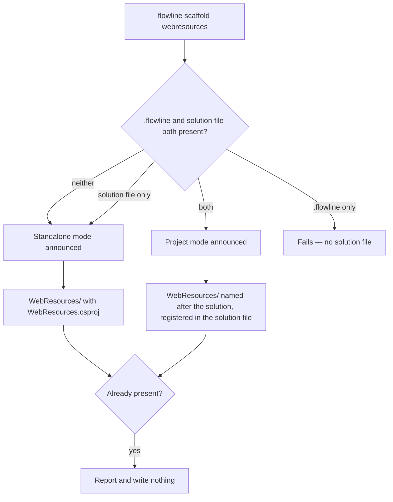
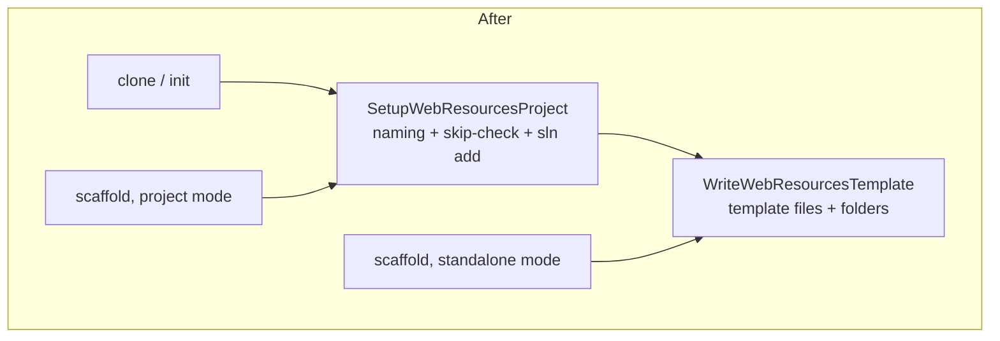

# Scaffold WebResources - Plan

## Goal Capsule

- **Objective:** Add `flowline scaffold webresources`, a command that writes the WebResources project template into a folder without touching Dataverse — templates only outside a Flowline project, named and registered inside one.
- **Product authority:** This plan owns the `scaffold` command, its `webresources` part, and both of its modes. `scaffold plugins` and `scaffold agents` are named as deferred, not active scope.
- **Authority order:** Requirements win on behavior. Key Decisions win on framing within those requirements. Key Technical Decisions win on mechanism within those requirements. Units override neither.
- **Execution profile:** Additive, with one behavior-preserving refactor of shared code (U1). `clone` and `init` must produce byte-identical scaffolds before and after — a change that alters either is out of contract, not a judgement call.
- **Stop conditions:** Stop and surface rather than guess if satisfying project mode would require a Dataverse call, if U1 cannot preserve `clone` and `init` behavior, or if skipping the prerequisite probe (KTD2) turns out to break an assumption the base command relies on later.
- **Tail ownership:** This plan ends at a merged change with README, wiki, and changelog updated (U6). It does not carry a release.
- **Product Contract preservation:** changed — R15 added (refuse a template-file collision rather than truncating it). R14 (`--dry-run`) was added from the repo's agent-CLI contract and then removed at the user's direction: that rule's models write irreversibly to Dataverse, while scaffold writes deletable local files, so the preview earned nothing R3 and R12 did not already give. R15 is what it was standing in for. R7 and AE7 corrected: the finish message stays, but the claim that its push step runs for an unauthenticated user was false — `ProfileResolutionService.ResolveAsync` throws `NotAuthenticated` when no profile matches the URL. The blog-reader persona was dropped from the Problem Frame and F1 at the user's direction; the remaining audience is a user working outside project mode. Dependencies/Assumptions corrected: the two modes share an extracted template-writing core rather than the existing scaffold method unchanged (KTD1). Every R/KD ID is unchanged and no requirement was removed.
- **Open blockers:** None.

---

## Product Contract

### Summary

A new top-level `scaffold` command (alias `new`) whose first part is `webresources`. In a folder with no Flowline project it writes the WebResources template and nothing else, so a reader can go from an empty directory to a buildable web resource project and push it with the standalone push that already exists. Inside a Flowline project it detects that, says so, then names the project after the configured solution and registers it in the solution file.

### Problem Frame

The WebResources project template is reachable today only as a side effect of `clone` or `init` — both of which connect to Dataverse, and both of which exist to bring a whole solution into a repo. Someone who wants the template itself has no command for it.

A user who works without project mode still wants the template's build setup, and today has to hand-copy files out of the Flowline repository.

There is a second, narrower gap on the same surface. An existing Flowline repo with no WebResources project — a plugin-only repo, or one migrated from spkl or Daxif — can only acquire one by re-running `clone`, which requires authentication and a live environment to do work that is entirely local.

### Key Decisions

- KD1. **A Flowline subcommand, not a published template package.** (session-settled: user-directed — chosen over shipping a `dotnet new` template: it promotes the CLI to a new reader, and avoids maintaining a second artifact.) Governs R1, R2.
- KD2. **The command is `scaffold`, with `new` as an alias.** (session-settled: user-directed — chosen over an `add` branch and over `init webresources`: first-level commands are verbs, `add` is too broad, and `init` already takes a solution name in the same positional slot.) Governs R1.
- KD3. **One command with a part positional, not a branch.** (session-settled: user-approved — chosen over a `scaffold` branch: Spectre's branch configurator exposes no description or examples.) `scaffold webresources` parses identically under either shape, so a later promotion to a branch leaves that invocation untouched; bare `scaffold` does change, from a missing-argument error to sub-help. Governs R1, R4.
- KD4. **Standalone writes templates and nothing else.** (session-settled: user-directed — chosen over also writing a solution file, or a `.flowline` stub: smallest surface, and the standalone push path already closes the loop without either.) Governs R5, R6.
- KD5. **The command detects its mode rather than behaving uniformly.** (session-settled: user-directed — chosen over always-templates-only and over refusing to run inside a project: the in-project case needs a solution name and the standalone case cannot have one.) Governs R8, R9.
- KD6. **The resolved mode is announced before anything is written.** (session-settled: user-approved — chosen over silent detection: the project marker is found by walking upward, so a run from a subdirectory can land in project mode unexpectedly.) Governs R3.
- KD7. **No graduation path between the two modes.** (session-settled: user-directed — chosen over adopting a standalone folder into a project later: the two cases live in separate folders and do not mix.) Governs R12.
- KD8. **Half a project fails; it does not degrade to standalone.** `.flowline` is what makes a folder a Flowline project, so its absence means standalone even beside a solution file; its presence without a solution file is a broken project, and the layout read already fails there with a worded error to inherit. Governs R10, R11.

### Requirements

**Command surface**

- R1. A top-level `scaffold` command, aliased `new`, takes one required positional naming the part to scaffold.
- R2. The command completes without a Dataverse connection, authentication, or network access in either mode.
- R3. The command states which mode it resolved before it writes anything.
- R4. `webresources` is the only accepted part value; any other value fails as a validation error that names the accepted values.

**Standalone mode**

- R5. Outside a Flowline project, the command writes only the WebResources project folder: the project file, the build and lint configuration, the README, the example sources under `src/`, and empty `public/` and `dist/` folders.
- R6. The project file standalone mode writes is named `WebResources.csproj`.
- R7. Standalone mode's finish message names the commands that take the user from the scaffolded folder to a pushed web resource, including the authentication and the solution that the push step requires.

**Project mode**

- R8. Inside a Flowline project, the command names the project file after the configured solution and registers it in the solution file — the same result `clone` produces.
- R9. Project mode requires both a `.flowline` and a solution file, because the solution name comes from the former and registration targets the latter.
- R10. A folder holding a `.flowline` but no solution file fails rather than falling back to standalone mode.
- R11. A folder holding a solution file but no `.flowline` is not a Flowline project, and gets standalone mode.

**Safety**

- R12. When a WebResources project is already present, the command reports that and writes nothing. There is no flag to overwrite one.
- R15. When any file the template would write is already on disk without a project file beside it, the command refuses and names the colliding file rather than truncating it.

**Documentation**

- R13. The public command surface documentation records the new command: the README command list, the wiki command reference, and the changelog.



### Key Flows

- F1. Standalone scaffold in an empty folder
  - **Trigger:** A user runs the command in an empty directory, outside any Flowline project.
  - **Steps:** The command finds no project marker, announces standalone mode, writes the template folder, then names the build and push commands that follow.
  - **Outcome:** A buildable web resource project that can be pushed without ever creating a Flowline project.
  - **Covered by:** R2, R3, R5, R6, R7

- F2. Existing project missing the WebResources project
  - **Trigger:** A user runs the command in a Flowline repo — plugin-only, or migrated from another tool — that has no WebResources project.
  - **Steps:** The command finds both markers, announces project mode, writes the template folder under the solution-derived project name, and registers it in the solution file.
  - **Outcome:** The repo gains a WebResources project without any Dataverse round trip.
  - **Covered by:** R2, R3, R8, R9

### Acceptance Examples

- AE1. **Covers R3, R5, R6.** Given an empty directory, when the command runs, then it announces standalone mode and leaves a `WebResources/` folder containing `WebResources.csproj`, with no solution file and no `.flowline` anywhere.
- AE2. **Covers R3, R8.** Given a Flowline project whose configured solution is `ContosoCustomizations` and which has no WebResources project, when the command runs, then it announces project mode and the solution file gains an entry for `ContosoCustomizations.WebResources.csproj`.
- AE3. **Covers R12.** Given a folder whose WebResources project already exists and whose template files have been edited, when the command runs, then it reports the project is already present and no file on disk changes.
- AE4. **Covers R2.** Given no PAC authentication profile and no network, when the command runs in either mode, then it succeeds.
- AE5. **Covers R4.** Given the part value `plugins`, when the command runs, then it fails as a validation error naming `webresources` as the accepted value.
- AE6. **Covers R3.** Given a Flowline project, when the command runs from a subdirectory of that project, then it announces project mode rather than silently scaffolding a standalone folder there.
- AE7. **Covers R7.** Given standalone mode completes a write, when the next-step block is printed, then it names the build step, the push step, and the authentication and solution the push step requires.
- AE8. **Covers R10.** Given a folder holding a `.flowline` and no solution file, when the command runs, then it fails naming the missing solution file rather than scaffolding anything.
- AE9. **Covers R11.** Given a folder holding a solution file and no `.flowline`, when the command runs, then it announces standalone mode and does not touch the solution file.
- AE11. **Covers R15.** Given a `WebResources/` folder holding a `package.json` and no project file, when the command runs, then it refuses naming `package.json` and that file's contents are unchanged.

### Scope Boundaries

- `scaffold plugins` and `scaffold agents` — the positional absorbs both later without restructuring, but neither ships here. `agents` additionally needs overwrite semantics that `webresources` does not, since regenerating a stale `AGENTS.md` means replacing a file that exists.
- Adopting a standalone folder into a Flowline project — per KD7. A reader who wants a real project starts a new folder with `clone` or `init`.
- Seeding `WebResources/public/` from unpacked solution source — that step needs a publisher prefix, which is a Dataverse fact, and would break R2.
- Any behavior change to `clone` or `init`. U1 refactors code they call; their observable output must not move.
- A `--scope` flag on `clone` or `init` to select which parts get scaffolded. This command supersedes the need.

#### Deferred to Follow-Up Work

- Moving `ProjectScaffolder` from `src/Flowline/Services/` into `Flowline.Core`. `AGENTS.md` names it as misfiled and says to move it opportunistically, not as a big-bang refactor; U1 touches the file but a project move would enlarge this diff without serving any requirement.

### Dependencies / Assumptions

- The standalone push path is assumed to remain the way a project-less user gets web resources into Dataverse; R7's finish message names it.
- Template files are embedded resources shipped with the CLI, so a scaffolded folder reflects the installed Flowline version and carries no separate version of its own.
- The existing template writer replaces a target file rather than skipping it, which is why R12 is a hard skip rather than a merge.
- `ProjectScaffolder` is already registered as a singleton, so the command injects it with no container change.

### Outstanding Questions

**Deferred to planning**

- OQ1. Whether the mode announcement is one line or is folded into the existing preflight output shape.
- OQ2. Whether the alias `new` appears in help output alongside `scaffold` or only resolves silently.

### Sources / Research

- `src/Flowline/Services/ProjectScaffolder.cs` — `SetupWebResourcesProjectAsync` is the method U1 splits; it already skips when a project is registered, resolving either the solution-named file in the default folder or a moved one recorded in the solution file.
- `src/Flowline/Utils/TemplateWriter.cs` — template writes truncate an existing target rather than skipping it. This is why R12 is a hard skip.
- `src/Flowline/Commands/PushCommand.cs` — the standalone push mode R7 points at: a web resource folder plus the solution as a positional. `ProfileResolutionService.ResolveAsync` throws `NotAuthenticated` when no PAC profile matches the target URL, regardless of `--dev`, so R7's printed steps name authentication and the solution as prerequisites rather than implying push runs without them.
- `src/Flowline/Commands/FlowlineCommand.cs` — the project marker is `.flowline`, found by walking upward (the surprise KD6 exists to prevent). The default `CheckSetupAsync` requires a git repo, requires the PAC CLI, and calls NuGet — the three reasons KTD2 overrides it.
- `src/Flowline/Commands/SlnAddCommand.cs` — the precedent for a command that only touches local files and overrides the prerequisite probe.
- `src/Flowline.Core/Services/SolutionFileLayout.cs` — throws `NotFound` when the folder holds no solution file (inherited by R10), and exposes no accessor for the solution file's own path (added in U4).
- `src/Flowline.Core/Console/FlowlineConsoleExtensions.cs` — the output vocabulary the mode announcement and the already-present report use.
- `src/Flowline/Program.cs` — command registration; `ProjectScaffolder` is already a singleton at line 77, so no container change is needed.
- `src/Flowline/Commands/InitCommand.cs` — the positional `[name]` argument that rules out `init webresources` as a spelling.
- `.claude/skills/cli-for-agents/SKILL.md` — the repo's own contract for new commands; the source of R14 and of the agent-CLI checklist in the Definition of Done.
- `docs/solutions/tooling-decisions/webresources-project-scaffolding-2026-06-04.md` — why templates are embedded resources versioned with the CLI rather than a separate package.
- `docs/solutions/architecture-patterns/solutionfilelayout-project-detection-consolidation.md` — the WebResources resolver once silently picked the alphabetically-first candidate and shipped wrong behavior. Independent support for KD8 failing rather than degrading.
- `docs/plans/2026-08-01-001-feat-clone-init-greenfield-solution-plan.md` — records that creation belongs to `init` and adoption to `clone`, which is why this command does neither.
- `src/Flowline/Templates/WebResources/` — the embedded template set; there is no equivalent for the Plugins project, which is produced by shelling out to PAC.

---

## Planning Contract

### Key Technical Decisions

- KTD1. **Extract the template-writing core; project mode wraps it.** `SetupWebResourcesProjectAsync` requires a solution file path and a loaded `SolutionFileLayout`, neither of which exists standalone, so the two modes cannot both call it as it stands. Extract the part that writes template files and creates folders; project mode keeps the naming, skip-check, and `dotnet sln add` around it. Chosen over duplicating the template writes in the command, which would let the two copies drift. Governs R5, R8.
- KTD2. **Override `CheckSetupAsync` to skip the prerequisite probe.** The default probe requires a git repository, requires the PAC CLI, and calls NuGet for the update notice. An empty folder is none of those, and the NuGet call alone contradicts R2. `SlnAddCommand` already sets this precedent for a command that only touches local files. Governs R2.
- KTD3. **No `--dry-run`, and the collision guard instead.** (session-settled: user-directed — chosen over adding `--dry-run` per the repo's agent-CLI contract: that rule's models are `push` and `deploy`, which write irreversibly to Dataverse. Scaffold writes local files you can delete, R12 already makes a second run a reporting no-op, and R3 announces the mode on real runs — so the preview's output is a worse version of just running it.) The one thing a preview would have caught is a template-file collision, which R15 prevents outright. Governs R15.
- KTD4. **Detection reads `.flowline` first, then the solution file.** `.flowline` is the project marker the base command already walks upward to find; the solution file is what registration targets. Both present means project mode, neither means standalone, and the asymmetric single-marker cases follow KD8. Governs R9, R10, R11.
- KTD5. **An invalid part value throws `ValidationFailed`, not `NotFound`.** The value is malformed input rather than a missing resource, and the message lists the accepted values so an agent discovers the vocabulary from the error. Governs R4.
- KTD6. **Mode detection and part validation are static and side-effect free**, so both are testable without constructing the command or a console. This mirrors how `CloneCommand.ShouldPickSolution` was made directly testable. Governs R3, R4.

### High-Level Technical Design

The refactor in U1 is the load-bearing shape. Today one method owns both the template writes and the project-registration work; after U1 the writes are a shared leaf that both entry points reach.



`clone` and `init` keep calling the same outer method with the same arguments; only its body changes. Standalone mode reaches the core directly, which is why it needs no solution file and no layout.

### Assumptions

- Skipping the prerequisite probe (KTD2) loses the update notice for this command only. That is accepted: every other command still prints it.
- The extracted core takes the target folder and the project file name as arguments, so the two modes differ by what they pass rather than by branching inside the core.

---

## Implementation Units

### U1. Extract the WebResources template-writing core

- **Goal:** One code path writes the WebResources template files, reachable with no solution file and no layout.
- **Requirements:** R5, R8 · KTD1
- **Dependencies:** none
- **Files:**
  - `src/Flowline/Services/ProjectScaffolder.cs`
  - `tests/Flowline.Tests/CloneCommandTests.cs` (guard only — assert existing scaffold output is unchanged)
- **Approach:**
  1. Split the body of `SetupWebResourcesProjectAsync` into an inner method that creates the folder, writes the eight template files (the six project/config files plus `src/example.ts` and `src/example-js.js`), and creates `src/modules`, `public/`, and `dist/`.
  2. Leave the outer method's contract untouched: same signature, same skip-check via the layout, same `dotnet sln add`, same return value.
  3. The inner method takes the target folder and the project file name; it reads no config and touches no solution file.
  4. Write the project file **last**, after every other template file and folder. It doubles as the presence marker `ResolveExistingWebResourcesFolder` checks, so writing it first would let an interrupted run report "already present" forever under R12's no-overwrite rule. Write order is not part of the on-disk result, so this does not affect the byte-identity requirement.
- **Execution note:** Behavior-preserving on the resulting file set, not on write order. The existing clone/init tests do **not** exercise the template writes — they hand-write stub `.csproj` files and assert only solution-file registration — so this unit must add its own characterization coverage rather than rely on them.
- **Patterns to follow:** The existing `TemplateWriter.WriteAsync` calls move verbatim; do not change which logical resource names are written or which target paths they land on. Order is the one thing this unit deliberately changes, per approach step 4.
- **Test scenarios:**
  - The inner method, called with a folder and a project file name, produces the same file set the outer method produced before the split.
  - Each written template file matches its embedded manifest resource byte for byte, so an encoding, line-ending, or truncation regression fails rather than passing silently.
  - The project file does not exist on disk until every other template file has been written.
  - A clone into a temp folder still yields a WebResources project registered in the solution file.
  - The outer method still skips when a WebResources project is already registered.
- **Verification:** `dotnet test tests/Flowline.Tests/Flowline.Tests.csproj -c Release` passes, including the new byte-identity and write-order scenarios.

### U2. Scaffold command skeleton, part validation, and mode detection

- **Goal:** The command exists, is registered, validates its positional, resolves its mode, and announces it — without writing anything yet.
- **Requirements:** R1, R2, R3, R4, R9, R10, R11 · KTD2, KTD4, KTD5, KTD6
- **Dependencies:** none
- **Files:**
  - `src/Flowline/Commands/ScaffoldCommand.cs` (new)
  - `src/Flowline/Program.cs`
  - `tests/Flowline.Tests/ScaffoldCommandTests.cs` (new)
- **Approach:**
  1. `ScaffoldCommand : FlowlineCommand<ScaffoldCommand.Settings>` with the standard injected constructor plus `ProjectScaffolder`; `RequiresProject => false`.
  2. Override `CheckSetupAsync` to a completed task, per KTD2.
  3. `Settings` carries a required positional part with a `[Description]`.
  4. Static `ValidatePart` and static mode resolution, per KTD6. Mode resolution returns standalone, project, or the R10 failure.
  5. Register in `Program.cs` with `.WithAlias("new")`, a description covering what + when + what changes, and at least one `.WithExample` with one argument per string.
- **Patterns to follow:** `SlnAddCommand` for the `CheckSetupAsync` override and a command that only touches local files. `Program.cs` lines 166-231 for the description and example shape.
- **Test scenarios:**
  - `ValidatePart("webresources")` returns without throwing; casing variants are accepted.
  - Covers AE5. `ValidatePart("plugins")` throws `FlowlineException` with `ExitCode.ValidationFailed` and a message containing `webresources`.
  - Mode resolution with neither marker present returns standalone.
  - Mode resolution with both markers present returns project mode.
  - Covers AE9. Mode resolution with a solution file and no `.flowline` returns standalone.
  - Covers AE8. Mode resolution with a `.flowline` and no solution file surfaces the missing-solution-file failure.
  - Covers AE6. Running from a subdirectory of a project resolves project mode, not standalone.
  - Covers AE4. The command runs to completion with the test console non-interactive and no PAC profile configured.
- **Verification:** `flowline scaffold --help` from a Release build lists the command, its alias, and its example; `flowline scaffold plugins` exits 15.

### U3. Standalone mode

- **Goal:** In a folder with no Flowline project, the command writes the template set and tells the user what to run next.
- **Requirements:** R5, R6, R7, R12, R15 · KTD1, KTD3
- **Dependencies:** U1, U2
- **Files:**
  - `src/Flowline/Commands/ScaffoldCommand.cs`
  - `tests/Flowline.Tests/ScaffoldCommandTests.cs`
- **Approach:**
  1. Call U1's extracted core with the working folder and `WebResources.csproj`.
  2. Skip and report when a WebResources project file is already there, per R12 — do not write over it.
  2b. Otherwise, check every path the template would write before writing any of them. If one exists, refuse and name it (R15). A folder holding template-named files without a project file is someone else's work, and the template writer truncates rather than skipping.
  3. Finish by naming the build step and the push step, including the authentication and solution the push requires (R7). The solution name is the push command's positional.
- **Patterns to follow:** `docs/tone-of-voice.md` for the message wording; `Console.Ok` / `Console.Skip` / `Console.Done` per the existing vocabulary.
- **Test scenarios:**
  - Covers AE1. An empty temp folder gains `WebResources/WebResources.csproj` plus the template files, and gains no solution file and no `.flowline`.
  - Standalone output announces standalone mode before the first write.
  - Covers AE7. The printed next-step block names the build step, the push invocation, and the authentication and solution the push requires.
  - Covers AE3. A second run over an edited template folder reports already-present and leaves every file byte-identical.
  - Covers AE11. A `WebResources/` folder holding only a `package.json` is refused by name, and that file's contents are unchanged.
  - The collision check runs before the first write, so a refusal leaves no partial template on disk.
- **Verification:** In a scratch folder, `flowline scaffold webresources` then `dotnet build WebResources/` succeeds; `npm install && npm run build` inside `WebResources/` produces output in `dist/`.

### U4. Project mode

- **Goal:** Inside a Flowline project, the command produces the same WebResources project `clone` would.
- **Requirements:** R8, R9, R12 · KTD1, KTD4
- **Dependencies:** U1, U2
- **Files:**
  - `src/Flowline/Commands/ScaffoldCommand.cs`
  - `src/Flowline.Core/Services/SolutionFileLayout.cs`
  - `tests/Flowline.Tests/ScaffoldCommandTests.cs`
  - `tests/Flowline.Core.Tests/Services/SolutionFileLayoutTests.cs`
- **Approach:**
  1. Add a public accessor on `SolutionFileLayout` returning the path of the solution file it read. The class already holds the folder and the file name privately; this exposes them rather than re-running the file search.
  2. Resolve the solution name from the loaded project config, then call the existing `SetupWebResourcesProjectAsync` with the layout and that path.
  3. Catch the layout's missing-solution-file failure in project mode and reword it for scaffold's context (R10). The inherited message names `clone` and the stand-alone push escape hatch, neither of which is the right next step here.
- **Patterns to follow:** `DeployCommand` (around lines 100-113) for reading `Config!.Solution` and calling `SolutionFileLayout.LoadAsync` together in a command body. `CloneCommand` is not the precedent — it never loads a layout directly; `ProjectScaffolder` does that internally.
- **Test scenarios:**
  - The new accessor returns the path of the solution file the layout read, for both `.sln` and `.slnx`.
  - Covers AE2. A project fixture with a configured solution and no WebResources project gains a solution-named project file and a solution-file entry.
  - Covers AE3. A project fixture that already has a registered WebResources project reports already-present and writes nothing.
  - A project whose WebResources project was moved and renamed is still detected as present, so no duplicate is scaffolded.
- **Verification:** `dotnet test Flowline.slnx -c Release` passes; a scaffolded project fixture loads with `dotnet sln list` showing the new entry.

### U6. Documentation

- **Goal:** The public command surface documents the new command.
- **Requirements:** R13
- **Dependencies:** U2, U3, U4
- **Files:**
  - `README.md`
  - `CHANGELOG.md`
  - `../Flowline.wiki/Command-Reference.md`
  - `../Flowline.wiki/WebResources-Project.md`
- **Approach:**
  1. README command list gains `scaffold` with a one-line description.
  2. Wiki command reference gains the command, its alias, its positional, and both modes.
  3. `WebResources-Project.md` gains the standalone path — scaffold, build, push.
  4. Changelog entry under the unreleased heading.
- **Execution note:** The wiki lives in a sibling checkout that may not exist on every machine. If `../Flowline.wiki/` is absent, report that rather than skipping silently or creating a replacement folder.
- **Test scenarios:** Test expectation: none — documentation only.
- **Verification:** The README command list and the wiki command reference both name `scaffold`, and the documented flags match `flowline scaffold --help` from a Release build.

---

## Verification Contract

| Gate | Command | Applies to |
|---|---|---|
| Restore | `dotnet restore Flowline.slnx` | all units |
| Build | `dotnet build Flowline.slnx -c Release` | all units |
| Full suite | `dotnet test Flowline.slnx -c Release` | U1, U4 (cross-project) |
| Targeted | `dotnet test tests/Flowline.Tests/Flowline.Tests.csproj -c Release --filter "ScaffoldCommandTests"` | U2, U3 |

The U1 refactor guard sits outside the table because its filter contains a pipe, which a table cell cannot carry unescaped and which must **not** be backslash-escaped — VSTest reads only a bare `|` as the OR operator, so an escaped filter matches nothing and the gate passes without running:

```bash
dotnet test tests/Flowline.Tests/Flowline.Tests.csproj -c Release --filter "CloneCommandTests|InitCommandTests"
```

User-facing output and exit codes must be checked from a **Release** build. A Debug build propagates exceptions instead of rendering the `Error: <message>` form, so correct error handling looks like a stack trace.

---

## Definition of Done

**Global**

- Every unit's test scenarios exist as tests and pass.
- `dotnet build Flowline.slnx -c Release` and `dotnet test Flowline.slnx -c Release` both pass.
- `clone` and `init` produce the same scaffold they produced before U1 — verified by U1's own byte-identity coverage, since the existing clone/init tests never exercise the template writes.
- The command reaches every requirement with no Dataverse call, no authentication, and no network request.
- New user-facing messages follow `docs/tone-of-voice.md`.
- The command satisfies the agent-CLI checklist in `.claude/skills/cli-for-agents/SKILL.md`: description covering what + when + state change, at least one example, `[Description]` on the positional, a specific `ExitCode` whose message carries the fix, and a second run that converges and reports the unchanged case. The checklist's `--dry-run` rule is deliberately not met — see KTD3.
- No dead-end or experimental code from abandoned approaches remains in the diff.

**Per unit**

| Unit | Done when |
|---|---|
| U1 | The extracted core is reachable without a solution file, each template file matches its embedded resource byte for byte, the project file is written last, and clone/init tests still pass. |
| U2 | `flowline scaffold --help` shows the command; an invalid part exits 15 naming `webresources`; every mode-resolution case has a test. |
| U3 | An empty folder becomes a project that builds with `dotnet build`, a template-file collision is refused by name, and the printed next steps name the build, push, authentication, and solution a user needs. |
| U4 | A project fixture gains a solution-named, solution-registered WebResources project with no Dataverse call. |
| U6 | README, wiki, and changelog name the command and match its actual help output. |
