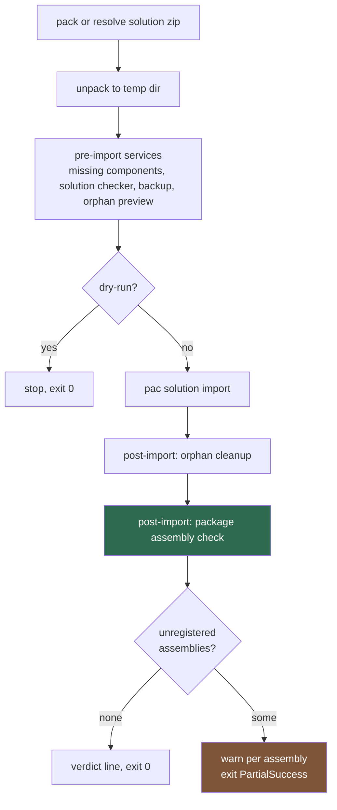
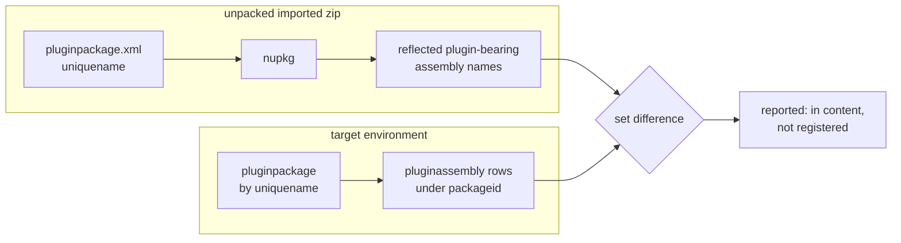

# Deploy Package Assembly Registration Check - Plan

## Goal Capsule

- **Objective:** `deploy` verifies, after the import, that every plugin-bearing assembly in the imported plug-in package actually carries a registration in the target, reports the ones that do not, and returns a non-zero exit code instead of a clean one. `push` says once that the registration it forged is environment-local.
- **Product authority:** This plan owns the post-import verification step in `deploy`, the one-line promotion note in `push`, and orphan classification for package-owned plugin assemblies. The push-side self-registration fallback, the rest of orphan cleanup, and the pre-import gates are context, not active scope.
- **Open blockers:** None external. The platform behaviour is measured, the decisions are settled, and no unmeasured platform fact gates the design — the check observes rather than predicts. One internal unknown gates U1's approach rather than the plan: whether the reflection primitive works in a deploy unpack. U1 answers it in its first step before any service code is written.

---

## Product Contract

### Summary

`flowline deploy` today can import a solution, report success, exit 0, and leave the target holding a plug-in assembly that will never run. This plan makes that state visible: after the import, `deploy` compares the plugin-bearing assemblies inside the imported package against the assembly records under that package in the target, names anything unregistered, and exits `PartialSuccess`. It does not repair the target. `push` gains one sentence, printed only when it forges a record, saying the fix does not travel.

### Problem Frame

A Dataverse plug-in package registers every plugin-bearing assembly it contains when the package is created. On update it does not. An assembly newly present in the `.nupkg` gets its content stored and no `PluginAssembly` record, ever.

`push` already compensates: it waits for the registration it was promised, and when the wait expires it creates the record itself (`src/Flowline.Core/Plugins/PluginService.cs:714`). That fix is local to the environment `push` writes to.

Measurement on 2026-08-17 established that solution import has the same gap, and that nothing in the solution carries the fix forward. Three imports into a target holding the same package:

| Variant | `PluginAssembly` root component in the manifest | Package content | Result in target |
|---|---|---|---|
| Content only | absent | new | one row, added assembly absent |
| Component present | present | unchanged | one row, added assembly absent |
| Component present | present | new again | one row, added assembly absent |

Every run returned `Solution Imported successfully`, exit 0, import job 100%. The target's own re-export then hands back a manifest naming one assembly and a package containing two, so the next environment down the chain inherits the same hole. Full measurement, including the byte-identical DLL hashes proving the content landed, lives in the source document referenced under Sources.

`DeployCommand` never references `PluginService`; its only plug-in assembly work is orphan cleanup, which deletes records and never creates them. So the outcome today is: content lands, assembly is dead, exit 0, no output.

The cost lands on exactly the shape this repo is built for. A consultant splits a growing plugin project in two, `push` handles DEV, and every promotion after that quietly ships code that does not run.

### The remedy, stated once

Every message this plan adds points at the same fix, and it is defined here so R3, R9, R10 and the
documentation all say the same thing rather than each inventing wording:

> Create the `pluginassembly` record under that package in the target, with `isolationmode` sandbox
> and the assembly's own version, culture and public key token, then deploy again so the content
> write populates its plugin types.

That is the sequence `PluginService.RegisterPackageAssemblyDirectlyAsync` performs on the push path
(`src/Flowline.Core/Plugins/PluginService.cs:714`), done by hand: through the Plugin Registration
Tool, the maker portal, or a Web API call. Flowline has no command that does it against a deploy
target today — that is the deferred work, not a gap in the wording.

**The state is sticky.** Until the record exists, the same finding and the same non-zero exit repeat
on every later deploy of that solution. Saying so is what separates a one-off from a permanent block
for the first person who meets exit 18 in a pipeline, given that repair is deferred and R8 rules out
a flag.

### Key Decisions

- **Observe after the import; never predict before it** (session-settled: user-directed — chosen over a blocking pre-import gate and over a pre-import warning): a check that asks "is this assembly registered?" stops firing on its own the day Microsoft fixes the platform. A check that asserts "the platform will not register this" hardcodes the bug and has to be removed by hand. This is the same self-limiting stance the push fallback took, where the bounded wait is the detector. Governs R1, R2, R7.
- **Report, never repair** (session-settled: user-approved — chosen over forging the record behind a scoped `--force` and over forging it ungated): `deploy` imports a solution; it does not create records in a target. The push-side rationale for an ungated forge was that the push had no other way to succeed. The deploy did succeed — the import worked and the result is incomplete — so the same argument does not carry. Governs R3, R6.
- **No suppression flag** (session-settled: user-approved — chosen over a `--skip-package-assembly-check` flag mirroring `--skip-component-check`, and over a scoped `--force` that keeps the report but drops the exit code): the check is read-only and cheap, and `PartialSuccess` already means "completed but incomplete". A flag invites permanently disabling the thing that was invisible in the first place. Governs R8.
- **Say it once at push, at the moment it is learned**: the promotion note fires only when the self-registration fallback actually fired. Printing it on every package push trains people to skip the line. Governs R9.

### Requirements

**Verification in deploy**

- R1. After the import, `deploy` determines the plugin-bearing assemblies present in each plug-in package the imported solution carries, and the assembly records registered under that package in the target.
- R2. An assembly present in the imported package content with no registration in the target is reported, naming the assembly, its version, and its package.
- R3. The report states that the assembly will not run, names the remedy defined above, and states that the finding and its non-zero exit repeat on every later deploy until the record exists. `deploy` performs no write to the target as a result of the finding.
- R4. `deploy` returns `ExitCode.PartialSuccess` when the check finds at least one unregistered assembly.
- R5. A solution carrying no plug-in package produces no output from the check and no exit-code change.
- R6. A package the target does not hold at all produces no finding — the check reports what it observes, and a package the import created is registered or not on its own merits.
- R7. A check that cannot run to completion warns, names why, and leaves the exit code alone.
- R8. No flag skips the check or suppresses its exit code.

**Promotion note in push**

- R9. When `push` self-registers an assembly, it states that the registration is local to that environment and that each deploy target needs the remedy defined above, in the same words R3 uses. Nothing is printed when no assembly was self-registered.

**Orphan classification for package-owned assemblies**

- R11. An assembly record under a plug-in package that the imported solution still carries, whose DLL is present in that package's content, is not an orphan candidate — regardless of whether the solution manifest names it.
- R12. A plug-in package the imported solution no longer carries at all keeps today's behaviour: the package and everything under it are removed, unchanged.

**Exit-code contract**

- R10. `ExitCode.PartialSuccess` is documented as covering both post-import failure sources, each with its own corrective action — the maker-portal removal it already names for orphan cleanup, and the remedy defined above for an unregistered assembly. The summary line printed on that exit no longer claims every failure is an orphan.

### Scope Boundaries

**In scope**

- Post-import verification in `deploy`, for every plug-in package in the imported solution.
- The one-line promotion note in `push`.
- Generalising the `PartialSuccess` summary line and its documentation.
- Orphan classification for package-owned plugin assemblies, and only for those. The rest of orphan cleanup, including the package-gone delete path, is unchanged.

**Deferred for later**

- **Repairing the target.** Creating the record and re-writing package content from `deploy` is the natural next step if Microsoft does not fix the platform. It needs `deploy` to write `pluginpackage` content outside the import, which is a step change in what the command does. Revisit after the Microsoft issue is answered, or after this is hit in a client PROD.
- **`drift` and `status` surfaces.** Both could report the same state without a deploy. Considered and held out to keep the change to the command that creates the problem.
- **The half-registered case.** A `pluginassembly` row that exists with zero plugin types produces the same "will not run" outcome. Not covered here: it is reachable only through a manual partial fix, and its remedy differs from the missing-row case.

**Outside this work**

- Predicting the gap before an import, in any form, including under `--dry-run`. That is the design this plan deliberately rejected.

### Success Criteria

- A deploy that adds an assembly to an existing package in the target names the assembly and exits `PartialSuccess`, where it exits 0 and prints nothing today.
- A deploy of a solution whose packages are fully registered prints one verdict line and exits 0.
- The day Dataverse registers the assembly on import, the same code path reports nothing and exits 0, with no edit to Flowline.

---

## Key Technical Decisions

- **KTD1. The check is an `IPostDeployService` with a no-op pre-import half.** The interface already fans out at both hooks (`src/Flowline.Core/Services/IPostDeployService.cs:40-44`) and `PostDeployContext` already carries everything needed: the connected service, the target solution info, and `DataverseSolutionSrcRoot`, which is an unpack of the zip actually imported rather than the local checkout. Nothing new has to be threaded through `DeployCommand`. Governs R1, R2.

- **KTD2. Read the package from the unpacked imported zip, not from the checkout.** `DeployCommand` unpacks whatever it imported into a temp directory before building the context (`src/Flowline/Commands/DeployCommand.cs:302-313`), which is what makes the check valid on the `--path` and cache-reuse routes. Verified against a real export on 2026-08-19: `pac solution unpack` preserves `pluginpackages/<uniquename>/package/<name>.nupkg` and `pluginpackages/<uniquename>/pluginpackage.xml`, so both the package identity and its bytes are on disk at post-import time. Governs R1.

- **KTD3. Register last, after orphan cleanup.** Orphan cleanup can delete a `pluginassembly` or redirect to a `pluginpackage` delete (`src/Flowline.Core/OrphanCleanup/Handlers/PluginAssemblyFamilyHandler.cs`). Verifying after it means the check sees the state the deploy actually leaves behind. The three pre-import services keep their load-bearing order; the new one appends. Governs R1, R4.

- **KTD4. Reuse the reflection and lookup primitives `push` uses, once the reflection half is proven in this context.** `PluginAssemblyReader.AnalyzePackage(string nupkgPath)` (`src/Flowline.Core/Plugins/PluginAssemblyReader.cs:33`) already applies the exact filter Dataverse itself applies — one result per DLL containing an `IPlugin` implementer, dependencies skipped. `PluginReader.FindPackageAssemblyAsync` already queries a single assembly under a package. Widening that method to `public` and looping is a smaller change than a new query, and avoids `LoadPackageSnapshotsAsync`, which additionally loads steps, images, and SDK message ids the check has no use for.

  **The reflection half is conditional and U1 proves it first.** `AnalyzePackage` builds its resolver from the DLLs inside `lib/` plus copy-local build output found beside the `.nupkg` (`PluginAssemblyReader.cs:77-80`), and the reason it needs those siblings is that `Microsoft.Xrm.Sdk` is kept out of `lib/` by `PrivateAssets="All"`. A deploy unpack has no siblings. If the SDK cannot resolve there, `IsDerivedFrom` walking `GetInterfaces()` either faults or — worse — yields zero plugin-bearing assemblies, which prints a clean verdict and exits 0. That is the silent success this feature exists to remove, so it is settled before any service code is written, not on the first real deploy.

  Named fallbacks if the probe fails, in preference order: supply .NET Framework reference assemblies to `PathAssemblyResolver` so the resolve succeeds, or make the `IPlugin` probe resolution-tolerant. The second is only acceptable if an unresolvable assembly is *reported* rather than silently treated as not plugin-bearing — silently skipping it recreates the exact failure mode. Governs R1, R2, R7.

- **KTD5. `DeployCommand`'s summary line becomes source-neutral, in one file.** The line at `src/Flowline/Commands/DeployCommand.cs:350` reads every failure as an orphan, which was true while one service could fail and stops being true once a second one can. `DeployCommand` already sums every post-import service's count, so rewriting its own line from that total is all R10 needs. Type-sniffing the service in the accumulation loop would work and is worse.

  Relocating the orphan wording into `OrphanCleanupService` was considered and dropped: it reaches into a component this plan otherwise leaves alone, for no gain, since orphan cleanup already prints per-item warnings carrying the maker-portal action (`src/Flowline.Core/OrphanCleanup/OrphanCleanupService.cs:923`) and the new check prints its own findings with its own remedy. The summary line was the only place claiming a cause it no longer owns; making it stop claiming one is the whole fix. Governs R4, R10.

- **KTD7. Package content, not the manifest, decides whether a package-owned assembly is an orphan.** Orphan cleanup resolves live plugin assemblies by portable simple name against the type-91 root components in `Solution.xml` (`src/Flowline.Core/OrphanCleanup/ComponentClassifier.cs:94-105`), and reads "absent from the manifest" as "removed on purpose". For a package-owned assembly that inference breaks on exactly this bug: the manifest can omit an assembly the source environment never registered, while the imported package content carries its DLL. The record then classifies as an orphan, and because a package-owned assembly cannot be deleted directly, `PluginAssemblyFamilyHandler` redirects to a whole-`pluginpackage` delete — taking every other assembly, plugin type and step registration in it. `HandlerStatus.Auto` means no `--force` is involved.

  Deleting only the record would be no better: the DLL stays in the package content, so the environment lands back in the unregistered state this plan exists to detect, and the next deploy reports it again.

  So the test moves from the manifest to the content, which is the set U1 already computes. The two conditions stay cleanly separated: a package the imported solution no longer carries at all is still genuinely gone, and the package delete is correct for it — that is the case the redirect was built for. Governs R11, R12.

- **KTD6. A check that cannot run warns and does not touch the exit code.** `ExitCode.Inconclusive` exists for "the check could not run", but the post-import hook returns a failure count rather than an exit code, and throwing after a committed import would lose the deployed signal to report a verification problem. Reporting a broken check as an incomplete deploy would be a lie in the other direction. The failure is also close to unreachable: the same `.nupkg` was just imported successfully and, on the normal route, reflected by `push` before that. Warn, name the reason, return zero. Governs R7.

---

## High-Level Technical Design

Where the check sits in the deploy pipeline, and what it reads:

What the check compares, per package in the imported solution:

Directional guidance for review, not implementation specification.

---

## Implementation Units

### U1. Package assembly check service

**Goal:** A post-deploy service that compares the imported package's plugin-bearing assemblies against the target's registrations and returns the count of unregistered ones.

**Requirements:** R1, R2, R3, R5, R6, R7

**Dependencies:** none

**Files:**
- `src/Flowline.Core/Deploy/PluginPackageAssemblyCheckService.cs` (new)
- `src/Flowline.Core/Plugins/PluginReader.cs` (widen `FindPackageAssemblyAsync` to `public`)
- `tests/Flowline.Core.Tests/PluginAssemblyReaderTests.cs` (the step 0 probe joins the existing reader tests)
- `tests/Flowline.Core.Tests/Deploy/PluginPackageAssemblyCheckServiceTests.cs` (new)

**Approach:**

**Step 0 — the gating probe. Write this before any service code.** A test that copies a real plugins-project `.nupkg` into an empty temp directory with no sibling build output, calls `AnalyzePackage`, and asserts it returns the expected plugin-bearing assemblies. This is the deploy-unpack condition exactly. If it returns empty or throws, KTD4's reflection half does not hold and one of its named fallbacks is adopted before step 3 is written. Do not defer this to the manual round: everything below is built on its answer.

Then:

1. Implement `IPostDeployService`. `RunPreImportAsync` returns a completed task and does nothing — this check has no pre-import half by design (KTD1).
2. In `RunPostImportAsync`, enumerate the immediate subdirectories of `pluginpackages/` under `context.DataverseSolutionSrcRoot`. Absent or empty means the solution carries no plug-in package: return zero, print nothing (R5).
3. Per package directory: read the unique name, locate the single `.nupkg` under `package/`, and reflect it with `PluginAssemblyReader.AnalyzePackage`. Verified on 2026-08-19 against a real export: `pluginpackage.xml` carries the unique name both as a `uniquename` attribute on its root element and as a `<name>` element, and the containing directory is named with it as well — read the XML rather than the directory name, and treat a mismatch as a warn case.
   - **Construct `PluginAssemblyReader` with a discarding console.** It writes `console.Info($"Assembly … analyzed")` per plugin-bearing DLL (`PluginAssemblyReader.cs:94`) and the scanner it drives emits its own warnings — push-time output that has no place in a deploy. The reader takes `IAnsiConsole` through its primary constructor, so pass one built over `TextWriter.Null`; there is no discard console in `Flowline.Core` today.
4. Query the target for the `pluginpackage` by unique name. The only such query today is inline at `src/Flowline.Core/Plugins/PluginService.cs:393-399`, so this one lands in the new service file rather than reusing a helper. No match means the target does not hold this package: contribute zero and print nothing (R6).
5. Per reflected assembly, call `PluginReader.FindPackageAssemblyAsync` against the resolved package id, **inside the same bounded poll `push` uses** — five attempts, one second apart, re-querying only the assemblies still missing, mirroring `LoadPackageSnapshotsWithRetryAsync` (`src/Flowline.Core/Plugins/PluginService.cs:651`). The deploy path needs this more than push does, not less: the import runs as an async job, so the write that would create the record is further from the read than on push's direct write. An assembly still absent when the poll expires is a finding.
6. Warn once per finding, naming assembly, version and package, and carrying R3's message: it will not run, here is the remedy, and this repeats on every later deploy until it is done. Return the total finding count.
7. **Print the verdict line only when every examined package was fully evaluated** — at least one reflected assembly and no warn path taken. A package whose DLLs reflect to nothing, or one that hit the R7 path while a sibling package was clean, means the check cannot claim a clean result; print the warning alone. A clean verdict that also covers what was skipped is the false all-clear this feature exists to remove.

**R7 handling wraps the entire per-package body — steps 3, 4 and 5 — not reflection alone.** Any fault warns with the reason and contributes zero. This matters because `DeployCommand` wraps the post-import loop in try/finally for temp-directory cleanup only (`src/Flowline/Commands/DeployCommand.cs:344-371`), so an escaping exception fails a deploy whose import already committed, reported as a general error. `AnalyzePackage` also throws outright on a package containing a workflow activity type, with wording aimed at a push-time author — another reason the catch has to be wide and the warn text has to be this service's own.

Follow the primary-constructor-plus-`new()`-collaborators style of `PluginService` (`src/Flowline.Core/Plugins/PluginService.cs:15-21`) rather than introducing DI registrations for the readers, which are not container-registered today.

**Patterns to follow:**
- `src/Flowline.Core/Deploy/MissingComponentCheckService.cs` for service shape, spinner label, and the `console.Ok` verdict line on the clean path.
- `src/Flowline.Core/Console/FlowlineConsoleExtensions.cs` for `Warning` / `Ok` / `Info`. Warnings carry the `!` glyph; the message is a reason sentence plus an action, per `docs/tone-of-voice.md`.

**Test scenarios:**
- **Step 0 probe:** `AnalyzePackage` against a real `.nupkg` alone in a temp directory, no sibling build output, returns the expected plugin-bearing assemblies. This one gates the rest of the unit.
- Package with two reflected assemblies, target holds a row for one: returns 1, warns naming the missing assembly, its version and the package, and the warning carries the remedy and the recurrence sentence.
- Package with two reflected assemblies, target holds rows for both: returns 0, prints exactly one line — the verdict — with no per-assembly `analyzed` lines from the reader.
- An assembly absent on the first lookup and present on a later attempt: returns 0, no finding, no warning.
- An assembly absent on every attempt of the poll: returns 1.
- Imported solution has no `pluginpackages/` directory: returns 0, prints nothing at all, makes no Dataverse call.
- `pluginpackages/` exists but the target has no `pluginpackage` with that unique name: returns 0, prints nothing.
- Two packages in one solution, one clean and one with a missing assembly: returns 1, warns only about the second.
- Two packages, one clean and one hitting the warn path: the warning prints and **no clean verdict line does**.
- A package whose DLLs reflect to zero plugin-bearing assemblies: no clean verdict line.
- `.nupkg` missing from a package directory: warns naming the package, returns 0, does not throw.
- `AnalyzePackage` throws: warns naming the package and the reason, returns 0, does not throw.
- The `pluginpackage` lookup throws: warns, returns 0, does not throw.
- `FindPackageAssemblyAsync` throws: warns, returns 0, does not throw — the deploy must not fail after a committed import.
- A `.nupkg` whose only extra DLL implements no `IPlugin` (a plain dependency): contributes no finding, since reflection filters it.
- `RunPreImportAsync` performs no Dataverse call and prints nothing.
- Verified against a substituted `IOrganizationServiceAsync2` and a `TestConsole`, following `tests/Flowline.Core.Tests/Deploy/MissingComponentCheckServiceTests.cs`. Keep the poll delay injectable so the retry scenarios do not add five seconds to the suite.

**Verification:** The service reports a target missing one of two assemblies and stays silent on a fully-registered one, without writing anything to Dataverse.

---

### U2. Registration, exit code, and summary-line ownership

**Goal:** The check runs on every real deploy, its findings reach the exit code, and the `PartialSuccess` summary stops claiming every failure is an orphan.

**Requirements:** R4, R8, R10

**Dependencies:** U1

**Files:**
- `src/Flowline/Program.cs` (register after `OrphanCleanupService`)
- `src/Flowline/Commands/DeployCommand.cs` (summary line)
- `src/Flowline.Core/ExitCode.cs` (doc comment on `PartialSuccess`)
- `tests/Flowline.Tests/DeployCommandPostDeployTests.cs`

**Approach:**

1. Register the new service last in `PostDeployServiceRegistration`, after the `OrphanCleanupService` registration (KTD3). Leave the three pre-import services in place — their order is load-bearing and documented at the registration site.
2. Add no entry to `ResolveActiveServices` — the check has no skip flag (R8), so it is never filtered out.
3. Rewrite `DeployCommand`'s `PartialSuccess` line to be source-neutral, built from the total it already sums — the deploy completed, N post-import findings, see above — so both exit paths still end on a closing line and neither claims a cause it does not own. `OrphanCleanupService` is not touched: its per-item warnings already carry the maker-portal action, and the new check prints its own findings with its own remedy (KTD5).
4. Widen the `ExitCode.PartialSuccess` XML doc to cover both post-import sources, each with its corrective action. Do not renumber or add a code.

**Patterns to follow:** the existing accumulate-then-branch shape at `src/Flowline/Commands/DeployCommand.cs:344-356`.

**Test scenarios:**
- Resolving the real container yields five post-deploy services with the package assembly check last, extending the existing registration-order test rather than replacing it.
- `--skip-component-check`, `--skip-solution-check` and `--no-backup` each drop only their own service and never the package assembly check.
- A non-zero total from the check alone returns `PartialSuccess`.
- A non-zero total from orphan cleanup alone still returns `PartialSuccess`, and orphan cleanup's own per-item warnings still carry the maker-portal action.
- Both sources non-zero: one exit code, both sets of messages, and the closing line names neither cause.
- Zero total returns 0 and prints the deploy-complete line.
- The `PartialSuccess` branch always ends on a closing line, matching the clean path.

**Verification:** A deploy whose only post-import finding is an unregistered assembly exits 18 and prints no orphan wording. Read the exit code from a Release build.

---

### U5. Package content decides orphan candidacy for package-owned assemblies

**Goal:** A deploy stops deleting a plug-in package because one of its assemblies is registered in the target but missing from the manifest.

**Requirements:** R11, R12

**Dependencies:** U1 (reuses its per-package reflected-assembly set)

**Files:**
- `src/Flowline.Core/OrphanCleanup/ComponentClassifier.cs` or `src/Flowline.Core/OrphanCleanup/Handlers/PluginAssemblyFamilyHandler.cs` — placement decided at implementation; see Approach
- `tests/Flowline.Core.Tests/OrphanCleanupServiceTests.cs`
- `tests/Flowline.Core.Tests/Deploy/PluginPackageAssemblyCheckServiceTests.cs` (shared-set assertions, if the set is lifted out of U1)

**Approach:**

1. For each plug-in package the imported solution carries, the reflected assembly names from its `.nupkg` are the authority on what belongs under that package. U1 already computes exactly this set — lift it to a small shared helper rather than reflecting twice, and let both consumers read it.
2. A live `pluginassembly` whose `packageid` resolves to a package the imported solution still carries, and whose name is in that package's reflected set, is removed from the orphan candidate list before classification. It is not reported, not deleted, not redirected.
3. Everything else keeps today's behaviour. In particular a package the imported solution no longer carries produces no reflected set at all, so nothing is excluded and the existing redirect-to-package-delete path runs unchanged (R12).
4. Decide placement by where the candidate list is built: excluding at classification (`ComponentClassifier`) keeps the handler unaware, while excluding in `DetectAsync` keeps the knowledge next to the `packageid` resolution that is already there. Prefer whichever leaves the package-gone path untouched.

**Patterns to follow:** the type-91 portable-simple-name matching already in `ComponentClassifier.cs:94-105` — this adds a second source of truth for the same identity, not a new identity scheme.

**Test scenarios:**
- Target holds an assembly under a package the solution carries, the manifest does not name it, its DLL is in the package content: not an orphan, nothing deleted, no finding.
- Same, but the DLL is **not** in the package content: still an orphan, existing behaviour, redirect intact.
- The imported solution carries no directory for that package at all: package delete still fires, unchanged (R12).
- A package with two assemblies where the manifest names one and content carries both: neither is an orphan, and the package is not deleted.
- Classic (non-package) assembly orphans are unaffected — no `packageid`, so the exclusion never applies.
- The end-to-end shape: hand-register in the target, deploy again, and assert the package survives and the check reports clean.

**Verification:** A deploy following a hand-registered target leaves the package intact. Before this unit, the same sequence deletes it.

---

### U3. Promotion note on push

**Goal:** The person who watches `push` forge a record learns, at that moment, that the fix does not travel.

**Requirements:** R9

**Dependencies:** none

**Files:**
- `src/Flowline.Core/Plugins/PluginService.cs` (after the self-registration success line at line 744)
- `tests/Flowline.Core.Tests/PluginServiceTests.cs`

**Approach:** Emit one warning immediately after the existing `registered directly under package` line, stating that the registration is local to this environment and naming the remedy each deploy target needs, in the same words R3's deploy-side message uses. It fires from the same place the forge succeeds, so it is silent whenever Dataverse registered the assembly itself, and silent whenever no assembly was added.

**Patterns to follow:** the existing success line's markup and escaping at `src/Flowline.Core/Plugins/PluginService.cs:744`; `docs/tone-of-voice.md` for the warning glyph and the reason-plus-action shape.

**Test scenarios:**
- Self-registration succeeds: the note is printed once, immediately after the success line.
- Two assemblies self-registered in one push: the note appears once per registered assembly, matching how the success line is emitted, or once for the push — decide at implementation and assert whichever shape is chosen.
- Dataverse registers the assembly within the confirm window: no note.
- Push with no assembly-set change: no note.
- Self-registration is rejected: the failure path's message is unchanged and carries no note.

**Verification:** A push that forges a record prints the note; a push that does not, does not.

---

### U4. Documentation

**Goal:** The behaviour, the exit code, the promotion caveat, and the orphan-classification fix are documented where users and agents look for them.

**Requirements:** R4, R9, R10, R11

**Dependencies:** U1, U2, U3, U5

**Files:**
- `CHANGELOG.md`
- `docs/solutions/` (one entry recording the platform gap and this check as the response)
- Wiki, target repo `Flowline.wiki` (sibling checkout `../Flowline.wiki/`): `07-Deploy.md`, `04-Push-Plugins-and-Custom-APIs.md`, `03-Command-Reference.md`, `10-AI-Agents.md`, `12-Planned-Features.md`

**Approach:**

- `07-Deploy.md`: what the post-import check does, what a finding means, that deploy does not repair it, and the remedy plus the recurrence sentence in the same words R3 uses.
- `04-Push-Plugins-and-Custom-APIs.md`: the platform gap, the self-registration fallback, and that the registration is environment-local.
- `03-Command-Reference.md` and `10-AI-Agents.md`: the widened meaning of exit 18 with both corrective actions, since both carry the agent-facing exit-code contract.
- `12-Planned-Features.md`: repairing the target from `deploy`, as the deferred follow-up.
- `07-Deploy.md` again, and the CHANGELOG under a fix heading rather than a feature one: orphan cleanup no longer deletes a plug-in package because one of its assemblies is registered in the target but missing from the manifest. This is a behaviour change on a destructive path and a user who has hit it will want to recognise it, so name the symptom (a package disappearing after a deploy) and not only the fix.
- `docs/solutions/`: an entry with `module`, `tags`, and `problem_type` frontmatter matching the existing convention, so the measured platform behaviour is findable from the repo rather than only from the blog draft.

**State the platform behaviour as measured, not as general fact.** The evidence is three unmanaged imports into two Sandbox environments in one tenant on 2026-08-17; the managed path and the never-held-the-package path are explicitly unmeasured, and `microsoft/powerplatform-build-tools#1465` is open. Every page above that describes the gap carries that scope and links the issue. Otherwise five wiki pages and a `docs/solutions/` entry become the source future readers and agents plan against, with no way to tell which parts were observed — and no way to notice when Microsoft's answer changes it.

If the wiki checkout is not present on the machine running this work, report that rather than skipping it silently or creating a replacement folder.

**Test expectation:** none — documentation only.

**Verification:** Every page above reflects the shipped behaviour, and the exit-18 description matches `ExitCode.cs`.

---

## Verification Contract

- `dotnet build Flowline.slnx` clean.
- `dotnet test Flowline.slnx` green. `tests/Flowline.Core.Tests` and `tests/Flowline.Tests` both carry new coverage, so run both in full rather than filtering.
- Manual end-to-end against a real environment, recorded in `docs/test-goal.md`, using the fixture that produced the original measurement: a plug-in package with a second plugin-bearing assembly added, pushed to DEV, deployed to TEST.
  - Deploy to a target missing the assembly: names it, exits 18.
  - Register it in the target by hand, deploy again: verdict line, exits 0, **and the plug-in package is still there**. This is the U5 case and it is the one that would have been destructive before.
  - Remove the whole package project from source and deploy: the package is still deleted, unchanged (R12).
  - Deploy a solution with no plug-in package: no check output.
- Read every exit code from a Release build. A Debug build propagates exceptions and makes correct error handling look broken.

---

## Definition of Done

- U1's step 0 probe ran and its result is recorded, either confirming KTD4's reflection half or naming the fallback that was adopted instead.
- A hand-registered assembly in the target no longer causes the next deploy to delete its plug-in package, and a package genuinely removed from source still deletes.
- `deploy` reports unregistered package assemblies in the target and exits `PartialSuccess`, and its message names the remedy and the recurrence.
- A clean verdict line prints only when every package was fully evaluated.
- `deploy` writes nothing to the target as a result of the finding.
- No flag disables the check.
- `push` states the environment-local caveat when, and only when, it forges a record.
- The `PartialSuccess` summary no longer attributes every failure to orphan cleanup, and its documentation covers both sources.
- Build and full test suite pass.
- CHANGELOG, wiki pages, and a `docs/solutions/` entry updated.
- CLI text reviewed against `docs/tone-of-voice.md`.

---

## Risks

- **A managed deploy may unpack differently.** The unpack call passes `sln.IncludeManaged`, and the check assumes `pluginpackages/<uniquename>/package/<name>.nupkg` in both shapes. Verified for unmanaged on 2026-08-19; not verified for managed. If managed differs, the check degrades to the R7 warn path rather than a false finding, but the manual round should cover a managed target.
- **U5 changes a destructive path, so its negative case matters more than its positive one.** Getting the exclusion too wide means a package genuinely removed from source stops being cleaned up, which is a silent leak rather than a loud deletion — easier to miss and slower to notice. The R12 scenarios are the guard, and the manual round exercises the package-gone path deliberately, not only the case U5 fixes.
- **False positives are noisy but not destructive.** The check never writes, so the worst case is a deploy reported as incomplete when it was fine. The mitigation is that the comparison is a set difference against live target state, not a prediction.
- **Reflection in a bare unpack is the load-bearing unknown, and U1 step 0 retires it.** `AnalyzePackage` resolves reference assemblies from copy-local build output beside the `.nupkg`, which a deploy unpack does not have. The dangerous failure is not the throw — it is returning zero plugin-bearing assemblies, which reads as a clean package. Step 0 settles it before service code exists; KTD4 names the fallbacks. This stays on the register because the fallback path, if taken, changes what U1 builds.

---

## Open Questions

- **Deferred to implementation:** whether the push promotion note reads better once per self-registered assembly or once per push when several are forged at the same time. Decide at the call site and assert the chosen shape.
- **Deferred to implementation:** the exact spinner label and whether the check warrants one at all. With the bounded poll in step 5 a failing check now takes several seconds, which argues for one.
- **Read from code, not measured — confirm during U5:** that a package-owned `pluginassembly` genuinely cannot be deleted directly, which is what makes the handler redirect to a whole-package delete. It comes from the handler's own comment and is consistent with the push drop path relying on the content update to remove the record, but nobody has attempted the direct delete and watched it fail. If it turns out to work, the redirect has a smaller alternative and U5's framing of the blast radius changes — though the exclusion is still the right fix, since deleting the record leaves the DLL in the content.
- **Worth answering before U4 is written:** does `flowline push --dev <target-url>` register an assembly into an existing package in a non-DEV environment, and is pointing users at it consistent with `deploy` being the only Flowline command that writes to PROD? If it works and is acceptable, it is a better remedy than a hand-created record and R3's message should name it instead. The remedy above deliberately assumes it is not, since that is the claim the plan can make without measuring.
- **Deferred to implementation:** how many poll attempts are proportionate when the writer is an async import job rather than a direct write. Five-at-one-second mirrors push; the deploy path may want a longer budget.
- **Unmeasured, does not gate this work:** whether importing into an environment that has never held the package registers every assembly, and whether a managed import behaves differently from the unmanaged imports measured. The check observes the result either way, so neither answer changes the design — but both change what the documentation should tell people to expect.

---

## Sources & Research

- `docs/plans/2026-07-30-001-fix-plugin-package-assembly-set-plan.md` — the push-side fix, its platform findings section, and the self-limiting stance this plan continues.
- `docs/residual-review-findings/fix-plugin-package-assembly-set.md` — accepted-not-fixed findings on the push fallback.
- Live measurement, 2026-08-17, AutomateValue Dev and Test: three solution imports, the pre-import manifest inspection, the byte-identical DLL hashes, and the 22-minute latency re-check. Written up as `01b-solution-import-test.source.md` in the blog draft folder under `RAM/content/drafts/2026-08-17-dataverse-plugin-package-assembly-not-registered/`, outside this repo. U4 lands a `docs/solutions/` entry so the finding is reachable from here.
- `pac solution unpack` output shape verified 2026-08-19 against a real export: `pluginpackages/<uniquename>/package/<name>.nupkg` and `pluginpackage.xml` both survive the unpack.
- Microsoft issue `microsoft/powerplatform-build-tools#1465`, filed 2026-08-17.
- `.claude/skills/cli-for-agents/SKILL.md` — exit-code selection and unattended-run rules.
