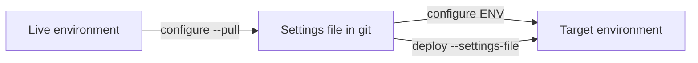

# Environment Configure Command - Plan

## Goal Capsule

- **Objective:** A team can capture an environment's per-environment configuration into a git-tracked file, and apply that file to an environment unattended, from a Flowline project or from a folder that has none.
- **Product authority:** This document. It supersedes the command-design section of [`docs/brainstorms/2026-06-12-environment-config-command-requirements.md`](../brainstorms/2026-06-12-environment-config-command-requirements.md) and ideas 7-8 of [`docs/ideation/2026-07-01-post-deploy-environment-config-ideation.html`](../ideation/2026-07-01-post-deploy-environment-config-ideation.html). Secret handling is outside this plan's authority — see [`2026-09-05-1406-feat-configure-secret-resolution-plan.md`](2026-09-05-1406-feat-configure-secret-resolution-plan.md).
- **Open blockers:** None.

---

## Product Contract

### Summary

Add `flowline configure <env>`: a verb-first command that applies a per-environment settings file to a Dataverse environment and captures one from a live environment with `--pull`.

### Problem Frame

A solution import carries structure, not per-environment state. Environment variable values and connection references are excluded from solutions by design, and Flowline has no command that writes either.

Activation is a narrower gap than it first appears. `deploy` already passes `--activate-plugins` on every import (`src/Flowline/Commands/DeployCommand.cs:807`), Microsoft's own switch for activating plug-ins and workflows and the default in Power Platform Pipelines. That leaves cloud flows: on an update import Microsoft preserves the target's state, so a flow switched off in the target stays off whatever the source says. Reconciling that, and recording in Git which components are meant to be off on purpose, is this plan's job.

The gap is felt three ways. In CI, nothing guarantees that TEST and PROD land with the same configuration, because configuration is applied by hand. When an environment is cloned or a DEV is re-provisioned, its configuration is reconstructed from memory. After go-live, turning a flow on or off means the maker portal, and that change exists nowhere in source control.

<!-- ce-section: work-relationships -->
### How This Work Fits Together

This plan owns **declared configuration**: a file that states what an environment's configuration should be, and a command that makes it so. The breakdown below is the current understanding, not a committed roadmap.

- **Secret resolution for the settings file** ([`2026-09-05-1406-feat-configure-secret-resolution-plan.md`](2026-09-05-1406-feat-configure-secret-resolution-plan.md)) — *Depends on* this plan. This plan's file holds literal values only (R4). That plan adds indirection so a value can reference a secret the file does not contain, and adds plugin secure configuration. It is the mitigation for the exposure R4 names, so teams carry that exposure until it lands.
- **Auto-applying configuration after a deploy** — *Depends on* this plan. `deploy --settings-file` is in v1 (R14) as a PAC passthrough asked for by flag. Applying the Flowline-owned sections automatically after an import, with the file and its references validated before packing, stays deferred.
- **Export on `clone` and `sync`** — *Depends on* this plan. Both are flags that call the pull capability R12 defines. Clone is the stronger of the two, since it targets PROD at the moment the repo is created.
- **Restore-on-deploy state snapshotting** ([`docs/brainstorms/2026-06-12-deploy-state-restoration-requirements.md`](../brainstorms/2026-06-12-deploy-state-restoration-requirements.md), listed under Deferred in [`STRATEGY.md`](../../STRATEGY.md)) — *Contradicts* this plan and stays deferred pending a decision. It treats the target's prior state as the truth; R3 treats the file as the truth and defaults to on. On a component that is off in the target and absent from the file the two disagree, so running both leaves two answers to why a flow changed state. Its own argument is that it needs no settings file: it works on the first deploy in any repo, with nothing authored, no discovery convention, and nothing to keep in step with the solution. It also covers public view state (`savedquery`), which sits outside this plan.
- **Inline single-component change** ([`2026-09-06-1132-feat-configure-inline-component-plan.md`](2026-09-06-1132-feat-configure-inline-component-plan.md)) — *Depends on* this plan. Lifted out of v1: component addressing, name collisions, setting a value rather than a state, and the dry-run interaction are all undesigned, and it was the lowest of the four stated priorities. It reuses this plan's apply path.
- **A read primitive for CI gates** ("is this flow on in PROD, exit 0 or 1") — *Shares* this plan's component-addressing grammar. *Still to decide* whether it belongs here, on `status`, or on its own command.

### Key Decisions

- **This work declares configuration.** A file states the intended state and `configure` makes the environment match it. Governs R1, R3.
- **One leaf command, with modes selected by flag.** Verb-first naming matches every other Flowline command; the cost is hand-validated mode combinations. Governs R5, R12.
- **Secret handling belongs to a separate plan.** This plan's file holds literal values. Governs R4.
- **Applying is explicit.** `configure` is run deliberately, and `deploy` touches configuration when given `--settings-file`. Governs R5, R14.
- **A component missing from the target is a reported skip.** This keeps `configure` safe to run before the solution has ever been imported. Governs R8.
- **This plan ships to users on its own, ahead of secret resolution.** Standalone it delivers post-deploy fixup and operational toggling in full; CI reproducibility is usable where every declared value is insensitive, and environment cloning stays manual until pull flags land on `clone`. The accepted cost is R4's exposure for that window: a value committed before secret resolution exists is remediated by rotation. Governs R4, R12, R13.
- **Settings files live beside the `.cdsproj`, one per environment role.** Solution-scoped data belongs with the solution, it keeps working for nested multi-solution repos, and it leaves the project root clear. Governs R4a.
- **The environment-to-file direction is `--pull`.** Git's `pull` already means fetch-and-merge, which is exactly R12b's semantics, and `sync` is already aliased `pull` for the same direction. Governs R12, R12b.
- **PAC generates the settings file's PAC-native sections.** Delegating wherever PAC already does the job is how Flowline inherits Microsoft's changes for free: `CopilotAgents` appeared in that file while the published parameter docs still listed two sections. Governs R12a.
- **The Flowline-owned sections extend PAC's file.** One file per environment, revisited if a real import proves `pac` rejects unknown keys. Governs R14.
- **A component the file does not name is left untouched.** The platform already defaults to on: `deploy` passes `--activate-plugins`, which activates plug-in steps and classic workflows, and a first-time import activates cloud flows that were on at export. The file therefore carries what the platform would get wrong — chiefly a component switched off after a deployment that should be on. One rule for every class, no enumeration on the apply path, and a run never switches on something somebody disabled deliberately. Governs R3, R9, R12.
- **Environment variables and connection references are applied by PAC at import time, and by Flowline through the SDK at every other time.** `deploy --settings-file` hands them to `pac solution import --settings-file`, so the initial landing uses Microsoft's own mechanism and inherits its connection-owner validation for almost no code. `configure` also writes those two classes through the SDK, so a wrong value is fixable while the solution stays imported. The accepted cost is two mechanisms writing the same two classes; R15 names the authority, and Flowline owns environment variable value-record and connection binding semantics on the SDK side. Governs R14, R15.

### Requirements

**The settings file**

- R1. One settings file per environment, authored and git-tracked by the team, declaring that environment's configuration.
- R2. The file covers environment variable values, connection references, flow and classic workflow active state, and plugin step enabled state.
- R3. The file is a partial declaration: `configure` reconciles the components the file names and leaves every other component untouched. One rule for every class. A component that must be on is declared on, which is what makes a drifted state fixable and reviewable.
- R4. Values are written and read literally. A settings file is as sensitive as the environment it was captured from, and a value that happens to hold a secret is committed like any other. The mitigation is the secret-resolution plan, not this one.
- R4a. Settings files live beside the `.cdsproj` as `Solution/deploymentSettings.<env>.json`, named for the environment role. When no per-environment file exists, `Solution/deploymentSettings.json` is used, so one file can serve every environment. PAC's filename stem is kept so a copied file is still recognisable as a deployment settings file. No Microsoft convention exists for this in a `.cdsproj` repo; this is Flowline's.

**Applying**

- R5. `flowline configure <env>` applies the settings file for that environment. `--settings-file <path>` overrides discovery; convention-based discovery applies only when the target is a role name, since `<env>` also accepts a URL.
- R5a. `configure` runs in project mode or stand-alone. Stand-alone applies when the command is given what it needs explicitly and no Flowline project root is found, matching how `deploy` resolves the same distinction from `--path` (`src/Flowline/Commands/DeployCommand.cs:105`). Stand-alone requires the target as a URL, since role names resolve from `.flowline`.
- R5b. Applying and inline changes need the solution's unique name, which project mode takes from the project and stand-alone takes from `--solution-name`. Neither needs a local artifact: components are enumerated from the target by name, the way orphan cleanup already does (`src/Flowline.Core/OrphanCleanup/OrphanCleanupService.cs:220`).
- R6. Applying is idempotent and re-runnable at any time, including before the solution has ever been imported.
- R7. Components apply in dependency order — environment variable values and connection references, then flow and workflow state, then plugin step state — regardless of their order in the file. Dataverse saves connection reference updates asynchronously, so that tier completes only once each binding is confirmed readable; flow state is not attempted before then.
- R7a. A component is skipped when a component it actually depends on failed or was itself skipped — not when any earlier tier had a failure. A skip propagated this way is an R8 skip and does not affect the exit code. Where the dependency between two declared components cannot be determined, the later component is attempted rather than skipped.
- R8. A component the file names that does not exist in the target is reported and skipped. It is not a failure and does not affect the exit code. When every component the file names is skipped, the run exits `Inconclusive` (19) rather than Success — nothing was compared, so it is not a pass signal (`src/Flowline.Core/ExitCode.cs:63`).
- R9. On apply, `configure` names the solution-scoped components in the covered classes that the file does not declare, so a reader can see how much of the environment the file actually governs. This is a warning and the exit code is unaffected.
- R10. `--dry-run` reports every change that would be made and writes nothing, following the existing `--dry-run` convention on `deploy` and `push`.
- R10a. Component values are opaque on every output surface. Dry-run, change summaries and failure messages report a value as changed, unchanged or set, never its content — for values read from the file and for one supplied inline. The secret-resolution plan extends this to resolved references rather than introducing it.
- R11. When some components apply and others fail, the command reports each failure and exits `PartialSuccess` (18), matching how orphan cleanup already reports post-import failures (`src/Flowline.Core/ExitCode.cs:55`). That code's published wording is deploy-and-orphan-cleanup specific, so its doc comment, the wiki exit-code page, and the `flowline` skill text broaden with this change.

**Capturing**

- R12. `flowline configure <env> --pull [<zip|folder>]` writes a settings file from the live environment, scoped to the solution's components rather than everything in the environment. The value is omitted in project mode, where the project's solution folder is used, and supplied stand-alone, where it also yields the solution's unique name from its manifest. For the state classes it writes the components whose state a deploy would not produce on its own, which in practice means the ones that are off; for the value classes it writes every declared value.
- R12a. `pac solution create-settings` generates the file's PAC-native sections, so a section Microsoft adds later appears without a Flowline change. Flowline fills in the live values and appends its own sections.
- R12b. Pulling merges into an existing file: components that have appeared are added, values already in the file are preserved, and an entry whose component no longer exists in the solution is reported rather than dropped. Merging matters most for the value classes, where a merge is what gives a newly declared variable somewhere to be configured.
- R13. Pulling writes component values verbatim, including the Key Vault reference fields of a Secret-type environment variable, whose value Dataverse does not expose. This verbatim default is provisional: the secret-resolution plan's open question about pulled values may replace it with reference placeholders, which would change what a pull writes for the same environment.

**Deploy integration**

- R14. `flowline deploy <env> --settings-file <path>` applies the whole file. The PAC-native sections go to `pac solution import --settings-file`, so environment variable values and connection references are applied by the import itself; the Flowline-owned sections are applied after the import, reported per R8 and exiting per R11. A configuration failure therefore surfaces once the solution is already in, which is the accepted trade in the no-preflight decision.
- R15. Neither mechanism is authoritative over the other: the file is. Because `configure` is idempotent (R6), running it after a deploy that already applied the same file changes nothing. A value that differs between the two runs means the file changed, not that the mechanisms disagree.

### Key Flows

**F1 — Bootstrap an environment's configuration**

1. Operator runs `flowline configure prod --pull`.
2. Flowline reads the solution's components from PROD and writes the settings file (R12).
3. Operator reviews and commits the file, treating it as sensitive per R4.

**F2 — Reproduce configuration in CI**

1. Pipeline runs `flowline deploy test --settings-file <path>`. The import applies the environment variable values and connection references from the file (R14).
2. The same run applies the file's flow, workflow and plugin step state after the import (R14), reporting each component per R8.
3. Components apply in dependency order (R7). Anything the file names that is missing from the target is skipped (R8), and anything in the solution the file does not name is reported (R9).
4. Any component that fails is reported and the run exits `PartialSuccess` (R11). Running `flowline configure test` separately is the equivalent two-step form.

### Acceptance Examples

- AE1. A file is exported from an environment, committed unchanged, and applied back to that same environment. Nothing changes and the command reports no differences. Covers R6, R12, R13.
- AE2. An environment has a flow that is off and the settings file does not name it. After `configure` runs the flow is still off, and the command names it among the components the file does not declare. Covers R3, R9.
- AE2a. The same file declares that flow on. After `configure` runs the flow is on. Covers R3.
- AE3. `configure test` runs against an environment where the solution has never been imported. Every declared component is reported as skipped, nothing is applied, and the command exits `Inconclusive`. Covers R6, R8.
- AE4. A file declares a connection reference and a flow that depends on it, listed flow-first. The connection reference is applied first. When it fails, the flow is reported as skipped rather than attempted, and is left inactive. Covers R7, R7a.
- AE5a. A solution gains a new environment variable. Re-running `configure prod --pull` adds an entry for it, leaves every value already in the file untouched, and reports a connection reference entry whose component was removed from the solution. Covers R12b.
- AE5b. `configure https://contoso-test.crm4.dynamics.com --settings-file prod.json --solution-name Contoso` runs in a folder with no Flowline project. It applies the file without a project, and the same command with a role name instead of a URL fails. Covers R5a, R5b.
- AE6. `deploy test --settings-file <path>` imports a solution whose file declares two environment variable values and one connection reference. The import applies all three. Running `configure test` immediately afterwards reports no change for them and applies only the flow and step state. Covers R14, R15.
- AE7. `configure prod --dry-run` runs over a file declaring five components, three of which already match. The output names the two that would change and nothing is written. Covers R10.

### Scope Boundaries

Deferred for later:

- Secret indirection, a resolution chain, and plugin secure configuration — the whole of [`2026-09-05-1406-feat-configure-secret-resolution-plan.md`](2026-09-05-1406-feat-configure-secret-resolution-plan.md).
- Export flags on `clone` and `sync`. Sync can only ever capture DEV, since it resolves `EnvironmentRole.Dev` (`src/Flowline/Commands/SyncCommand.cs:48`).
- An interactive component picker for users who do not know a component's name.
- A read command for CI gates.

Outside this work:

- Snapshotting and restoring state across an import. See How This Work Fits Together.
- Managed-solution scenarios. Flowline's model is unmanaged (`AGENTS.md`).

### Dependencies / Assumptions

- Assumed: the identity running `configure` can bind the connections the settings file names — it either owns them or they are shared with it. Flowline never creates connections. In a fresh TEST or a re-provisioned DEV this is a manual prerequisite, not an edge case.
- Assumed: the file is named and located by convention per environment, so `configure <env>` finds it without being told. The convention itself is a planning decision.
- `deploy` passes `--activate-plugins` on every import (`src/Flowline/Commands/DeployCommand.cs:807`), so plug-in steps and classic workflows arrive activated. R6's idempotency is measured within that behaviour.
- A Dataverse environment variable of type Secret stores a reference to an Azure Key Vault secret — subscription, resource group, vault name, secret name — not the secret itself ([Microsoft Learn](https://learn.microsoft.com/power-apps/maker/data-platform/environmentvariables-azure-key-vault-secrets)). Those reference fields are not sensitive, which is why R13 can export them.
- `IPostDeployService` exists (`src/Flowline/Program.cs:315-339`) but this plan registers nothing on it, since no command applies a settings file on your behalf.

### Outstanding Questions

**Deferred to Planning**

- Whether the file extends the PAC solution settings file shape (`pac solution create-settings` generates `EnvironmentVariables` and `ConnectionReferences`) with Flowline sections added, or uses a Flowline-native format. The apply mechanism is settled; this is the file shape only. Whichever shape is chosen must reserve the syntax the secret-resolution plan will use for references, define how a literal matching it is escaped, and leave room for a fifth component class — otherwise a file written under v1 changes meaning when that plan lands, and every adopter re-edits committed files.
- Whether `pac solution import --settings-file` tolerates the Flowline-owned sections in the same file. Verify with a real `pac` run early: the decision is to extend PAC's file, and to fall back to a separate Flowline file only if that is proven to break an import. This gates R14.
- Whether exported component identifiers are environment-local GUIDs or name-based. A file exported from PROD and applied to TEST needs the latter.
- Which exit code a fully blocked apply returns. The secret-resolution plan needs one for "a reference cannot be resolved, nothing applied", and assigns exit codes to this plan, which currently defines only Success, `Inconclusive` and `PartialSuccess`. Neither `ConfigInvalid` (11) nor `ValidationFailed` (15) is a clean fit, and the enum is a published contract agents pattern-match on.
- What declaring a `Suspended` flow as on should do. `workflow.statecode` has three values — Draft, Activated, Suspended — so a two-state declaration needs a stated outcome for the third.
- Whether `pac solution clone` or `sync` cleans `Solution/` as well as writing into it. R4a puts a hand-authored file there, and a clean would destroy it on every sync. Verify with a real run before relying on the location.
- Whether `push` ever writes plugin step `statecode`. If it does, a configure-declared step state would be undone by the next push and the two need a stated precedence.

### Sources / Research

- [`docs/brainstorms/2026-06-12-environment-config-command-requirements.md`](../brainstorms/2026-06-12-environment-config-command-requirements.md) — prior requirements. Its SDK notes on step and workflow state transitions stay useful; its command-design section is superseded here.
- [`docs/ideation/2026-07-01-post-deploy-environment-config-ideation.html`](../ideation/2026-07-01-post-deploy-environment-config-ideation.html) — ideas 7 and 8 (`flowline configure`, inline and interactive modes) are the direct ancestor of this plan.
- [`docs/ideation/2026-07-02-alm-accelerator-migration-targeting-ideation.html`](../ideation/2026-07-02-alm-accelerator-migration-targeting-ideation.html) — the per-environment deployment settings file idea.
- [`docs/brainstorms/2026-06-12-deploy-state-restoration-requirements.md`](../brainstorms/2026-06-12-deploy-state-restoration-requirements.md) — the adjacent work this plan deliberately excludes.
- `src/Flowline.Core/ExitCode.cs:55` — `PartialSuccess` as a stable public contract.
- `src/Flowline/Commands/SyncCommand.cs:48` — sync's DEV role lock, the reason pulling is not hosted there.

---

## Appendix

### Alternatives considered

Weighed during the brainstorm and two review rounds, then set aside. Recorded so they are not re-proposed without new information.

| Decision | Set aside | Why |
|---|---|---|
| Declared configuration | Snapshot-and-restore on deploy; one command doing both | The two answer the same question from different sources of truth. Restore-on-deploy keeps its own entry under How This Work Fits Together |
| One leaf command | `configure apply\|export\|set` verb branch; a `config` noun branch | Verb-first matches `clone`, `push`, `sync`, `deploy`. The branch buys per-leaf help and validation at the cost of that consistency |
| Inline stays inside `configure` | Top-level `set` / `get`; a top-level `override` | `set` collides with `.flowline` project config. Every alternative name reads well for on/off and breaks on setting a value |
| Secret handling in a separate plan | Carrying secrets, `${VAR}` and user-secrets in this plan | Combined scope was too large to plan as one unit, and capture, apply and set are useful without them |
| Applying is explicit | Auto-applying whenever a file exists for the target; opt-in per repo via `.flowline` | Keeps `deploy`'s success criteria unchanged and avoids a second code path |
| Missing component is a skip | Failing `NotFound` when the solution is absent; counting each miss toward partial success | Keeps `configure` safe to run before the solution has ever been imported |
| Ship ahead of secret resolution | Gating release on the secret plan; adding a v1 warning at pull time | Secrets are deliberately a later concern. R4 and the ship-alone decision record the accepted exposure |
| `Solution/deploymentSettings.<env>.json` | Project root; a `config/` folder | Solution-scoped data belongs with the solution and survives nested multi-solution repos. `config/` has no precedent beyond the deprecated ALM Accelerator |
| `--pull` | `--export`; `--capture`; `--create-settings` | Git's `pull` is fetch-and-merge, matching R12b. `--export` implies a fresh dump and collides with solution export |
| PAC generates its own sections | Flowline composing the PAC-native sections | `CopilotAgents` appeared in real files while the published docs still listed two sections; a hand-rolled generator would have missed it |
| Flowline sections extend PAC's file | A separate sibling file; generating a PAC-only subset at deploy time | One file per environment. Revisit if a real import proves `pac` rejects unknown keys — see Outstanding Questions |
| Absence means untouched | Absence means on, with the file listing only exceptions | `--activate-plugins` already makes on the platform default, so the file only needs to carry what the platform gets wrong. Avoids enumerating the solution on every apply and never switches on a component disabled deliberately |
| PAC at import, SDK otherwise | PAC-only; SDK-only | PAC-only makes a one-value fix a full re-import. SDK-only forfeits Microsoft's import-time semantics and connection-owner validation |
| No preflight on `deploy --settings-file` | Resolving references before packing; full pre-import validation | Accepted that a configuration failure surfaces after the import, reported like orphan cleanup |
| No `--strict` flag | Promoting skips and undeclared components to a failing exit code | The `Inconclusive` exit on an all-skipped run covers the wrong-file-wrong-environment case |
| Inline set-one-value in its own plan | Specifying the grammar inside v1; leaving R10 thin for planning to invent | The only part of the command with no settled design, and the fourth of four stated priorities |
| `deploy --settings-file` applies the whole file | A PAC passthrough that leaves state to `configure` | Passing a settings file and having part of it ignored is surprising, and the passthrough form earns little over running two commands |
| No `--scope` flag | A flag naming which sections to apply | Folded into the inline argument grammar, where a bare component type can mean that section — see Outstanding Questions |

Two decisions were reversed during review and are the most likely to be re-proposed. `deploy --settings-file` was cut from v1 and then restored once it became the delegation path to `pac solution import --settings-file`. R3 began as a partial declaration where absence meant untouched, and became a complete declaration by encoding.

