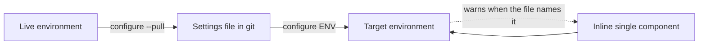

# Environment Configure Command - Plan

## Goal Capsule

- **Objective:** A team can capture an environment's per-environment configuration into a git-tracked file, apply that file to an environment unattended, and change one component without opening the maker portal — from a Flowline project or from a folder that has none.
- **Product authority:** This document. It supersedes the command-design section of [`docs/brainstorms/2026-06-12-environment-config-command-requirements.md`](../brainstorms/2026-06-12-environment-config-command-requirements.md) and ideas 7-8 of [`docs/ideation/2026-07-01-post-deploy-environment-config-ideation.html`](../ideation/2026-07-01-post-deploy-environment-config-ideation.html). Secret handling is outside this plan's authority — see [`2026-09-05-1406-feat-configure-secret-resolution-plan.md`](2026-09-05-1406-feat-configure-secret-resolution-plan.md).
- **Open blockers:** None.

---

## Product Contract

### Summary

Add `flowline configure <env>`: a verb-first command that applies a per-environment settings file to a Dataverse environment, captures one from a live environment with `--pull`, and changes one component inline without a file.

### Problem Frame

A solution import carries structure, not per-environment state. Environment variable values and connection references are excluded from solutions by design, and Flowline has no command that writes either.

Activation is a narrower gap than it first appears. `deploy` already passes `--activate-plugins` on every import (`src/Flowline/Commands/DeployCommand.cs:807`), which is Microsoft's own switch for activating plug-ins and workflows and the default in Power Platform Pipelines. What it does not cover is cloud flows: on an update import Microsoft deliberately preserves the target's state, so a flow switched off in the target stays off no matter what the source says. Nothing reconciles that, and nothing records anywhere in Git which components are meant to be off on purpose.

The gap is felt three ways. In CI, nothing guarantees that TEST and PROD land with the same configuration, because configuration is applied by hand. When an environment is cloned or a DEV is re-provisioned, its configuration is reconstructed from memory. After go-live, turning a flow on or off means the maker portal, and that change exists nowhere in source control.

<!-- ce-section: work-relationships -->
### How This Work Fits Together

This plan owns **declared configuration**: a file that states what an environment's configuration should be, and a command that makes it so. The breakdown below is the current understanding, not a committed roadmap.

- **Secret resolution for the settings file** ([`2026-09-05-1406-feat-configure-secret-resolution-plan.md`](2026-09-05-1406-feat-configure-secret-resolution-plan.md)) — *Depends on* this plan. This plan's file holds literal values only (R4). That plan adds indirection so a value can reference a secret the file does not contain, and adds plugin secure configuration. It is the mitigation for the exposure R4 names, so shipping this plan to users before it means teams carry that exposure.
- **Auto-applying configuration after a deploy** — *Depends on* this plan. `deploy --settings-file` is in v1 (R15) but only as a PAC passthrough the user asks for by flag. Applying the Flowline-owned sections automatically after an import, with the file and its references validated before packing, stays deferred.
- **Export on `clone` and `sync`** — *Depends on* this plan. Both are flags that call the capture capability R13 defines. Clone is the stronger of the two, since it targets PROD at the moment the repo is created.
- **Restore-on-deploy state snapshotting** ([`docs/brainstorms/2026-06-12-deploy-state-restoration-requirements.md`](../brainstorms/2026-06-12-deploy-state-restoration-requirements.md), listed under Deferred in [`STRATEGY.md`](../../STRATEGY.md)) — *Contradicts* this plan and stays deferred pending a decision. It treats the target's prior state as the truth; R3 treats the file as the truth and defaults to on. On a component that is off in the target and absent from the file the two disagree, and running both leaves no single answer to why a flow changed state. Against that, it needs no settings file at all: it works on the first deploy in any repo, with nothing authored, no discovery convention, and nothing to keep in step with the solution, which is the one thing this plan cannot match. Its other non-overlap is public view state (`savedquery`), which this plan does not cover.
- **A read primitive for CI gates** ("is this flow on in PROD, exit 0 or 1") — *Shares* this plan's component-addressing grammar. *Still to decide* whether it belongs here, on `status`, or on its own command.

### Key Decisions

- **This work declares configuration; it does not snapshot and restore it.** (session-settled: user-directed — chosen over restore-on-deploy and over a combined command: the two solve different problems and restore-on-deploy is already deferred in STRATEGY.md.) Governs R1, R3.
- **One leaf command with modes selected by flag, not a verb branch.** Verb-first naming matches every other Flowline command; the cost is hand-validated mode combinations. (session-settled: user-directed — chosen over a `configure apply|export|set` branch and over a `config` noun branch: consistency with `clone`/`push`/`sync`/`deploy` outweighs per-leaf help and validation.) Governs R5, R10, R13.
- **Inline single-component change stays inside `configure`.** It is the same reconcile with a smaller input, not a separate capability. (session-settled: user-directed — chosen over top-level `set`/`get` and over `override`: `set` collides with `.flowline` project config semantics, and every alternative name covers on/off but breaks on setting a value.) Governs R10.
- **Secret handling is a separate plan.** This plan's file holds literal values, so v1 ships with no indirection, no resolution chain, and no plugin secure configuration. (session-settled: user-directed — chosen over carrying secrets in this plan: the combined scope was too large, and capture, apply and set are useful without them.) Governs R4.
- **Applying is explicit; nothing applies a settings file unless asked.** `configure` is run deliberately, and `deploy` touches configuration only when given `--settings-file`. (session-settled: user-directed — chosen over auto-applying whenever a file exists for the target environment.) Governs R5, R15.
- **A component missing from the target is a reported skip, not a failure.** Keeps `configure` safe to run before the solution has ever been imported. (session-settled: user-directed — chosen over failing `NotFound` on an absent solution and over counting each miss toward partial success.) Governs R8.
- **This plan ships to users on its own, ahead of secret resolution.** Standalone it fully delivers post-deploy fixup and operational toggling; CI reproducibility is usable where no declared value is sensitive, and environment cloning stays manual until export flags land on `clone`. The accepted cost is R4's exposure for the whole window: export writes literal values, v1 adds no warning or permission control at export time, and a value committed before secret resolution exists cannot be un-committed — remediation is rotation, not a file edit. (session-settled: user-directed — chosen over gating release on the secret-resolution plan and over adding a v1 export warning: secrets are deliberately a later concern.) Governs R4, R13, R14.
- **Settings files live beside the `.cdsproj`, one per environment role.** Solution-scoped data belongs with the solution, it keeps working for nested multi-solution repos, and it keeps the project root clear. (session-settled: user-directed — chosen over the project root and over a `config/` folder.) Governs R4a.
- **The environment-to-file direction is `--pull`, not `--export`.** Git's `pull` already means fetch-and-merge, which is exactly R13b's semantics, and `sync` is already aliased `pull` for the same direction. `--export` implies a fresh dump and collides with solution export. (session-settled: user-directed — chosen over `--export`, `--capture` and `--create-settings`.) Governs R13, R13b.
- **PAC generates the settings file's PAC-native sections; Flowline never composes them.** Using PAC wherever it already does the job is how Flowline inherits Microsoft's changes for free — `CopilotAgents` appeared in that file without being in the published parameter docs, and a hand-rolled generator would have missed it. (session-settled: user-directed — chosen over Flowline composing the sections itself.) Governs R13a.
- **The Flowline-owned sections extend PAC's file rather than living in a sibling.** One file per environment, revisited only if a real import proves `pac` rejects unknown keys. (session-settled: user-directed — chosen over a separate Flowline file and over generating a PAC subset at deploy time.) Governs R15.
- **Everything in the solution is expected to be on; the file records the exceptions.** Being more opinionated than the platform is the point: Microsoft preserves a cloud flow's target state because it has no declaration to consult, and this command has one. The accepted costs are that `configure` enumerates the solution's state components on every apply, and that a component someone switched off without declaring it gets switched back on. (session-settled: user-directed — chosen over absence-meaning-untouched and over following the platform's per-class split.) Governs R3, R9, R13.
- **Environment variables and connection references are applied by PAC at import time, and by Flowline through the SDK at every other time.** `deploy --settings-file` hands them to `pac solution import --settings-file`, so the initial landing uses Microsoft's own mechanism and inherits its connection-owner validation for almost no code. `configure` also writes those two classes through the SDK, because PAC's file is consumed only during an import and a wrong value should be fixable without re-importing the solution. (session-settled: user-directed — chosen over PAC-only, which makes a one-value fix a full re-import, and over SDK-only, which forfeits Microsoft's import-time semantics and validation.) Governs R15, R16. The accepted cost is two mechanisms writing the same two component classes; R16 states which is authoritative and Flowline owns environment variable value-record and connection binding semantics on the SDK side.

### Requirements

**The settings file**

- R1. One settings file per environment, authored and git-tracked by the team, declaring that environment's configuration.
- R2. The file covers environment variable values, connection references, flow and classic workflow active state, and plugin step enabled state.
- R3. For the state classes (flows, classic workflows, plugin steps) the file is a complete declaration by encoding: every such component in the solution is expected to be on, and the file lists the exceptions that must be off. A component the file does not name is turned on, not left alone. This is deliberately more opinionated than the platform, which preserves a cloud flow's target state on update imports.
- R3a. For the value classes (environment variables, connection references) absence means untouched, because those components have no default-on state to assert.
- R4. Values are written and read literally. A settings file is as sensitive as the environment it was captured from, and a value that happens to hold a secret is committed like any other. The mitigation is the secret-resolution plan, not this one.
- R4a. Settings files live beside the `.cdsproj` as `Solution/deploymentSettings.<env>.json`, named for the environment role. When no per-environment file exists, `Solution/deploymentSettings.json` is used, so one file can serve every environment. PAC's filename stem is kept so a copied file is still recognisable as a deployment settings file. No Microsoft convention exists for this in a `.cdsproj` repo; this is Flowline's.

**Applying**

- R5. `flowline configure <env>` applies the settings file for that environment. `--settings-file <path>` overrides discovery; convention-based discovery applies only when the target is a role name, since `<env>` also accepts a URL.
- R5a. `configure` runs in project mode or stand-alone. Stand-alone applies when the command is given what it needs explicitly and no Flowline project root is found, matching how `deploy` resolves the same distinction from `--path` (`src/Flowline/Commands/DeployCommand.cs:105`). Stand-alone requires the target as a URL, since role names resolve from `.flowline`.
- R5b. Applying and inline changes need the solution's unique name, which project mode takes from the project and stand-alone takes from `--solution-name`. Neither needs a local artifact: components are enumerated from the target by name, the way orphan cleanup already does (`src/Flowline.Core/OrphanCleanup/OrphanCleanupService.cs:220`).
- R6. Applying is idempotent and re-runnable at any time, including before the solution has ever been imported.
- R7. Components apply in dependency order — environment variable values and connection references, then flow and workflow state, then plugin step state — regardless of their order in the file. Dataverse saves connection reference updates asynchronously, so that tier completes only once each binding is confirmed readable; flow state is not attempted before then.
- R7a. A component is skipped when a component it actually depends on failed or was itself skipped — not when any earlier tier had a failure. A skip propagated this way is an R8 skip and does not affect the exit code. Where the dependency between two declared components cannot be determined, the later component is attempted rather than skipped.
- R8. A component the file names that does not exist in the target is reported and skipped. It is not a failure and does not affect the exit code. When every component the file names is skipped, the run exits `Inconclusive` (19) rather than Success — nothing was compared, so it is not a pass signal (`src/Flowline.Core/ExitCode.cs:63`).
- R9. Applying the state classes requires enumerating the solution's components in those classes, since R3 gives absence a meaning. `configure` reports every component it turns on because the file did not name it, so a state change nobody declared is visible rather than silent.
- R10. `flowline configure <env>` accepts a single component inline instead of a file, changing that component's state or value without one. When the environment's settings file also names that component, the command warns that the next full apply will override the change.
- R11. `--dry-run` reports every change that would be made and writes nothing, following the existing `--dry-run` convention on `deploy` and `push`.
- R11a. Component values are opaque on every output surface. Dry-run, change summaries and failure messages report a value as changed, unchanged or set, never its content — for values read from the file and for one supplied inline. The secret-resolution plan extends this to resolved references rather than introducing it.
- R12. When some components apply and others fail, the command reports each failure and exits `PartialSuccess` (18), matching how orphan cleanup already reports post-import failures (`src/Flowline.Core/ExitCode.cs:55`). That code's published wording is deploy-and-orphan-cleanup specific, so its doc comment, the wiki exit-code page, and the `flowline` skill text broaden with this change.

**Capturing**

- R13. `flowline configure <env> --pull [<zip|folder>]` writes a settings file from the live environment, scoped to the solution's components rather than everything in the environment. The value is omitted in project mode, where the project's solution folder is used, and supplied stand-alone, where it also yields the solution's unique name from its manifest. For the state classes it writes only the components that are off, matching R3's encoding; for the value classes it writes every declared value.
- R13a. The file's PAC-native sections are generated by `pac solution create-settings` rather than composed by Flowline, so a section Microsoft adds later appears without a Flowline change. Flowline fills in the live values and appends its own sections.
- R13b. Pulling merges into an existing file: components that have appeared are added, values already in the file are preserved, and an entry whose component no longer exists in the solution is reported rather than dropped. Merging matters for the value classes, where absence means untouched and an unmerged file would leave a new variable configured nowhere; the state classes need nothing, since a new component is absent and absence already means on.
- R14. Pulling writes component values verbatim, including the Key Vault reference fields of a Secret-type environment variable, whose value Dataverse does not expose. This verbatim default is provisional: the secret-resolution plan's open question about pulled values may replace it with reference placeholders, which would change what a pull writes for the same environment.

**Deploy integration**

- R15. `flowline deploy <env> --settings-file <path>` passes the file's PAC-native sections to `pac solution import --settings-file`, so environment variable values and connection references are applied by the import itself. Deploy applies no Flowline-owned section; flow, workflow and plugin step state remain `configure`'s job.
- R16. Neither mechanism is authoritative over the other: the file is. Because `configure` is idempotent (R6), running it after a deploy that already applied the same file changes nothing. A value that differs between the two runs means the file changed, not that the mechanisms disagree.

### Key Flows

**F1 — Bootstrap an environment's configuration**

1. Operator runs `flowline configure prod --pull`.
2. Flowline reads the solution's components from PROD and writes the settings file (R13).
3. Operator reviews and commits the file, treating it as sensitive per R4.

**F2 — Reproduce configuration in CI**

1. Pipeline runs `flowline deploy test --settings-file <path>`. The import applies the environment variable values and connection references from the file (R15).
2. Pipeline runs `flowline configure test` as a second step, which applies flow, workflow and plugin step state, and re-asserts the first two classes as a no-op (R16).
3. Flowline applies in dependency order (R7): the file's declared-off components go off, every other state component in the solution goes on, and each one turned on because the file did not name it is reported (R9). Anything missing from the target is skipped (R8).
4. Any component that fails is reported and the run exits `PartialSuccess` (R12).

**F3 — Turn a feature on after go-live**

1. Operator runs `flowline configure prod flow "Order Processing" --on`.
2. Flowline activates that one flow and touches nothing else (R3, R10).
3. If the PROD settings file also names that flow, the command warns that the next full apply will override the change (R10).

### Acceptance Examples

- AE1. A file is exported from an environment, committed unchanged, and applied back to that same environment. Nothing changes and the command reports no differences. Covers R6, R13, R14.
- AE2. An environment has a flow that is off and the settings file does not name it. After `configure` runs the flow is on, and the command reports that it turned it on because the file did not declare it. Covers R3, R9.
- AE2a. The same environment has an environment variable whose value the file does not name. After `configure` runs the value is unchanged. Covers R3a.
- AE3. `configure test` runs against an environment where the solution has never been imported. Every declared component is reported as skipped, nothing is applied, and the command exits `Inconclusive`. Covers R6, R8.
- AE4. A file declares a connection reference and a flow that depends on it, listed flow-first. The connection reference is applied first. When it fails, the flow is reported as skipped rather than attempted, and is left inactive. Covers R7, R7a.
- AE5. `configure prod flow "Order Processing" --on` runs while the PROD settings file declares that flow inactive. The flow is activated and the command warns that the next full apply will deactivate it again. Covers R10.
- AE5a. A solution gains a new environment variable. Re-running `configure prod --pull` adds an entry for it, leaves every value already in the file untouched, and reports a connection reference entry whose component was removed from the solution. Covers R13b.
- AE5b. `configure https://contoso-test.crm4.dynamics.com --settings-file prod.json --solution-name Contoso` runs in a folder with no Flowline project. It applies the file without a project, and the same command with a role name instead of a URL fails. Covers R5a, R5b.
- AE6. `deploy test --settings-file <path>` imports a solution whose file declares two environment variable values and one connection reference. The import applies all three. Running `configure test` immediately afterwards reports no change for them and applies only the flow and step state. Covers R15, R16.
- AE7. `configure prod --dry-run` runs over a file declaring five components, three of which already match. The output names the two that would change and nothing is written. Covers R11.

### Scope Boundaries

Deferred for later:

- Secret indirection, a resolution chain, and plugin secure configuration — the whole of [`2026-09-05-1406-feat-configure-secret-resolution-plan.md`](2026-09-05-1406-feat-configure-secret-resolution-plan.md).
- Export flags on `clone` and `sync`. Sync can only ever capture DEV, since it resolves `EnvironmentRole.Dev` (`src/Flowline/Commands/SyncCommand.cs:48`).
- An interactive component picker for users who do not know a component's name.
- A read command for CI gates.

Outside this work:

- Snapshotting and restoring state across an import. See How This Work Fits Together.
- Managed-solution scenarios. Flowline's model is unmanaged (`AGENTS.md`).

### Dependencies / Assumptions

- Assumed: the identity running `configure` can bind the connections the settings file names — it either owns them or they are shared with it. Flowline never creates connections. In a fresh TEST or a re-provisioned DEV this is a manual prerequisite, not an edge case.
- Assumed: the file is named and located by convention per environment, so `configure <env>` finds it without being told. The convention itself is a planning decision.
- Classic workflows reset to Draft on every import, so R6's idempotency holds between imports rather than across one.
- A Dataverse environment variable of type Secret stores a reference to an Azure Key Vault secret — subscription, resource group, vault name, secret name — not the secret itself ([Microsoft Learn](https://learn.microsoft.com/power-apps/maker/data-platform/environmentvariables-azure-key-vault-secrets)). Those reference fields are not sensitive, which is why R14 can export them.
- `IPostDeployService` exists (`src/Flowline/Program.cs:315-339`) but this plan registers nothing on it, since no command applies a settings file on your behalf.

### Outstanding Questions

**Deferred to Planning**

- Whether the file extends the PAC solution settings file shape (`pac solution create-settings` generates `EnvironmentVariables` and `ConnectionReferences`) with Flowline sections added, or uses a Flowline-native format. The apply mechanism is settled; this is the file shape only. Whichever shape is chosen must reserve the syntax the secret-resolution plan will use for references, define how a literal matching it is escaped, and leave room for a fifth component class — otherwise a file written under v1 changes meaning when that plan lands, and every adopter re-edits committed files.
- Whether `pac solution import --settings-file` tolerates the Flowline-owned sections in the same file. Verify with a real `pac` run early: the decision is to extend PAC's file, and to fall back to a separate Flowline file only if that is proven to break an import. This gates R15.
- Whether exported component identifiers are environment-local GUIDs or name-based. A file exported from PROD and applied to TEST needs the latter.
- The inline argument grammar for R10 — how a component type, name, and target state are expressed on the command line.
- Which exit code a fully blocked apply returns. The secret-resolution plan needs one for "a reference cannot be resolved, nothing applied", and assigns exit codes to this plan, which currently defines only Success, `Inconclusive` and `PartialSuccess`. Neither `ConfigInvalid` (11) nor `ValidationFailed` (15) is a clean fit, and the enum is a published contract agents pattern-match on.
- What R3 means for a `Suspended` flow. `workflow.statecode` has three values — Draft, Activated, Suspended — and "absence means on" does not say whether a suspended flow is activated or left alone.
- What the enumeration in R9 costs on a large solution, and whether it needs bounding.
- Whether `pac solution clone` or `sync` ever cleans `Solution/` rather than only writing into it. R4a puts a hand-authored file there, and a clean would destroy it on every sync. Verify with a real run before relying on the location.
- Whether `push` ever writes plugin step `statecode`. If it does, a configure-declared step state would be undone by the next push and the two need a stated precedence.

### Sources / Research

- [`docs/brainstorms/2026-06-12-environment-config-command-requirements.md`](../brainstorms/2026-06-12-environment-config-command-requirements.md) — prior requirements. Its SDK notes on step and workflow state transitions stay useful; its command-design section is superseded here.
- [`docs/ideation/2026-07-01-post-deploy-environment-config-ideation.html`](../ideation/2026-07-01-post-deploy-environment-config-ideation.html) — ideas 7 and 8 (`flowline configure`, inline and interactive modes) are the direct ancestor of this plan.
- [`docs/ideation/2026-07-02-alm-accelerator-migration-targeting-ideation.html`](../ideation/2026-07-02-alm-accelerator-migration-targeting-ideation.html) — the per-environment deployment settings file idea.
- [`docs/brainstorms/2026-06-12-deploy-state-restoration-requirements.md`](../brainstorms/2026-06-12-deploy-state-restoration-requirements.md) — the adjacent work this plan deliberately excludes.
- `src/Flowline.Core/ExitCode.cs:55` — `PartialSuccess` as a stable public contract.
- `src/Flowline/Commands/SyncCommand.cs:48` — sync's DEV role lock, the reason pulling is not hosted there.
