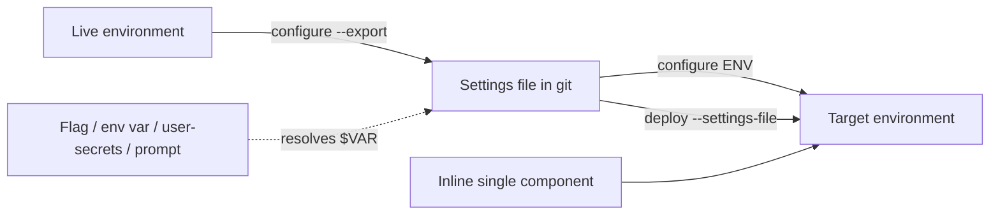

# Environment Configure Command - Plan

## Goal Capsule

- **Objective:** A team can reproduce an environment's per-environment configuration — environment variable values, connection references, flow and workflow activation, plugin step enablement — from a git-tracked file, unattended, without opening the maker portal.
- **Product authority:** This document. It supersedes the command-design section of [`docs/brainstorms/2026-06-12-environment-config-command-requirements.md`](../brainstorms/2026-06-12-environment-config-command-requirements.md) and ideas 7-8 of [`docs/ideation/2026-07-01-post-deploy-environment-config-ideation.html`](../ideation/2026-07-01-post-deploy-environment-config-ideation.html).
- **Open blockers:** None.

---

## Product Contract

### Summary

Add `flowline configure <env>`: a single verb-first command that applies a per-environment settings file to a Dataverse environment, captures one from a live environment with `--export`, and changes one component inline without a file. `deploy --settings-file <path>` applies the same file as part of a deploy.

### Problem Frame

A solution import carries structure, not per-environment state. Environment variable values and connection references are excluded from solutions by design; classic workflows reset to Draft on every import; plugin steps and flows carry whatever state the target happened to have. Flowline has no command that writes any of it.

The gap is felt three ways. In CI, nothing guarantees that TEST and PROD land with the same configuration, because configuration is applied by hand. When an environment is cloned or a DEV is re-provisioned, its configuration is reconstructed from memory. After go-live, turning a flow on or off means the maker portal, and that change exists nowhere in source control.

`IPostDeployService` already exists as the deploy extension point with six implementers (`src/Flowline/Program.cs:290-314`), so the deploy-side hook this needs is present. Nothing writes per-environment state through it.

<!-- ce-section: work-relationships -->
### How This Work Fits Together

This plan owns **declared configuration**: a file that states what an environment's configuration should be, and a command that makes it so. The breakdown below is the current understanding, not a committed roadmap.

- **Restore-on-deploy state snapshotting** ([`docs/brainstorms/2026-06-12-deploy-state-restoration-requirements.md`](../brainstorms/2026-06-12-deploy-state-restoration-requirements.md), listed under Deferred in [`STRATEGY.md`](../../STRATEGY.md)) — *Can proceed independently of* this plan. It preserves whatever state the target already had across an import; this plan declares state from a file. The two answer different questions and a team may want either, both, or neither.
- **Export on `clone` and `sync`** — *Depends on* this plan. Both are flags that call the capture capability R9 defines. Deferred to v2.
- **Auto-apply after deploy with preflight validation** — *Depends on* this plan. Deferred to v2; see R16 for the v1 stance.
- **A read primitive for CI gates** ("is this flow on in PROD, exit 0 or 1") — *Shares* this plan's component-addressing grammar. *Still to decide* whether it belongs here, on `status`, or on its own command.

### Key Decisions

- **This work declares configuration; it does not snapshot and restore it.** (session-settled: user-directed — chosen over restore-on-deploy and over a combined command: the two solve different problems and restore-on-deploy is already deferred in STRATEGY.md.) Governs R1, R3.
- **One leaf command with modes selected by flag, not a verb branch.** Verb-first naming matches every other Flowline command; the cost is hand-validated mode combinations. (session-settled: user-directed — chosen over a `configure apply|export|set` branch and over a `config` noun branch: consistency with `clone`/`push`/`sync`/`deploy` outweighs per-leaf help and validation.) Governs R4, R6, R9.
- **Inline single-component change stays inside `configure`.** It is the same reconcile with a smaller input, not a separate capability. (session-settled: user-directed — chosen over top-level `set`/`get` and over `override`: `set` collides with `.flowline` project config semantics, and every alternative name covers on/off but breaks on setting a value.) Governs R6.
- **Secret indirection is a property of the value, not of the section.** Any value anywhere in the file may be `${VAR}`. A plain-string environment variable can carry a secret and a Secret-type one carries only a Key Vault reference, so sorting by component type would be wrong in both directions. Governs R11.
- **`dotnet user-secrets` is a resolution rung, bought for ergonomics rather than security.** It is unencrypted plaintext in the user profile; what it adds over an environment variable is persistence across shells and per-solution scoping. (session-settled: user-directed — chosen over environment variables alone and over native Key Vault resolution: the small-team case needs persistence without Key Vault setup.) Governs R12.
- **Applying is explicit in v1.** Deploy never applies a settings file unless given one. (session-settled: user-directed — chosen over auto-apply-with-opt-out and over opt-in-per-repo: keeps deploy's current success criteria intact while the file format settles.) Governs R15, R16.
- **v1 covers only component classes that round-trip through export.** Plugin secure configuration is deferred so that everything `--export` writes can be applied back unchanged. (session-settled: user-directed — chosen over shipping it apply-only in v1: keeps v1's story symmetric.) Governs R2, R10.
- **Small teams may put secrets in plain-string environment variables.** Accepted risk: readable by any sufficiently privileged user, mitigated by admin-only environment access. (session-settled: user-directed — chosen over requiring Secret-type variables: Key Vault setup is disproportionate for a small team.) Governs R2, R11.

### Requirements

**The settings file**

- R1. One settings file per environment, authored and git-tracked by the team, declaring that environment's configuration.
- R2. The file covers environment variable values, connection references, flow and classic workflow active state, and plugin step enabled state. Plugin secure configuration is out of scope for v1.
- R3. The file is a partial declaration, not a full desired state: `configure` reconciles only the components the file names and leaves every other component untouched.

**Applying**

- R4. `flowline configure <env>` applies the settings file for that environment.
- R5. Applying is idempotent and re-runnable at any time, including with no prior deploy.
- R6. `flowline configure <env>` accepts a single component inline instead of a file, changing that component's state or value without one.
- R7. `--dry-run` reports every change that would be made and writes nothing, following the existing `--dry-run` convention on `deploy` and `push`.
- R8. When some components apply and others fail, the command reports each failure and exits `PartialSuccess` (18), matching how orphan cleanup already reports post-import failures (`src/Flowline.Core/ExitCode.cs:55`).

**Capturing**

- R9. `flowline configure <env> --export` writes a settings file from the live environment, scoped to the components belonging to the solution rather than everything in the environment.
- R10. Export never writes a secret value into the file. Every component class in scope for v1 round-trips: what export writes can be applied unchanged, apart from values the author chooses to replace with `${VAR}` references.

**Secret resolution**

- R11. Any value in the file may be written as `${VAR}` and is resolved when the file is applied.
- R12. Resolution order is: command-line flag, then process environment variable, then `dotnet user-secrets`, then a masked interactive prompt, then failure. This extends the chain `SecretResolver` already implements for the client secret (`src/Flowline/Services/SecretResolver.cs:20-39`) by one rung.
- R13. An unresolvable reference fails the command with a typed exit code and writes nothing for that value. Flowline never writes an empty value in place of a missing secret.
- R14. Resolved secret values are never logged and never written back to the settings file.

**Deploy integration**

- R15. `flowline deploy <env> --settings-file <path>` applies the named settings file as part of the deploy.
- R16. Deploy does not validate the settings file before importing. A configuration failure surfaces after the import has landed and reports partial success per R8.

### Key Flows

**F1 — Bootstrap an environment's configuration**

1. Operator runs `flowline configure prod --export`.
2. Flowline reads the solution's components from PROD and writes the settings file (R9).
3. Operator replaces sensitive values with `${VAR}` references and commits the file.

**F2 — Reproduce configuration in CI**

1. Pipeline runs `flowline deploy test`, which imports the solution.
2. Pipeline runs `flowline configure test`, or passes `--settings-file` to the deploy (R15).
3. Flowline resolves each `${VAR}` from the pipeline's environment (R12) and applies every declared component.
4. Any component that fails is reported and the run exits `PartialSuccess` (R8).

**F3 — Turn a feature on after go-live**

1. Operator runs `flowline configure prod flow "Order Processing" --on`.
2. Flowline activates that one flow and touches nothing else (R3, R6).

### Acceptance Examples

- AE1. A settings file references `${API_KEY}`, the variable is not set anywhere in the chain, and the run is non-interactive. The command fails with a typed exit code, names the unresolved variable, and applies no value for it. Covers R13.
- AE2. A file is exported from an environment, committed unchanged, and applied back to that same environment. Nothing changes and the command reports no differences. Covers R5, R9, R10.
- AE3. An environment has a flow that the settings file does not name, and the flow is Active. After `configure` runs, the flow is still Active. Covers R3.
- AE4. A deploy is run with `--settings-file`, the import succeeds, and one connection reference in the file points at a connection that does not exist in the target. The solution stays imported, the failure is reported, and the run exits `PartialSuccess`. Covers R8, R16.
- AE5. `configure prod --dry-run` is run against a file declaring five components, three of which already match. The output names the two that would change and nothing is written. Covers R7.

### Scope Boundaries

Deferred for later:

- Plugin secure configuration. Ranked last of the four component classes, and the only one that cannot round-trip through export, since secure configuration is never returned on read (`CONCEPTS.md:86`). Deferring it keeps v1 symmetric: everything export writes can be applied back.
- Export flags on `clone` and `sync`. Clone is the stronger of the two, because it targets PROD at the moment the repo is created; sync can only ever capture DEV, since it resolves `EnvironmentRole.Dev` (`src/Flowline/Commands/SyncCommand.cs:48`).
- Auto-applying the settings file after deploy, with the file and its `${VAR}` references validated before packing.
- Native Azure Key Vault resolution (`kv://` references) inside Flowline.
- An interactive component picker for users who do not know a component's name.
- A separate read command for CI gates.

Outside this work:

- Snapshotting and restoring state across an import. See How This Work Fits Together.
- `.env` file support. Azure's own guidance is not to store secrets in one, and it places a live secret inside the working tree.
- Managed-solution scenarios. Flowline's model is unmanaged (`AGENTS.md`).

### Dependencies / Assumptions

- A Dataverse environment variable of type Secret stores a reference to an Azure Key Vault secret — subscription, resource group, vault name, secret name — not the secret itself, and Key Vault is the only supported secret store ([Microsoft Learn](https://learn.microsoft.com/power-apps/maker/data-platform/environmentvariables-azure-key-vault-secrets)). Those reference fields are not sensitive and belong in the committed file.
- Plugin secure configuration is never returned on read and is excluded from solution export (`CONCEPTS.md:86`). This is why it is deferred rather than included: it is the one class export could not produce.
- `IPostDeployService` is the deploy hook this needs and already exists (`src/Flowline/Program.cs:290-314`).
- Assumed: the file is named and located by convention per environment, so `configure <env>` finds it without being told. The convention itself is a planning decision.

### Outstanding Questions

**Deferred to Planning**

- Whether the file extends the PAC solution settings file shape (`pac solution create-settings` generates `EnvironmentVariables` and `ConnectionReferences`) with Flowline sections added, or uses a Flowline-native format.
- Whether `deploy --settings-file` hands the PAC-native sections to `pac solution import --settings-file` at import time and applies the Flowline sections afterwards, or applies everything through the SDK after import.
- The inline argument grammar for R6 — how a component type, name, and target state are expressed on the command line.
- File naming and discovery convention.
- Whether `--export` over an existing file is force-gated, per the `--force` specifier pattern (`src/Flowline/Commands/SyncCommand.cs:41`).

### Sources / Research

- [`docs/brainstorms/2026-06-12-environment-config-command-requirements.md`](../brainstorms/2026-06-12-environment-config-command-requirements.md) — prior requirements. Its SDK notes on step and workflow state transitions stay useful; its command-design section is superseded here.
- [`docs/ideation/2026-07-01-post-deploy-environment-config-ideation.html`](../ideation/2026-07-01-post-deploy-environment-config-ideation.html) — ideas 7 and 8 (`flowline configure`, inline and interactive modes) are the direct ancestor of this plan.
- [`docs/ideation/2026-07-02-alm-accelerator-migration-targeting-ideation.html`](../ideation/2026-07-02-alm-accelerator-migration-targeting-ideation.html) — the per-environment deployment settings file idea.
- [`docs/brainstorms/2026-06-12-deploy-state-restoration-requirements.md`](../brainstorms/2026-06-12-deploy-state-restoration-requirements.md) — the adjacent work this plan deliberately excludes.
- `src/Flowline/Services/SecretResolver.cs:20-39` — the existing secret resolution chain R12 extends.
- `src/Flowline.Core/ExitCode.cs:55` — `PartialSuccess` as a stable public contract.
- `src/Flowline/Commands/SyncCommand.cs:48` — sync's DEV role lock, the reason export is not hosted there.
- [Use environment variables for Azure Key Vault secrets](https://learn.microsoft.com/power-apps/maker/data-platform/environmentvariables-azure-key-vault-secrets) — Secret-type variables store references, not values.
