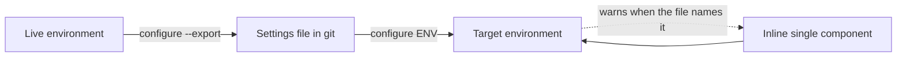

# Environment Configure Command - Plan

## Goal Capsule

- **Objective:** A team can capture an environment's per-environment configuration into a git-tracked file, apply that file to an environment unattended, and change one component without opening the maker portal.
- **Product authority:** This document. It supersedes the command-design section of [`docs/brainstorms/2026-06-12-environment-config-command-requirements.md`](../brainstorms/2026-06-12-environment-config-command-requirements.md) and ideas 7-8 of [`docs/ideation/2026-07-01-post-deploy-environment-config-ideation.html`](../ideation/2026-07-01-post-deploy-environment-config-ideation.html). Secret handling is outside this plan's authority — see [`2026-09-05-1406-feat-configure-secret-resolution-plan.md`](2026-09-05-1406-feat-configure-secret-resolution-plan.md).
- **Open blockers:** None.

---

## Product Contract

### Summary

Add `flowline configure <env>`: a verb-first command that applies a per-environment settings file to a Dataverse environment, captures one from a live environment with `--export`, and changes one component inline without a file.

### Problem Frame

A solution import carries structure, not per-environment state. Environment variable values and connection references are excluded from solutions by design; classic workflows reset to Draft on every import; plugin steps and flows carry whatever state the target happened to have. Flowline has no command that writes any of it.

The gap is felt three ways. In CI, nothing guarantees that TEST and PROD land with the same configuration, because configuration is applied by hand. When an environment is cloned or a DEV is re-provisioned, its configuration is reconstructed from memory. After go-live, turning a flow on or off means the maker portal, and that change exists nowhere in source control.

<!-- ce-section: work-relationships -->
### How This Work Fits Together

This plan owns **declared configuration**: a file that states what an environment's configuration should be, and a command that makes it so. The breakdown below is the current understanding, not a committed roadmap.

- **Secret resolution for the settings file** ([`2026-09-05-1406-feat-configure-secret-resolution-plan.md`](2026-09-05-1406-feat-configure-secret-resolution-plan.md)) — *Depends on* this plan. This plan's file holds literal values only (R4). That plan adds indirection so a value can reference a secret the file does not contain, and adds plugin secure configuration. It is the mitigation for the exposure R4 names, so shipping this plan to users before it means teams carry that exposure.
- **Deploy integration (`deploy --settings-file`)** — *Depends on* this plan. Cut from v1: without pre-import validation it produces the same result as running `deploy` then `configure` as two steps, while adding a flag, a settings type, a post-deploy service and a new exit path to `deploy`'s published contract. It earns its cost only in the validated form, which also needs the secret plan's resolution pass.
- **Export on `clone` and `sync`** — *Depends on* this plan. Both are flags that call the capture capability R13 defines. Clone is the stronger of the two, since it targets PROD at the moment the repo is created.
- **Restore-on-deploy state snapshotting** ([`docs/brainstorms/2026-06-12-deploy-state-restoration-requirements.md`](../brainstorms/2026-06-12-deploy-state-restoration-requirements.md), listed under Deferred in [`STRATEGY.md`](../../STRATEGY.md)) — *Can proceed independently of* this plan. It preserves whatever state the target already had across an import; this plan declares state from a file.
- **A read primitive for CI gates** ("is this flow on in PROD, exit 0 or 1") — *Shares* this plan's component-addressing grammar. *Still to decide* whether it belongs here, on `status`, or on its own command.

### Key Decisions

- **This work declares configuration; it does not snapshot and restore it.** (session-settled: user-directed — chosen over restore-on-deploy and over a combined command: the two solve different problems and restore-on-deploy is already deferred in STRATEGY.md.) Governs R1, R3.
- **One leaf command with modes selected by flag, not a verb branch.** Verb-first naming matches every other Flowline command; the cost is hand-validated mode combinations. (session-settled: user-directed — chosen over a `configure apply|export|set` branch and over a `config` noun branch: consistency with `clone`/`push`/`sync`/`deploy` outweighs per-leaf help and validation.) Governs R5, R10, R13.
- **Inline single-component change stays inside `configure`.** It is the same reconcile with a smaller input, not a separate capability. (session-settled: user-directed — chosen over top-level `set`/`get` and over `override`: `set` collides with `.flowline` project config semantics, and every alternative name covers on/off but breaks on setting a value.) Governs R10.
- **Secret handling is a separate plan.** This plan's file holds literal values, so v1 ships with no indirection, no resolution chain, and no plugin secure configuration. (session-settled: user-directed — chosen over carrying secrets in this plan: the combined scope was too large, and capture, apply and set are useful without them.) Governs R4.
- **Applying is explicit; no command applies a settings file on your behalf.** (session-settled: user-directed — chosen over auto-apply-with-opt-out and over shipping `deploy --settings-file` in v1: an unvalidated deploy hook produces the same outcome as running two commands.) Governs R5.
- **A component missing from the target is a reported skip, not a failure.** Keeps `configure` safe to run before the solution has ever been imported. (session-settled: user-directed — chosen over failing `NotFound` on an absent solution and over counting each miss toward partial success.) Governs R8.
- **This plan ships to users on its own, ahead of secret resolution.** Standalone it fully delivers post-deploy fixup and operational toggling; CI reproducibility is usable where no declared value is sensitive, and environment cloning stays manual until export flags land on `clone`. The accepted cost is R4's exposure for the whole window: export writes literal values, v1 adds no warning or permission control at export time, and a value committed before secret resolution exists cannot be un-committed — remediation is rotation, not a file edit. (session-settled: user-directed — chosen over gating release on the secret-resolution plan and over adding a v1 export warning: secrets are deliberately a later concern.) Governs R4, R13, R14.
- **Environment variable and connection reference values apply through the SDK rather than by delegating to `pac solution import --settings-file`.** PAC's settings file is consumed only during an import, so delegating would make those two classes unreachable without one — forfeiting apply-without-import, per-component dry-run, and per-component failure reporting, which are the point of the command.

### Requirements

**The settings file**

- R1. One settings file per environment, authored and git-tracked by the team, declaring that environment's configuration.
- R2. The file covers environment variable values, connection references, flow and classic workflow active state, and plugin step enabled state.
- R3. The file is a partial declaration, not a full desired state: `configure` reconciles only the components the file names and leaves every other component untouched.
- R4. Values are written and read literally. A settings file is as sensitive as the environment it was captured from, and a value that happens to hold a secret is committed like any other. The mitigation is the secret-resolution plan, not this one.

**Applying**

- R5. `flowline configure <env>` applies the settings file for that environment. `--settings-file <path>` overrides discovery; convention-based discovery applies only when the target is a role name, since `<env>` also accepts a URL.
- R6. Applying is idempotent and re-runnable at any time, including before the solution has ever been imported.
- R7. Components apply in dependency order — environment variable values and connection references, then flow and workflow state, then plugin step state — regardless of their order in the file. Dataverse saves connection reference updates asynchronously, so that tier completes only once each binding is confirmed readable; flow state is not attempted before then.
- R7a. A component is skipped when a component it actually depends on failed or was itself skipped — not when any earlier tier had a failure. A skip propagated this way is an R8 skip and does not affect the exit code. Where the dependency between two declared components cannot be determined, the later component is attempted rather than skipped.
- R8. A component the file names that does not exist in the target is reported and skipped. It is not a failure and does not affect the exit code. When every component the file names is skipped, the run exits `Inconclusive` (19) rather than Success — nothing was compared, so it is not a pass signal (`src/Flowline.Core/ExitCode.cs:63`).
- R9. On apply, `configure` names the solution-scoped components in the covered classes that the file does not declare. This is a warning; the file stays a partial declaration and the exit code is unaffected.
- R10. `flowline configure <env>` accepts a single component inline instead of a file, changing that component's state or value without one. When the environment's settings file also names that component, the command warns that the next full apply will override the change.
- R11. `--dry-run` reports every change that would be made and writes nothing, following the existing `--dry-run` convention on `deploy` and `push`.
- R11a. Component values are opaque on every output surface. Dry-run, change summaries and failure messages report a value as changed, unchanged or set, never its content — for values read from the file and for one supplied inline. The secret-resolution plan extends this to resolved references rather than introducing it.
- R12. When some components apply and others fail, the command reports each failure and exits `PartialSuccess` (18), matching how orphan cleanup already reports post-import failures (`src/Flowline.Core/ExitCode.cs:55`). That code's published wording is deploy-and-orphan-cleanup specific, so its doc comment, the wiki exit-code page, and the `flowline` skill text broaden with this change.

**Capturing**

- R13. `flowline configure <env> --export` writes a settings file from the live environment, scoped to the components belonging to the solution rather than everything in the environment.
- R14. Export writes component values verbatim, including the Key Vault reference fields of a Secret-type environment variable, whose value Dataverse does not expose. This verbatim default is provisional: the secret-resolution plan's open export question may replace it with reference placeholders, which would change export's output for the same environment.

### Key Flows

**F1 — Bootstrap an environment's configuration**

1. Operator runs `flowline configure prod --export`.
2. Flowline reads the solution's components from PROD and writes the settings file (R13).
3. Operator reviews and commits the file, treating it as sensitive per R4.

**F2 — Reproduce configuration in CI**

1. Pipeline runs `flowline deploy test`, which imports the solution.
2. Pipeline runs `flowline configure test` as a second step.
3. Flowline applies declared components in dependency order (R7), naming any it skipped (R8) and any the file does not declare (R9).
4. Any component that fails is reported and the run exits `PartialSuccess` (R12).

**F3 — Turn a feature on after go-live**

1. Operator runs `flowline configure prod flow "Order Processing" --on`.
2. Flowline activates that one flow and touches nothing else (R3, R10).
3. If the PROD settings file also names that flow, the command warns that the next full apply will override the change (R10).

### Acceptance Examples

- AE1. A file is exported from an environment, committed unchanged, and applied back to that same environment. Nothing changes and the command reports no differences. Covers R6, R13, R14.
- AE2. An environment has an Active flow the settings file does not name. After `configure` runs, the flow is still Active and the command names it as undeclared. Covers R3, R9.
- AE3. `configure test` runs against an environment where the solution has never been imported. Every declared component is reported as skipped, nothing is applied, and the command exits `Inconclusive`. Covers R6, R8.
- AE4. A file declares a connection reference and a flow that depends on it, listed flow-first. The connection reference is applied first. When it fails, the flow is reported as skipped rather than attempted, and is left inactive. Covers R7, R7a.
- AE5. `configure prod flow "Order Processing" --on` runs while the PROD settings file declares that flow inactive. The flow is activated and the command warns that the next full apply will deactivate it again. Covers R10.
- AE6. `configure prod --dry-run` runs over a file declaring five components, three of which already match. The output names the two that would change and nothing is written. Covers R11.

### Scope Boundaries

Deferred for later:

- Secret indirection, a resolution chain, and plugin secure configuration — the whole of [`2026-09-05-1406-feat-configure-secret-resolution-plan.md`](2026-09-05-1406-feat-configure-secret-resolution-plan.md).
- `deploy --settings-file`. See How This Work Fits Together for why it is not worth its cost unvalidated.
- Export flags on `clone` and `sync`. Sync can only ever capture DEV, since it resolves `EnvironmentRole.Dev` (`src/Flowline/Commands/SyncCommand.cs:48`).
- An interactive component picker for users who do not know a component's name.
- A read command for CI gates.

Outside this work:

- Snapshotting and restoring state across an import. See How This Work Fits Together.
- Managed-solution scenarios. Flowline's model is unmanaged (`AGENTS.md`).

### Dependencies / Assumptions

- Assumed: the identity running `configure` can bind the connections the settings file names — it either owns them or they are shared with it. Flowline never creates connections. In a fresh TEST or a re-provisioned DEV this is a manual prerequisite, not an edge case.
- Assumed: the file is named and located by convention per environment, so `configure <env>` finds it without being told. The convention itself is a planning decision.
- Classic workflows reset to Draft on every import, so R6's idempotency holds between imports rather than across one.
- A Dataverse environment variable of type Secret stores a reference to an Azure Key Vault secret — subscription, resource group, vault name, secret name — not the secret itself ([Microsoft Learn](https://learn.microsoft.com/power-apps/maker/data-platform/environmentvariables-azure-key-vault-secrets)). Those reference fields are not sensitive, which is why R14 can export them.
- `IPostDeployService` exists (`src/Flowline/Program.cs:315-339`) but this plan registers nothing on it, since no command applies a settings file on your behalf.

### Outstanding Questions

**Deferred to Planning**

- Whether the file extends the PAC solution settings file shape (`pac solution create-settings` generates `EnvironmentVariables` and `ConnectionReferences`) with Flowline sections added, or uses a Flowline-native format. The apply mechanism is settled; this is the file shape only. Whichever shape is chosen must reserve the syntax the secret-resolution plan will use for references, define how a literal matching it is escaped, and leave room for a fifth component class — otherwise a file written under v1 changes meaning when that plan lands, and every adopter re-edits committed files.
- Whether exported component identifiers are environment-local GUIDs or name-based. A file exported from PROD and applied to TEST needs the latter.
- The inline argument grammar for R10 — how a component type, name, and target state are expressed on the command line.
- File naming and discovery convention, and what happens when discovery finds nothing or is ambiguous.
- Whether `--export` over an existing file is force-gated, per the `--force` specifier pattern (`src/Flowline/Commands/SyncCommand.cs:41`).
- Which exit code a fully blocked apply returns. The secret-resolution plan needs one for "a reference cannot be resolved, nothing applied", and assigns exit codes to this plan, which currently defines only Success, `Inconclusive` and `PartialSuccess`. Neither `ConfigInvalid` (11) nor `ValidationFailed` (15) is a clean fit, and the enum is a published contract agents pattern-match on.
- Whether `push` ever writes plugin step `statecode`. If it does, a configure-declared step state would be undone by the next push and the two need a stated precedence.

### Sources / Research

- [`docs/brainstorms/2026-06-12-environment-config-command-requirements.md`](../brainstorms/2026-06-12-environment-config-command-requirements.md) — prior requirements. Its SDK notes on step and workflow state transitions stay useful; its command-design section is superseded here.
- [`docs/ideation/2026-07-01-post-deploy-environment-config-ideation.html`](../ideation/2026-07-01-post-deploy-environment-config-ideation.html) — ideas 7 and 8 (`flowline configure`, inline and interactive modes) are the direct ancestor of this plan.
- [`docs/ideation/2026-07-02-alm-accelerator-migration-targeting-ideation.html`](../ideation/2026-07-02-alm-accelerator-migration-targeting-ideation.html) — the per-environment deployment settings file idea.
- [`docs/brainstorms/2026-06-12-deploy-state-restoration-requirements.md`](../brainstorms/2026-06-12-deploy-state-restoration-requirements.md) — the adjacent work this plan deliberately excludes.
- `src/Flowline.Core/ExitCode.cs:55` — `PartialSuccess` as a stable public contract.
- `src/Flowline/Commands/SyncCommand.cs:48` — sync's DEV role lock, the reason export is not hosted there.
