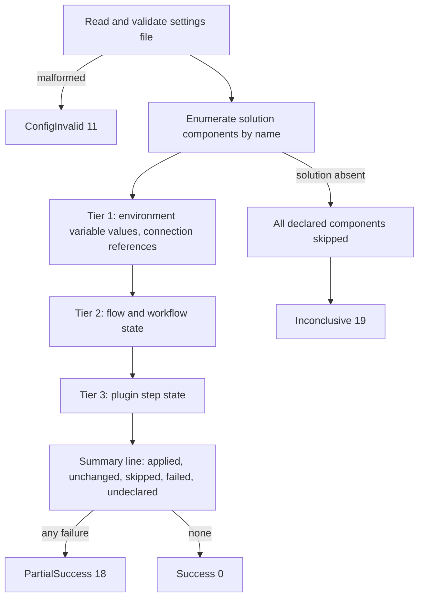

# Environment Configure Command - Plan

## Goal Capsule

- **Objective:** A team can capture an environment's per-environment configuration into a git-tracked file, and apply that file to an environment unattended, from a Flowline project or from a folder that has none.
- **Means:** A new `configure` command that writes the four component classes through the Dataverse SDK, with `pac solution create-settings` generating the PAC-native half of the file (see the Key Decision on PAC-generated sections).
- **Product authority:** This document. It supersedes the command-design section of [`docs/brainstorms/2026-06-12-environment-config-command-requirements.md`](../brainstorms/2026-06-12-environment-config-command-requirements.md) and ideas 7-8 of [`docs/ideation/2026-07-01-post-deploy-environment-config-ideation.html`](../ideation/2026-07-01-post-deploy-environment-config-ideation.html). Secret handling is outside this plan's authority — see [`2026-09-05-1406-feat-configure-secret-resolution-plan.md`](2026-09-05-1406-feat-configure-secret-resolution-plan.md).
- **Stop conditions:** Stop and ask if implementation shows a value class cannot be written correctly through the SDK at all. That would reopen whether `configure` can own those classes without an import, which is a product call rather than a planning one.
- **Open blockers:** None. Document review raised five; four were answered here and one moved with the deploy integration to its own plan.
- **Execution profile:** Deep. Eight units, U8 retired to the deploy plan. Most of the weight is in `Flowline.Core`: environment variable and connection reference writes have no precedent anywhere in `src/`.
- **Product Contract preservation:** R1-R13 unchanged. R14 and R15 removed with the deploy integration, which moved to its own plan; no surviving requirement cited them. Two Dependencies entries corrected against research: the file-naming assumption was superseded by R4a, and the claim that nothing registers on `IPostDeployService` is reversed by KTD4. Six Outstanding Questions resolved into KTDs or verified facts; one remains open and non-blocking.

---

## Product Contract

### Summary

Add `flowline configure <env>`: a verb-first command that applies a per-environment settings file to a Dataverse environment and captures one from a live environment with `--pull`.

### Problem Frame

A solution import carries structure, not per-environment state. Environment variable values and connection references are excluded from solutions by design, and Flowline has no command that writes either.

Activation is a narrower gap than it first appears. `deploy` already passes `--activate-plugins` on every import (`src/Flowline/Commands/DeployCommand.cs:807`), Microsoft's own switch for activating plug-ins and workflows and the default in Power Platform Pipelines. That leaves cloud flows: on an update import Microsoft preserves the target's state, so a flow switched off in the target stays off whatever the source says. Reconciling that, and recording in Git which components are meant to be off on purpose, is this plan's job.

The gap is felt three ways. In CI, nothing guarantees that TEST and PROD land with the same configuration, because configuration is applied by hand. When an environment is cloned or a DEV is re-provisioned, its configuration is reconstructed from memory. After go-live, turning a flow on or off means the maker portal, and that change exists nowhere in source control.

<!-- ce-section: work-relationships -->
### How This Work Fits Together

This plan owns **declared configuration**: a file that states what an environment's configuration should be, and a command that makes it so. The breakdown below is the current understanding, not a committed roadmap.

- **Secret resolution for the settings file** ([`2026-09-05-1406-feat-configure-secret-resolution-plan.md`](2026-09-05-1406-feat-configure-secret-resolution-plan.md)) — *Depends on* this plan. This plan's file holds literal values only (R4). That plan adds indirection so a value can reference a secret the file does not contain, and adds plugin secure configuration. It is the mitigation for the exposure R4 names, so teams carry that exposure until it lands.
- **Deploy integration** ([`2026-09-06-1512-feat-deploy-settings-file-plan.md`](2026-09-06-1512-feat-deploy-settings-file-plan.md)) — *Depends on* this plan. Lifted out of v1: it was the only unit modifying published behaviour, and document review found six defects in it against one or two elsewhere. It reuses this plan's apply path.
- **Pull on `clone` and `sync`** — *Depends on* this plan. Both are flags that call the capture capability R12 defines. Clone is the stronger of the two, since it targets PROD at the moment the repo is created.
- **Restore-on-deploy state snapshotting** ([`docs/brainstorms/2026-06-12-deploy-state-restoration-requirements.md`](../brainstorms/2026-06-12-deploy-state-restoration-requirements.md), listed under Deferred in [`STRATEGY.md`](../../STRATEGY.md)) — *Contradicts* this plan and stays deferred pending a decision. It treats the target's prior state as the truth; R3 treats the file as the truth for the components the file names. On a component that is off in the target and declared on in the file the two disagree, so running both leaves two answers to why a flow changed state. Its own argument is that it needs no settings file: it works on the first deploy in any repo, with nothing authored, no discovery convention, and nothing to keep in step with the solution. It also covers public view state (`savedquery`), which sits outside this plan.
- **Inline single-component change** ([`2026-09-06-1132-feat-configure-inline-component-plan.md`](2026-09-06-1132-feat-configure-inline-component-plan.md)) — *Depends on* this plan. Lifted out of v1: component addressing, name collisions, setting a value rather than a state, and the dry-run interaction are all undesigned, and it was the lowest of the four stated priorities. It reuses this plan's apply path.
- **A read primitive for CI gates** ("is this flow on in PROD, exit 0 or 1") — *Shares* this plan's component-addressing grammar. *Still to decide* whether it belongs here, on `status`, or on its own command. Deferred deliberately: `--dry-run` plus the R11a summary line covers an agent's read need for v1, and the primitive is only needed when a pipeline must gate on configuration drift.

### Key Decisions

- **This work declares configuration.** A file states the intended state and `configure` makes the environment match it. Governs R1, R3.
- **One leaf command, with modes selected by flag.** Verb-first naming matches every other Flowline command; the cost is hand-validated mode combinations. Governs R5, R12.
- **Secret handling belongs to a separate plan.** This plan's file holds literal values. Governs R4.
- **Applying is explicit.** `configure` is run deliberately; no other command applies a settings file. Governs R5.
- **A component missing from the target is a reported skip.** This keeps `configure` safe to run before the solution has ever been imported. Governs R8.
- **This plan ships to users on its own, ahead of secret resolution.** Standalone it delivers post-deploy fixup and operational toggling in full; CI reproducibility is usable where every declared value is insensitive, and environment cloning stays manual until pull flags land on `clone`. The accepted cost is R4's exposure for that window: a value committed before secret resolution exists is remediated by rotation. Governs R4, R12, R13.
- **Settings files live beside the `.cdsproj`, one per environment role.** Solution-scoped data belongs with the solution, it keeps working for nested multi-solution repos, and it leaves the project root clear. Governs R4a.
- **The environment-to-file direction is `--pull`.** Git's `pull` already means fetch-and-merge, which is exactly R12b's semantics, and `sync` is already aliased `pull` for the same direction. Governs R12, R12b.
- **PAC generates the settings file's PAC-native sections.** Delegating wherever PAC already does the job is how Flowline inherits Microsoft's changes for free: `CopilotAgents` appeared in that file while the published parameter docs still listed two sections. Governs R12a.
- **The Flowline-owned sections extend PAC's file.** One file per environment. Verified by a real import against a live environment — see Dependencies.
- **A component the file does not name is left untouched.** The platform already defaults to on: `deploy` passes `--activate-plugins`, which activates plug-in steps and classic workflows, and a first-time import activates cloud flows that were on at export. The file therefore carries what the platform would get wrong — chiefly a component switched off after a deployment that should be on. One rule for every class, no enumeration on the apply path, and a run never switches on something somebody disabled deliberately. Governs R3, R9, R12.
- **Environment variables and connection references are written through the SDK.** PAC's settings file is consumed only during an import, so an SDK write is what lets a wrong value be fixed while the solution stays imported. Flowline owns environment variable value-record and connection binding semantics. Governs R7.

### Requirements

**The settings file**

- R1. One settings file per environment, authored and git-tracked by the team, declaring that environment's configuration.
- R2. The file covers environment variable values, connection references, flow and classic workflow active state, and plugin step enabled state.
- R3. The file is a partial declaration: `configure` reconciles the components the file names and leaves every other component untouched. One rule for every class. A component that must be on is declared on, which is what makes a drifted state fixable and reviewable.
- R4. Values are written and read literally. A settings file is as sensitive as the environment it was captured from, and a value that happens to hold a secret is committed like any other. The mitigation is the secret-resolution plan, not this one.
- R4a. Settings files live beside the `.cdsproj` as `Solution/deploymentSettings.<env>.json`, named for the environment role. When no per-environment file exists, `Solution/deploymentSettings.json` is used. The fallback is read-only: `--pull` against a role always writes the role-named file, since a pull captures environment-local values and the shared file is exactly where they must not go. That shared file is safe for the state classes only: a connection reference binds an environment-local connection id and most environment variable values differ per environment by definition, so a shared file declaring them would push one environment's values into another. PAC's filename stem is kept so a copied file is still recognisable as a deployment settings file. No Microsoft convention exists for this in a `.cdsproj` repo; this is Flowline's.

**Applying**

- R5. `flowline configure <env>` applies the settings file for that environment. `--settings-file <path>` overrides discovery; convention-based discovery applies only when the target is a role name, since `<env>` also accepts a URL.
- R5a. `configure` runs in project mode or stand-alone. Stand-alone applies when the command is given what it needs explicitly and no Flowline project root is found, matching how `deploy` resolves the same distinction from `--path` (`src/Flowline/Commands/DeployCommand.cs:105`). Stand-alone requires the target as a URL, since role names resolve from `.flowline`.
- R5c. A role target keeps the environment-type guard that every other role-taking command inherits: it refuses a non-Prod role pointing at a Production-type environment and the reverse (`src/Flowline/Commands/FlowlineCommand.cs:268-272`), which is what catches a stale URL in `.flowline`. Resolving a role must not write `.flowline`, so `--dry-run` leaves project config untouched.
- R5b. Applying needs the solution's unique name, which project mode takes from the project and stand-alone takes from `--solution-name`. Neither needs a local artifact: components are enumerated from the target by name, the way orphan cleanup already does (`src/Flowline.Core/OrphanCleanup/OrphanCleanupService.cs:771-790`).
- R6. Applying is idempotent and re-runnable at any time, including before the solution has ever been imported.
- R7. Components apply in tier order — environment variable values and connection references, then flow and workflow state, then plugin step state — regardless of their order in the file. Ordering is by tier only: which flow consumes which connection reference is not knowable from what R9 enumerates, so a component whose prerequisite failed is still attempted and fails on its own, reported normally. Dataverse saves connection reference updates asynchronously. Flowline does not wait: a flow whose binding has not yet propagated fails activation and is reported with the retry remedy, which R6 makes safe to act on.
- R8. A component the file names that does not exist in the target is reported and skipped. It is not a failure and does not affect the exit code. When every component the file names is skipped, the run exits `Inconclusive` (19) rather than Success — nothing was compared, so it is not a pass signal (`src/Flowline.Core/ExitCode.cs:58`).
- R9. On apply, `configure` names the solution-scoped components in the covered classes that the file does not declare, so a reader can see how much of the environment the file actually governs. This is a warning and the exit code is unaffected.
- R10. `--dry-run` reports every change that would be made and writes nothing, following the existing `--dry-run` convention on `deploy` and `push`.
- R10a. Component values are opaque on every output surface. Dry-run, change summaries and failure messages report a value as changed, unchanged or set, never its content. The secret-resolution plan extends this to resolved references rather than introducing it.
- R11. When some components apply and others fail, the command reports each failure and exits `PartialSuccess` (18), matching how orphan cleanup already reports post-import failures (`src/Flowline.Core/ExitCode.cs:55`). That code's published wording is deploy-and-orphan-cleanup specific, so its doc comment, the wiki exit-code page, and the `flowline` skill text broaden with this change.
- R11a. Every run ends with one summary line carrying counts for applied, unchanged, skipped, failed and undeclared components, and every component named in a skip, failure or undeclared report appears on its own line. R10a's opacity covers values, never names or states — a run whose only signal is an exit code leaves an operator or an agent nothing to act on.

**Capturing**

- R12. `flowline configure <env> --pull [<zip|folder>]` writes a settings file from the live environment, scoped to the solution's components rather than everything in the environment. The value is omitted in project mode, where the project's solution folder is used and the file is written to R4a's convention path; it is supplied stand-alone, where it yields the solution's unique name from its manifest and the file is written beside it. `--pull` and `--settings-file` are mutually exclusive — the latter is an apply-side input. For the state classes it writes the components whose state a deploy would not produce on its own, which in practice means the ones that are off; for the value classes it writes every declared value.
- R12a. `pac solution create-settings` generates the file's PAC-native sections, so a section Microsoft adds later appears without a Flowline change. Flowline fills in the live values and appends its own sections.
- R12b. Pulling merges into an existing file: components that have appeared are added, values already in the file are preserved, and an entry whose component no longer exists in the solution is reported rather than dropped. Merging matters most for the value classes, where a merge is what gives a newly declared variable somewhere to be configured.
- R12c. A pull writes deterministically: stable key and array ordering, so a second pull against an unchanged environment produces a byte-identical file and no spurious diff.
- R13. Pulling writes component values verbatim. A Secret-type environment variable is pulled verbatim only when its `secretstore` is Azure Key Vault (0), where the stored fields are a reference rather than a secret; any other store, including Microsoft Dataverse (1) and any unrecognised value, writes a named placeholder and is reported. Fail closed on an unknown store. This verbatim default is provisional: the secret-resolution plan's open question about pulled values may replace it with reference placeholders, which would change what a pull writes for the same environment.

### Key Flows

**F1 — Bootstrap an environment's configuration**

1. Operator runs `flowline configure prod --pull`.
2. Flowline reads the solution's components from PROD and writes the settings file (R12).
3. Operator reviews and commits the file, treating it as sensitive per R4.

**F2 — Reproduce configuration in CI**

1. Pipeline runs `flowline deploy test`, which imports the solution.
2. Pipeline runs `flowline configure test` as a second step, applying every declared component.
3. Components apply in dependency order (R7). Anything the file names that is missing from the target is skipped (R8), and anything in the solution the file does not name is reported (R9).
4. Any component that fails is reported and the run exits `PartialSuccess` (R11).

### Acceptance Examples

- AE1. A file is pulled from an environment, committed unchanged, and applied back to that same environment. Nothing changes and the command reports no differences. Covers R6, R12, R13.
- AE2. An environment has a flow that is off and the settings file does not name it. After `configure` runs the flow is still off, and the command names it among the components the file does not declare. Covers R3, R9.
- AE2a. The same file declares that flow on. After `configure` runs the flow is on. Covers R3.
- AE3. `configure test` runs against an environment where the solution has never been imported. Every declared component is reported as skipped, nothing is applied, and the command exits `Inconclusive`. Covers R6, R8.
- AE4. A file declares a connection reference and a flow, listed flow-first. The connection reference is applied first. Covers R7.
- AE5a. A solution gains a new environment variable. Re-running `configure prod --pull` adds an entry for it, leaves every value already in the file untouched, and reports a connection reference entry whose component was removed from the solution. Covers R12b.
- AE5b. `configure https://contoso-test.crm4.dynamics.com --settings-file prod.json --solution-name Contoso` runs in a folder with no Flowline project. It applies the file without a project, and the same command with a role name instead of a URL fails. Covers R5a, R5b.
- AE7. `configure prod --dry-run` runs over a file declaring five components, three of which already match. The output names the two that would change and nothing is written. Covers R10.

### Scope Boundaries

Deferred for later:

- Secret indirection, a resolution chain, and plugin secure configuration — the whole of [`2026-09-05-1406-feat-configure-secret-resolution-plan.md`](2026-09-05-1406-feat-configure-secret-resolution-plan.md).
- Pull flags on `clone` and `sync`. Sync can only ever capture DEV, since it resolves `EnvironmentRole.Dev` (`src/Flowline/Commands/SyncCommand.cs:48`).
- An interactive component picker. `--pull` is the agent's bulk discovery mechanism and R9's undeclared report is the incremental one, so this is an interactive-convenience gap rather than a capability gap.
- A read command for CI gates.
- `deploy --settings-file` and auto-applying configuration after a deploy — the whole of [`2026-09-06-1512-feat-deploy-settings-file-plan.md`](2026-09-06-1512-feat-deploy-settings-file-plan.md).
- Inline single-component change — component addressing, name collisions, the set-a-value grammar and the dry-run interaction. See [`2026-09-06-1132-feat-configure-inline-component-plan.md`](2026-09-06-1132-feat-configure-inline-component-plan.md).

Deferred to follow-up work:

- Waiting for a connection binding to propagate before activating a flow. KTD6 records why no such wait exists today: no observable signal distinguishes a saved binding from a propagated one. If one is found, `deploy` has the same latent need.
- Paging the component enumeration beyond the 2000-value `ConditionOperator.In` ceiling (`src/Flowline.Core/OrphanCleanup/EntityNameLookup.cs:55-68`). U2 enforces the ceiling and fails loudly rather than silently truncating.

Outside this work:

- Snapshotting and restoring state across an import. See How This Work Fits Together.
- Managed-solution scenarios. Flowline's model is unmanaged (`AGENTS.md`).

### Dependencies / Assumptions

- Assumed: the identity running `configure` can bind the connections the settings file names — it either owns them or they are shared with it. Flowline never creates connections. In a fresh TEST or a re-provisioned DEV this is a manual prerequisite, not an edge case, and R11a's failure line must name the connection and the sharing fix.
- Verified 2026-09-06: `pac solution import --settings-file` ignores unrecognised top-level sections rather than rejecting the file. A real import against a live environment completed with `Flows` and `PluginSteps` present alongside the PAC-native sections. Both PAC sections were empty in that test, so known sections applying correctly beside unknown ones is untested, and this is observed behaviour rather than documented contract.
- `deploy` passes `--activate-plugins` on every import (`src/Flowline/Commands/DeployCommand.cs:807`), so plug-in steps and classic workflows arrive activated. R6's idempotency is measured within that behaviour.
- `push` never writes plugin step `statecode` — it reads the column (`src/Flowline.Core/Plugins/PluginReader.cs:340`) and writes it in no upsert (`src/Flowline.Core/Plugins/PluginPlanner.cs:370-399`). No precedence rule between `push` and `configure` is needed.
- A Dataverse environment variable of type Secret (`type` = 100000005) stores a reference to a secret rather than the secret itself, and its `secretstore` choice offers Azure Key Vault (0) and Microsoft Dataverse (1) ([definition reference](https://learn.microsoft.com/power-apps/developer/data-platform/reference/entities/environmentvariabledefinition)). For the Key Vault store the reference fields — subscription, resource group, vault name, secret name — are not sensitive, which is why R13 can pull them. R13 fails closed on any store other than Key Vault, so the Dataverse store needs no behavioural proof before v1 ships.
- Nothing in `src/` reads or writes `environmentvariablevalue` or `environmentvariabledefinition` today. Only type-name mappings exist (`src/Flowline.Core/OrphanCleanup/ComponentTypeCatalog.cs:66-67`). That class is greenfield.
- `IPostDeployService` (`src/Flowline/Program.cs:315-339`) is untouched by this plan. The deploy plan registers a participant on it.

### Outstanding Questions

**Resolve Before Planning** — none.

**Deferred to Planning** — none.

**Deferred to Implementation** — none.

Answered 2026-09-06: `pac` does not delete files it does not own in the solution folder. `pac solution unpack`
defaults `--allowDelete` to false, `pac solution sync` exposes no such flag, and a re-unpack over a folder
holding a hand-authored `deploymentSettings.prod.json` printed "Not deleting files" and left it byte-intact.
R4a's location is safe. Proven for the unpack half, which is the destructive one; a full `flowline sync`
against a live environment would confirm the export half leaves the folder alone too.

### Sources / Research

- [`docs/brainstorms/2026-06-12-environment-config-command-requirements.md`](../brainstorms/2026-06-12-environment-config-command-requirements.md) — prior requirements. Its SDK notes on step and workflow state transitions stay useful; its command-design section is superseded here.
- [`docs/ideation/2026-07-01-post-deploy-environment-config-ideation.html`](../ideation/2026-07-01-post-deploy-environment-config-ideation.html) — ideas 7 and 8 (`flowline configure`, inline and interactive modes) are the direct ancestor of this plan.
- [`docs/solutions/architecture-patterns/ai-agent-consumable-cli-contract-2026-06-07.md`](../solutions/architecture-patterns/ai-agent-consumable-cli-contract-2026-06-07.md) — the typed-exit-code and help-text contract every new command follows.
- [`docs/solutions/architecture-patterns/verbose-output-render-hook-routing.md`](../solutions/architecture-patterns/verbose-output-render-hook-routing.md) — why verbose output must not be hand-guarded.
- [`docs/solutions/developer-experience/debug-build-hides-the-real-cli-error-output.md`](../solutions/developer-experience/debug-build-hides-the-real-cli-error-output.md) — verify user-facing wording with a Release build.
- [`.claude/skills/cli-for-agents/SKILL.md`](../../.claude/skills/cli-for-agents/SKILL.md) — the local contract for agent-drivable command surfaces.

---

## Planning Contract

### Key Technical Decisions

KTD4 was retired with the deploy integration. Numbering is stable, so the gap stays rather than renumbering the rest.

- **KTD1. Exit codes resolve by phase and allocate nothing new.** A malformed or unparseable settings file is `ConfigInvalid` (11); validation that fails before any write is `ValidationFailed` (15); runtime component failures are `PartialSuccess` (18) whether some or all failed; a solution absent from the target on pull is `NotFound` (3). R6 makes the recovery for "some failed" and "all failed" identical — fix cause, rerun — so a distinct code would buy no distinct action while permanently widening a published enum. Counts live in R11a's summary line. Governs R8, R11.
- **KTD2. Environment resolution avoids the base standalone helper.** `GetAndCheckStandaloneEnvironmentAsync` (`src/Flowline/Commands/FlowlineCommand.cs:320-335`) throws `ValidationFailed` on a Production environment and hardcodes "Dev" in its messages, which AE5b hits directly. Only the **URL** branch of `DriftCommand.ResolveEnvironmentAsync` (`src/Flowline/Commands/DriftCommand.cs:176-184`) is guard-free; its role branch calls `GetAndCheckEnvironmentInfoAsync`, which throws `ValidationFailed` when a non-Prod role resolves to a Production-type environment and when the Prod role resolves to a non-Production one (`src/Flowline/Commands/FlowlineCommand.cs:268-272`), and which mutates `.flowline` through `GetOrUpdateUrl`. `configure` keeps that guard — it is what catches a stale role URL — and takes the URL branch for a URL target. Resolution must not write `.flowline`, so a dry run stays read-shaped (R5c). Governs R5, R5a, R5c.
- **KTD3. Stand-alone is `--solution-name` present and no project root found.** This mirrors deploy's shape (`src/Flowline/Commands/DeployCommand.cs:105`) rather than push's flag-only-plus-throw form, so the two precedents do not diverge further. Two neighbouring cases get explicit errors rather than silent behaviour: `--solution-name` passed inside a project, and a role name passed stand-alone. On a stand-alone pull both `--solution-name` and the artifact manifest supply a unique name; the manifest wins, and a disagreement is a `ValidationFailed` error naming both values rather than a silent pick. Governs R5a, R5b.
- **KTD5. Component enumeration is `solutioncomponent` plus per-table intersection.** Connection references carry an environment-specific `componenttype` (`src/Flowline.Core/OrphanCleanup/Handlers/ConnectionReferenceHandler.cs:6-10`), so a single typed query cannot find them. The enumeration queries `solutioncomponent` for the stable types and the `connectionreference` table directly, intersecting on id. The 2000-value `ConditionOperator.In` ceiling (`src/Flowline.Core/OrphanCleanup/EntityNameLookup.cs:55-68`) is enforced and fails loudly. Governs R5b, R9.
- **KTD6. There is no wait for connection-binding propagation.** Re-reading the row Flowline just wrote proves the write landed, not that the platform propagated the binding to the flow runtime, and no observable signal for the latter is known. A poll with no failing condition is a no-op, so the failure is handled instead: an activation that fails on an unpropagated binding is reported with the retry remedy. Governs R7.
- **KTD7. State writes update `statecode` and `statuscode` directly.** `OrphanCleanupService.TryDeactivateWorkflowAsync` (`src/Flowline.Core/OrphanCleanup/OrphanCleanupService.cs:950-965`) is the house pattern and there is no `SetStateRequest` anywhere in the codebase. Governs R7, R11.
- **KTD8. A Suspended flow declared on is activated, and its prior Suspended state is reported.** `workflow.statecode` has three values and the file declares two. Activating makes the same file produce the same environment; the report makes a re-suspension visible. Governs R3, R11a.

  *Execution note (settled by the author during code review, user-directed).* KTD8 left the declared-off case
  unstated, and the first implementation shipped it unwired: the inventory flattened Suspended and Draft to
  one boolean, so no caller could tell them apart and a suspended flow declared off was reported Unchanged.
  The settled rule is the strict one: **the file decides the state for both directions.** A suspended flow
  declared off is moved to Draft and reported as a change, so the file fully determines what the environment
  holds. The cost is accepted and documented: a pull writes a suspended flow as `"Enabled": false`, so the
  first apply of a freshly pulled file changes it, which is the one case where AE1's round trip reports a
  change rather than nothing. It converges after that apply. The report line covers both directions and says
  the flow had been suspended, rather than claiming it was activated.
- **KTD9. Components are addressed by name, never by environment-local id.** A file pulled from PROD must apply to TEST, and component ids differ per environment. Schema names for environment variables and logical names for connection references, both corroborated by PACX's component resolver, which queries `environmentvariabledefinition` and `environmentvariablevalue` by `schemaname`. A declared name matching more than one component in the inventory is a reported skip naming both matches, never an arbitrary pick — Dataverse enforces uniqueness on none of these name columns. Unique names for plugin steps. For flows and classic workflows the key is `workflow.uniquename` where there is one, falling back to the display name where there is not. Governs R12, R12c.

  **Execution note (verified against a live solution).** The fallback is the common case, not the edge case: classic workflows carry no unique name in solution source at all — an unpacked `.xaml.data.xml` has only `Name` — so they are addressed by display name, which is renameable and not unique. A real client solution held two distinct workflows both named `Account - set name`, and a pull of that environment produced a file whose entry the apply correctly refused rather than guessing between them. The ambiguity skip is therefore load-bearing rather than defensive. The practical limits: renaming such a workflow silently orphans its line in the settings file, and two same-named workflows cannot be declared at all until one is renamed. Both are reported, never silently resolved.
- **KTD10. `configure` gates nothing behind `--force` and asks no confirmation.** It writes only what the file declares (R3), so there is no destructive scope to gate. The force vocabulary is `ConfigOnlyValidSpecifiers` (`src/Flowline/FlowlineSettings.cs:30`), matching `drift`. Recorded as a decision so implementation does not invent a PROD confirmation, which would break every CI job already running the command.
- **KTD11. `--dry-run` still exits `Inconclusive` on an all-skipped run.** A dry run that compared nothing is not a pass signal, and treating it as one would remove the wrong-file-wrong-environment preflight that justified rejecting `--strict`. `DriftCommand` already exits 19 on its skipped case (`src/Flowline/Commands/DriftCommand.cs:198`). Governs R8, R10.
- **KTD12. Two test techniques, one per layer.** Command-level decisions that shape output or control flow are pure `internal static` helpers on the command, because commands are never run end to end — see `DeployCommand.ResolveStandalone`, `ResolveRunMode`, `DriftCommand.SelectExitCode`. Core services take `IOrganizationServiceAsync2` and are tested against an NSubstitute substitute, as `OrphanCleanupServiceTests` and `MissingComponentCheckServiceTests` already do. Governs the test scenarios in every unit below.

### High-Level Technical Design

**Apply pipeline.** Tiers run in order (R7). No cross-component dependency is inferred; each component is attempted and reported on its own.

**Mode and flag resolution.** The two modes and the direction flag are orthogonal; the table is the validation contract, not a suggestion.

| Target | Project found | `--solution-name` | `--settings-file` | `--pull` | Outcome |
|---|---|---|---|---|---|
| role | yes | absent | absent | absent | Project apply, role-named file, falling back to `deploymentSettings.json` |
| URL | yes | absent | absent | absent | Project apply, `deploymentSettings.json` only — no role name exists to build the suffixed filename from |
| role or URL | yes | absent | given | absent | Project apply, explicit file |
| role or URL | yes | absent | absent | given | Project pull, writes to R4a convention path |
| URL | no | given | given | absent | Stand-alone apply |
| URL | no | given | absent | `<zip\|folder>` | Stand-alone pull, writes beside the artifact |
| role | no | any | any | any | Error — role names resolve from `.flowline` |
| any | yes | given | any | any | Error — `--solution-name` is stand-alone only |
| any | any | any | given | given | Error — `--pull` and `--settings-file` are mutually exclusive |

### Assumptions

- The settings file's Flowline-owned sections use section names that will not collide with a future PAC addition. `CopilotAgents` arrived unannounced once already; a collision would be discovered at parse time and is recoverable by renaming a section before adoption is wide.
- `pac solution create-settings` can run against the project's solution folder without a live environment connection, so R12a's skeleton generation does not add an auth dependency to pull beyond the one the value capture already needs.

### Sequencing

`Flowline.Core` first, bottom-up: the file model, then the read side, then the two write sides, then orchestration. The command surface lands only once the pipeline it drives exists. Documentation closes the published-contract obligation R11 opens.

---

## Implementation Units

### U1. Settings file model, reader, merge and deterministic write

**Goal:** A typed representation of the settings file, with parse, merge and write that are pure and independently testable.

**Requirements:** R1, R2, R4a, R12b, R12c

**Dependencies:** none

**Files:**
- `src/Flowline.Core/Configure/SettingsDocument.cs` (create)
- `src/Flowline.Core/Configure/SettingsFileReader.cs` (create)
- `src/Flowline.Core/Configure/SettingsFileMerger.cs` (create)
- `src/Flowline.Core/Configure/SettingsFileLocator.cs` (create)
- `tests/Flowline.Core.Tests/Configure/SettingsFileReaderTests.cs` (create)
- `tests/Flowline.Core.Tests/Configure/SettingsFileMergerTests.cs` (create)
- `tests/Flowline.Core.Tests/Configure/SettingsFileLocatorTests.cs` (create)

**Approach:**
1. Model the PAC-native sections as a pass-through bag so an unknown section Microsoft adds survives a read-modify-write untouched, and model the Flowline-owned sections as typed lists.
2. Locator implements R4a: role-named file beside the resolved `DataverseSolutionFolder`, falling back to the un-suffixed file. Take the folder from `SolutionFileLayout` (`src/Flowline.Core/Services/SolutionFileLayout.cs:51-55`), never compose it from the project root.
3. Merge implements R12b — add appeared, preserve existing values, report vanished — and write implements R12c with stable key and array ordering.
4. A malformed file raises the error KTD1 maps to `ConfigInvalid`.

**Patterns to follow:** Pure Core services with no console dependency, mirroring `src/Flowline.Core/Services/SolutionFileLayout.cs`.

**Test scenarios:**
- A file with only the PAC-native sections round-trips through read and write unchanged, byte for byte.
- A file carrying an unknown top-level section retains that section after a read-modify-write.
- Merge adds an entry for a component absent from the file and leaves an existing entry's value untouched.
- Merge reports an entry whose component no longer exists rather than dropping it.
- Two consecutive writes of the same document produce identical bytes, with input dictionaries supplied in different insertion orders. Covers R12c.
- Locator prefers `deploymentSettings.prod.json` over `deploymentSettings.json` and returns the latter when the former is absent.
- Malformed JSON produces the typed error, not an unhandled parse exception.

**Verification:** The reader, merger and locator are exercised without a Dataverse connection or a live `pac`. The settings-file-survives-sync question is answered in Outstanding Questions.

### U2. Solution component enumeration by name

**Goal:** Given a solution unique name and an environment, return the components in the four covered classes with their current state.

**Requirements:** R5b, R9

**Dependencies:** none

**Files:**
- `src/Flowline.Core/Configure/SolutionComponentInventory.cs` (create)
- `tests/Flowline.Core.Tests/Configure/SolutionComponentInventoryTests.cs` (create)

**Approach:**
1. Query `solutioncomponent` joined to `solution` on `uniquename` for the stable component types, mirroring `OrphanCleanupService.QuerySolutionComponentsAsync` (`src/Flowline.Core/OrphanCleanup/OrphanCleanupService.cs:771-790`).
2. Query the `connectionreference` table directly and intersect on id, per KTD5 — its `componenttype` is environment-specific and cannot be filtered by constant.
3. Resolve names for each component: display name for flows and workflows, unique name for plugin steps, schema name for environment variables and logical name for connection references (KTD9).
4. Exclude the plugin steps `PluginReader` already excludes — `category = 'CustomAPI'` and `stage = 30` (`src/Flowline.Core/Plugins/PluginReader.cs:337-350`) — so `configure` and `push` agree on what a step is.
5. Enforce the 2000-value `In` ceiling explicitly and fail with a named error rather than truncating.

**Patterns to follow:** `EntityDetectionHelper.DetectByTableAsync` for batched by-id lookup (`src/Flowline.Core/OrphanCleanup/EntityDetectionHelper.cs:14-44`); `EntityNameLookup.EnsureInLimit` for the ceiling (`:55-68`).

**Test scenarios:**
- The name-resolution mapping returns the right name kind per component class, given a synthetic entity collection.
- The plugin step exclusion drops a `CustomAPI`-category step and a stage-30 step and keeps an ordinary one.
- An id set above the ceiling raises the named error rather than silently returning a partial set.
- Intersecting connection references by id keeps only those in the named solution.
- A declared name matching two components in the inventory is reported as a skip naming both, and neither is written.

**Verification:** Enumeration returns the same component set for a solution as the maker portal shows, checked once by hand against the TEST environment.

### U3. State writes for flows, workflows and plugin steps

**Goal:** Set a component's active state and report the outcome, including the Suspended case.

**Requirements:** R7, R11, R11a; KTD7, KTD8

**Dependencies:** U2

**Files:**
- `src/Flowline.Core/Configure/ComponentStateWriter.cs` (create)
- `tests/Flowline.Core.Tests/Configure/ComponentStateWriterTests.cs` (create)

**Approach:**
1. Update `statecode` and `statuscode` on the target row, following `TryDeactivateWorkflowAsync` (`src/Flowline.Core/OrphanCleanup/OrphanCleanupService.cs:950-965`). No `SetStateRequest` — nothing in the codebase uses it.
2. A component already in the declared state is reported unchanged and not written.
3. A Suspended flow declared on is activated, and the prior Suspended state is carried on the outcome so R11a can report it (KTD8).
4. Catch `FaultException<OrganizationServiceFault>` per component and carry the fault code on the outcome. Classify dependency-blocked faults with the existing `OrphanCleanupService.IsDependencyError` shape — `0x80047002`, or a message containing "depend" — rather than a new hardcoded code, so `configure` and orphan cleanup classify the same fault identically. The message names the blocking component.

**Patterns to follow:** `OrphanCleanupService.TryExecuteEntryAsync` (`:893-926`) — try/catch per item, accumulate, never abort the run.

**Test scenarios:**
- A component already in the declared state is reported unchanged and no update is issued.
- A Draft flow declared on produces an update setting `statecode` to Activated. Covers AE2a.
- A Suspended flow declared on produces the same update and an outcome carrying the prior Suspended state. Covers KTD8.
- An organization-service fault produces a failed outcome carrying the fault code, and the run continues to the next component.
- A dependency-blocked fault produces a message naming the blocking component.

**Verification:** State transitions apply against the TEST environment for one flow, one classic workflow and one plugin step, and a re-run reports all three unchanged.

### U4. Value writes for environment variables and connection references

**Goal:** Set an environment variable value and bind a connection reference, and confirm the binding is readable before dependent work proceeds.

**Requirements:** R7, R11, R11a

**Dependencies:** U2

**Files:**
- `src/Flowline.Core/Configure/ComponentValueWriter.cs` (create)
- `tests/Flowline.Core.Tests/Configure/ComponentValueWriterTests.cs` (create)

**Approach:**
1. Environment variables are two tables: `environmentvariabledefinition` holds the schema name, the `type` choice and a default value; `environmentvariablevalue` holds the per-environment override and a lookup back to the definition ([definition reference](https://learn.microsoft.com/power-apps/developer/data-platform/reference/entities/environmentvariabledefinition), [value reference](https://learn.microsoft.com/power-apps/developer/data-platform/reference/entities/environmentvariablevalue)). Setting a value creates the value row when absent and updates it when present. The definition is never written.
2. An absent value row means the definition's default is in effect. The unchanged check compares the declared value against the effective value, so declaring a value equal to the default still creates a value row on first apply and reports unchanged on every apply after.
3. Connection reference binding updates `connectionid` on the `connectionreference` row.
4. No propagation wait (KTD6). A flow activation that fails because its binding has not propagated is reported like any other component failure, with a message saying a re-run after propagation will succeed.
5. A binding failure produces a message naming the connection and the ownership or sharing fix — this is the most likely real-world F2 failure and an agent discovers it only here.

**Execution note:** The environment variable definition-versus-value distinction is unproven in this codebase. Prove it with a narrow live write against TEST before building the surrounding orchestration.

**Test scenarios:**
- Setting a value where no value row exists produces a create on `environmentvariablevalue`, and no write to the definition.
- Setting a value where a value row exists produces an update on that row.
- Declaring a value equal to the definition's default, with no value row present, still creates the row; a second apply reports unchanged.
- Setting a value equal to the current one reports unchanged and issues no write.
- A binding failure message names the connection and the sharing remedy.
- A Secret-type environment variable's Key Vault reference fields round-trip without the value being read.

**Verification:** One environment variable value and one connection reference apply against TEST, and a re-run reports both unchanged.

### U5. Apply orchestration, skip propagation and exit-code selection

**Goal:** Run the tiers in order, propagate skips along real dependencies, accumulate outcomes and select the exit code.

**Requirements:** R3, R6, R7, R8, R9, R11, R11a; KTD1, KTD11

**Dependencies:** U1, U2, U3, U4

**Files:**
- `src/Flowline.Core/Configure/ConfigureApplyService.cs` (create)
- `src/Flowline.Core/Configure/ApplyOutcome.cs` (create)
- `tests/Flowline.Core.Tests/Configure/ConfigureApplyServiceTests.cs` (create)
- `tests/Flowline.Core.Tests/Configure/ApplyExitCodeTests.cs` (create)

**Approach:**
1. Order tiers per R7 regardless of file order. Within a tier, order is the file's.
2. Ordering is by tier only (R7). No cross-component dependency is inferred, so a component whose prerequisite failed is attempted and fails on its own.
3. A declared component absent from the inventory is an R8 skip. All-skipped selects `Inconclusive`, including under dry-run (KTD11).
4. Undeclared in-scope components are collected for R9's warning and never affect the exit code.
5. Exit-code selection is a pure function over the accumulated outcome, mirroring `DriftCommand.SelectExitCode` (`src/Flowline/Commands/DriftCommand.cs:196-201`) and matching deploy's precedence so 18 and 19 mean the same thing in both commands.
6. Dry-run threads through as `RunMode.DryRun` (`src/Flowline.Core/Models/RunMode.cs:3`) and every writer is bypassed.

**Test scenarios:**
- Tiers run in R7 order when the file lists a flow before a connection reference. Covers AE4.
- A failed connection reference does not suppress the flow tier; each component is attempted and reported on its own.
- All-skipped selects `Inconclusive` under a normal run and under dry-run. Covers AE3, KTD11.
- Some applied and some failed selects `PartialSuccess`; all failed selects the same code.
- A file declaring only components already in the declared state selects Success and reports every one unchanged. Covers AE1, R6.
- Undeclared components are collected and the exit code is unaffected. Covers AE2, R9.
- Dry-run issues no write and reports the same change set a real run would apply. Covers AE7.

**Verification:** The full pipeline is exercised without a live connection through the seams the writers expose; a real end-to-end apply is proven in U6's verification.

### U6. The `configure` command surface

**Goal:** A registered command that resolves the target and solution in both modes, drives the apply pipeline, and reports per R11a.

**Requirements:** R5, R5a, R5b, R5c, R9, R10, R10a, R11a; KTD2, KTD3, KTD10, KTD12

**Dependencies:** U5

**Files:**
- `src/Flowline/Commands/ConfigureCommand.cs` (create)
- `src/Flowline/Program.cs` (modify — registration and DI)
- `tests/Flowline.Tests/ConfigureCommandTests.cs` (create)
- `tests/Flowline.Tests/ConfigureCommandModeTests.cs` (create)

**Approach:**
1. Model on `DriftCommand` (`src/Flowline/Commands/DriftCommand.cs`): one positional role-or-URL target, standalone support, pure helpers for every decision, no packing.
2. Resolve a role through the shared role path, keeping its environment-type guard (R5c), and a URL through the untyped branch. Never `GetAndCheckStandaloneEnvironmentAsync`, which refuses Production and hardcodes "Dev" in its messages. Role resolution must not write `.flowline`.
3. Stand-alone predicate per KTD3, with explicit errors for a role name stand-alone and for `--solution-name` inside a project. Each missing stand-alone input errors naming its own flag, never one combined "invalid mode" message.
4. `--pull` is a `FlagValue<string>` with an optional value, following `SyncCommand`'s `--managed [false]` shape (`src/Flowline/Commands/SyncCommand.cs:26-29`); `[DefaultValue]` and the value placeholder are load-bearing or `.IsSet` throws. Reject `--pull` together with `--settings-file`.
5. `ValidForceSpecifiers` returns `FlowlineSettings.ConfigOnlyValidSpecifiers` per KTD10.
6. Output goes through the console helpers so it reaches the log via the render-hook pipeline; diagnostics are wrapped as verbose renderables, never guarded by an `if (IsVerbose)`.
7. Help text answers what the command does, when to run it, and its preconditions, with at least one example per mode and a `[Description]` on every option.

**Test scenarios:**
- The stand-alone predicate returns true for `--solution-name` with no project root and false with a project root present.
- A dry run against a role target leaves `.flowline` byte-identical. Covers R5c.
- A role name with no project root produces the mode-specific error naming the URL requirement. Covers AE5b.
- `--solution-name` inside a project produces an error rather than being ignored.
- `--pull` with `--settings-file` produces an error naming both flags.
- A bare `--pull` binds without throwing, and `--pull artifacts/x.zip` binds the value — driven through a real `CommandApp`, modelled on `tests/Flowline.Tests/ManagedFlagBindingTests.cs`.
- The summary line renders the five counts for a mixed outcome. Covers R11a.
- Dry-run wording is the statement form, not the prompt form.
- An invalid `--force` specifier lists the valid ones.

**Verification:** A real `configure test` against the TEST environment applies a file, and an immediate re-run reports every component unchanged and exits Success. Wording and exit codes checked with a Release build, per the debug-build learning.

### U7. `--pull` capture

**Goal:** Generate the file's PAC-native sections with `pac`, fill in live values, merge, and write.

**Requirements:** R12, R12a, R12b, R12c, R13; KTD9

**Dependencies:** U1, U2, U6

**Files:**
- `src/Flowline/Utils/PacUtils.cs` (modify — add a `create-settings` wrapper)
- `src/Flowline.Core/Configure/ConfigurePullService.cs` (create)
- `tests/Flowline.Core.Tests/Configure/ConfigurePullServiceTests.cs` (create)

**Approach:**
1. Add a `create-settings` wrapper to `PacUtils` following `SyncSolutionFromDataverseAsync`'s shape (`src/Flowline/Utils/PacUtils.cs:207-235`), always spreading `prefixArgs` first.
2. Project mode passes the resolved solution folder and writes to R4a's convention path; stand-alone passes the given zip or folder and writes beside it. A zip reads its manifest through `DeployCommand.ReadArtifactSolutionManifest` (`src/Flowline/Commands/DeployCommand.cs:947-985`); that helper is zip-only and throws `NotFound` on a directory, so a folder reads `Other/Solution.xml` directly through the same manifest parser it delegates to.
3. Capture live values for the PAC-native sections and current state for the Flowline sections, writing only the state components a deploy would not produce on its own.
4. Merge through U1 and write deterministically.

**Test scenarios:**
- Pull against an unchanged environment twice produces byte-identical files. Covers R12c.
- A solution gaining an environment variable produces a new entry with existing values untouched, and reports a vanished connection reference. Covers AE5a, R12b.
- Stand-alone pull resolves the unique name from a zip manifest and targets the path beside it.
- A Secret-type environment variable backed by Key Vault has its reference fields written and its value is not read. Covers R13.
- A Secret-type environment variable whose store is not Key Vault produces a named placeholder and a report line, and no value is read. Covers R13.
- Only off-state components are written for the state classes.

**Verification:** `configure test --pull` produces a file that `configure test` applies with no changes reported. Covers AE1.

### U9. Published contract and documentation

**Goal:** The exit-code contract, user documentation and agent-facing text match the shipped behaviour.

**Requirements:** R11

**Dependencies:** U6, U7

**Files:**
- `src/Flowline.Core/ExitCode.cs` (modify — broaden three doc comments)
- `README.md` (modify)
- `CHANGELOG.md` (modify)
- `docs/folder-structure.md` (modify — drop the "planned" marker on the settings file)
- `../Flowline.wiki/04-Command-Reference.md`, `../Flowline.wiki/11-AI-Agents.md` (modify)
- `plugin/skills/flowline/SKILL.md` (modify)

**Approach:**
1. Broaden the doc comments on `PartialSuccess` (18), `ConfigInvalid` (11) and `ValidationFailed` (15) so they cover configuration as well as their current subjects. The enum is a published contract agents pattern-match on, so wording drift is a real defect.
2. Wiki gets the user-facing workflow and the command reference entry; internal mechanics stay in `docs/`, per the documentation-split convention.
3. `CONCEPTS.md` already defines declared configuration and needs no change.

**Test expectation:** none — documentation and doc comments only. The behaviour they describe is covered by U6 and U7.

**Verification:** `../Flowline.wiki/Home.md` lists the updated pages, and the exit codes named in the wiki match `src/Flowline.Core/ExitCode.cs`.

---

## Verification Contract

- `dotnet build Flowline.slnx` and `dotnet test Flowline.slnx` pass. Prefer `--filter` on `Configure` while iterating.
- User-facing wording and exit codes are checked with a **Release** build. A Debug build propagates exceptions and prints a stack trace instead of the rendered message (`src/Flowline/Program.cs`, `#if DEBUG`), so correct error handling looks broken.
- Live proof against the TEST environment, which `docs/end-to-end-test-goal.md` sanctions for real writes: `configure test --pull` produces a file, `configure test` applies it, and a re-run reports everything unchanged and exits Success.
- PROD is never a real write. `--dry-run` only, per the end-to-end test constraints.

## Definition of Done

- Every requirement R1-R13 is either implemented or explicitly deferred in Scope Boundaries, with no requirement silently unaddressed.
- Each acceptance example has at least one test scenario that enforces it, linked by its `Covers` marker.
- Exit codes match KTD1 in every path, and the three broadened doc comments match the shipped behaviour.
- `configure` help text answers what, when and preconditions, with an example per mode and a `[Description]` on every option.
- No hand-rolled verbose guard and no hand-rolled confirm — output routes through the console helpers and the render-hook pipeline.
- README, `CHANGELOG.md`, the wiki pages and the `flowline` skill text reflect the shipped command surface.
- Abandoned approaches are removed. The environment variable value-record semantics in U4 are the likeliest source of dead experimental code; none of it ships.

---

## Appendix

### Alternatives considered

Weighed during the brainstorm and two review rounds, then set aside. Recorded so they are not re-proposed without new information.

| Decision | Set aside | Why |
|---|---|---|
| Declared configuration | Snapshot-and-restore on deploy; one command doing both | The two answer the same question from different sources of truth. Restore-on-deploy keeps its own entry under How This Work Fits Together |
| One leaf command | `configure apply\|export\|set` verb branch; a `config` noun branch | Verb-first matches `clone`, `push`, `sync`, `deploy`. The branch buys per-leaf help and validation at the cost of that consistency |
| Inline stays inside `configure` | Top-level `set` / `get`; a top-level `override` | `set` collides with `.flowline` project config. Every alternative name reads well for on/off and breaks on setting a value |
| Secret handling in a separate plan | Carrying secrets, `${VAR}` and user-secrets in this plan | Combined scope was too large to plan as one unit, and capture, apply and set are useful without them |
| Applying is explicit | Auto-applying whenever a file exists for the target; opt-in per repo via `.flowline` | Keeps `deploy`'s success criteria unchanged and avoids a second code path |
| Missing component is a skip | Failing `NotFound` when the solution is absent; counting each miss toward partial success | Keeps `configure` safe to run before the solution has ever been imported |
| Ship ahead of secret resolution | Gating release on the secret plan; adding a v1 warning at pull time | Secrets are deliberately a later concern. R4 and the ship-alone decision record the accepted exposure |
| `Solution/deploymentSettings.<env>.json` | Project root; a `config/` folder | Solution-scoped data belongs with the solution and survives nested multi-solution repos. `config/` has no precedent beyond the deprecated ALM Accelerator |
| `--pull` | `--export`; `--capture`; `--create-settings` | Git's `pull` is fetch-and-merge, matching R12b. `--export` implies a fresh dump and collides with solution export |
| PAC generates its own sections | Flowline composing the PAC-native sections | `CopilotAgents` appeared in real files while the published docs still listed two sections; a hand-rolled generator would have missed it |
| Flowline sections extend PAC's file | A separate sibling file; generating a PAC-only subset at deploy time | One file per environment, and a real import proved `pac` ignores unknown sections rather than rejecting them |
| Absence means untouched | Absence means on, with the file listing only exceptions | `--activate-plugins` already makes on the platform default, so the file only needs to carry what the platform gets wrong. Avoids enumerating the solution on every apply and never switches on a component disabled deliberately |
| PAC at import, SDK otherwise | PAC-only; SDK-only | PAC-only makes a one-value fix a full re-import. SDK-only forfeits Microsoft's import-time semantics and connection-owner validation |
| No preflight on `deploy --settings-file` | Resolving references before packing; full pre-import validation | Accepted that a configuration failure surfaces after the import, reported like orphan cleanup |
| No `--strict` flag | Promoting skips and undeclared components to a failing exit code | The `Inconclusive` exit on an all-skipped run covers the wrong-file-wrong-environment case |
| Inline set-one-value in its own plan | Specifying the grammar inside v1 | The only part of the command with no settled design, and the fourth of four stated priorities |
| Deploy integration in its own plan | Shipping `deploy --settings-file` inside v1 | It was the only unit changing published behaviour and drew six review findings against one or two elsewhere. Cutting it makes v1 purely additive |
| Tier ordering only | Edge-level skip propagation between a flow and its connection reference | The dependency is not knowable from what the enumeration returns, so the mechanism would have shipped inert and its acceptance example would pass only on synthetic fixtures |
| No `--scope` flag | A flag naming which sections to apply | Folded into the inline argument grammar, where a bare component type can mean that section |
| `--pull` keeps its optional value | Splitting into a bare `--pull` plus `--solution <zip\|folder>` | Fewest flags. The binding ambiguity an agent could hit is closed by rejecting `--pull` with `--settings-file` instead |
| Reuse the published exit-code enum | Allocating a new code for a fully blocked apply | R6 makes recovery identical whether some or all components failed, so a new code buys no distinct action and permanently widens a published contract |
| Bounded poll local to the value writer | A reusable wait-for-consistency primitive in `Flowline.Core` | One caller today. `deploy` has the same latent need and would be the second caller that justifies extracting it |

Two areas moved more than once and are the most likely to be re-proposed. `deploy --settings-file` was cut from v1, restored as the PAC delegation path, then lifted into its own plan after review found six defects in that single unit. R3's encoding went from partial declaration to complete-by-encoding and back, once `--activate-plugins` was found to make "on" the platform default already.
