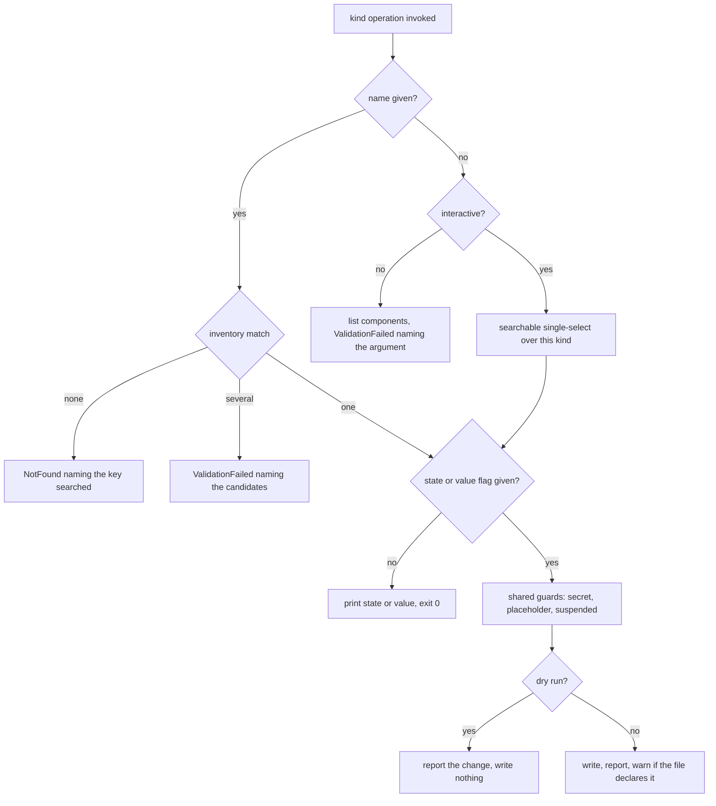

# Settings Inline Component Change - Plan

## Goal Capsule

- **Objective:** An operator can read one component's current state, or turn one flow, workflow or plugin step on or off, or set one environment variable value or connection reference, in a named environment, in a single command, without editing a file; and the settings template lists what the solution actually declares, without anyone remembering to refresh it.
- **Means:** A `settings` branch whose operations are the five component kinds, each taking the environment as its first argument, where a supplied `--on`, `--off` or `--value` writes and the absence of one reads (KTD1, KTD4, KTD5).
- **Product authority:** This document, for the whole `settings` command surface. The settings file format, the apply pipeline, component discovery, tier ordering and the apply exit codes belong to [`2026-09-05-1332-feat-environment-configure-command-plan.md`](2026-09-05-1332-feat-environment-configure-command-plan.md).
- **Open blockers:** None. The two questions this document opened under "Resolve Before Planning" are settled as KTD4 and KTD5.
- **Execution profile:** Standard. Seven units. Most of the risk sits in U2, which moves two safety guards into the writers so no caller can reach an unguarded write. U7 is the one unit outside the `settings` surface, touching `clone` and `pull`; it shares the skeleton generation and merge with `pull`'s capture path, which is why it lives here rather than in its own plan.
- **Product Contract preservation:** R1-R6 unchanged in meaning; R1's wording follows the command rename and the argument order. R7-R18 added, and R17 carries a second outcome the original document did not scope. Two Scope Boundaries entries moved into scope (the picker, and reading state), both by session decision. Three "Deferred to Planning" questions resolved into KTD5, KTD8 and KTD9.
- **Tail ownership:** This plan carries the rename through documentation (U6), and U7 through `clone` and `pull`. It does not update review P10 or C15 in [`docs/reviews/2026-09-08-cli-command-surface-design-review.md`](../reviews/2026-09-08-cli-command-surface-design-review.md), which record the deferral this plan closes.

---

## Product Contract

### Summary

Replace `flowline configure <target>` with a `flowline settings` branch whose operations are `push`, `pull`, and the five component kinds, each taking the environment as its first argument. Naming a component and a target state or value changes it directly; naming a component without one reads it.

### Problem Frame

Turning a flow on at go-live, or off during an incident, currently means the maker portal. The configure command reconciles a whole file, which is the wrong shape for a single deliberate change under time pressure: it requires a file to exist, to be current, and to be edited and saved before anything happens.

This was the fourth of four priorities when the configure command was scoped, and it is the only part of that command whose grammar was never settled. It was lifted out of v1 so the rest could be planned without it.

Settling that grammar forces the command's own shape. One leaf with mode flags carried apply and capture; it does not carry apply, capture, read, write and list without a flag-contradiction matrix for every pair. The command has become a resource with operations, so it is modelled as one.

<!-- ce-section: work-relationships -->
### How This Work Fits Together

This plan owns the **`settings` command surface**, including the rename it requires.

- **The configure command** ([`2026-09-05-1332-feat-environment-configure-command-plan.md`](2026-09-05-1332-feat-environment-configure-command-plan.md)) — *Depends on* it entirely. The apply pipeline, the inventory, the settings file model and the exit codes are that plan's, and this work reuses them unchanged except where U2 names.
- **Review P10 and C15** ([`docs/reviews/2026-09-08-cli-command-surface-design-review.md`](../reviews/2026-09-08-cli-command-surface-design-review.md)) — *Closes* both. P10 deferred the `configure` grammar to this work; C15 deferred the `--pull [zip-or-folder]` overload to P10. R12 settles the first and KTD3 the second.
- **`deploy --settings-file`** (P5b in the same review) — *Shares* the `--settings-file` flag name, which R12 keeps on `push`.
- **`clone` and `pull`** — *Extended by* U7, which adds the shared-template refresh to both. This is the only part of the work outside the `settings` branch, and it reaches into those commands rather than changing what they already do.

### Key Decisions

- **The command is a noun branch named `settings`.** The command grew past what one verb carries, and the file it reads and writes is already called a settings file. (session-settled: user-directed — chosen over keeping `configure` as one leaf with mode flags, and over a `configure` branch: five operations need contradiction checks on one verb, and `configure get` does not read as English.) Governs R1, R12.
- **Each operation takes the environment as its own first positional argument, after the operation name.** This matches `deploy`, `drift` and today's `configure`, which all take a mandatory environment positional after their verb, and it keeps Spectre's generated usage line correct without a mitigation. (session-settled: user-directed — chosen over naming the environment before the operation, which drops the positional from every generated usage line, and over a mandatory `--env` flag, which no command in this CLI has: every `--env` today is omittable.) Governs R12.
- **The five component kinds are the operations, and the presence of a target state or value decides read from write.** One grammar covers all five classes without separate `set`, `get` and `list` verbs. (session-settled: user-directed — chosen over explicit verbs with the kind as data: the verbs the user asked to remove, and the parser then enforces that exactly one kind is named.) Governs R7, R8.
- **Exactly one component changes per invocation.** (session-settled: user-directed — chosen over multi-select: the user preferred type-to-filter over bulk ticking, and bulk changes are what the settings file already does.) Governs R10.
- **The picker is a fallback for a missing argument, never a mode or a flag.** (session-settled: user-approved — chosen over a `--pick` flag: an interactive-only mode would be unreachable for the unattended runs that are most of this CLI's use.) Governs R9.
- **A component named on the command line but absent from the target fails.** A file apply skips it because the file describes many components; an operator who typed one name gets an error. (session-settled: user-approved — chosen over matching the file path's skip: a skip would exit `Inconclusive`, whose meaning does not transfer to a hand-typed name.) Governs R11.
- **The write direction is `push`, matching `pull`.** The top-level commands already split this way, so the verbs mean one direction each and the noun says which payload. (session-settled: user-directed — chosen over `apply`: `apply` and `pull` are a mismatched pair, one naming a file operation and the other a direction.) Governs R12.
- **The settings file stays authoritative.** An inline change writes the environment and nothing else; the file is not updated. Governs R4, R15.

### Requirements

**Command surface**

- R1. `flowline settings <kind> <target>` accepts one component on the command line instead of a settings file, changing that component's state or value.
- R7. The component operations are named for what they do: `state` for every class with an on and an off, `value` for every class with a value. The environment and the component name follow as positional arguments in that order, and `--type` narrows either to one class. `state` covers cloud flows, classic workflows, business rules, business process flows, actions and plugin steps.
- R7a. A name given without `--type` is matched across every class the command covers. A name matching more than one stops the run, names each candidate with its class, and offers `--type` as the remedy.
- R7b. Business rules, business process flows and actions are readable and switchable but have no settings-file section, so a capture never writes them, an apply never touches them, the undeclared report never lists them, and the override warning never fires for them.
- R12. Every operation takes the environment as its first positional argument; the file apply becomes `push` and the file capture becomes `pull`. Both name the settings file with `--settings-file`, which `push` reads and `pull` writes; `pull` also takes `--from` for the solution artifact.
- R18. `settings pull` against an environment named by URL derives the file name from the role inferred for that environment, saying it was inferred; when no role can be inferred and no `--settings-file` is given, it fails naming the flag rather than writing the shared file.
- R13. Invoking `settings` with no operation prints the branch's help, listing the operations, without reading or writing any environment.
- R16. `settings pull` with no environment named offers the environments the project configures, captures the ones chosen, writes one role-named file each and reports each environment on its own line. A non-interactive run fails naming the argument instead of choosing for itself.
- R17. `clone` and `pull` generate the shared settings template from the unpacked solution, listing the environment variables and connection references the solution declares with no values, adding what appeared and reporting what vanished, without connecting to any environment.

**Reading and writing one component**

- R2. Component types covered are flows, classic workflows, plugin steps, environment variable values and connection references — the same classes the settings file covers.
- R3. Setting a state and setting a value are both supported, since two of the five classes carry a value rather than an on-or-off state.
- R8. A supplied `--on`, `--off` or `--value` writes the component; without one the command reads and prints the component's current state or value.
- R10. Exactly one component changes per invocation.
- R11. A component named on the command line but absent from the target fails, naming the addressing key that was searched.
- R6. An address that matches no component fails, and one that matches more than one fails naming the candidates, rather than picking one.

**Interactive fallback**

- R9. When the component name is omitted, an interactive session shows a searchable single-select picker over that kind; a non-interactive session lists the components and exits 0. For the three state kinds each listed line carries the component's current state; for the two value kinds the list is names only.
- R9b. When an interactive session asks for a connection reference's new value, it offers the target environment's connections for that reference's connector, plus entering an id by hand and creating one in the maker portal. A listing that fails or returns nothing leaves the typed-id path and does not fail the run.
- R19. After a capture writes the file, an interactive run offers to fill in each declared entry that has no value: an environment variable with nothing set, and a connection reference with nothing bound. A secret placeholder is not offered. A non-interactive run reports the count and exits 0.
- R20. A settings file declares the state of every class that has one: cloud flows, classic workflows, business rules, business process flows, actions and plugin steps, in a section each. Within one apply, every activation runs before every deactivation.
- R21. After a component write, an interactive run that is not a dry run offers to bring the settings file into line with it: declaring the new state, removing the declaration, or leaving the file alone where it disagrees, and adding the declaration where it is silent. A dry run and an unattended run never write the file.
- R9d. The picker gathers components whose names share leading text under a heading that cannot itself be picked, dropping that text from the rows beneath it. The shared text is found by cutting at delimiters, and a group forms only when it saves more characters than its heading costs. Blocks are ordered by their most interesting member, an ungrouped component winning a tie. The non-interactive listing stays flat.
- R9c. A list or picker of a state kind leads each line with the component's state, as a shape and a word, coloured in the picker, and orders the list suspended, then off, then on, with name order inside each group.
- R9a. An interactive session that reads — whether the name was typed or picked — prints what it found and then asks what the state or value should be, offering the opposite of the current state first. Declining leaves the component alone and the run still exits 0. A non-interactive read prints and stops.
- R14. When the target holds no component of the named kind, the command says so and stops without failing.

**Safety and reporting**

- R4. When the environment's settings file also names the component, the command warns that the next push will override the change, naming the file. The file is not modified.
- R15. In stand-alone mode the R4 warning is omitted, because without a project there is no settings file to compare against, and silence must not read as "no file names it".
- R5. `--dry-run` reports what would change and writes nothing, as it does for a file apply.

### Acceptance Examples

- AE1. `settings flow prod "ApprovalFlow" --on`, against a flow the PROD settings file declares off, turns the flow on and warns that the next push will turn it off again, naming the file. Covers R1, R4.
- AE2. The same command with `--dry-run` reports the change and leaves the flow untouched. Covers R5.
- AE3. An address matching two components in the solution fails, names both, and changes nothing. Covers R6.
- AE4. Setting an environment variable value inline changes the value in the target and leaves every other component alone. Covers R2, R3.
- AE5. `settings flow prod "ApprovalFlow"` prints the flow's current state and exits 0, writing nothing. Covers R8.
- AE6. `settings flow prod` in a non-interactive session lists the solution's flows with each one's state and exits 0. Covers R9.
- AE6a. `settings envvar prod` in a non-interactive session lists the solution's variables by name, with no values. Covers R9.
- AE6b. `settings flow prod "Nightly reconciliation"` in an interactive session prints the current state, then offers the opposite of it first. Covers R9a.
- AE7. A flow Dataverse has suspended, addressed with `--off`, is moved to Draft, and the run reports that it had been suspended. Covers R3.
- AE8. Setting a value on an environment variable whose secret cannot be read is refused, and the variable is unchanged. Covers R2.
- AE9. `settings` with no operation prints the branch's help and connects to no environment, the same as `sln` with no operation. Covers R13.
- AE10. `settings pull` in a project configuring test, uat and prod writes three role-named files and reports each. With prod unreachable it still writes the other two, names prod as failed, and exits `PartialSuccess`. Covers R16.
- AE13. `settings dev flow` answers with `'flow' is the operation and it comes first, before the environment. Try: flowline settings flow dev`, carrying the rest of the invocation into the suggestion. `settings dev` names the operations instead. `settings flwo` is left to the parser. Covers R7.
- AE12. `settings pull https://contoso-test.crm4.dynamics.com` writes the TEST-named settings file and says the role was inferred. The same command against an environment whose name carries no role keyword fails naming `--settings-file`, and writes nothing. Covers R18.
- AE11. A solution gains an environment variable. The next `pull` adds its key to the shared template with an empty value, leaves every value already there untouched, and changes nothing in any environment. Covers R17.

### Scope Boundaries

Outside this work:

- Capturing live environment state automatically during `clone` or `pull`. Considered and rejected: it would turn a declaration into a mirror, so drift introduced in a portal would be recorded as intent and pushed back as such, and it would make a DEV solution export depend on reaching every other tenant. U7 generates the template from the solution source instead, which needs no connection.
- Seeding the shared template with DEV's values. The un-suffixed file is a live fallback rather than an inert one, so a DEV value would be applied to any environment that falls back to it, and a flow switched off for development would declare itself off for production.

- Writing the inline change back into the settings file. The configure plan settled that the file is authoritative and an inline change is deliberate drift, surfaced by R4's warning.
- Clearing an environment variable value. KTD9 refuses an empty `--value`, so clearing needs its own flag and is not designed here.
- Bulk state changes across several components. The settings file and `push` already do this.

- Masking a secret on the read path. A read of an environment variable prints whatever the value row holds, including a Dataverse-stored secret. The capture path refuses to read such a value at all, substituting a placeholder, and this surface deliberately does not: see Risks.

#### Deferred to Follow-Up Work

- Masking or refusing a secret value on the read path and in the picker's labels, mirroring what the capture path already does.
- A non-positional source for a secret value, such as standard input or a file, alongside `--value`.
- Clearing a role's URL from the project config when its environment is torn down. Without it a repo whose DEV has been destroyed exits `PartialSuccess` on every sweep, because an unreachable environment is a failure by decision. This belongs to `provision`, not to this surface.
- A pipeline gate that exits non-zero when a component is off. KTD11 keeps the read form at exit 0 and defers gating to an opt-in flag, following the `--exit-code` precedent on `drift` and `diff`.
- A `pull settings` alias, so the capture is reachable from the top-level `pull` as well as from `settings`. One command class can be registered under two branches, so this stays cheap to add later.
- Updating review P10 and C15 to record that this plan closed them.
- Command-level coverage for two remaining paths: the override warning firing through the command rather than only through its predicate (R4, R15), including its degrade path when the file on disk cannot be parsed, and the dry-run wording on a component write (AE2, KTD11). Both need a command driven far enough to reach a live Dataverse call, which the probe pattern alone does not reach. The other three the 2026-09-10 review found — the non-interactive picker fallback (R9), the bare branch form (AE9), and the missing-solution-flag failure outside a project — are covered in `SettingsCommandSurfaceTests`, and the last of those is mutation-checked: reinstating the bug fails two of them.
- Deciding what `--from` means during an all-environments capture. Every role would read its component list from one shared artifact rather than each from the project's own source. That may be what someone wants, but nothing states it, and the neighbouring `--settings-file` case is a validated contradiction. Raised by the 2026-09-10 code review.
- Moving the shared-template refresh off the sync command. `clone` reaches into `SyncCommand` for it, which the project boundary rule discourages, but a clean Core home is blocked while the `pac` wrapper is still misfiled in the CLI project. Raised by the 2026-09-10 simplification pass.
- Covering the value flag in the invocation-log redaction pattern. KTD5 chose a flag over a positional because redaction is anchored on flag names, but the pattern matches only `--client-secret` and `/mfaClientSecret:` today (`src/Flowline/Diagnostics/SubprocessCapture.cs:108`), and `src/Flowline/Program.cs:104` runs it over raw argv for the line `src/Flowline/Commands/FlowlineCommand.cs:135` logs on every invocation. Until it covers `--value`, a secret written inline is logged in clear text every run. Belongs with secret handling, in [`2026-09-05-1406-feat-configure-secret-resolution-plan.md`](2026-09-05-1406-feat-configure-secret-resolution-plan.md), which owns that authority. Raised by the 2026-09-10 review and deferred by decision.
- Restating the accepted read-path secret risk to say it persists on every invocation. The Risks entry says the read is unsafe in a logged pipeline, which reads as safe interactively; the console render hook (`src/Flowline/Program.cs:174`) and the unconditional debug-level file sink mean printed output reaches Flowline's own log either way. This is a correction to this document's own Risks section. Raised by the 2026-09-10 review and deferred by decision.
- Documenting the template refresh on the `pull` and getting-started wiki pages. U6 covers only the rename and is sequenced before U7, so no unit documents the behaviour U7 adds to `clone` and `pull`. This is a correction to U7's own file list. Raised by the 2026-09-10 review and deferred by decision.
- Correcting the version cited in KTD18. It names the Flowline build the registration-order behaviour was verified against, inside a sentence about the parser, which reads as a stale parser version. The pinned parser is Spectre.Console.Cli 0.55.0 and that is what the tested build links, so the claim holds and only the citation misleads. Raised by the 2026-09-10 review and deferred by decision.

### Outstanding Questions

None blocking. Two questions are deferred to implementation and named in U5 and U1 respectively: the picker's page size against a large solution, and whether `pull`'s stand-alone detection reads better as a separate resolver once it is no longer a flag.

### Risks

- **A read prints a Dataverse-stored secret in clear text.** Only a read of one named variable does: the picker's labels and the no-name listing show value kinds by name alone (KTD19), so the exposure is one variable per invocation rather than a solution's worth. The capture path never queries the value row for such a variable, so the secret never enters memory there; this surface reads and prints it. The exposure reaches the terminal and any log capturing that output. Accepted deliberately for this iteration to keep the read simple, on the understanding that the remedy is the deferred masking item above and that the same guard the capture path uses is the thing to reuse. Anyone shipping this before that item lands should know the read is not safe to run against a production variable in a logged pipeline.

### Sources / Research

- [`2026-09-05-1332-feat-environment-configure-command-plan.md`](2026-09-05-1332-feat-environment-configure-command-plan.md) — the command this extends. KTD8, KTD9 and KTD10 in that plan govern addressing keys, suspended-flow semantics and the absence of force gating, and all three carry into this surface unchanged.
- [`docs/reviews/2026-09-08-cli-command-surface-design-review.md`](../reviews/2026-09-08-cli-command-surface-design-review.md) — P10 deferred this grammar; C15 deferred the `--pull [zip-or-folder]` overload into P10.
- [`docs/ideation/2026-07-01-post-deploy-environment-config-ideation.html`](../ideation/2026-07-01-post-deploy-environment-config-ideation.html) — idea 8 proposes the inline and interactive modes, and is the closest thing to a prior design.
- [`.claude/skills/cli-for-agents/SKILL.md`](../../.claude/skills/cli-for-agents/SKILL.md) — flag-first input, the `IsInteractive()` guard, exit-code selection, and the rule that `GeneralError` is never a shortcut. Governs R9, R11, R13.
- [`docs/solutions/runtime-errors/spectre-console-status-prompt-exclusivity.md`](../solutions/runtime-errors/spectre-console-status-prompt-exclusivity.md) — Spectre.Console forbids an interactive prompt inside a status spinner. Governs KTD10.
- [`docs/solutions/architecture-patterns/ai-agent-consumable-cli-contract-2026-06-07.md`](../solutions/architecture-patterns/ai-agent-consumable-cli-contract-2026-06-07.md) — typed exit codes, `WithDescription` and `WithExample` on every command, `[Description]` on every option.
- Spectre.Console.Cli 0.55 behaviour, verified against a scratch application during planning rather than inferred: a branch may carry a positional argument and a default command that consumes it; a branch-declared option binds only when it appears before the subcommand token, and is silently ignored after it; `SelectionPrompt<T>` exposes `EnableSearch()` while `MultiSelectionPrompt<T>` does not; leaf usage lines omit the branch positional, and `WithExample` renders the true form; one command class may be registered under several names, with the invoked name available from the command context.

---

## Planning Contract

### Key Technical Decisions

- KTD1. **The branch carries no settings of its own; every operation declares its own environment positional and its own options.** A branch-declared positional is dropped from every leaf's generated usage line, and a branch-declared option binds only before the operation token and is silently discarded after it, so a trailing `--dry-run` would be accepted and ignored. Keeping the branch empty avoids both, and each leaf's generated usage line is then correct without a mitigation. Governs R5, R12.
- KTD2. **Bare `settings` has no default command and falls to Spectre's own help.** Reversed after implementation (session-settled: user-directed). The original decision routed it to a custom command so the run could exit `ValidationFailed` rather than Spectre's `GeneralError`, citing the agent contract's ban on `GeneralError` as a shortcut. That rule is scoped to codes this project chooses when it throws, not to what the parser returns on its own, so it never applied here. What the custom screen actually cost was visible once built: it printed less than the real help, having no description, examples or options, and it kept a second copy of every operation name and description that could drift from the registration. A bare `flowline sln` already behaves this way, so the branch now matches the one precedent in the CLI. Governs R13.
- KTD3. **`pull` becomes an operation and `--pull [zip-or-folder]` disappears, with the artifact moving to `--from <zip|folder>`.** This closes C15's overload without a separate change. Stand-alone detection currently keys off the `--pull` flag value and moves to the `pull` leaf; the `--pull` with `--settings-file` contradiction check disappears entirely, because the grammar makes that pair unreachable rather than invalid. Governs R12.
- KTD16. **`--settings-file` names the settings file on both `push` and `pull`, and the operation decides whether it is read or written.** The capture path needs an explicit destination that today it cannot have: outside a project there is no layout to derive one from, and a URL target carries no role to name the file after. The two path flags on `pull` name different objects rather than different directions, since `--from` names the solution artifact the key list comes from and `--settings-file` names the settings file, and the verb already carries the direction. One name for one object also holds across `deploy --settings-file`, which is where the flag name comes from. Governs R12, R18. (session-settled: user-directed — chosen over `-o/--output`, which would give the same file two names depending on which way it moves.)
- KTD17. **A URL target names its file from the inferred role, and refuses to fall back to the shared file.** `EnvironmentRoleInference` in the core services already derives a role from the host label and the display name, returns nothing rather than guessing when no keyword matches, and never infers production from a name at all, since production comes only from the environment type Dataverse reports. So a bad sandbox name cannot cause a capture to land on the production file. When inference returns nothing the run fails naming `--settings-file`: the un-suffixed file is a live fallback for every environment, so a capture written there would apply one environment's connection identifiers everywhere. A file already present at the derived path is overwritten without a prompt or a check, on either the inferred or the keyword path. Inference confuses only the three non-production roles with each other, since production comes from the environment type Dataverse reports rather than from any name, so the worst case is one non-production capture landing on another non-production file, and the file is regenerable by re-running the capture. Guarding it would put a prompt in the path operators run most, where re-capturing an environment is the ordinary case. Governs R18. (session-settled: user-directed — chosen over treating a collision on an inferred path as a failed inference, and over guarding every capture including the keyword path.)
- KTD18. **The seven operations stay under the one noun, grouped by registration order and one-line descriptions.** Two of the seven move a whole file and five touch a single component, and nothing in a flat list says so. Spectre renders commands in registration order rather than alphabetically, verified against a Release build of v0.18.1-alpha, so registering the two file operations first and the five kinds after produces the grouping with no mechanism. It also prints each description in full, and Flowline's top-level descriptions run to a paragraph, which is what makes seven of them a long screen; a leaf inside a branch is scanned rather than discovered, so these take one line each. Governs R13. (session-settled: user-directed, after an options pass — chosen over moving the file operations under the top-level `push` and `pull` verbs, which converts two working leaves into branches and scatters one payload across three places in the help, and over registering them in both places, which adds a second spelling of every example rather than shortening anything. The runner-up becomes right if a second payload ever wants applying and capturing too.)
- KTD4. **Two command classes serve the five kinds, each registered under its operation names and discriminated by the invoked name.** One class covers the three state kinds and one the two value kinds, which is what lets KTD5 scope the flags per class. The split is by flag set, not by behaviour: both map onto the same component-kind enum and call the same single-component service. Governs R7. (session-settled: user-directed — chosen over a `<kind>` positional validated as data: the parser rejects an unknown kind for free, and the help lists the kinds.)
- KTD15. **The operation names are `flow`, `workflow`, `plugin`, `envvar` and `connref`.** `envvar` and `connref` are the abbreviations the Power Platform community already uses for these two classes, and `plugin` says plugin registration rather than a step inside a flow, which is what a bare `step` reads as in a product whose other operations are flows. `flow` stays unqualified because a bare flow in this CLI is always a cloud flow; the classic kind carries the qualifier instead, as `workflow`. Governs R7. (session-settled: user-directed — chosen over `variable`, `connection` and `step`, which read as generic and collide with unrelated meanings, and over `cloudflow`, which pays a qualifier the ambiguity does not require.)
- KTD5. **The target state or value is a flag, and each operation declares only the flags its class can use.** The three state operations offer `--on` and `--off`; the two value operations offer `--value`. Because the kind is the operation, the parser rejects `--value` on a flow and `--on` on a variable with no hand-written check, so the only validation left is `--on` together with `--off`. Governs R8, R3. (session-settled: user-directed — chosen over a positional value: Flowline logs every invocation's arguments and redacts them with a pattern anchored on flag names, which structurally cannot match a bare positional, so a secret passed positionally would be written to the log on every run.)
- KTD6. **The secret and placeholder guard moves into the value writers themselves, and the orchestrator's private wrapper stops existing.** The public value writer has no placeholder check and no unreadable-secret check today; those live only in the orchestrator's private method. Adding a second, guarded entry point beside the unguarded one would leave the inline write safe only by convention, so the guard goes where every caller already arrives. Both value writers get it, so the environment-variable and connection-reference paths cannot diverge, even though only the first carries a secret. Governs R2, and AE8 proves it.
- KTD7. **Every inline state write passes the suspended flag explicitly.** The state writer takes it as an optional parameter defaulting to false, and a suspended flow reads as not-enabled, so omitting it makes `off` report "unchanged" and leave the flow suspended. That is the exact failure the configure plan's KTD8 exists to prevent, reachable by one missing argument. Governs R3, and AE7 proves it.
- KTD8. **Inline results use their own outcome type, not the file-apply outcome.** The apply outcome reports every solution component the file does not declare, which for a one-component invocation is everything else in the solution, and it maps an all-skipped run to `Inconclusive`. Neither is right for a single named component. Governs R11.
- KTD9. **Addressing uses the unique, schema or logical name, case-insensitively, and an empty `--value` is rejected rather than written.** The inventory already matches case-insensitively on those keys, and display names are not addressable, so the not-found message names which key was searched. Because the value is a flag, `--value ""` is a deliberate request rather than an omission, so it is refused naming the deferred clear capability: the apply path skips empty values precisely so a captured file re-applies as a no-op. Governs R7, R8, R11.
- KTD10. **The picker runs after the inventory spinner closes, over the already-materialized inventory.** Spectre forbids a prompt inside a status display, and the inventory read currently sits inside one. Governs R9.
- KTD27. **The file offer has three answers, and an explicit `true` is not redundant.** (session-settled: user-directed.) The run already knew the file would undo what was just done and said so; offering to fix it is the half that was missing. Three answers rather than two because declaring the opposite and declaring nothing are different: a solution import turns flows off and on again and does not restore the state of one that already existed, so "make sure this is on" is a thing the file has to be able to say, and removing the entry instead hands the component back to the environment. It is offered for a component the file does not name at all for the same reason. An earlier version of this reasoning claimed a declared `true` would be stripped by the next capture; that was wrong — `SettingsFileMerger` keeps every existing entry's declared value — and it was the only argument for not offering. Never in a dry run, which has written nothing to record, and never unattended, because the file is committed and that is not a decision to take on a caller's behalf. Governs R21.
- KTD28. **Activations run before deactivations within the apply.** (session-settled: user-directed.) Some components cannot be switched off while they are the last of their kind still on, so a release that swaps one for another has to raise the new before lowering the old. Ordering it in the apply is what makes the swap declarable in one file rather than a two-step procedure someone has to remember. It costs one sort and nothing when no such constraint exists. Governs R20.
- KTD26. **The picker groups by found prefixes, and a group has to pay for its heading.** (session-settled: user-directed, after an options pass and a live trial.) A plugin step is named for its class and message and runs past a hundred characters, so it wrapped at an arbitrary column; a heading moves what every sibling repeats out of the rows and breaks the line where it means something. The key is found by cutting names at `.`, `]`, `|` and `:` rather than taught per kind, which is why it grouped cloud flows on their bracketed entity prefix without being told about brackets, and why a solution sharing nothing gets no headings. Kind was rejected as the axis: grouping only plugin steps would be right for one solution and wrong for a team with eight flows on one entity, and it would reintroduce the kind-per-behaviour coupling KTD25 removed. The bar is whether the group saves more characters than the row its heading spends, measured against one conventional line rather than the real terminal width, because a narrow terminal needs grouping more and scaling the bar with the width would give it less. Ordering ranks whole blocks by their best member, an ungrouped component winning a tie, because a Spectre group is one contiguous block and its rows cannot be split across the state tiers. The non-interactive listing is left flat and one line per component, since that output is documented as machine-readable. The heading takes the brand's secondary colour rather than `dim`, which rendered near-invisible on a dark terminal and cost the grouping its point. (Rejected: grouping by plugin class, which on a codebase that names the registration in the class produces one group per step; and eliding names, since the picker's search matches the displayed text.) Governs R9d.
- KTD25. **The component operations are named for what they do, and the kind became a filter.** (session-settled: user-directed, after two options passes.) Five operations were the same two commands under different names, and the list grew with the platform: the process category choice is open, shipping 0 Workflow, 1 Dialog, 2 Business Rule, 3 Action, 4 Business Process Flow, 5 Modern Flow, 6 Desktop Flow, 7 AI Flow, with Dynamics 365 extending the same choice at 9000. A leaf per category has no ceiling, so the kind moved to `--type` and the list closed at four. Grouped by action rather than by object because that is the only cut that closes: `envvar` and `connref` were never going to grow, but keeping two concrete names beside one action name would have put two questions in one list. Chosen over `process`/`plugin`/`envvar`/`connref` (six leaves, and a mixed naming dimension once the value pair collapsed), over a `process` branch with `get`/`set`/`run` leaves (more words over more top-level entries, and it separates `settings push` from the thing it overrides), and over leaving it (free today, a deprecation once released). `--type` rather than `--scope`, which already means something else on `push`: a repeatable flags enum limiting which part of the payload is pushed. No aliases for the retired names, since nothing shipped; the argument-order hint answers them instead with the line to run. Governs R7, R7a.
- KTD25a. **The inventory widened to the process family and the settings file did not.** (session-settled: user-directed.) Every process category is a `workflow` row carrying a `statecode`, which is what makes them all switchable and what made the old two-category filter necessary: an unfiltered read had a capture write business rules into the file and the next apply deactivate them. The guard moved from the query to the file paths, which now honour an explicit list of the classes a file has a section for. The read covers 0, 2, 3, 4 and 5; Dialog is out because Microsoft deprecated it, and Desktop Flow and AI Flow are out until their activation semantics are confirmed. Whether the three new classes should also gain file sections is deferred, and until they do, a business rule switched off here stays off. Governs R7b.
- KTD24. **The guided fill is the tail of a capture, not a command of its own.** (session-settled: user-directed.) `pac solution create-settings` emits a skeleton with every value blank and a capture leaves an entry blank when the environment has nothing to read, which is the whole reason these files get hand-edited. A pull already writes the file, already knows which entries came back empty, and is already connected to the environment whose connections would fill them, so a separate wizard command would need a second route to all three. Saved before the questions rather than after: the capture is the part that cannot be retyped, so an abandoned session costs only the answers not yet typed. One confirmation per file, because a sweep has to be declinable per environment and because running a capture is not signing up for an interview. Silent when nothing is missing, which is what keeps it out of the way of an ordinary refresh. The secret placeholder is excluded: prompting for it would take a secret typed at a terminal into a file the team commits, which is the exposure the plan already defers rather than one to add. Governs R19.
- KTD23. **The transposed invocation gets a message, not a lenient parser.** (session-settled: user-directed, after an options pass.) "In dev, do flow" is how the task is described out loud, so `settings dev flow` is what fingers reach for, and Spectre answers `Unknown command 'dev'`: true, and it teaches nothing, because it names the token it could not route without saying the token is fine and only in the wrong place. Accepting both orders was rejected, and so was moving the environment to `--env`: `EnvironmentSettings` already records the rule that commands *acting on* an environment take it as a positional `<target>` (`deploy`, `drift`, and this branch) while commands *recording* one take `-e|--env`, so a change here buys one branch's convenience by breaking the shape two other commands share. An environment-first grammar is not expressible at all, because command names are literals registered at startup and a URL target could never be one. The hint is produced in the exception handler, which sits outside the command app and therefore keeps its own copy of the operation names; an operation added to the registration and forgotten there only means the hint stays quiet for that one. It fires only when the token is a role keyword or a URL, because anything else is more likely a mistyped operation, which the parser's own error serves better. Governs R7.
- KTD22. **State leads a component line, as a shape and a word, and the list is ordered by state.** (session-settled: user-directed, after an options pass.) A plugin step's addressable name is its class and message and runs past a hundred characters, so a trailing state wrapped onto its own line and stopped aligning; column zero is the one position a terminal cannot take away. A shape and a word rather than either alone: the glyph is the column the eye runs down, and the word is what the picker's search matches, verified against Spectre, so typing `off` narrows a long list. `✓` and `✗` were rejected because Flowline already spends them on Ok and Error in the same scrollback; `●` `◐` `○` are unclaimed, differ in shape rather than only colour, and sit in a Unicode block with wide font coverage. Suspended keeps its own shape rather than sharing the hollow circle, because an operator who reads a stopped-itself flow as off turns it on and it stops again. Colour reinforces and does not carry, for anyone who does not separate red from green; observed against a real terminal, the selection highlight recolours the name but leaves the state's colour alone. `on` and `off` pad to each other and `suspended` does not: padding every row to its width costs twelve columns on rows that already overflow, for a state that is rare. Ordering puts suspended and off first, which is what the list is opened to find. Governs R9c. (Rejected: eliding the name to fit the state on one line, because the picker's search matches the displayed text and half of every name would stop matching.)
- KTD20. **Connections are listed through `pac`, by parsing its table.** (session-settled: user-directed, after an options pass.) Connections are not Dataverse rows, so they cannot join the inventory query; `pac connection list` is the only first-party route Flowline already depends on, and it rejects `--json`, so the fixed-width table is the whole contract. Parsed by column offset rather than whitespace, because a connection called "HTTP Request AD" splits into three, and offsets are read from each run's own header line because PAC pads columns to their widest cell. A verbatim sample of real output is pinned in the tests so a PAC layout change fails there. Creating a connection stays in the browser: `pac connection create` makes a service principal Dataverse connection and nothing else, and a connector needing interactive consent has no headless path at all. Governs R9b.
- KTD19. **A missing name is a question the listing answers, and an interactive read continues into the change.** (session-settled: user-directed.) The first version made a no-name non-interactive run exit `ValidationFailed` with the list above it, treating "which ones are there" as a malformed invocation; a run that prints exactly what was asked for has not failed, so it now exits 0. And an interactive read that ends by printing a state the operator just looked at, offering no way to change it, sends them back to the maker portal the surface exists to avoid — so the picker and the bare read both continue into a prompt for the new state or value. The value kinds list names only: printing every variable's value would take the single-read exposure this plan accepts under Risks and apply it to a whole solution at once, in the runs most likely to be piped or logged. Governs R9, R9a.
- KTD11. **The read form always exits 0, and `--dry-run` is inert on it.** Exit codes that answer a question stay opt-in on this CLI, as `drift` and `diff` show. A read that writes nothing is unaffected by a dry run, and the help says so rather than leaving the flag silently accepted. Governs R8, R5.
- KTD14. **The shared template is derived from the solution, never from an environment, and carries keys without values.** The skeleton generator already takes a solution path, so the key list comes from the unpacked source and needs no connection, no authentication and no secret read. Values stay empty because the apply path skips an empty value for both value classes, which is what makes a shared file that any environment can fall back to safe to write automatically. The state sections are omitted entirely: a flow's state is a boolean with no inert form, so listing one at all would declare it, and DEV is exactly where flows are switched off. Governs R17.
- KTD21. **A pull with no environment prompts for which ones, and fails unattended.** (session-settled: user-directed — chosen over an `--all` flag, which the user rejected, and over restricting capture to one environment at a time, which removes the only answer to "are all my settings files current".) The sweep is a real task: one solution change staleness every role's file in the same way, and four commands is four chances to miss one silently. What was wrong was the spelling. A CLI's no-argument form should not be its broadest, and this one opens an auth flow and a Dataverse connection per configured role, so an unattended caller that meant one environment waited through four before finding out. Unattended it now fails naming the argument, matching `push`, whose target has always been required. At a terminal it is a multi-select with every role pre-selected, so one Enter still sweeps: the point is to make the width visible and narrowable, not to make it harder. Picking none exits 0, because the only other way out of a list is Ctrl+C. Governs R16.
- KTD13. **The capture sweep is project-only, offers every configured role, and isolates failures per environment.** The roles come from the project config, which holds one URL per role, so outside a project there is nothing to enumerate and the environment must be named. No role is exempt: the apply side already accepts DEV as a target, and a DEV branched from production carries connection references bound to connections that do not exist there, so a DEV file has a real consumer. Each environment is captured on its own and reported on its own line, so one bad environment does not lose the captures that succeeded. An environment that cannot be reached is a failure, not a skip: the sweep names it and the run exits `PartialSuccess`, because a configured role that no longer answers is something the operator has to fix rather than something to pass over quietly. Governs R16.
- KTD12. **The R4 warning needs a project, so stand-alone mode omits it rather than reporting no match.** Locating the settings file needs the project layout, which stand-alone mode does not have. The check also tests whether `push` would actually touch the component, not merely whether the file names it, because the apply path skips entries with an empty value. Governs R4, R15.

### High-Level Technical Design

The command surface, as directional guidance rather than a registration specification:

```text
flowline settings                                            operations + ValidationFailed
flowline settings push   <target> [--settings-file <path>] [--dry-run]
flowline settings pull   [target] [--from <zip|folder>] [--settings-file <path>]
                                                             no target: pick from the configured roles
flowline settings flow     <target> [name] [--on|--off]  [--dry-run]
flowline settings workflow <target> [name] [--on|--off]  [--dry-run]
flowline settings plugin   <target> [name] [--on|--off]  [--dry-run]
flowline settings envvar   <target> [name] [--value <v>] [--dry-run]
flowline settings connref  <target> [name] [--value <v>] [--dry-run]
```

What the bare form prints, per KTD18, as the shape rather than the final wording:

```text
Settings for one environment.

  Whole file
    push      apply a settings file to an environment
    pull      write a settings file from an environment

  One component
    flow      turn a cloud flow on or off
    workflow  turn a classic workflow on or off
    plugin    turn a plugin step on or off
    envvar    set an environment variable value
    connref   bind a connection reference

Run 'flowline settings <operation> --help' for arguments.
```

How a kind operation resolves its optional name argument and decides read from write:



### Assumptions

- The five component kinds stay fixed at the classes the settings file covers. A sixth kind would be a new registration plus an inventory change, not a grammar change.
- `configure` has no users to migrate. It sits under `[Unreleased]` in the changelog, so the rename ships as one breaking entry with no alias and no deprecation cycle.

### Sequencing

`Flowline.Core` guards first, then the command surface, then the interactive layer, then documentation, with the template refresh last. U7 depends on U1 only for the settings-file location rules, so it can be built at any point after that and left out of a first release without affecting the rest. U2 lands before U3 so the only writer the inline path can reach is already guarded, rather than being written against an unguarded one and corrected later.

---

## Implementation Units

### U1. The `settings` branch, with `push` and `pull` as operations

**Goal:** Replace the `configure` leaf with a `settings` branch whose `push` and `pull` operations each take the environment as their first argument and do what the leaf's apply and `--pull` paths do today.

**Requirements:** R12, R13, R16, R18; KTD1, KTD2, KTD3, KTD13, KTD16, KTD17, KTD18

**Dependencies:** None

**Files:**
- `src/Flowline/Program.cs`
- `src/Flowline/Commands/ConfigureCommand.cs` (split into the push and pull commands, plus a shared settings base declaring the environment positional the operations inherit)
- `tests/Flowline.Tests/ConfigureCommandTests.cs`

**Approach:**
1. Register the branch with no settings of its own, per KTD1. The environment positional lives on a settings base that each operation's own settings type inherits, so every leaf declares it at position 0.
2. Split the existing command's apply and pull halves into two leaf commands, each with its own settings type carrying its own options.
3. Add the default command from KTD2, which takes no required arguments, renders the operation list and throws `ValidationFailed`. The list is grouped under a whole-file heading and a single-component heading, per KTD18, and closes by naming the per-operation help.
4. Register `push` and `pull` before the five kinds, and give every leaf on this branch a one-line description rather than the paragraph the top-level commands carry, per KTD18.
5. Rework stand-alone detection: it currently keys off the `--pull` flag value, which no longer exists. On `pull`, the artifact argument is `--from`; on `push`, `--solution-name` alone decides.
6. Make `pull`'s environment argument optional. With one named, it captures that environment as today. With none, it enumerates every role the project configures and captures each in turn per KTD13. Outside a project, omitting it fails naming the argument, since there are no configured roles to enumerate.
7. Give `pull` its own `--settings-file`, per KTD16. With one, it is the destination. Without one, the destination is derived as today from the role, and a URL target derives it from the inferred role per KTD17, failing on `--settings-file` when nothing can be inferred. `--settings-file` together with the no-target sweep is a contradiction, since one path cannot name several files, and fails naming both.
8. Delete the `--pull` with `--settings-file` contradiction check and its test. The grammar makes the pair unreachable, so a runtime check for it is dead code rather than a guard.
9. Give every operation a description and at least one `WithExample`, as the agent-facing CLI contract requires of every command.

**Execution note:** Item 5 leaves one shape question open. Stand-alone detection is currently a pure static helper on the single command; with two operations resolving it from different flags, decide during the work whether it stays a shared helper or becomes a small resolver each operation calls. Either is testable without a checkout, which is the property to preserve.

**Patterns to follow:** The `sln` branch in `src/Flowline/Program.cs` is the existing branch registration. The command-level helper style, pure `internal static` methods tested without a checkout, is established across the deploy and drift commands.

**Test scenarios:**
- The environment resolves identically for `push` and `pull` given the same role keyword.
- Stand-alone detection returns true for `pull` with an artifact and no project, and false inside a project.
- Stand-alone detection returns true for `push` with a solution name and no project.
- `--solution-name` inside a project still produces its own error naming the flag.
- A role keyword with no project still produces the stand-alone role error.
- Covers AE9. The default command throws `ValidationFailed` and its message names the available operations under both group headings.
- The branch's help lists the two file operations before the five kinds.
- Covers AE10. A sweep over a project configuring three roles produces three captures, and a failure against one still writes the other two and exits `PartialSuccess`.
- A sweep offers every configured role, including DEV, and a role the project leaves unset is not enumerated.
- Omitting the environment outside a project fails naming the argument rather than enumerating nothing.
- Covers AE12. A URL target whose name carries a role keyword writes the role-named file, and the output line says the role was inferred.
- A URL target with no inferable role and no `--settings-file` fails naming the flag, and never resolves to the shared un-suffixed file.
- `--settings-file` on a capture writes exactly that path, inside a project and stand-alone alike.
- `--settings-file` with no environment named fails naming both, rather than writing every role's capture to one path.

**Verification:** `flowline settings --help` from a Release build lists the operations; `flowline settings push --help` shows the environment argument alongside `--settings-file` and `--dry-run`; a run of `settings pull <url> --from <zip>` outside a project behaves as `configure <url> --pull <zip>` did.

### U2. Close the unguarded write path

**Goal:** Put the placeholder and unreadable-secret checks inside the value writers and make the suspended state a required input, so no caller can reach an unguarded write.

**Requirements:** R2, R3; KTD6, KTD7

**Dependencies:** None

**Files:**
- `src/Flowline.Core/Configure/ConfigureApplyService.cs`
- `src/Flowline.Core/Configure/ComponentValueWriter.cs`
- `src/Flowline.Core/Configure/ComponentStateWriter.cs`
- `tests/Flowline.Core.Tests/Configure/ComponentValueWriterTests.cs`
- `tests/Flowline.Core.Tests/Configure/ComponentStateWriterTests.cs`

**Approach:**
1. Move the placeholder and unreadable-secret refusals out of the orchestrator's private wrapper and into the public environment-variable writer, so the guard sits on the path every caller already takes rather than on a second one beside it.
2. Give the connection-reference writer the same shape, so the two value writers cannot drift apart. It carries a connection identifier rather than a credential, so this is symmetry rather than exposure.
3. Retire the orchestrator's private wrapper and point the apply path at the guarded writer, so its behavior is unchanged and its existing tests still prove it.
4. Make the suspended state a required input on the state write rather than an optional argument defaulting to false, so a caller cannot omit it silently.

**Execution note:** Characterize first. The two guards have no direct coverage on the writers today, only through the orchestrator, so add tests that pin the current refusals before moving them.

**Patterns to follow:** The existing core services take `IOrganizationServiceAsync2` and are tested against an NSubstitute substitute.

**Test scenarios:**
- Covers AE8. Writing a value to an environment variable whose secret cannot be read is refused at the writer, and no update reaches Dataverse.
- No caller can reach an environment-variable or connection-reference write that skips the refusals, checked by there being one entry point per writer rather than two.
- Writing the literal placeholder string as a value is refused.
- A suspended flow with a target state of off produces a state update rather than an unchanged outcome.
- A suspended flow with a target state of on is activated, and the outcome carries the prior suspended state.
- A plugin step, which has no third state, is unaffected by the change.
- The existing apply path produces identical outcomes for every case its tests already cover.

**Verification:** The configure core test project passes unchanged apart from the added cases, proving the move preserved apply behavior.

### U3. Single-component read and write service

**Goal:** Add a core service that resolves one component by kind and name, reads its current state or value, and writes a new one, reporting an outcome shaped for a single component.

**Requirements:** R6, R8, R10, R11; KTD8, KTD9

**Dependencies:** U2

**Files:**
- `src/Flowline.Core/Configure/` (new single-component service and its outcome type)
- `tests/Flowline.Core.Tests/Configure/` (new test file for the service)

**Approach:**
1. Resolve the component through the existing inventory match, which already returns either one component or the ambiguous candidates.
2. Map the three match results onto outcomes: one component proceeds, none is not-found naming the key that was searched, several is ambiguous naming the candidates.
3. Read returns the current state or value. For the three state kinds and for connection references the inventory already carries it; an environment variable's value lives in its own row and needs one further read, because the inventory deliberately leaves it unset.
4. Write routes through the writers U2 guarded, choosing the state or value path by kind.
5. Return an outcome type carrying the component, the action taken and the prior value, with no undeclared-component report and no all-skipped exit mapping, per KTD8.

**Test scenarios:**
- A name matching one flow returns its current state on a read.
- A name matching nothing returns not-found, and the message names the unique-name key.
- Covers AE3. A name matching two workflows returns ambiguous and names both.
- Covers AE4. A write to an environment variable changes only that variable.
- A write to a connection reference binds it and leaves other components untouched.
- An empty `--value` is refused, and no write reaches Dataverse.
- A dry run returns the same outcome as a write and issues no update request.
- Matching is case-insensitive on the addressing key.

**Verification:** The service returns the same component set for a solution as the file apply path sees, checked against a substituted client with a shared inventory fixture.

### U4. The five kind operations

**Goal:** Register the five component kinds as operations on the `settings` branch, dispatching read or write by whether a value was supplied.

**Requirements:** R7, R8, R10, R11, R14; KTD4, KTD5, KTD11, KTD12, KTD18

**Dependencies:** U1, U3

**Files:**
- `src/Flowline/Program.cs`
- `src/Flowline/Commands/` (new component command)
- `tests/Flowline.Tests/` (new test file for the component command)

**Approach:**
1. Register two command classes, one for the three state kinds and one for the two value kinds, each under its own operation names, mapping the invoked name onto the component-kind enum per KTD4. They register after `push` and `pull`, in the order the design lists them, and carry one-line descriptions per KTD18. Both settings types inherit the environment positional from U1's shared base and add the optional name positional after it.
2. Dispatch on the positionals: no name goes to U5's fallback, name without value reads, name with value writes.
3. Give the three state operations a settings type carrying `--on` and `--off`, and the two value operations one carrying `--value`, per KTD5. The only contradiction to check by hand is `--on` together with `--off`.
4. Report through the same console helpers the apply path uses, one line per outcome, so the render hook logs it the same way.
5. Give both settings types the same `--solution-name` option `push` carries, and resolve the solution through the stand-alone path when there is no project and the project path otherwise. Without it the inventory has nothing to read and R15's stand-alone case cannot run.
6. Apply KTD12's warning: locate the settings file, check whether a push would actually act on this component, and stay silent in stand-alone mode.
7. Keep the read form at exit 0 and document `--dry-run` as inert on it, per KTD11.

**Patterns to follow:** The apply path's report method renders one line per component outcome with the console extension helpers rather than a table; match that shape. Every option needs a `[Description]`, and every registration a description and an example.

**Test scenarios:**
- Covers AE5. A read prints the state and returns success.
- Covers AE1. A write against a component the settings file declares differently emits the override warning naming the file.
- A write against a component the settings file names with an empty value emits no warning, because a push would skip it.
- A write in stand-alone mode resolves the solution from `--solution-name`, and emits no warning and no claim that the file was checked.
- A component operation outside a project with no `--solution-name` fails naming the flag, rather than failing later with nothing to read.
- `--on` and `--off` together fail with `ValidationFailed` naming both flags.
- A free-string `--value` is accepted verbatim for a variable, including one containing spaces or a leading dash.
- Covers AE2. A dry-run write reports the change and returns success without writing.
- A dry run on a read is accepted and changes nothing about the output.
- Covers AE7. A suspended flow addressed with off reports that it had been suspended.
- A not-found component exits `NotFound`, and an ambiguous one exits `ValidationFailed`.

**Verification:** From a Release build, each of the five operations reads and writes against a live TEST environment, and `--dry-run` leaves the environment unchanged.

### U5. Interactive picker and the non-interactive fallback

**Goal:** When the component name is omitted, let an interactive operator pick one by typing part of its name, and make a non-interactive run fail in a way that names what was missing.

**Requirements:** R9, R14; KTD10

**Dependencies:** U4

**Files:**
- `src/Flowline/Commands/` (the component command, plus a picker helper)
- `tests/Flowline.Tests/` (the component command test file)

**Approach:**
1. Read the inventory for the named kind, then close the status display before prompting, per KTD10.
2. Interactive: show a single-select prompt with search enabled, labelled with each component's name and current state, and page it.
3. Non-interactive: print the component names as plain lines, then throw `ValidationFailed` naming the missing name argument.
4. Empty inventory for that kind: report it and stop without failing, per R14.
5. After a pick, fall through to the same read or write path U4 uses, so the picker only supplies the name.
6. When an interactive run reaches the read path, prompt for the new state or value afterwards and record the answer on the settings object, so the flags stay the one thing that says what the invocation asked for. Declining returns without a write.

**Execution note:** The picker's page size against a solution with hundreds of components is an execution-time question. Start with the default and adjust once it has been seen against a real solution.

**Patterns to follow:** Every existing prompt in this codebase checks the interactive capability first and throws with a message naming the flag before constructing the prompt. Follow that order rather than constructing the prompt and guarding the show.

**Test scenarios:**
- Covers AE6. A non-interactive run with no name lists the components and exits `ValidationFailed` naming the argument.
- The failure message names the argument the caller should supply, not a flag that does not exist.
- An empty inventory for the kind returns success and says the target holds none of that kind.
- The picker is never constructed when the session is not interactive.
- A supplied name skips the picker entirely.

**Verification:** From a Release build, running a kind operation with no name in a terminal shows the picker and filters as characters are typed; the same command piped to a file lists and fails.

### U6. Documentation and the published contract

**Goal:** Carry the rename and the new operations into every place the old command is documented.

**Requirements:** R1, R12

**Dependencies:** U1, U4, U5

**Files:**
- `README.md`
- `CHANGELOG.md`
- `CONCEPTS.md`
- `STRATEGY.md`
- `../Flowline.wiki/04-Command-Reference.md`
- `../Flowline.wiki/13-Planned-Features.md`
- `../Flowline.wiki/Home.md`

**Approach:**
1. Rewrite the unreleased changelog entry for the configure command to describe `settings` and its operations, as one breaking entry rather than a rename note on top of the old one.
2. Update the command table in the readme.
3. Rewrite the command reference's configure section as the settings branch, one subsection per operation.
4. Remove the inline single-value edit item from the planned features page, since this work ships it.
5. Update the declared-configuration entry in the concepts glossary, which names `flowline configure` by name.
6. Update the four references to `configure` in the strategy document: two deferred items gated on the command shipping, the workflow-restoration item that argues a planned feature contradicts it, and the roadmap line about rendering settings-file changes. Its link to the predecessor plan is a file path, not a command name, and stays.

**Execution note:** The wiki is a separate checkout and has its own agent instructions governing page shape, naming and link anchors. Read those before editing any page there. If the checkout is not present, say so rather than skipping the wiki silently.

**Test expectation:** none — documentation only. The behavior it describes is proven by U1 through U5.

**Verification:** No occurrence of `flowline configure` survives outside the changelog's historical entries and the review documents, which record the decision rather than the contract.

### U7. Shared settings template on clone and pull

**Goal:** Keep the un-suffixed settings template listing what the solution declares, refreshed whenever the solution source is written, with no environment connection.

**Requirements:** R17; KTD14

**Dependencies:** U1

**Files:**
- `src/Flowline/Commands/CloneCommand.cs`
- `src/Flowline/Commands/SyncCommand.cs`
- `src/Flowline.Core/Configure/` (the template write and merge, reusing the skeleton and merge the capture path already drives)
- `tests/Flowline.Core.Tests/Configure/` (new test file for the template merge)
- `tests/Flowline.Tests/`

**Approach:**
1. Generate the skeleton from the unpacked solution folder, the same generator the capture path already drives, so the key list comes from source and no environment is contacted.
2. Merge it into the shared template rather than overwriting: values already present survive, keys that appeared are added empty, keys whose components left the solution are reported rather than dropped.
3. Drop the state sections from the merged result, per KTD14. Only the environment-variable and connection-reference sections belong in a template that every environment can fall back to.
4. Place the write after `pull`'s uncommitted-changes check, so a generated file cannot trip the gate the command applies to the unpacked source.
5. On `clone` this is first creation; on `pull` it is a refresh. Report it in one line either way, and say which keys appeared or vanished rather than restating the whole file.

**Execution note:** The claim that the skeleton generator runs without a live environment connection is recorded as an unverified assumption in the predecessor plan. Confirm it against a real solution folder before building on it, because the whole unit rests on it.

**Patterns to follow:** The capture path already composes a skeleton, an existing file and live state into one document, and already reports what appeared and what vanished. This unit is that pipeline with the live-state input removed.

**Test scenarios:**
- Covers AE11. A solution gaining an environment variable adds its key with an empty value on the next refresh.
- A value already in the template is preserved across a refresh.
- A key whose component left the solution is reported, not deleted.
- The merged template carries no cloud flow, workflow or plugin step section.
- The refresh contacts no environment, proven by a run with no authentication available.
- A refresh on a repo with uncommitted solution source does not change the outcome of the command's own clean-tree check.
- On a first clone the template is created; on a repeat run it is merged rather than replaced.

**Verification:** From a Release build, adding an environment variable in DEV, running `pull`, and confirming the shared template gains the key with an empty value while the role-named files are untouched.

---

## Verification Contract

| Gate | Command | Applies to |
|---|---|---|
| Build | `dotnet build Flowline.slnx` | All units |
| Core tests | `dotnet test tests/Flowline.Core.Tests/Flowline.Core.Tests.csproj` | U2, U3, U7 |
| CLI tests | `dotnet test tests/Flowline.Tests/Flowline.Tests.csproj` | U1, U4, U5, U7 |
| Full suite | `dotnet test Flowline.slnx` | Before finishing, since the rename is cross-cutting |
| User-facing output | Run the CLI from a Release build | U1, U4, U5 |

The Release-build rule is not optional for checking messages or exit codes. A Debug build propagates exceptions instead of rendering them, so correct error handling looks like a stack trace.

Live verification against a TEST environment covers what a substituted client cannot: that a state write actually changes the component, and that a connection binding lands.

---

## Definition of Done

**Global**

- Every changed behavior has focused test coverage, and the full suite passes.
- User-facing text follows [`docs/tone-of-voice.md`](../tone-of-voice.md): a glyph prefix on every status line, errors that say what to do next, and no raw markup in place of the console helpers.
- Every new registration has a description and at least one example, and every option a description.
- Exit codes are the specific typed ones; `GeneralError` appears nowhere in this work.
- The readme, the wiki and the changelog describe `settings`, and no dead-end abandoned approach survives in the diff.

**Per unit**

| Unit | Done when |
|---|---|
| U1 | `settings push <target>` and `settings pull [target]` do what the old leaf did, the sweep captures the roles chosen from the configured ones, a capture can name its own destination, and the bare form prints the grouped operations and fails with the typed code |
| U2 | There is no unguarded way to write a value, the suspended state cannot be omitted, and the apply path's behavior is provably unchanged |
| U3 | One component resolves, reads and writes, with the three match results mapped to distinct outcomes |
| U4 | All five kinds read and write from the command line, with the override warning correct in project and stand-alone modes |
| U5 | An omitted name prompts interactively and fails by name otherwise |
| U6 | No published document still tells a user to run `flowline configure` |
| U7 | The shared template lists what the solution declares, refreshes without contacting an environment, and preserves values already filled in |
