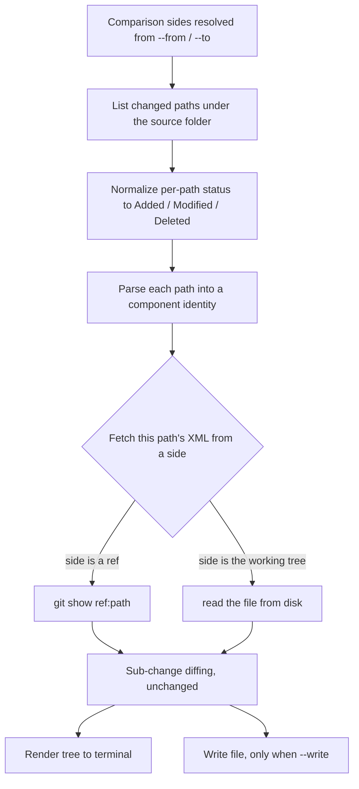

# Standalone diff Command for Solution Source - Plan

## Goal Capsule

- **Objective:** Someone holding a Dataverse solution repository can find out what components changed between any two points in its history, at any time, without running a sync and without contacting Dataverse.
- **Means:** Expose the change-summary renderer `sync` already runs at its last step as a standalone read-only command, and generalize it from working-tree-vs-HEAD to any two git points (KTD1).
- **Product authority:** This session's dialogue. No upstream brainstorm document; `product_contract_source: ce-plan-bootstrap`.
- **Open blockers:** None.

---

## Product Contract

### Summary

Add `flowline diff`, a read-only command that renders unpacked Dataverse solution XML as named component changes. It compares two git points: HEAD against the working tree by default, or any refs given through `--from` and `--to`. It writes nothing unless asked. `sync` already renders through this same code and comes out unchanged; what generalizes is the handful of values that name an environment.

### Problem Frame

The translation from solution XML to "this connection reference was deleted, this view lost a column" only runs at the tail of `sync`. That is the one moment it is least needed and least available: the terminal scrolls away, the run takes minutes, and it requires a live DEV environment. Everything else that produces solution-source changes gets no translation at all. Editing solution XML by hand, merging a branch, popping a stash, or simply reopening the terminal after yesterday's sync leaves a `git diff` over per-component XML, which is not readable at the level people reason about. The failure is silent rather than loud: a deleted connection reference reads as nine removed lines inside `Other/Customizations.xml` and gets missed. These scenarios divide by whether the work is committed yet: a sync's own output and a hand edit are still in the working tree, so the no-option default reaches them, while a merged branch or a committed stash needs `--from` against the point to compare from.

### Key Decisions

- KD1. A standalone command, not a mode on `sync` (session-settled: user-directed — chosen over `sync --show-changes` / `--skip-sync`: a flag that inverts a command's preconditions is a mode switch, and every other `sync` flag would become meaningless under it). Governs R1.
- KD2. The command is named `diff` (session-settled: user-directed — chosen over `changes`: the capability is git-comparison-shaped and grows ref-to-ref comparison). Governs R1.
- KD3. Git is the only comparison axis (session-settled: user-directed — chosen over `diff` as the container for every comparison, held open rather than rejected: keeping the command network-free is what makes it usable at any moment). Governs R1.
- KD4. Producing a file is opt-in (session-settled: user-approved — chosen over writing `CHANGES.md` by default: a command named `diff` that silently writes a tracked file is a surprise, and it becomes wrong once ref-to-ref comparison exists). Governs R8, R9.
- KD5. `diff` does not regenerate `docs/DATAVERSE_CONTEXT.md`, though `sync` still does (session-settled: user-directed). Governs R14.

### Requirements

- R1. `flowline diff` reports Dataverse solution component changes between two git points and never contacts Dataverse.
- R2. With no options it compares HEAD against the working tree, and counts untracked files as additions.
- R3. `--from <ref>` compares that ref against the working tree.
- R4. `--from <ref> --to <ref>` compares the two refs and does not consult the working tree.
- R5. `--to` without `--from` is rejected as invalid input, naming the missing option.
- R7. The report names the solution version transition whenever the version differs between the two sides.
- R8. `--write` writes the report to `CHANGES.md`; `--write <file>` writes it to the named path instead. A comparison with no changes still writes, recording the compared points and zero changes, and replaces any earlier content at that path.
- R9. Without `--write`, the command creates and modifies no file.
- R10. A written file records which two points were compared, replacing the sync-only "Synced from" line.
- R11. The command exits 0 whether or not changes were found. `--exit-code` makes it exit `ChangesFound` when at least one change was found.
- R12. `sync` supplies its environment-specific wording and its write target to the generalized writer, and its terminal report and `CHANGES.md` are unchanged.
- R13. A failure names the cause and the corrective action: no git repository, unknown ref, no solution source found.
- R14. `diff` does not write `docs/DATAVERSE_CONTEXT.md`.

### Acceptance Examples

- AE1. **Covers R2.** Given a repo whose working tree has a deleted connection reference and a bumped solution version, when `flowline diff` runs, then the report names the deleted connection reference and the version transition, and the exit code is 0.
- AE2. **Covers R4, R7.** Given tags `1.12.38` and `1.12.39`, when `flowline diff --from 1.12.38 --to 1.12.39` runs with an unrelated uncommitted edit present in the working tree, then the report describes only what changed between the two tags and the uncommitted edit does not appear.
- AE3. **Covers R8, R10.** Given the same two tags, when `--write RELEASENOTES.md` is added, then `RELEASENOTES.md` holds the report and records that `1.12.38` was compared against `1.12.39`, and `CHANGES.md` is untouched.
- AE4. **Covers R11.** Given a working tree identical to HEAD, when `flowline diff --exit-code` runs, then the exit code is 0. Given any component change, the exit code is `ChangesFound`.
- AE5. **Covers R13.** Given `--from` naming a ref that does not exist, when the command runs, then it fails naming the ref and does not render a partial report.
- AE7. **Covers R3.** Given a branch merge whose solution changes are already committed, when `flowline diff --from <the commit before the merge>` runs, then the report names the merged components, which the no-option default would not have shown.

### Scope Boundaries

**In scope.** Git-to-git comparison of unpacked solution source, its rendering, optional file output, and rewiring `sync` onto the shared path.

**Not in scope.**

- Comparing against a live environment. That is `drift` (`docs/plans/2026-07-07-002-feat-drift-preview-diff-engine-plan.md`), which compares committed source against one named environment and needs a connection.
- Plugin and web-resource state, which `sync` reports separately and which requires a live environment.
- A structured-output mode. `.claude/skills/cli-for-agents/SKILL.md` §8 rules out `--json`.
- Release-notes-shaped output distinct from the change tree. Cut, not deferred.

### Deferred to Follow-Up Work

- `--path <dir>`, to run the comparison against an unpacked-solution folder with no `.flowline` and no solution file. Cut from v1: it needs its own git-root resolution rule, and without one a mistyped path reports "no changes" instead of failing, which passes an `--exit-code` gate green. Revisit with that rule stated, and with the failure semantics for a path holding no solution source decided.

The ranked extension register is in [Future Extensions](#future-extensions) below and mirrored into `STRATEGY.md`.

---

## Planning Contract

### Key Technical Decisions

- KTD1. **The change summary takes two named comparison sides instead of assuming working-tree-vs-HEAD.** Today it hardcodes five git calls to HEAD and the working tree (`src/Flowline/Utils/SolutionChangeSummary.cs:45-81`, `:520-555`, `:600-621`). A side becomes either a git ref or the working tree, and the file listing, line counting, and per-file XML fetching each resolve against it. Component-name resolution is side-dependent too and generalizes with them: today it reads the file from disk when it exists and otherwise falls back to the last commit that touched the path, neither of which is the compared ref. Grouping and sub-change diffing are untouched. Governs R2, R3, R4.
- KTD1a. **Ref comparison ships in v1 rather than after the command proves itself.** Review conflict, recorded and overruled: the adversarial lens argued that every scenario in the Problem Frame is working-tree-vs-HEAD, which the current summary already computes, and that the two-sided generalization is the largest regression risk in the plan because `sync`'s dirty-tree guard and `generate`'s guard read the same code. The decision stands as made; the objection is recorded so a future reader sees it was raised. If U1 proves harder than expected, shipping working-tree mode first is the fallback the objection describes.
- KTD2. **`--from` with no `--to` uses the working tree as the right side** (session-settled: user-directed — chosen over comparing against HEAD: one mental model, where `--from` moves the left side and the right side stays your files on disk unless `--to` says otherwise). Governs R3.
- KTD3. **`--exit-code` returns a new `ExitCode.ChangesFound = 22`** (session-settled: user-approved — chosen over git's literal exit 1: `1` is `GeneralError` in this codebase, and `docs/solutions/architecture-patterns/ai-agent-consumable-cli-contract-2026-06-07.md` declares the numbers a stable API that agents pattern-match). Reusing `12 DirtyWorkingDirectory` is also refused; its documented promise is "commit or stash", which is wrong advice here. Governs R11.
- KTD4. **`--write [FILE]` uses the optional-value flag shape already used by `sync --managed [false]`** (`src/Flowline/Commands/SyncCommand.cs:25-28`), so bare `--write` and `--write <path>` are one option rather than two. Governs R8.
- KTD5. **The caller supplies the write target, the same way it supplies the provenance line.** `sync` passes the repo root, which is where it writes `CHANGES.md` today and must keep writing it. `diff` resolves the same repo-root default, never inside the source root: the source root is what the file listing scans, so a file written there would report itself as an untracked addition on the next run. Governs R8, R12.
- KTD6. **Every string that names an environment becomes caller-supplied, and `diff` owns no sync-specific behavior.** That is three things today: the written file's "Synced from" provenance line, the terminal no-changes line, and the write target. The context-document regeneration also stays on `sync`'s side of the call. Governs R10, R12, R14.
- KTD7. **Untracked files count only where a working tree is one of the sides.** `git status` has no meaning between two refs, so ref-to-ref listing comes from `git diff --name-status` alone. Governs R2, R4.

### High-Level Technical Design

Three comparison modes, resolved from the two options:

| Mode | Invocation | Left side | Right side | File listing |
|---|---|---|---|---|
| Working tree | `diff` | `HEAD` | working tree | `git status --porcelain -uall` |
| Ref to working tree | `diff --from X` | ref `X` | working tree | `git diff --name-status X`, plus untracked from `git status` |
| Ref to ref | `diff --from X --to Y` | ref `X` | ref `Y` | `git diff --name-status X Y` |

Directional guidance, not implementation specification. How each side answers "give me this file's content" is the part that generalizes:

The two status vocabularies differ: `git status --porcelain` emits two-character codes including `??` for untracked, while `git diff --name-status` emits single letters including `R` for renames. Normalizing both into the existing three-state status is a named step above because getting it wrong misreports deletions.

### Assumptions

- A rename reported by `git diff --name-status` is treated as a delete plus an add of the component, matching how the existing parser already keys components by path.
- A shallow clone that cannot resolve a named ref fails with the same error as a ref that does not exist. Distinguishing them adds a message, not behavior.
- `--write` to a path whose parent directory does not exist creates the directory, matching `sync` (`src/Flowline/Utils/SolutionChangeSummary.cs:265-267`).

### Sequencing

U1 unlocks everything else. U3 depends on U1. U4, U5, U6 depend on U3. U7 lands last so documentation describes shipped behavior.

---

## Implementation Units

### U1. Two-sided comparison in the change summary

- **Goal:** The change summary compares two named sides rather than assuming HEAD and the working tree.
- **Requirements:** R2, R3, R4, R13. Implements KTD1, KTD7.
- **Dependencies:** None.
- **Files:** `src/Flowline/Utils/SolutionChangeSummary.cs`, `tests/Flowline.Tests/SolutionChangeSummaryTests.cs`.
- **Approach:**
  1. Introduce a comparison-side concept with two cases: a git ref, or the working tree.
  2. Route the file listing through the mode matrix in the technical design, normalizing porcelain codes and name-status letters into the existing three-state status.
  3. Route line counting to `git diff --numstat` against the resolved sides, keeping the existing untracked line count only where the working tree is a side.
  4. Replace the two hardcoded content fetchers (`GetHeadXmlAsync`, `GetCurrentXmlAsync`) with one fetch that resolves against a given side, and route component-name resolution through that same fetch so it stops reading disk-first and stops falling back to the last commit touching the path.
  5. Keep the existing default reachable, so an unparameterized call still means HEAD against the working tree. `generate` uses the same summary as a dirty-tree guard, so its behavior must not move.
- **Patterns to follow:** The existing `Run` helper and `CommandResultValidation.None` convention in the same file; the real-temp-repo test setup in `tests/Flowline.Tests/GitComponentProvenanceLookupTests.cs:18-23` and its git runner at `:520-549`.
- **Execution note:** Add the ref-to-ref tests before generalizing the fetchers. The existing working-tree behavior is the regression risk, and it has coverage today that must stay green.
- **Test scenarios:**
  - Working-tree mode still reports the same components as before the change, including untracked files as additions.
  - Ref-to-ref mode reports a component added between two commits.
  - Ref-to-ref mode reports a component deleted between two commits.
  - Ref-to-ref mode reports a component modified between two commits, with its sub-changes.
  - Ref-to-working-tree mode reports a change that is committed after the named ref together with one that is still uncommitted.
  - Ref-to-ref mode ignores an uncommitted working-tree edit entirely.
  - A rename between two refs reports the old path as deleted and the new path as added.
  - A component renamed in the working tree does not change the name shown by a ref-to-ref comparison.
  - A component deleted on the right-hand ref but still present on disk is named from the ref, not from disk.
  - An unknown ref produces a failure rather than an empty summary.
  - `generate`'s dirty-tree guard over its models folder reports what it reported before the change.
- **Verification:** The existing summary tests pass unchanged, and the new ref-mode tests pass against a real temporary repository.

### U2. Solution version transition

- **Goal:** The report names the solution version transition when the two sides differ.
- **Requirements:** R7.
- **Dependencies:** U1.
- **Files:** `src/Flowline/Utils/SolutionChangeSummary.cs`, `tests/Flowline.Tests/SolutionChangeSummaryTests.cs`.
- **Approach:** Read the version element from `Other/Solution.xml` on each side through U1's fetch, and surface the transition beside the file and line totals. Absent on either side means no transition line.
- **Patterns to follow:** The element-level comparison added for connection references in the same file, which reads one element from each side and derives a status.
- **Test scenarios:**
  - Differing versions between sides produce a transition naming both.
  - Identical versions produce no transition line.
  - A missing `Other/Solution.xml` on one side produces no transition line and no failure.
- **Verification:** A repository whose only change is a version bump reports the transition and reports it as a change.

### U3. The `flowline diff` command

- **Goal:** `flowline diff` exists, resolves its comparison source, and renders the report.
- **Requirements:** R1, R2, R3, R4, R5, R13.
- **Dependencies:** U1.
- **Files:** `src/Flowline/Commands/DiffCommand.cs`, `src/Flowline/Program.cs`, `tests/Flowline.Tests/DiffCommandTests.cs`.
- **Approach:**
  1. Add the command with `--from` and `--to` options, each carrying a description, since an undocumented option is invisible to an agent reading `--help`.
  2. Suppress the setup and authentication preconditions the base command applies by default, since nothing here reaches Dataverse.
  3. Resolve the source folder from the solution file's Dataverse solution project, and fail naming that requirement when there is no solution file.
  4. Reject `--to` without `--from`.
  5. Register the command with a description following the what plus when plus what-changes shape, and at least one `.WithExample(...)`. The description names the comparison axis (git history, no network) and points at `drift` for the live-environment comparison, since the two commands are one letter apart and both read-only.
- **Patterns to follow:** `src/Flowline/Commands/ScaffoldCommand.cs` for a command that needs no Dataverse connection; `SolutionFileLayout` for resolving the Dataverse solution project; the registration block at `src/Flowline/Program.cs:169-243`; `.claude/skills/cli-for-agents/SKILL.md` for option descriptions, exit-code selection, and help text.
- **Test scenarios:**
  - A repository in project mode renders a report with no options given.
  - A resolved source whose two sides are identical reports no changes and exits 0.
  - `--to` without `--from` fails as invalid input, naming `--from`.
  - Running outside a git repository fails naming that, with the corrective action.
  - A folder with no solution file fails naming the solution file as the requirement.
  - The command performs no Dataverse call on any of the above paths.
- **Verification:** `flowline diff --help` lists every option with a description, and a Release build renders the report without a stack trace.

### U4. File output and comparison provenance

- **Goal:** `--write` produces the report as a file, and the file records what was compared.
- **Requirements:** R8, R9, R10.
- **Dependencies:** U3.
- **Files:** `src/Flowline/Utils/SolutionChangeSummary.cs`, `src/Flowline/Commands/DiffCommand.cs`, `src/Flowline/Commands/SyncCommand.cs`, `tests/Flowline.Tests/DiffCommandTests.cs`.
- **Approach:**
  1. Add `--write` as an optional-value option per KTD4, resolving its default target per KTD5.
  2. Generalize the file's provenance line and its write target so the caller supplies both. `sync` keeps its "Synced from" wording and repo-root target per KTD5 and KTD6.
  3. Generalize the terminal no-changes line the same way, since it names an environment today.
  4. Have `diff` supply a provenance line and a no-changes line that name the two compared points and no environment.
  5. Make the write-on-no-changes behavior caller-supplied too: the writer skips an empty report today, `sync` keeps that, and `diff` opts into writing per R8.
- **Patterns to follow:** The `FlagValue<bool>` option on `sync --managed [false]` (`src/Flowline/Commands/SyncCommand.cs:25-28`) for the optional-value shape.
- **Test scenarios:**
  - Without `--write`, no file is created and an existing `CHANGES.md` is unmodified.
  - Bare `--write` writes `CHANGES.md` at the repo root, per KTD5.
  - `--write <name>` writes that file and leaves `CHANGES.md` untouched.
  - A file written by `--write` does not appear as an untracked addition on the next run.
  - `--write` to a path whose parent does not exist creates the parent.
  - `--write` on a comparison with no changes writes a file naming the compared points and reporting zero changes.
  - `--write` over a file holding an earlier report replaces its content rather than leaving it stale.
  - The written file names both compared points in working-tree mode and in ref-to-ref mode.
  - A `sync`-written file still carries its own provenance wording and still lands at the repo root.
  - `diff`'s no-changes terminal line names the compared points and names no environment.
- **Verification:** A written file opens with the compared points and the same component sections `sync` produces.

### U5. `--exit-code` and the new exit value

- **Goal:** Callers can gate on whether changes were found without parsing output.
- **Requirements:** R11.
- **Dependencies:** U3.
- **Files:** `src/Flowline.Core/ExitCode.cs`, `src/Flowline/Commands/DiffCommand.cs`, `tests/Flowline.Tests/DiffCommandTests.cs`.
- **Approach:** Add `ChangesFound = 22` with a doc comment stating it is not a failure, then return it from `diff` only when `--exit-code` is passed and at least one change was found. Never renumber or reuse an existing value.
- **Patterns to follow:** The numbering and doc-comment convention already in `src/Flowline.Core/ExitCode.cs`; the stability rule in `.claude/skills/cli-for-agents/SKILL.md` §5.
- **Test scenarios:**
  - Changes present without `--exit-code` exits 0.
  - Changes present with `--exit-code` exits `ChangesFound`.
  - No changes with `--exit-code` exits 0.
  - A genuine failure with `--exit-code` returns its own specific code, not `ChangesFound`.
- **Verification:** The four exit codes above are observed from a Release build.

### U6. Point `sync` at the generalized writer

- **Goal:** `sync` passes its own wording and write target into the generalized writer and comes out unchanged.
- **Requirements:** R12, R14.
- **Dependencies:** U3, U4.
- **Files:** `src/Flowline/Commands/SyncCommand.cs`, `tests/Flowline.Tests/SyncCommandTests.cs`.
- **Approach:** `sync`'s reporting tail (`src/Flowline/Commands/SyncCommand.cs:158-168`) already calls the same rendering methods `diff` will call, so this is not a rewire onto new code. What changes is that the three values U4 generalized are now passed in rather than hardcoded: the provenance wording, the no-changes line, and the repo-root write target. The context-document regeneration stays at the call site per KTD6, and the pre-sync dirty-tree check at `:81` is untouched.
- **Execution note:** `sync` mutates a live environment, so prove this with the existing sync tests before touching the command, and keep the change to passing the three values in.
- **Test scenarios:**
  - A sync run still writes `CHANGES.md` at the repo root, with its own provenance wording.
  - A sync run with no component changes still prints its own environment-named no-changes line.
  - A sync run still regenerates the context document.
  - A sync run's terminal tree matches what `diff` renders for the same working tree.
  - The pre-sync dirty-tree check still blocks on uncommitted changes and still lists them.
- **Verification:** The sync test project passes, and a Release build's sync output is unchanged in shape from before the rewire.

### U7. Documentation

- **Goal:** The documented behavior matches what shipped.
- **Requirements:** R1 through R14.
- **Dependencies:** U6.
- **Files:** `README.md`, `CHANGELOG.md`, `CONCEPTS.md`, `STRATEGY.md`, `../Flowline.wiki/04-Command-Reference.md`.
- **Approach:**
  1. Add `diff` to the command surface in `README.md` and the wiki command reference, reading `../Flowline.wiki/AGENTS.md` first since that repo has its own rules. Both entries name the comparison axis and cross-reference `drift`, and `drift`'s existing entries gain the reciprocal pointer.
  2. Add a `CHANGELOG.md` entry under Added.
  3. Reword the `Sync change summary` entry in `CONCEPTS.md`, which currently defines the summary as sync-scoped and becomes wrong when this ships.
  4. In `STRATEGY.md`, add `diff` to the Drift detection track with a one-line "why it serves the approach", and add the extension register under Deferred.
- **Execution note:** This is documentation, so verify each behavioral claim against the shipped code rather than against this plan.
- **Test scenarios:** `Test expectation: none -- documentation only, no behavior changes.`
- **Verification:** Every claim in the new documentation cites code that exists. If the wiki checkout is unavailable, report that rather than skipping it silently.

---

## Verification Contract

- Build: `dotnet build Flowline.slnx`
- Full suite: `dotnet test Flowline.slnx`. Use `--filter` on `SolutionChangeSummary`, `DiffCommand`, or `SyncCommand` while iterating.
- Run the full suite before finishing, since U1 and U6 are cross-cutting.
- Check user-facing output from a Release build (`-c Release`). A Debug build propagates exceptions and prints a stack trace instead of the handled error line, which makes correct error handling look broken.
- Review new user-facing strings against `docs/tone-of-voice.md`.
- Treat `.github/workflows/ci.yml` as the authority on CI configuration.

## Definition of Done

- Every requirement R1 through R14 is observable from a Release build.
- Each unit's test scenarios exist as tests and pass.
- `sync` output is unchanged in shape after U6.
- `ExitCode.ChangesFound = 22` carries a doc comment and no existing value moved.
- `README.md`, the wiki command reference, `CHANGELOG.md`, `CONCEPTS.md`, and `STRATEGY.md` are updated.
- No abandoned approach is left in the diff.

---

## Future Extensions

Speculative. Nothing here has evidence behind it yet: it was captured while the design was fresh, not because a need was hit. Ranked, not committed. Mirrored into `STRATEGY.md` under Deferred.

Everything in A, B, and C stays inside the git-only boundary (KD3). Whether `diff` later becomes the container for every comparison Flowline can make is held open rather than decided.

### A. Depth, ranked first

Translate the component types that today render as a bare status line. Sub-change diffing currently covers entity metadata, views, forms, and option sets only (`src/Flowline/Utils/SolutionChangeSummary.cs:579-584`).

| Component type | Today | Could report |
|---|---|---|
| Security roles | status line only | which privileges changed, on which tables |
| Cloud flows and workflows | status line only | actions and triggers added or removed |
| Plugin steps | status line only | message, stage, filtering attributes |
| App modules and sitemap | status line only | areas and subareas added or removed |
| Environment variables | status line only | default value or type changed |

Ranked first because it improves what exists rather than adding surface, needs no new options, and lands in `sync`, `diff`, and `CHANGES.md` at once through the shared path. Role privileges are the sharpest gap: security-relevant and invisible today. That shared reach also widens the blast radius, so each type wants its own coverage.

### B. Reach

- **Branch merge conflicts in Dataverse terms.** Compare two branches against their merge base and report "both branches changed the Account main form" as a component-level conflict, before git produces an unreadable textual merge. The most interesting idea here and the least proven.
- **Per-component history.** Every commit that touched one named component, and who made it. The path parsing exists, and the `Provenance verdict` concept already reasons over solution-source history.
- **Settings-file changes.** Once `configure` ships, its `Declared configuration` files are git-tracked, so rendering their changes needs no new boundary.

### C. Distribution

- **Deploy preview.** `deploy` imports without saying what the import will change. The last deployed tag against what is being packed is answerable from git alone, and `sync` already tells people to tag.
- **CI and pull-request comment.** `--exit-code` makes gating possible; posting the component summary on a solution pull request turns an unreadable XML diff into a review artifact.

### Considered and cut

- **Release-notes-shaped output.** `--write RELEASENOTES.md` already covers most of it and the rest is taste.
- **Out of boundary:** comparing against a live environment, comparing a packed solution, and `drift` or `deploy` delegating to `diff`. Recorded because they are the natural shape of the container question, not because they are planned.
