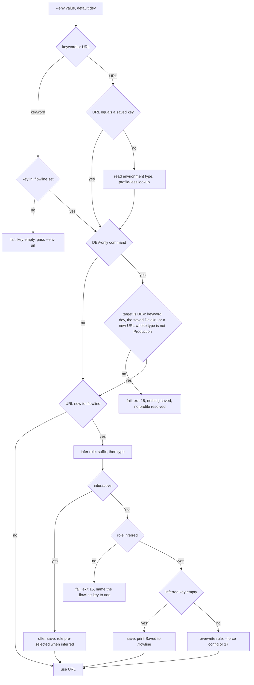
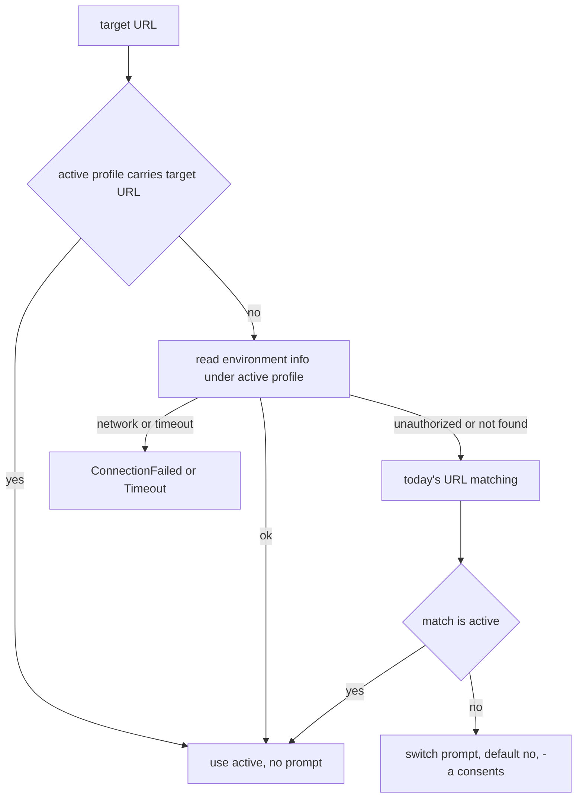
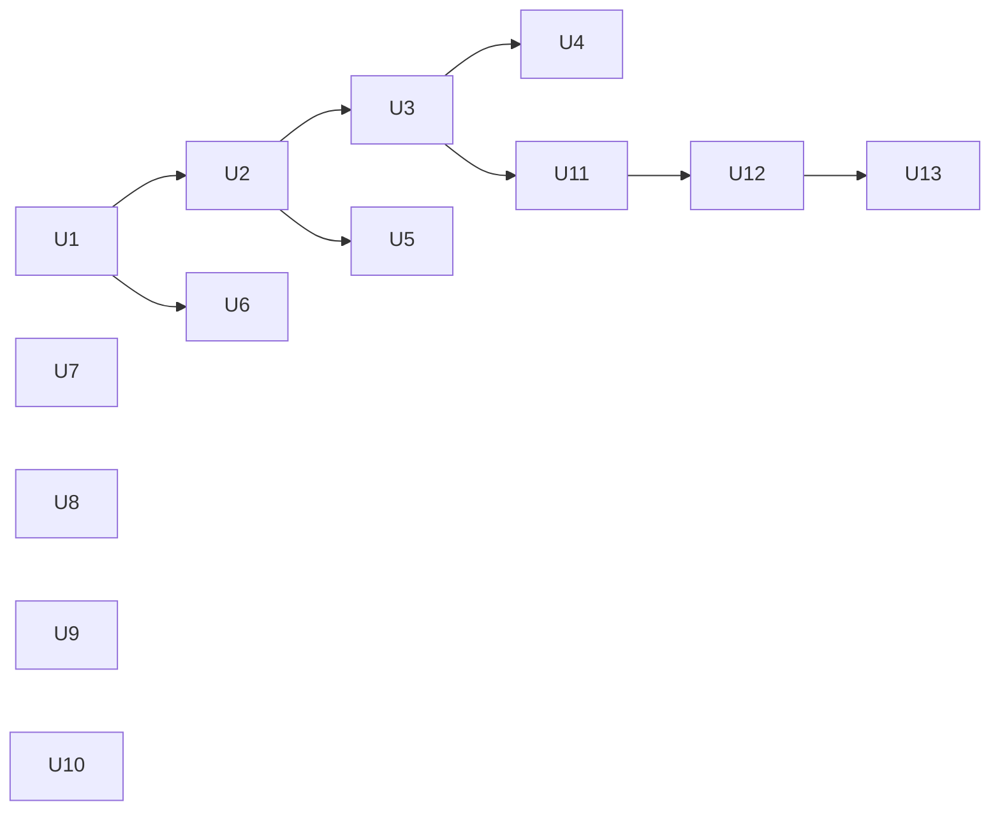

# CLI Command Surface Decisions - Plan

## Goal Capsule

- **Objective:** A user or agent addresses any Flowline environment the same way on every command, cannot push code to a non-DEV environment by accident, and reads the same command names and flags in help, README, wiki, scaffolded `AGENTS.md` and plugin skills.
- **Means:** Implement the accepted and modified decisions of the 2026-09-08 CLI design review (KD1 to KD16), with no compatibility aliases for removed flags.
- **Product authority:** `docs/reviews/2026-09-08-cli-command-surface-design-review.md`, decided with the user on 2026-09-08. Deferred and rejected findings there are out of scope.
- **Open blockers:** None.
- **Stop conditions:** A settled decision proves infeasible in code, or a change would alter behaviour of a command the review did not touch.

---

## Product Contract

### Summary

Give every Dataverse-touching command one `-e|--env <role|url>` option, restrict `push`, `pull` and `init` to DEV, infer and save a new URL's role, and generalise the write-on-first-use rule to every persisting flag. Make `pull` the primary name of the export command. Route provision overwrite through a force specifier, honour `--copy` on every role, align `drift` and a declined confirmation with the exit-code contract, give `diff` git-style positionals and `scaffold` a plugins part, and sweep README, wiki, templates and plugin skills so no surface names a removed flag.

### Problem Frame

The review found the command surface grew one grammar at a time. Environments were named three ways, `push` could only reach DEV by flag shape rather than by rule, a flag passed once silently changed the team's project file, the most destructive write (`provision` over an existing environment) was the one hazard outside `--force`, and `drift` reported a successful comparison with a failure code. Each is small; together they are what a new user or an agent has to learn around. The decisions were made in the review; this plan is the implementation shape.

### Key Decisions

- KD1. **`-e|--env <role|url>` on push, pull, generate, init and provision; positional `<target>` stays on deploy, drift, configure** (session-settled: user-approved — chosen over `--env` everywhere: required input is positional, optional input with a default is a flag). `--env` names the existing environment the command connects to; on `provision` that is the Production source it copies from, and the positional `<role>` stays the environment being created (extended 2026-09-09, session-settled: user-directed — chosen over keeping `--prod`, `--source` and `--from`: one flag, one meaning, no new word). Governs R1, R2, R5.
- KD2. **push, pull and init target DEV only** (session-settled: user-directed — chosen over allowing other roles behind a force specifier: code flows up through DEV, everything else is `deploy`). Governs R3, R4.
- KD3. **A URL not in `.flowline` is offered for saving under an inferred role; non-interactive runs save and say so** (session-settled: user-directed — chosen over a `--role` flag, a one-shot URL that is never saved, and an `env add` command: inference from the URL name, the display name and the environment type needs no new flag, and `.flowline` is hand-editable). The fallback for a Sandbox with no keyword hit changed from `dev` to ask-or-fail after document review (session-settled: user-approved — chosen over defaulting to `dev`: Dataverse cannot distinguish a test or UAT sandbox from a DEV one by type, so a default would hand DEV write access to an environment that never earned it). Governs R6, R7, R8.
- KD4. **clone with several configured URLs and no `--env` asks interactively and errors non-interactively** (session-settled: user-directed — chosen over defaulting to prod). Governs R9.
- KD5. **Removed flags get no aliases** (session-settled: user-directed — chosen over hidden aliases for one release: the tool is pre-1.0). Governs R10.
- KD6. **Persisting flags stay; one write-on-first-use, ask-on-change rule for all of them** (session-settled: user-directed — chosen over one-shot flags and a `config set` command: editing `.flowline` by hand is supported). Governs R11, R12, R13.
- KD7. **Auth resolver prefers the active profile when it reaches the target; the switch prompt, its `no` default, no restore and `-a` stay** (session-settled: user-directed — chosen over a `yes` default and restore-on-exit: PAC's active profile is the user's chosen context and Flowline is a guest in it). Governs R14, R15.
- KD8. **drift exits 0, 22 with `--exit-code`; a declined first-import prompt exits 17; code 14 documented reserved; 15 untouched** (session-settled: user-approved — chosen over splitting code 15). Governs R18, R19, R20.
- KD9. **`pull` is the primary name, `sync` a permanent alias, with a full sweep** (session-settled: user-directed — option 2 of 3, chosen over keeping `sync` primary: `push`/`pull` is the pair the git model implies and `configure --pull` already uses the word). Governs R21, R31.
- KD10. **Wiki page `07-Sync.md` is renamed to `07-Pull.md`** (session-settled: user-directed — chosen over keeping the filename for the published URL). Conflict note: `../Flowline.wiki/AGENTS.md` "Pages" says renaming breaks inbound links and external URLs and not to do it; the decision stands as an exception and U13 adds the carve-out to that rule. Governs R31.
- KD11. **provision overwrite is `--force overwrite` through `ConfirmGated`; `--copy` applies to every role** (session-settled: user-approved for the specifier, user-directed for `--copy`: chosen over rejecting `--copy` on test and uat). Governs R16, R17.
- KD12. **diff takes refs as positionals with `A..B` and `A...B`; `--from`/`--to` removed** (session-settled: user-approved — chosen over keeping both grammars: diff shipped days ago). Governs R28.
- KD13. **scaffold gains a `plugins` part** (session-settled: user-approved). Governs R29.
- KD14. **`--skip-<check>` reads, `--no-<action>` writes, written as a rule; no flag renames** (session-settled: user-approved — chosen over a repeatable `--skip <gate>`). Governs R32.
- KD15. **Global options split into a Dataverse-only base** (session-settled: user-approved). Governs R30.
- KD16. **`--pluginFile` becomes `--plugin-file`; `--webresources` stays** (session-settled: user-approved — chosen over keeping PAC's spelling: PAC has no single convention). Governs R10, R22.

### Requirements

**Environment addressing**

- R1. `push`, `pull`, `generate` and `init` accept `-e|--env <role|url>`, default `dev`, and no longer accept `--dev`. `provision` accepts `-e|--env <prod|url>`, default `prod`, naming the Production environment it copies from, and no longer accepts `--prod`; a dev/test/uat keyword or a non-Production URL is refused before anything is written. The shared `--env` description reads "Environment to connect to: dev, test, uat, prod, or a URL (saved to .flowline)".
- R2. `deploy`, `drift` and `configure` keep their positional `<target>` and gain nothing.
- R3. `push`, `pull` and `init` refuse any target that is not DEV before connecting to it, resolving a PAC profile for it, or writing anything to `.flowline`: a role keyword other than `dev`, a URL equal to a configured test, UAT or prod URL, or a URL whose environment type is Production. The error names the accepted forms and exits 15.
- R4. `generate` accepts any role keyword or URL, including a Production-type environment.
- R5. A role keyword resolves from `.flowline`; an empty key fails naming the key and `--env <url>`.
- R6. A URL not in `.flowline`, in an interactive run, offers to save it under a role with the inferred role pre-selected; declining uses the URL once.
- R7. A URL not in `.flowline`, in a non-interactive run, saves it under the inferred role and prints one line naming the role, the inference source and `.flowline`. When the inferred role's key already holds a different URL, R11's different-value branch applies instead of a save.
- R8. Role inference, in order: a Production type is `prod` whatever the name says; then a keyword in the URL's host label (`dev`, `develop`, `development`; `test`, `tst`, `testing`, `qa`, `sit`; `uat`, `acc`, `acceptance`, `acceptatie`, `preprod`, `staging`, `stage`, `stg`), matched as a whole hyphen-separated token in any position with trailing digits ignored, last match wins; then the same keywords in the environment's display name; then a Developer type is `dev`. A Sandbox with no keyword hit is not inferred, because Dataverse reports a test or UAT sandbox with the same type as a DEV one (keyword table, any-position token match, display-name source and Production-over-name added 2026-09-09): a non-interactive run fails with exit 15 naming the `.flowline` key to add for the role the URL belongs to, and an interactive run offers the role picker with no pre-selected role.
- R9. `clone` takes `--env <role|url>`. A URL is saved through R6 to R8. With no `--env`: one configured URL is used; more than one asks interactively which, and fails non-interactively naming `--env`. The prod, uat, test, dev scan is removed.
- R10. These flags are removed with no alias: `--prod`, `--uat`, `--test`, `--dev` on every command; `--pluginFile`; `--allow-overwrite`; `--from` and `--to` on `diff`. An old spelling fails with the parser's unknown-option error.

**Persisting flags**

- R11. Every flag whose value persists to `.flowline` follows one rule: absent reads the saved value; present with an empty key saves it and prints "Saved to .flowline: <key>"; present with the same value changes nothing; present with a different value asks to overwrite interactively and, non-interactively, needs `--force config` or exits 17. Covered flags: `--env` URLs, `--managed` on `clone` and `pull`, `--namespace`, `--extra-tables`, `--generator`, `--output` and `--service-context-name` on `generate`.
- R12. Every persisting flag's description ends with "(saved to .flowline)".
- R13. `--managed` keeps its optional value and renders its placeholder as `[true|false]`.

**Auth**

- R14. When PAC's active profile can reach the target environment, the command uses it with no switch and no prompt, even when another profile carries the target URL.
- R15. Otherwise resolution is unchanged: URL match, ambiguity picker, switch prompt with default `no`, `-a` to consent, no switch back, non-interactive error naming `pac auth select`.

**Safety and exit codes**

- R16. `provision` on an existing target asks "overwrite?" interactively and, non-interactively, exits 17 naming `--force overwrite`; `overwrite` is a valid specifier so `--force all` covers it.
- R17. `provision --copy minimal|full` applies to dev, test and uat; defaults stay minimal for dev and full for test and uat.
- R18. `drift` exits 0 after a completed comparison; with `--exit-code` it exits 22 when orphans were found. Inconclusive stays 19.
- R19. A declined first-import confirmation in `deploy` exits 17 with a message naming `--force first-import`.
- R20. Exit code 14 is documented as reserved with no throw site.

**Help and naming**

- R21. The export command is registered as `pull` with alias `sync`; every description, example, message, template and skill leads with `pull`.
- R22. `push` takes `--plugin-file <PATH>` with short `-p`.
- R23. Root help lists four examples: `clone ContosoSales`, `push`, `pull`, `deploy prod`.
- R24. Every `WithExample` passes one argument per string.
- R25. `deploy`'s `<target>` description lists prod, uat, test or a URL.
- R26. Descriptions corrected: `pull` says patch version, says it builds to validate the synced source, and names `CHANGES.md` and the context docs; `push --no-publish` says "after the push"; `--no-cache` is one line and the artifact note moves to `deploy`.
- R27. In every user-facing string, "sync" refers only to the alias of `pull` and "publish" only to the Dataverse publish operation.

**Other commands**

- R28. `diff [from] [to]` compares refs like git: no arguments is HEAD against the working tree; one ref is that ref against the working tree; two refs compare the refs; `A..B` equals `A B`; `A...B` compares the merge base of A and B against B. A missing merge base fails naming both refs.
- R29. `scaffold plugins [--name]` writes a plugin project the way `clone` and `init` do, adds it to the nearest solution file, skips when it already exists, and requires `--name` for a second plugin project in a solution that has one.

**Global options**

- R30. `--no-cache`, `-a` and `--env` appear only on commands that touch Dataverse; `diff`, `scaffold`, `sln add` and `status` show neither `--no-cache` nor `-a`.

**Documentation**

- R31. README, every wiki page, the scaffolded `AGENTS.md`, the five plugin skills and the repo's `cli-for-agents` skill name no removed flag and lead with `pull`. Wiki `07-Sync.md` becomes `07-Pull.md` and every inbound link follows. Three lines land from rejected findings: the `pac solution pack` recipe on the deploy artifacts section, the no-bump pull as dry run on the pull page, and the publish sentence naming the last push or `pac solution publish`.
- R32. `.claude/skills/cli-for-agents/SKILL.md` gains the `--skip-<check>` / `--no-<action>` rule and the "(saved to .flowline)" phrase, and its examples use `--env` and `--plugin-file`.
- R33. `CHANGELOG.md` gets a Breaking section naming the removed flags, the `drift` exit change, the `clone` non-interactive change and the `provision` exit change. Historical entries keep their wording.

### Acceptance Examples

- AE1. **Covers R3.** Given `.flowline` holds a TestUrl, when `flowline push --env test` runs, then the run fails before connecting, exit 15, and the message names `dev` or a DEV URL as the accepted forms.
- AE2. **Covers R7, R8, R11.** Given `.flowline` has an empty DevUrl and no TTY, when `flowline push --env https://contoso-dev.crm4.dynamics.com` runs, then the push proceeds and prints "Saved to .flowline: DevUrl (inferred from URL name)", and a second run with no `--env` uses it without printing that line.
- AE3. **Covers R3, R8.** Given no TTY, when `flowline push --env https://contoso.crm4.dynamics.com` runs against a Production-type environment, then the run is refused, exit 15, and nothing is saved.
- AE4. **Covers R7, R11.** Given DevUrl already holds a different URL and no TTY, when `flowline push --env <other-dev-url>` runs, then it exits 17 naming `--force config`.
- AE5. **Covers R9.** Given `.flowline` holds a ProdUrl and a DevUrl and no TTY, when `flowline clone ContosoSales` runs, then it exits 15 naming `--env`.
- AE6. **Covers R14.** Given PAC's active profile is a user profile with no environment URL and it can reach the DEV URL, and a second profile carries that URL, when `flowline push` runs, then no switch prompt appears and the run uses the active profile.
- AE7. **Covers R16.** Given the target environment exists and no TTY, when `flowline provision dev` runs without `--force overwrite`, then it exits 17 naming `--force overwrite`; with `--force all` it copies.
- AE8. **Covers R18.** Given orphans exist in TEST, when `flowline drift test` runs, then exit 0 with the report; with `--exit-code`, exit 22.
- AE9. **Covers R19.** Given an interactive first deploy to TEST, when the user answers `n`, then exit 17 and the message names `--force first-import`.
- AE10. **Covers R28.** Given tags `1.12.38` and `1.12.39` on a branch with a shared base, when `flowline diff 1.12.38...1.12.39` runs, then the report covers only changes after the merge base; `flowline diff --from 1.12.38` fails with the parser's unknown-option error.
- AE11. **Covers R21.** When `flowline sync --help` runs, then the header and usage line read `pull`.
- AE12. **Covers R7, R8.** Given no TTY and a Sandbox-type environment at `https://contoso-uat2.crm4.dynamics.com` whose host carries none of the three suffixes, when `flowline push --env <that url>` runs, then it exits 15 naming the `.flowline` key to add, saves nothing, and never connects to that environment.

### Scope Boundaries

**In scope.** Everything in R1 to R33.

**Not in scope.**

- Numbered or named roles beyond dev, test, uat, prod (review C3, deferred).
- `deploy --settings-file` (review P5b, deferred).
- The `configure` grammar and its `--pull [zip-or-folder]` option (review P10, deferred).
- `deprovision`, `restore`, structured output (review G4, G5, G6, deferred).
- Every rejected finding in the review.

#### Deferred to Follow-Up Work

- `docs/solutions/` entries that quote `--dev` or `--pluginFile` in copy-paste commands. Discovery work with an unknown line count; sweep after this lands.
- `CHANGELOG.md` historical entries keep `sync`; only the new entries use `pull`.

---

## Planning Contract

### Key Technical Decisions

- KTD1. **One environment target resolver serves every command.** A new service resolves a keyword or URL against `ProjectConfig`, applies the DEV-only gate for push, pull and init, and owns the save flow of R6 to R8. `deploy`, `drift` and `configure` route their positional `<target>` through the same keyword resolution. Rationale: role parsing exists three times today with different shapes (`DeployCommand.ResolveTargetUrl`, `DriftCommand.TryResolveRole`, `ConfigureCommand` around line 342), and `docs/solutions/conventions/flowline-add-environment-2026-06-06.md` records that environment logic is decentralised across six files with no fan-out. Instantiates KD1, KD2, KD3, KD4.
- KTD2. **Role inference is a pure function in Core with no process exit.** `PacUtils.GetPartsFromEnvUrl` calls `Environment.Exit` on a regex miss (`src/Flowline/Utils/PacUtils.cs:616-625`) and is not reused. The new function takes a URL and an optional environment type and returns a role plus the source of the inference; a URL it cannot parse falls through to the type step. Instantiates KD3.
- KTD3. **The reachability probe is one direct connector call, made only when the active profile is not the URL-matched one.** When the active profile already carries the target URL, nothing changes and no probe runs. Otherwise the resolver reads the target's environment info through the connector under the active profile. That read is separate from the validator's cached environment check, which the connector never populates, so in this mismatch case the command pays one extra live round-trip; the common path pays none because the probe never runs there. Outcomes: success selects the active profile; an authorization or not-found response falls through to today's URL matching; a network failure or timeout surfaces as `ConnectionFailed` or `Timeout`, since another profile would fail the same way. Instantiates KD7.
- KTD4. **The settings split is a type check in the shared pipeline.** `FlowlineSettings` keeps `-v` and `-f`; `DataverseSettings : FlowlineSettings` adds `--no-cache`, `-a` and `-e|--env`. `FlowlineCommand<TSettings>` reads the two removed values through `settings as DataverseSettings` at `src/Flowline/Commands/FlowlineCommand.cs:65,117,136`, defaulting to `false`. Rationale: those reads are the only base-pipeline consumers and `diff`, `scaffold`, `sln add` never used the flags. Instantiates KD15.
- KTD5. **`init` gets `--env <url>` with the DEV-only gate.** KD1 lists `init` among the commands that lose `--dev`; without a replacement, non-interactive `init` has no way to name a target. `init` is always DEV, so its `--env` accepts `dev` or a DEV URL under the same gate as push and pull. Not session-settled: derived from KD1 and KD2.
- KTD6. **The persisting-flag rule generalises `ProjectConfig.GetOrUpdateUrl`.** The four-branch method at `src/Flowline/Config/ProjectConfig.cs:35-74` already implements absent, empty, same and different for URLs. It becomes one generic setter that also prints the first-save line, and the generate flags (`src/Flowline/Commands/GenerateCommand.cs:136-147` save silently today) and `--managed` (`ProjectConfig.GetOrUpdateSolution`) route through it. `push` gains the `Config.Save()` call it lacks today; `pull`'s unconditional "Project configuration saved" line at `src/Flowline/Commands/SyncCommand.cs:57-58` prints only when a value changed. Instantiates KD6.
- KTD7. **scaffold plugins mirrors the web resources part with a plural rule.** Default folder `Plugins` and file `<Solution>.Plugins.csproj` next to a solution file, `Plugins.csproj` without one (the analogue of `StandaloneWebResourcesProjectFileName`). Exists already: skip at exit 0. A solution file that already records a plugin project: require `--name`, since plugin projects are plural (`PluginProjectResolver.EnumerateCandidates`). Instantiates KD13.
- KTD8. **generate bypasses the Production guard.** `GetAndCheckEnvironmentInfoAsync` rejects a Production-type environment for any role but prod (`src/Flowline/Commands/FlowlineCommand.cs:268-272`). generate only reads metadata, so it passes a flag that skips that guard. Instantiates KD1 for generate.
- KTD9. **Removed flags rely on the parser's error.** Spectre reports an unknown option by name. A custom "use `--env`" hint would need a parse interceptor for six old spellings on a pre-1.0 tool; the CHANGELOG Breaking section carries the mapping instead. Instantiates KD5.
- KTD10. **provision's existing-target path changes from exit 0 to a gated prompt.** Today it warns and returns 0 (`src/Flowline/Commands/ProvisionCommand.cs:129-133`) without prompting. Conflict note: `.claude/skills/cli-for-agents/SKILL.md` rule 9 asks reconciling commands to converge on a re-run; a second `provision` against an existing target now exits 17 unless `--force overwrite` is passed. The user chose this in review C5 with the behaviour change stated. Instantiates KD11.
- KTD11. **Root examples through `config.AddExample`.** With none registered, Spectre fills root help from the children's examples capped by `MaximumIndirectExamples`; four root examples replace that. Verified against Spectre.Console.Cli 0.55.0. Instantiates R23.
- KTD12. **The merge base comes from git.** No merge-base helper exists in `src/Flowline/Utils/GitUtils.cs`; a new method shells to `git merge-base` and maps a missing base to `ValidationFailed` naming both refs. Instantiates KD12.

### High-Level Technical Design

Target resolution for a Dataverse command, from the option value to a usable URL. The DEV-only gate applies to push, pull and init only.

Auth profile resolution after KD7. The probe runs only when the active profile is not already the URL-matched one.

### Assumptions

- The environment-info read used by KTD3 distinguishes an authorization failure from a network failure in the exception it raises. If it does not, U6 adds that classification.
- Spectre's optional positional pair on `diff` parses `A..B` as one token; the split happens in the command, not the parser.

### Sequencing

U1, U7, U8, U9 and U10 have no upstream dependency and can run as one parallel layer with U2. U11 waits for the code changes it describes. U12 and U13 are the documentation tail.

---

## Implementation Units

| U-ID | Title | Key files | Depends on |
|---|---|---|---|
| U1 | Settings split and the `--env` option | `FlowlineSettings.cs`, new `DataverseSettings.cs`, `FlowlineCommand.cs`, every `*Command.cs` Settings | none |
| U2 | Environment target resolver, inference and save flow | new resolver and inference files, `ProjectConfig.cs`, `FlowlineCommand.cs` | U1 |
| U3 | push, pull, generate, init on `--env` | `PushCommand.cs`, `SyncCommand.cs`, `GenerateCommand.cs`, `InitCommand.cs` | U2 |
| U4 | clone on `--env` | `CloneCommand.cs` | U3 |
| U5 | Persisting-flag rule for generate flags and `--managed` | `GenerateCommand.cs`, `ProjectConfig.cs`, `CloneCommand.cs`, `SyncCommand.cs` | U2 |
| U6 | Auth resolver prefers the active profile | `ProfileResolutionService.cs`, `DataverseConnector.cs` | U1 |
| U7 | provision: `--force overwrite` and `--copy` on every role | `ProvisionCommand.cs` | none |
| U8 | Exit codes: drift `--exit-code`, declined first import | `DriftCommand.cs`, `DeployCommand.cs`, `ExitCode.cs` | none |
| U9 | diff positionals and merge base | `DiffCommand.cs`, `GitUtils.cs` | none |
| U10 | scaffold plugins | `ScaffoldCommand.cs`, `ProjectScaffolder.cs` | none |
| U11 | Renames, examples and descriptions | `Program.cs`, finish-line strings, `ProjectScaffolder.cs` | U3 |
| U12 | Repo docs and skills | `README.md`, `CHANGELOG.md`, `plugin/skills/*`, `.claude/skills/cli-for-agents/SKILL.md` | U11 |
| U13 | Wiki sweep and page rename | `../Flowline.wiki/*.md` | U12 |

### U1. Settings split and the `--env` option

- **Goal:** `--no-cache`, `-a` and `-e|--env` exist only on Dataverse-touching commands; the shared pipeline still compiles and behaves.
- **Requirements:** R1, R30. Instantiates KD1, KD15 via KTD4.
- **Dependencies:** none.
- **Files:** `src/Flowline/FlowlineSettings.cs`, `src/Flowline/DataverseSettings.cs` (new), `src/Flowline/Commands/FlowlineCommand.cs`, the `Settings` class in each of `PushCommand.cs`, `SyncCommand.cs`, `GenerateCommand.cs`, `InitCommand.cs`, `CloneCommand.cs`, `DeployCommand.cs`, `DriftCommand.cs`, `ConfigureCommand.cs`, `ProvisionCommand.cs`, `StatusCommand.cs`; `tests/Flowline.Tests/FlowlineSettingsTests.cs`, `tests/Flowline.Tests/FlowlineCommandTests.cs`.
- **Approach:**
  1. Move `NoCache` and `AutoSwitchProfile` from `FlowlineSettings` to `DataverseSettings`; add `-e|--env <ROLE|URL>` with a description that names the accepted forms and the DEV-only rule where it applies (per KTD5 the description differs for push, pull, init).
  2. Re-base every Dataverse command's `Settings` on `DataverseSettings`. `diff`, `scaffold`, `sln add`, `status` stay on `FlowlineSettings`.
  3. In `FlowlineCommand<TSettings>`, read the two moved values through a type check (KTD4). Shorten the `--no-cache` description to one line; the artifact-reuse sentence moves to `deploy`'s description in U11.
  4. `status` does not run through the shared pipeline: it extends the Spectre command directly and calls the update-notice check with the flag itself (`src/Flowline/Commands/StatusCommand.cs:98`). That call passes a literal false, since `status` stays on `FlowlineSettings`.
- **Patterns to follow:** `FlowlineSettings.ValidateForce` and the per-command `ValidForceSpecifiers` override for how a base contract is narrowed per command.
- **Test scenarios:**
  - Parsing `diff --no-cache` fails as an unknown option; parsing `push --no-cache` succeeds.
  - `status --help` output lists neither `--no-cache` nor `-a`; `push --help` lists both plus `--env`.
  - The update-notice check runs for `diff` as if `--no-cache` were false (probe through the existing seam in `FlowlineCommandTests`).
- **Verification:** Release build; `--help` of every command captured and diffed against the current output; only the intended options moved.

### U2. Environment target resolver, inference and save flow

- **Goal:** One resolver turns a keyword or URL into a target, infers and saves a role, and gates DEV-only commands, per the first diagram.
- **Requirements:** R3, R5, R6, R7, R8, R11 (URL branch). Instantiates KD1, KD2, KD3 via KTD1, KTD2, KTD6.
- **Dependencies:** U1.
- **Files:** `src/Flowline.Core/Services/EnvironmentRoleInference.cs` (new, pure), `src/Flowline/Services/EnvironmentTargetResolver.cs` (new), `src/Flowline/Config/ProjectConfig.cs` (generic get-or-update with first-save print, role-keyed accessor), `src/Flowline/Commands/FlowlineCommand.cs` (guard bypass parameter on `GetAndCheckEnvironmentInfoAsync`), `tests/Flowline.Core.Tests/EnvironmentRoleInferenceTests.cs` (new), `tests/Flowline.Tests/Services/EnvironmentTargetResolverTests.cs` (new), `tests/Flowline.Tests/ProjectConfigTests.cs`.
- **Approach:**
  1. Inference function per R8: suffix match on the host label before `.crm`, then type; an unsuffixed Sandbox yields no role. Returns the role, or none, and the inference source. No dependence on `PacUtils.GetPartsFromEnvUrl`.
  2. Resolver takes the option value, the config, the interactivity flag, the force settings, and a DEV-only flag. Keyword path: lookup, empty key fails naming the key and `--env <url>`. URL path: normalise trailing slash and case, compare to the four keys, then the save flow per R6 and R7 with the different-value branch delegated to the config setter's overwrite rule.
  3. For a URL not in `.flowline`, read its environment type through the profile-less lookup `provision` already uses (`FlowlineValidator.GetEnvironmentInfoByUrlAsync`, called at `src/Flowline/Commands/ProvisionCommand.cs:87`), run the DEV-only gate on that answer, and only then infer and save. A refused URL exits 15 with nothing written and no PAC profile resolved, so the exit code does not depend on what the inferred key already held.
  4. Generalise `GetOrUpdateUrl` into one setter used for URLs now and for U5's flags later, printing "Saved to .flowline: <key>" on the empty-key branch.
- **Execution note:** Inference and the resolver's decision table are pure; write their tests first and watch them fail before wiring the commands.
- **Patterns to follow:** `ProjectConfig.GetOrUpdateUrl` for the four branches; `CloneCommand.ResolveRoleAsync` (`src/Flowline/Commands/CloneCommand.cs:238-258`) for the role picker shape; `SettingsConsoleExtensions.Confirm` for the gated prompt.
- **Test scenarios:**
  - Inference: `contoso-dev.crm4` gives dev from suffix; `contoso-test.crm4` gives test; `contoso.crm4` with type Production gives prod; type Developer gives dev; type Sandbox with no suffix gives no role; unknown type and no suffix gives no role; a URL the parser cannot read falls to the type step without throwing.
  - Covers AE12. Non-interactive new URL, Sandbox type, no suffix: exit 15 naming the `.flowline` key to add, nothing saved, no connect to the target.
  - Interactive new URL, Sandbox type, no suffix: picker shows the four roles with none pre-selected; choosing one saves under that key.
  - Keyword `test` with empty TestUrl fails naming `TestUrl` and `--env <url>`.
  - URL equal to DevUrl with a trailing slash and different case resolves to dev with no save.
  - Covers AE2. Non-interactive new URL, empty inferred key: saved, line printed, second call silent.
  - Covers AE4. Non-interactive new URL, inferred key holds another URL: exit 17 naming `--force config`; with `--force config` the key is overwritten.
  - Interactive new URL: picker pre-selects the inferred role; Enter saves; declining uses the URL and saves nothing.
  - Covers AE1, AE3. DEV-only gate: keyword `prod`, a URL equal to TestUrl, and a Production-type URL each fail with exit 15 before any connect; a Sandbox URL passes.
- **Verification:** All scenarios green; no command wired yet, so the CLI is unchanged at this point.

### U3. push, pull, generate, init on `--env`

- **Goal:** The four commands take `--env`, push, pull and init are DEV-only, generate reaches any role, `push` saves `.flowline`, and standalone mode is unchanged.
- **Requirements:** R1, R3, R4, R10 (their `--dev`), R11 (push save). Instantiates KD1, KD2 via KTD1, KTD5, KTD6, KTD8.
- **Dependencies:** U2.
- **Files:** `src/Flowline/Commands/PushCommand.cs`, `src/Flowline/Commands/SyncCommand.cs`, `src/Flowline/Commands/GenerateCommand.cs`, `src/Flowline/Commands/InitCommand.cs`, `src/Flowline/Services/ProfileResolutionService.cs` (parameter rename only), `tests/Flowline.Tests/PushCommandTests.cs`, `tests/Flowline.Tests/SyncCommandTests.cs`, `tests/Flowline.Tests/GenerateCommandTests.cs`, `tests/Flowline.Tests/InitCommandTests.cs`, `tests/Flowline.Tests/ProfileResolutionServiceStandaloneTests.cs`.
- **Approach:**
  1. Delete each `--dev` option; read `settings.Env` from `DataverseSettings` and pass it to the resolver with the DEV-only flag for push, pull and init.
  2. `generate` passes the guard bypass (KTD8) and resolves any role through the same resolver.
  3. Standalone push and generate pass the option value to `ResolveStandaloneEnvironmentUrl` unchanged; the Production refusal there stays.
  4. `push` calls `Config.Save()` after resolution when the resolver reports a save. `pull` prints its saved line only on change.
  5. `init` keeps its environment picker for the interactive no-flag case (`CreateEnvironmentResolver`).
- **Patterns to follow:** `GenerateCommand.ShouldPersistSettings` for when to save; `PushCommand` standalone branch at line 98 to 108.
- **Test scenarios:**
  - `push --env dev` in project mode resolves DevUrl and connects; `push --env test` fails per AE1.
  - `push --env <new-url>` non-interactive saves and prints per AE2; `.flowline` on disk holds the URL afterwards.
  - `generate --env prod` against a Production-type environment proceeds.
  - `init --env <prod-url>` fails with the DEV-only message; `init --env <sandbox-url>` proceeds.
  - Standalone `push --plugin-file x.dll` with no `--env` still resolves the active resource-specific profile; with an active profile pointing at Production it is refused.
  - `pull` with nothing changed prints no "Saved to .flowline" line.
- **Verification:** Command tests green; a Release-build `push --help` shows `--env` and no `--dev`.

### U4. clone on `--env`

- **Goal:** `clone` names its source with `--env`, saves a URL through the shared flow, and never scans roles silently.
- **Requirements:** R9, R10 (clone's four flags). Instantiates KD3, KD4 via KTD1.
- **Dependencies:** U3.
- **Files:** `src/Flowline/Commands/CloneCommand.cs`, `tests/Flowline.Tests/CloneCommandTests.cs`.
- **Approach:**
  1. Remove the four URL options and the config-setter calls at lines 58 to 61.
  2. Source selection: `--env` given resolves through U2 (URL saved under the inferred role, keyword looked up). Absent: one configured URL is the source; more than one goes to a role picker interactively and fails non-interactively naming `--env`; none goes to the existing environment and solution picker.
  3. Delete `FindUnmanagedSourceAsync`'s prod, uat, test, dev scan. The unmanaged-solution check stays on the chosen source.
- **Patterns to follow:** `CloneCommand.ShouldPickSolution` and `PickSolutionAsync` for the existing interactive path and its test doubles (`GetSolutionsOverride`).
- **Test scenarios:**
  - Fresh folder, `clone X --env <prod-url>`, non-interactive: saved as ProdUrl (type Production), printed, cloned.
  - Covers AE5. Two URLs, no `--env`, non-interactive: exit 15 naming `--env`.
  - Two URLs, no `--env`, interactive: picker lists both roles; choosing one clones from it.
  - One URL, no `--env`: used without a prompt.
  - `--env uat` with empty UatUrl fails naming `UatUrl`.
- **Verification:** Clone tests green; `clone --help` shows `--env` and `--managed` only.

### U5. Persisting-flag rule for generate flags and `--managed`

- **Goal:** Every persisting flag follows R11 and R12; `--managed` renders per R13.
- **Requirements:** R11, R12, R13. Instantiates KD6 via KTD6.
- **Dependencies:** U2.
- **Files:** `src/Flowline/Commands/GenerateCommand.cs` (lines 136 to 147), `src/Flowline/Config/ProjectConfig.cs` (`GetOrUpdateSolution` and the Generate settings), `src/Flowline/Commands/CloneCommand.cs` and `SyncCommand.cs` (`--managed` template and description), `tests/Flowline.Tests/GenerateCommandTests.cs`, `tests/Flowline.Tests/ProjectConfigTests.cs`, `tests/Flowline.Tests/ManagedFlagBindingTests.cs`.
- **Approach:**
  1. Route namespace, extra tables, generator, output and service context name through the generic setter from U2 instead of the silent assignments.
  2. `GetOrUpdateSolution`'s managed branch uses the same setter so the message and the force specifier match.
  3. Option template `--managed [true|false]`; description reworded; append "(saved to .flowline)" to every persisting flag's description in one wording.
- **Test scenarios:**
  - `generate --extra-tables contact` with `account,contact` saved, non-interactive: exit 17 naming `--force config`; with the specifier, the list is replaced.
  - `generate --namespace X` on an empty key: saved and printed.
  - `sync --managed` twice: second run silent; `sync --managed false` after `true`: overwrite prompt.
  - `sync --help` renders `--managed [TRUE|FALSE]`.
- **Verification:** Tests green; every persisting flag's help line ends with the phrase (grep the Release `--help` output).

### U6. Auth resolver prefers the active profile

- **Goal:** A user whose active PAC profile reaches the target is never asked to switch.
- **Requirements:** R14, R15. Instantiates KD7 via KTD3.
- **Dependencies:** U1.
- **Files:** `src/Flowline/Services/ProfileResolutionService.cs`, `src/Flowline.Core/Services/DataverseConnector.cs`, `tests/Flowline.Tests/Services/ProfileResolutionServiceTests.cs`, `tests/Flowline.Core.Tests/DataverseConnectorTests.cs`.
- **Approach:**
  1. Before `FindBestProfile`, check whether the active profile is the URL match; if so, today's path.
  2. Otherwise run the probe (KTD3) under the active profile through a new connector method that classifies the outcome as reachable, unauthorized or not found, or transport failure.
  3. Reachable selects the active profile and emits the existing status line naming it. Unauthorized or not found continues into today's chain. Transport failure throws the existing `ConnectionFailed` or timeout mapping.
  4. Add a probe override seam beside the five existing `*Override` properties.
- **Execution note:** Characterise today's order with a test before changing it, so the fall-through branch is proven equal to current behaviour.
- **Patterns to follow:** `ProfileResolutionServiceTests.MakeService` for seam injection; `DataverseTimeout.Matches` for the transport classification.
- **Test scenarios:**
  - Covers AE6. Active UNIVERSAL profile reaches the target, a second profile carries the URL: no prompt, active used.
  - Active profile is a TEST service principal, target is DEV, probe unauthorized: falls through, URL match found, switch prompt appears with default `no`.
  - Probe times out: exit 16, no prompt, no switch.
  - Active profile is the URL match: no probe call (assert the seam was not invoked).
  - Non-interactive fall-through with a non-active URL match: error naming `pac auth select`, unchanged.
- **Verification:** Tests green; on the common path (active profile is the URL match) the probe seam is never invoked and the Dataverse round-trip count equals today's; in the mismatch case it is today's plus one, and the test asserts that count. Wiki 03 order rewritten in U13.

### U7. provision: `--force overwrite` and `--copy` on every role

- **Goal:** Overwriting an environment is a force-gated hazard, and `--copy` means what it says.
- **Requirements:** R16, R17, R10 (`--allow-overwrite`, `--prod`), R1 (`--env`). Instantiates KD11 via KTD10 and KD1.
- **Dependencies:** U2 (the `--env` part).
- **Files:** `src/Flowline/Commands/ProvisionCommand.cs`, `src/Flowline/Services/EnvironmentTargetResolver.cs`, `tests/Flowline.Tests/ProvisionCommandTests.cs`, `tests/Flowline.Tests/Services/EnvironmentTargetResolverTests.cs`.
- **Approach:**
  1. Remove `AllowOverwrite`; add `overwrite` to `ValidForceSpecifiers`.
  2. Replace the warn-and-return at lines 129 to 133 with `ConfirmAsync(..., settings, "overwrite", ct)`; a declined prompt exits 17 like deploy's first-import decline after U8.
  3. Copy type at line 158: use the passed value when given, else the role default.
  4. Replace `--prod <URL>` with `-e|--env <role|url>` (added 2026-09-09). The source resolves through `EnvironmentTargetResolver` with the DEV-only gate generalised to `onlyRole` (PROD for provision, DEV for push, pull and init, none for clone and generate); a blank `--env` defaults to the gated role's keyword. The non-persisting environment check then confirms the type; the existing post-copy save flushes the resolver's write.
- **Patterns to follow:** `DeployCommand` first-import confirmation for the `ConfirmAsync` call shape and the specifier list; `PushCommand` for the resolver call.
- **Test scenarios:**
  - Covers AE7. Existing target, non-interactive, no specifier: exit 17 naming `--force overwrite`; `--force all` proceeds.
  - Existing target, interactive, decline: exit 17; accept: copy runs.
  - `--force bogus` lists `overwrite`, `config`, `all`.
  - `provision uat --copy minimal` issues a minimal copy; `provision uat` issues a full copy; `provision dev` issues minimal.
  - `provision dev --env dev` exits 15 naming PROD; `--env <sandbox-url>` is refused before any `.flowline` write; `--env <prod-url>` is saved as ProdUrl and printed; no `--env` resolves ProdUrl; `--prod <url>` fails with the parser's unknown-option error.
- **Verification:** Tests green; `provision --help` shows `--env` with the `prod` default, `--copy` with the per-role default, and neither `--allow-overwrite` nor `--prod`.

### U8. Exit codes: drift `--exit-code`, declined first import

- **Goal:** `drift` follows `diff`'s exit contract and a deliberate "no" is not reported as a SIGINT.
- **Requirements:** R18, R19, R20. Instantiates KD8.
- **Dependencies:** none.
- **Files:** `src/Flowline/Commands/DriftCommand.cs`, `src/Flowline/Commands/DeployCommand.cs` (line 214), `src/Flowline.Core/ExitCode.cs` (doc comment on 22 and 14), `tests/Flowline.Tests/DriftCommandTests.cs`, `tests/Flowline.Tests/DeployCommandFirstImportTests.cs`.
- **Approach:**
  1. Add `--exit-code` to `DriftCommand.Settings` copying `DiffCommand.Settings.ExitCodeOnChanges`; `SelectExitCode`'s found branch returns 22 with the flag and 0 without; Inconclusive unchanged.
  2. Deploy's decline returns `ForceRequired`; the message already names the specifier.
  3. Doc comments: 22 now names drift too; 14 says reserved.
- **Patterns to follow:** `DiffCommand.cs:42-44,137`.
- **Test scenarios:**
  - Covers AE8. Orphans found: 0 without the flag, 22 with it; none found: 0 either way; skipped comparison: 19 with or without the flag.
  - Covers AE9. Interactive decline: 17; non-interactive without the specifier: 17 (unchanged); with `--force first-import`: import proceeds.
- **Verification:** Tests green; the exit table in wiki 11 rewritten in U13.

### U9. diff positionals and merge base

- **Goal:** `diff` takes refs the way git does.
- **Requirements:** R28, R10 (`--from`, `--to`). Instantiates KD12 via KTD12.
- **Dependencies:** none.
- **Files:** `src/Flowline/Commands/DiffCommand.cs`, `src/Flowline/Utils/GitUtils.cs`, `src/Flowline/Program.cs` (diff examples), `tests/Flowline.Tests/DiffCommandTests.cs`, `tests/Flowline.Tests/GitUtilsTests.cs`.
- **Approach:**
  1. Replace the two options with optional positionals `[from] [to]`.
  2. A pure ref-spec parser: no args; one arg; two args; one arg containing `..` splits into two; `...` resolves the left side to the merge base. Two args plus a range form is invalid input.
  3. `GitUtils` gains a merge-base call; no base maps to `ValidationFailed` naming both refs.
  4. `ResolveSides` consumes the parsed pair; everything downstream unchanged.
- **Patterns to follow:** `DiffCommand.ResolveSides` (lines 150 to 161) as the pure seam; `GitUtils.GetLastCommitShaForPathAsync` for the shell-out shape.
- **Test scenarios:**
  - Parser: `diff`, `diff A`, `diff A B`, `diff A..B`, `diff A...B`, `diff A..B C` (invalid), `diff ..B` (invalid, names the missing left side).
  - Covers AE10. Three-dot on a branch: report covers changes after the merge base; two refs with no common base: fails naming both.
  - `--from x` fails as an unknown option.
  - `--exit-code` with two positionals still returns 22 on changes.
- **Verification:** Tests green; `diff --help` shows the positionals and no `--from`.

### U10. scaffold plugins

- **Goal:** A second or first plugin project can be scaffolded outside `clone` and `init`.
- **Requirements:** R29. Instantiates KD13 via KTD7.
- **Dependencies:** none.
- **Files:** `src/Flowline/Commands/ScaffoldCommand.cs`, `src/Flowline/Services/ProjectScaffolder.cs` (`SetupPluginsProjectAsync` and a standalone name), `tests/Flowline.Tests/ScaffoldCommandTests.cs`, `tests/Flowline.Tests/ProjectScaffolderPluginsTests.cs` (new).
- **Approach:**
  1. Add `plugins` to `s_parts` and a `ScaffoldPluginsAsync` mirroring the web resources path: resolve target, resolve names, already-scaffolded check, template collision check.
  2. Extract the template-writing half of `SetupPluginsProjectAsync` so it runs without a solution file, naming the file `Plugins.csproj` in that case.
  3. Solution file already records a plugin project and no `--name`: refuse with `ValidationFailed` naming `--name`.
- **Patterns to follow:** `ScaffoldCommand.ResolveNames`, `EnsureNoTemplateCollision`, `ProjectScaffolder.StandaloneWebResourcesProjectFileName`.
- **Test scenarios:**
  - Next to `Contoso.slnx`: writes `Plugins/Contoso.Plugins.csproj` and adds it to the solution file.
  - No solution file: writes `Plugins/Plugins.csproj` and warns it is in no solution file.
  - Plugin project already present and no `--name`: exit 15 naming `--name`; with `--name Extra`: writes `Extra/Extra.csproj` and adds it.
  - Re-run on an existing scaffold: skip at exit 0.
  - Template-named files present without a project: stops naming them (exit 20).
- **Verification:** Tests green; `scaffold --help` lists both parts.

### U11. Renames, examples and descriptions

- **Goal:** Help and finish lines read `pull`, `--plugin-file`, and the corrected descriptions.
- **Requirements:** R21, R22, R23, R24, R25, R26, R27. Instantiates KD9, KD16 via KTD11.
- **Dependencies:** U3.
- **Files:** `src/Flowline/Program.cs`, `src/Flowline/Commands/PushCommand.cs` (option at line 44, finish line at 228, `--no-publish` at 67), `src/Flowline/Commands/CloneCommand.cs` (line 110), `src/Flowline/Commands/InitCommand.cs` (line 76), `src/Flowline/Commands/DeployCommand.cs` (target description, DevBlock message), `src/Flowline/Commands/SyncCommand.cs` (description), `src/Flowline/Services/ProjectScaffolder.cs` (`BuildAgentsFileContent` lines 170, 190, 205, 206), `tests/Flowline.Tests/ProjectScaffolderWebResourcesTests.cs` or a new `ProjectScaffolderAgentsTests.cs`, `tests/Flowline.Tests/PushCommandTests.cs`.
- **Approach:**
  1. Register `AddCommand<SyncCommand>("pull").WithAlias("sync")`; rewrite its description per R26; examples use `pull`.
  2. `--plugin-file` template; `-p` stays.
  3. Root examples per R23; split the packed strings at `Program.cs:177,178,207`; drop `dev` from deploy's target description; move the artifact sentence from `--no-cache` to deploy's description.
  4. Sweep every string in `src/` for "sync" as a command reference and "publish" misuse per R27; the finish lines in push, clone and init say `pull`.
  5. `BuildAgentsFileContent` leads its daily loop and rules with `pull`.
- **Test scenarios:**
  - `flowline sync --help` and `flowline pull --help` both render with `pull` in the usage line (Covers AE11).
  - The generated `AGENTS.md` contains `flowline pull` and not `flowline sync` as a command.
  - `push --pluginFile x` fails as an unknown option; `push --plugin-file x` parses.
  - A grep test over the Release `--help` of every command finds no `--dev`, `--pluginFile`, `--allow-overwrite`, `--from`, `--to`.
- **Verification:** Root `--help` shows the four examples with no wrapping at 80 columns.

### U12. Repo docs and skills

- **Goal:** Nothing in the repo teaches a removed flag or the old command name.
- **Requirements:** R31 (repo half), R32, R33. Instantiates KD9, KD14.
- **Dependencies:** U11.
- **Files:** `README.md`, `CHANGELOG.md`, `plugin/skills/flowline/SKILL.md`, `plugin/skills/flowline-generate/SKILL.md`, `plugin/skills/flowline-migration/SKILL.md`, `plugin/skills/flowline-webresources/SKILL.md`, `plugin/skills/flowline-plugins/SKILL.md`, `.claude/skills/cli-for-agents/SKILL.md`, `docs/tone-of-voice.md` (only if it quotes `sync` as the command).
- **Approach:**
  1. README quick start, command table and standalone examples: `pull`, `--env`, `--plugin-file`.
  2. Plugin skills: the lines the parity assessment listed (`flowline/SKILL.md` lines 23, 25, 28, 46, 69, 161 to 171, 181 to 186, 206, 214; `flowline-generate` 54; `flowline-migration` 23; `flowline-webresources` 133; `flowline-plugins` 100, 108, 113, 115, 117) plus a grep for stragglers.
  3. `cli-for-agents`: rule 1 example uses `--env`; rule 3 cites provision's specifier; rule 5 mentions 22 for drift; rule 7 gains the "(saved to .flowline)" phrase; a new numbered rule states KD14's prefix rule with the existing deploy flags as precedent.
  4. CHANGELOG: an Unreleased entry with a Breaking section per R33 and the mapping of old flags to new forms.
- **Test expectation:** none, documentation. Replacement verification: a grep over the listed files for `--dev`, `--pluginFile`, `--allow-overwrite`, `--from`, `--to`, `--prod`, `--uat`, `--test` and `flowline sync` returns only CHANGELOG history.
- **Verification:** Grep clean; `/verify-doc-claims` run on `plugin/skills/flowline/SKILL.md` and the `cli-for-agents` skill against the changed source.

### U13. Wiki sweep and page rename

- **Goal:** The published wiki matches the shipped surface, with the export page renamed.
- **Requirements:** R31 (wiki half), R20. Instantiates KD9, KD10.
- **Dependencies:** U12.
- **Files:** in `../Flowline.wiki/`: `07-Sync.md` renamed to `07-Pull.md`, `Home.md`, `01-Getting-Started.md`, `02-Project-Configuration.md`, `03-Authentication.md`, `04-Command-Reference.md`, `05-Push-Plugins-and-Custom-APIs.md`, `06-Push-WebResources.md`, `08-Deploy.md`, `09-WebResources-Project.md`, `10-Generate-Early-Bound-Types.md`, `11-AI-Agents.md`, `12-Philosophy.md`, `14-Migration-from-spkl.md`, `15-Migration-from-Daxif.md`, `16-Migration-from-ALM-Accelerator.md`, `17-Migration-from-PACX.md`, `AGENTS.md` (rename carve-out).
- **Approach:**
  1. Read `../Flowline.wiki/AGENTS.md` first; it governs audience and page shape.
  2. Rename the page with `git mv`, retitle it "Pull", update the two inbound links (`Home.md:29`, `04-Command-Reference.md:140`) and any prose naming the page.
  3. `04-Command-Reference.md`: global flags table per R30; `pull` section; `--env` on push, pull, generate, init with the DEV-only rule; clone section per R9; `--plugin-file`; provision per R16 and R17; drift exit codes per R18; diff positionals; scaffold plugins; deploy target list; the publish sentence per R31.
  4. `03-Authentication.md`: "How Flowline selects a profile" rewritten to the second diagram's order.
  5. `11-AI-Agents.md`: exit rows 14 (reserved), 17 (adds declined confirmation and provision overwrite), 22 (adds drift), 130 (Ctrl+C only); command table and rules with `pull` and `--env`; force vocabulary adds `overwrite`.
  6. `08-Deploy.md`: `pac solution pack` line in Artifacts; DevBlock message quoting `pull`. `07-Pull.md`: the no-bump pull as dry run.
  7. Every other page: `--dev` to `--env`, `sync` to `pull` where it names the command.
  8. `AGENTS.md` Pages section: add that `07-Sync` was renamed on this date as a deliberate exception.
- **Test expectation:** none, documentation. Replacement verification: grep the wiki for `[[07-Sync`, `--dev`, `--pluginFile`, `--allow-overwrite`, `--from`, `--prod`; every `[[NN-` link resolves to an existing file.
- **Verification:** Grep clean; `/verify-doc-claims` on `04-Command-Reference.md` and `11-AI-Agents.md` against the built CLI.

---

## Verification Contract

| Check | Command or outcome | Applies to |
|---|---|---|
| Build | `dotnet build Flowline.slnx` | every unit |
| Unit and command tests | `dotnet test Flowline.slnx` | every unit; targeted `--filter` while iterating |
| Help surface diff | Release build, `flowline <cmd> --help` for every command captured before and after, diffed; only intended changes | U1, U3, U4, U5, U7, U8, U9, U10, U11 |
| Removed-flag grep | `--dev`, `--pluginFile`, `--allow-overwrite`, `--from`, `--to`, `--prod`, `--uat`, `--test` absent from `src/`, `plugin/`, `README.md`, wiki; CHANGELOG history exempt | U11, U12, U13 |
| Command-name grep | `flowline sync` absent as a primary reference outside CHANGELOG history | U11, U12, U13 |
| Wiki links | every `[[NN-...]]` target exists; `[[07-Sync` absent | U13 |
| Doc claims | `/verify-doc-claims` on `04-Command-Reference.md`, `11-AI-Agents.md`, `plugin/skills/flowline/SKILL.md`, `.claude/skills/cli-for-agents/SKILL.md` | U12, U13 |
| CI | `.github/workflows/ci.yml` green on the branch | final |

Run the CLI from a Release build when checking messages and exit codes; a Debug build propagates exceptions and hides the rendered error.

---

## Definition of Done

- Every R1 to R33 is satisfied by an observed test or grep result named in the unit's Verification.
- Every acceptance example AE1 to AE11 has a passing test or a recorded manual observation.
- `dotnet test Flowline.slnx` green; CI green.
- No `Environment.Exit`, hidden alias, or old flag spelling introduced; the removed-flag grep is clean.
- `CHANGELOG.md` Unreleased carries the Breaking section.
- Wiki checkout at `../Flowline.wiki` updated and its page list in `Home.md` correct; if the checkout is unavailable on the implementing machine, report that instead of skipping.
- Dead-end or experimental code from abandoned approaches removed from the diff.
- Final response lists the validation run and anything not verified.

---

## Risks and Dependencies

- **Breaking changes for scripts.** `drift` exit 15 becomes 0, `clone` with two URLs and no flag becomes an error, `provision` on an existing target becomes 17, and eight flag spellings stop parsing. All carried in the CHANGELOG Breaking section (R33); the exit-code contract's own comment requires a release note.
- **Settings inheritance blast radius.** U1 touches every command's `Settings`; the help-surface diff in the Verification Contract is the guard.
- **Probe semantics.** KTD3 depends on the connector distinguishing authorization from transport failure; see Assumptions.
- **Wiki checkout.** U13 needs `../Flowline.wiki` writable; the repo's AGENTS.md says not to assume it exists on every machine.
- **Scaffolded `AGENTS.md` in user repos** already names `sync`; those copies are not reachable and stay correct because `sync` remains an alias.
