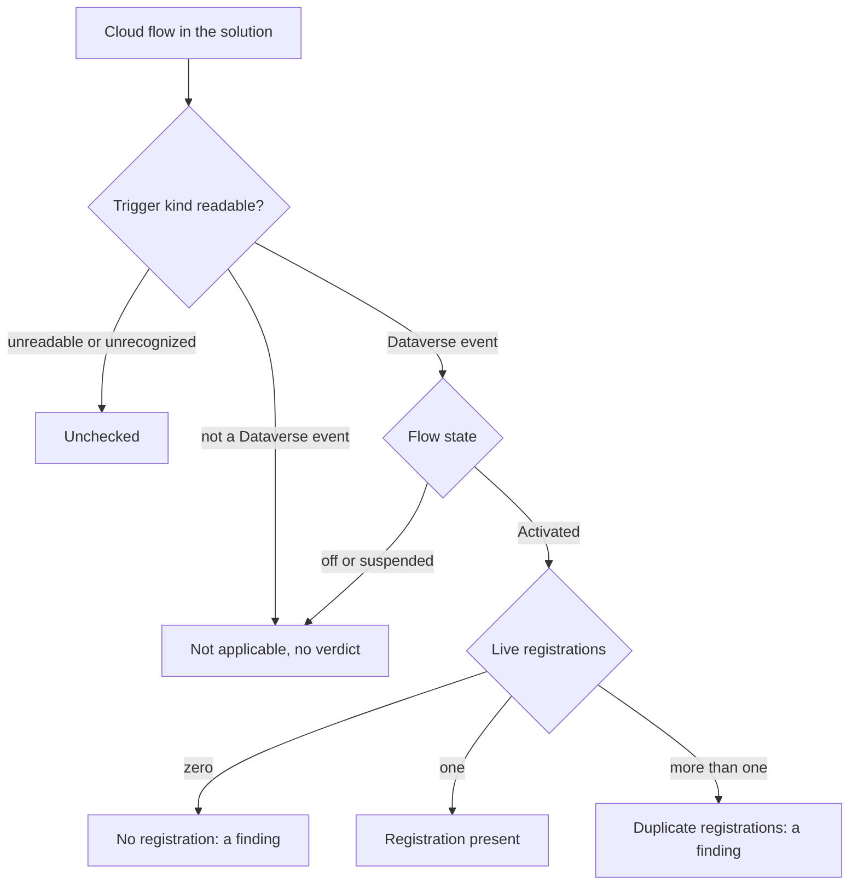
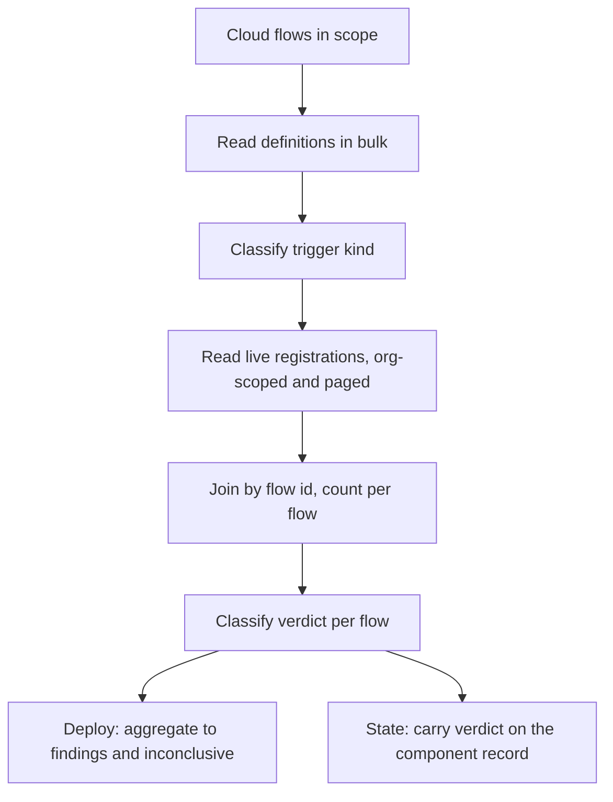

# Flow Trigger Registration Check - Plan

## Goal Capsule

- **Objective:** A user can tell, without opening the maker portal and without guessing, whether a cloud flow that reports itself as on still holds the Dataverse registration it needs in order to fire. Today a flow can sit in the Activated state with that registration missing, and nothing in the toolchain distinguishes it from a flow that is working. The check reports registration state; it is one of several documented conditions a flow needs to run, so it never claims the flow will execute.
- **Product authority:** This plan owns detection and reporting only. Repairing a flow, and any comparison axis other than live environment state, are out of scope and named in Scope Boundaries.
- **Means:** Read each flow's stored definition to find the Dataverse-triggered ones, read their callback registrations, and report the mismatch through the deploy pipeline's existing post-import check seam and the existing flow-state readout (KTD4).
- **Execution profile:** Read-only against Dataverse. The check writes nothing, so it needs no confirmation gate, no `--force` specifier and no `--dry-run` of its own.
- **Stop conditions:** Stop and ask if implementation finds that a flow's trigger cannot be classified without parsing the whole definition into a typed model, or that callback registrations cannot be read org-wide within the query bounds R12 sets. Both would change the cost shape the plan assumes.
- **Open blockers:** None. Registration-recreation timing is assumed synchronous and recorded as an assumption; U5 measures it and U6 is held contingent on that measurement.
- **Tail ownership:** This plan ends at a merged change with tests, docs and changelog. It does not ship a release.

---

## Product Contract

**Product Contract preservation:** unchanged. Planning added the Planning Contract, Implementation Units, Verification Contract and Definition of Done below; no R, A, F or AE ID changed meaning, and no Key Decision was rewritten.

### Summary

Flowline learns to detect cloud flows that are activated but have lost the Dataverse registration they need in order to fire, and reports them in the two places a user already looks: as a post-import finding on `deploy`, and inline when reading flow state through `settings state`. Detection reads each flow's own trigger to find the Dataverse-triggered ones, then checks whether each still holds exactly one live callback registration. Flowline never writes to the flow; it names the remedies it already implements.

### Problem Frame

A solution import carries structure, not state. Dataverse holds a cloud flow's Dataverse trigger as a separate subscription row rather than as part of the flow record, and that row can go missing while the flow record still reads Activated. The flow then looks correct everywhere a person would think to check, including the maker portal, and silently receives nothing.

The failure has been hit in practice on this project. The tell was indirect: work that should have been triggered simply did not happen. The remedies that sometimes worked were turning the flow off and on, and deploying again. "Sometimes" is the shape of the problem. Off-and-on only fixes the case where the subscription was genuinely missing, so every time it did not help, the time was spent on a cause that was never the cause, with no way to separate the two. A user with no way to read the subscription is left toggling flows and hoping.

Microsoft documents the diagnostic and the remedy on its known-issues page, and documents nothing that surfaces the condition proactively. Detection is the missing half: knowing the subscription exists is what turns "try toggling it" into "this is not that bug, look elsewhere."

### Key Decisions

- KD1. **Report, never repair.** (session-settled: user-directed — chosen over auto-repair on deploy and a flag-gated repair: deactivating and reactivating a flow in PROD kills anything mid-run and can reset its run-as context, which is too large a side effect for a diagnostic to take on its own initiative.) Governs R5.
- KD2. **The verdict comes from the flow's own trigger, not from the absence of rows.** (session-settled: user-directed — chosen over flagging every activated flow with no registration: flows triggered by a schedule, an HTTP call, or a non-Dataverse connector legitimately have none, and would otherwise be permanent false findings.) Governs R1, R3.
- KD3. **Two existing surfaces, no new command.** (session-settled: user-directed — chosen over deploy-only, `settings state`-only, and adding a dedicated check command: deploy answers "is anything unregistered after this import" and `settings state` answers "is this flow registered right now", and a user needs both.) Governs R7, R10, R11.
- KD4. **Flows needing attention are called out; healthy flows render exactly as they do today.** (session-settled: user-directed — chosen over a wiring column on every row: the column would read as fine on nearly every row and would make non-Dataverse triggers into permanent visible noise.) A flow with no registration, a flow with duplicate registrations, and an unchecked flow each carry their own marker; only healthy flows render unchanged. Governs R11.
- KD5. **Reuse the existing post-import finding and exit-code machinery rather than introducing a code of its own.** The deploy path already resolves an exit code from post-import outcomes by precedence and already distinguishes "found problems" from "could not verify". Governs R8, R9.
- KD6. **The report names a condition, not a diagnosis.** A flow can be activated, Dataverse-triggered, and unregistered for more than one reason, and the causes have different remedies. Prescribing a single remedy would send a user into the toggle-and-hope loop this feature exists to end. Governs R5.
- KD7. **A duplicate registration is a finding.** Microsoft states that each Dataverse row-event trigger creates exactly one callback registration, and documents duplicates as a cause of duplicate triggering with a remedy of their own. More than one row is therefore an anomaly by the platform's own rule, not an oddity worth only a count. This project has not observed one, so the decision rests on the documented rule rather than on local evidence. Governs R4.

- KD8. **Only the Activated state earns a verdict.** (session-settled: user-directed — chosen over checking suspended flows too and over reporting them as unchecked: a suspended flow already announces itself, and if suspension clears the registration then checking it turns every suspended flow into a guaranteed finding.) Governs R3.

The verdict is a four-way decision over two inputs, not a boolean:

### Actors

- A1. **Consultant at a terminal.** Runs `deploy` and reads the result, or reaches for `settings state` when a flow is behaving oddly. Gets a picker when naming no flow.
- A2. **Unattended agent or CI job.** Runs the same commands non-interactively, reads the exit code rather than the rendered output, and gets a list rather than a picker.

### Requirements

**Detection**

- R1. For each cloud flow in the target solution, Flowline determines whether the flow is triggered by a Dataverse row event, by reading the flow's own stored definition against an enumerated list of recognized Dataverse trigger shapes. A flow on a recognized non-Dataverse trigger produces no verdict. A definition that is readable but matches no entry in either list, or that carries more than one trigger, is reported as unchecked rather than silently excluded.
- R2. For each Dataverse-triggered cloud flow in the Activated state, Flowline reads that flow's live callback registrations and counts those that are not soft-deleted. The registration is matched to its flow by an identifier join whose validity has been confirmed for one registration version; a flow whose registrations carry a version the join has not been validated against is reported as unchecked, never as missing a registration.
- R3. A Dataverse-triggered cloud flow that is Activated and has zero live registrations is reported as having no registration, and counts as a finding. The check reports registration state only, and never states that a flow with a registration will run. Only the Activated state earns a verdict: a flow that is off or suspended produces none, because neither state carries an expectation of a live registration.
- R4. When a flow has more than one live registration, Flowline reports the count and treats it as a finding. The report names the documented remedy for duplicates, which is to remove the extra rows or cycle the flow off and on.
- R5. This check never writes to a flow, and never asserts why a flow lost its registration. The report states the observed condition and names two causes to rule out: a subscription lost after an import, whose remedy is `flowline settings state <env> <flow> --off` followed by the same command with `--on`, and a trigger Dataverse refused to register, which that remedy cannot fix and which the maker portal's flow checker reports.
- R6. When Flowline cannot read a flow's trigger kind, or cannot read registrations, that flow is reported as unchecked. It is never reported as holding a registration, or as missing one, on incomplete information.

**Deploy reporting**

- R7. `deploy` runs the check after the import completes, alongside the other post-import checks. Each flow with no registration, and each flow with duplicate registrations, counts as one finding.
- R8. The check contributes findings to the existing post-import exit-code resolution and introduces no exit code of its own. It does not change the precedence by which a more specific outcome outranks a plain finding count.
- R9. A check that could not run reports itself as inconclusive rather than as clean.

**State reporting**

- R10. `settings state <env> <flow>` reports the flow's registration state alongside its on, off, or suspended state, so the two answers arrive together.
- R11. `settings state <env> --type flow` with no flow named carries three distinct markers, one for a flow with no registration, one for a flow with duplicate registrations, and one for an unchecked flow, and leaves healthy and not-applicable flows rendering as they do today. An unchecked flow is never presented as healthy. This holds in both forms the command takes: the list a non-interactive run prints, and the candidate labels the interactive picker shows.
- R12. Reading state for many flows uses a bounded number of queries rather than one round trip per flow, and states a payload ceiling for a listing run. Trigger classification reads flow definitions in bulk; the definition is the only place the trigger is stored, so the constraint is on how it is fetched, not on whether it is.

**Boundaries on propagation**

- R13. A registration verdict is never written into a settings file by `settings pull`, and `settings push` never treats it as configuration to apply. It is a fault report, not environment state a user would want committed.

### Key Flows

- F1. Deploy surfaces an unregistered flow after an import
  - **Trigger:** A1 or A2 runs `flowline deploy prod` and the import succeeds.
  - **Steps:** The post-import check classifies each cloud flow's trigger, reads registrations for the Dataverse-triggered ones that are Activated, and reports each flow with none and each flow with more than one.
  - **Outcome:** The run names each flow found without a registration after the import, and states that it reports current state without attributing the condition to this deployment. A2 sees a non-zero exit code; A1 sees the findings in the deploy summary.
  - **Covers R7, R8, R5.**
- F2. Consultant diagnoses a suspect flow
  - **Trigger:** A1 suspects a specific flow is not firing and runs `flowline settings state prod ApprovalFlow`.
  - **Steps:** Flowline reports the flow's activation state and its registration state together.
  - **Outcome:** Either the flow has no registration, and A1 gets the condition plus both causes to rule out, or it has one, and A1 knows the registration is not what is wrong and stops toggling. The second outcome is the one that saves the most time.
  - **Covers R10, R5.**

### Acceptance Examples

- AE1. **Covers R3, R5.** Given a Dataverse-triggered flow in the Activated state with zero live registrations, when the check runs, then the flow is reported as having no registration, counts as one finding, and the report names both causes to rule out without choosing between them.
- AE1b. **Covers R5.** Given a flow whose trigger Dataverse refused to register because the trigger is misconfigured, when the check runs, then it reports the same no-registration condition and names the same two causes as every other case, without identifying which one applies.
- AE2. **Covers R1.** Given a recurrence-triggered flow in the Activated state with zero registrations, when the check runs, then no verdict is produced and the flow appears in no report.
- AE3. **Covers R2, R3.** Given a Dataverse-triggered flow that is off, when the check runs, then no verdict is produced, because a flow that is off is not expected to hold a registration.
- AE4. **Covers R3.** Given a Dataverse-triggered flow that suspended itself and has zero live registrations, when the check runs, then no registration verdict is produced. The suspended state is already the signal, and the readout reports it as it does today.
- AE5. **Covers R4.** Given a Dataverse-triggered flow in the Activated state with two live registrations, when the check runs, then the count is reported, the flow counts as a finding, and the report names removing the extra row or cycling the flow as the remedy.
- AE6. **Covers R6, R9.** Given a flow whose trigger kind cannot be read, when the check runs on `deploy`, then that flow is reported as unchecked and the check reports itself inconclusive rather than clean.
- AE6b. **Covers R1.** Given a flow whose definition is readable but carries a trigger shape on neither recognized list, when the check runs, then the flow is reported as unchecked rather than excluded as not-applicable.
- AE6c. **Covers R2.** Given a Dataverse-triggered flow whose registrations carry a version the identifier join has not been validated against, when the check runs, then the flow is reported as unchecked and never as missing a registration.
- AE7. **Covers R11.** Given an environment where one of twelve flows has no registration, when A1 runs `settings state <env> --type flow`, then the eleven healthy flows render as they do today and the twelfth carries the no-registration marker, distinct from the marker an unchecked flow would carry.
- AE8. **Covers R13.** Given an environment with an unregistered flow, when A1 runs `settings pull`, then the resulting settings file carries the flow's declared state and no registration verdict.

### Scope Boundaries

- Repairing a flow, on deploy or on demand. The remedy is named, not performed.
- `drift`. It compares local solution content against an environment; wiring is runtime health on a different axis.
- `diff`. Its boundary is git history with no environment involved.
- Settings files, in either direction, per R13.
- Classic workflows, business rules, business process flows, actions, and plugin steps. Callback registrations are a cloud-flow mechanism; the other kinds sharing the `workflow` table do not make them in scope.
- A dedicated command for the check.
- Any claim about what causes a registration to go missing. The check reports the state, not the cause.

### Dependencies and Assumptions

- Detection depends on a flow's trigger kind being readable from data Flowline can already reach. Nothing in the current codebase reads a flow's stored definition, so this is new reach into an existing table rather than a new integration.
- The off-then-on remedy already exists as a Flowline operation, so the report can name a command rather than describe a portal click path.
- Assumed: registration recreation during a solution import completes before the post-import checks run. Unmeasured. See Outstanding Questions.

### Outstanding Questions

**Resolve Before Planning**

- Whether registration recreation during an import is synchronous. If it is not, `deploy` reports flows as unregistered while they are still being registered, and every deploy touching a Dataverse-triggered flow returns a findings exit code. An unattended agent would read that as a partial failure on every run. The assumption in this plan is that recreation is immediate, based on recall rather than measurement. Measure it the way import payload sizes were measured for the missing-component check. If the answer is asynchronous, the async case needs a requirement of its own: R9 covers a check that could not run, which is a different condition from a check that ran too early, and reusing it would leave the real case uncovered. The shape that requirement should take: deploy rechecks the affected flows within a bounded window after import and classifies only the final observation, so a registration still being recreated never reports as missing.

**Deferred to Planning**

- The exact parameter path that carries a Dataverse trigger's table and message inside the trigger definition. The trigger type and operation are at a stable, shallow path, but the table and message names were not at the path probed during this brainstorm, and R12's payload bound depends on reading as little as possible.
- Whether a Dataverse trigger can present under any operation other than the one observed, and whether a flow can hold more than one trigger.
- Whether the report should distinguish the two cause classes rather than naming both. The one observed rejection was detectable from the trigger definition alone: a create-only change type carrying a column filter. Encoding platform validation rules into Flowline is a maintenance liability and the full rule set is unknown, so R5 currently names both causes and chooses between them for neither. Revisit only if a small, stable set of rejection rules turns out to cover most real cases.
- Whether registrations for many flows are read in one query or a small number of them, satisfying R12.
- The exact wording of the no-registration and duplicate-registration reports on each surface, against `docs/tone-of-voice.md`.
- How an unchecked flow renders on the `settings state` surface, where there is no findings count to carry it.

### Sources and Research

- Microsoft, "Troubleshoot known issues with Dataverse", Flow triggering multiple times: https://learn.microsoft.com/power-automate/dataverse/known-issues#flow-triggering-multiple-times. Documents duplicate callback registrations as a cause of duplicate triggering, and names deleting the extra rows or cycling the flow as the remedy.
- Microsoft, "Understand callback registration for Dataverse triggers": https://learn.microsoft.com/power-automate/dataverse/powerautomate-callbackregistration-flow. States that each row-event trigger creates exactly one callback registration, that turning a flow on creates it and turning it off removes it, and that a flow does not trigger when the registration is missing or invalid.
- Microsoft, "Troubleshoot known issues with Dataverse", Flow not triggering: https://learn.microsoft.com/power-automate/dataverse/known-issues#flow-not-triggering. Documents the diagnostic query, that no rows means the registration is missing, and that the remedy is turning the flow off and back on.
- Microsoft, Callback Registration table reference: https://learn.microsoft.com/power-apps/developer/data-platform/reference/entities/callbackregistration. Confirms the table is readable through ordinary retrieve and query operations, and that only rows with a soft-delete status of zero are active. It also carries a version picklist with three values, so the correlation question below should be sampled across several flows of different vintages rather than settled off a single row.
- `src/Flowline.Core/Services/IPostDeployService.cs:44-53` — the post-import extension point and the outcome shape carrying findings, an inconclusive flag, and a preferred exit code.
- `src/Flowline/Commands/DeployCommand.cs:829-838` — post-import exit-code resolution and its precedence, which R8 commits to leaving unchanged.
- `src/Flowline.Core/Configure/ComponentStateWriter.cs:132-150` — the existing off-and-on write for cloud flows, which is the remedy R5 names.
- `src/Flowline.Core/Configure/SolutionComponentInventory.cs:361-368, 460-472` — the existing read of flow rows and state, and the precedent for surfacing a third state distinct from the on-or-off boolean.
- `src/Flowline/Commands/SettingsComponentCommands.cs:126-156` — the split between the list a non-interactive run prints and the picker an interactive run shows, which R11 has to cover on both paths.
- Verified absent as of this plan: nothing in `src/` reads a flow's stored definition, and nothing queries the callback registration table.
- Verified against a live environment on 2026-09-14, sampling every activated cloud flow in one Dataverse organization:
  - A callback registration's name column holds the flow's `workflowid` verbatim. Five sampled registrations joined to five flows with an exact match. The correlation is an id join, not a name match. Every sampled row was version V1, so the join has not been observed across other versions.
  - A flow's stored definition is readable through an ordinary query, so R1 needs no new transport.
  - A Dataverse row-event trigger presents as a webhook-subscription trigger type paired with a subscribe operation, and is distinguishable from a recurrence trigger and a manual or request trigger by the trigger type alone.
  - A flow can be activated, Dataverse-triggered, and unregistered because Dataverse refused the registration, not because one was lost. One of the two flows found in this state had an invalid trigger: a create-only change type combined with a column filter, which the platform rejects and the maker portal's flow checker reports as an error. Off-then-on does not fix that case. This is the reason R5 reports a condition rather than prescribing a remedy.
  - The two cause classes were separable from the trigger definition in the observed pair. Both triggers were create-on-organization-scope; the rejected one additionally carried a column filter, which is the combination the platform refuses. The other was well formed, making it a lost subscription rather than a rejected one. That flow was then confirmed in the maker portal: the platform's own flow checker reported no errors and no warnings, its status was on, and its 28-day run history was empty. A valid trigger, an activated flow, no subscription, and no runs. Both cause classes have a confirmed live specimen, and the detection rule separated them correctly.
  - Of fourteen activated cloud flows, ten held a registration and four did not. Two of the four were legitimately registration-free, one on a recurrence trigger and one on a manual trigger, which is the false-positive class KD2 exists to avoid. The other two carried Dataverse row-event triggers with zero live registrations, matching the condition R3 defines. Nothing else in the toolchain flagged either of them.

---

## Planning Contract

### Key Technical Decisions

- KTD1. **Classification is a pure function, separate from every Dataverse read.** Trigger kind and the four-way verdict are decided by functions that take already-fetched values and return an enum. This mirrors how workflow state is already classified apart from the query that fetches it (`src/Flowline.Core/Configure/SolutionComponentInventory.cs:460-472`), and it is what makes the verdict tree table-testable with no connection. Governs R1, R3, R4.
- KTD2. **Registrations are read with `RetrieveAllAsync`, never `RetrieveMultipleAsync`.** The registration read is org-scoped rather than solution-scoped, so it is exactly the shape that silently truncates at one page. The repo has a documented incident and a paging extension for this (`docs/solutions/logic-errors/retrieve-multiple-async-silent-truncation-2026-05-29.md`, `src/Flowline.Core/Services/DataverseExtensions.cs`). A truncated read would report healthy flows as unregistered, the same false-positive class KD2 exists to prevent. Governs R12.
- KTD3. **The registration-to-flow join reads the flow id out of the registration's name column, and is version-gated.** Confirmed on live data for one registration version; any other version routes to unchecked rather than to a verdict. Governs R2.
- KTD4. **The deploy surface is a new post-deploy service on the existing seam, registered last.** It implements the two-hook interface with a no-op pre-import half, mirroring the plugin-package assembly check (`src/Flowline.Core/Deploy/PluginPackageAssemblyCheckService.cs:41-81`). Registering last means it observes the state the deploy actually leaves behind, the rationale already recorded for that service (`src/Flowline/Program.cs:249-279`). It contributes findings and an inconclusive flag only, adding no `ExitCode` member. Governs R7, R8, R9.
- KTD5. **The verdict rides on the shared component inventory record as a nullable field, populated only for cloud flows.** It follows the convention already used there for fields that apply to one component class and are null for every other (`src/Flowline.Core/Configure/SolutionComponentInventory.cs:159-170`), keeping one read path for the state command instead of a parallel lookup. The verdict computation is gated on the requested component kinds: the definition and registration reads run only when cloud flows are in scope. Without that gate the shared inventory read, which every settings command calls unfiltered (`src/Flowline/Commands/SettingsCommandBase.cs:181-185`), would charge an org-wide registration scan to `settings value` on a single environment variable. (session-settled: user-approved — chosen over a separate registration lookup used only by the state command: one read path, at the cost of a field the other settings commands carry without reading.) Conflict found during planning research: the shared read path is unfiltered, so the decision holds only with the kind gate above; without it the cost falls on every settings command, not just the state command. Governs R10, R11.
- KTD6. **Degradation is per flow, not per run.** A fault reading one flow's definition or registrations marks that flow unchecked and continues, using the existing fault-tolerance wrapper (`src/Flowline.Core/OrphanCleanup/DataverseFaultTolerance.cs:15-33`). A fault that takes down the whole check is caught at the service boundary and reported inconclusive. One bad flow must not cost the verdict on the others. Governs R6, R9.
- KTD7. **The flow definition is parsed with the read-only JSON document API, reading only the trigger node.** The repo uses `System.Text.Json` exclusively and already uses this read-only shape to pull a few fields out of an unmodeled payload (`src/Flowline.Core/Services/DataverseConnector.cs:492`). Modeling the whole flow definition would couple Flowline to a schema Microsoft changes freely. Governs R1.
- KTD8. **Timing is assumed synchronous, measured once, and the recheck is held contingent.** (session-settled: user-directed — chosen over building the bounded recheck unconditionally, over cutting the deploy surface from this plan, and over returning to brainstorm: it keeps the simplest shipping path and defers work that may prove unnecessary.) Governs R7.

### High-Level Technical Design

The check is a five-stage pipeline. The first four stages are shared by both surfaces; only the last differs.

Stages B and D are the only Dataverse round trips, and both are bulk. Stages C and F are pure. The split at the end is what lets one engine serve a post-import check and a command readout without either surface owning the logic.

Directional only. The stage names are not class names, and the implementer chooses the decomposition.

### Assumptions

- Registration recreation during a solution import completes before post-import checks run. Unmeasured. U5 measures it; U6 is the contingency.
- The registration-to-flow join holds for registration versions beyond the one sampled. Unverified, and R2 fails safe to unchecked rather than assuming it.
- A flow definition's trigger node is reachable without parsing the full definition into a typed model. Supported by the live sample; a stop condition if it proves false.

### Sequencing

U1 and U2 are the engine and land first, in that order. U3 and U4 are the two surfaces and are independent of each other once U2 exists. U5 runs against a real environment after U4 is usable. U6 fires only if U5 says asynchronous. U7 follows the surfaces.

## Implementation Units

### U1. Verdict model and classification functions

- **Goal:** Decide a flow's trigger kind and its registration verdict as pure functions, with no Dataverse access.
- **Requirements:** R1, R3, R4 (KTD1).
- **Files:** new source under `src/Flowline.Core/Configure/`; new test file at the mirrored path under `tests/Flowline.Core.Tests/Configure/`.
- **Approach:** One function maps a trigger definition node to a trigger kind over an enumerated list of recognized Dataverse row-event shapes and recognized non-Dataverse shapes, returning an unrecognized result for anything else. A second function maps trigger kind, activation state, registration count and join-version validity to the verdict. Model the verdict as an enum covering not-applicable, unchecked, no-registration, duplicate-registration and registration-present. Follow the existing pure-predicate style in the component inventory rather than introducing a class hierarchy.
- **Test scenarios:** A recognized Dataverse row-event trigger classifies as Dataverse-triggered. Recurrence and manual triggers classify as non-Dataverse. An unrecognized trigger shape classifies as unrecognized. A definition carrying two triggers classifies as unrecognized. Activated plus zero registrations yields no-registration. Activated plus one yields registration-present. Activated plus two yields duplicate-registration. Off and suspended each yield not-applicable regardless of count. A non-Dataverse trigger yields not-applicable regardless of count. An unvalidated join version yields unchecked even when the count is zero. An unrecognized trigger yields unchecked.
- **Verification:** `dotnet test tests/Flowline.Core.Tests/Flowline.Core.Tests.csproj --filter FullyQualifiedName~Configure` passes, with the verdict table covered as theory rows.

### U2. Flow definition and callback registration reads

- **Goal:** Fetch the inputs U1 classifies, in bulk, for a set of cloud flows.
- **Requirements:** R2, R6, R12 (KTD2, KTD3, KTD6, KTD7).
- **Files:** new reader source under `src/Flowline.Core/Configure/`; new test file at the mirrored path under `tests/Flowline.Core.Tests/Configure/`.
- **Approach:** One method reads flow rows with their stored definition for a bounded set of flow ids, honoring the existing in-clause limit guard before building the query. A second reads live callback registrations org-scoped, filtered to not-soft-deleted, paged through the existing paging extension. Join in memory by flow id and return a per-flow count plus the registration version seen. State the payload ceiling R12 requires: record the registration page size and the flow-id in-clause limit inline at the read call site, with the date, following the same convention U5 uses for its measured value. Parse only the trigger node out of each definition with the read-only JSON document API. Wrap each per-flow parse so a malformed definition marks that flow unchecked instead of failing the batch.
- **Test scenarios:** A registration set spanning two pages returns rows from both pages. A flow with no matching registration returns a count of zero. A flow with two matching registrations returns a count of two. A soft-deleted registration is excluded from the count. A malformed definition marks that flow unchecked and leaves the other flows in the batch classified. An id set above the in-clause limit is rejected by the existing guard before a query is issued. A registration carrying an unvalidated version surfaces that version so U1 can route it to unchecked.
- **Verification:** `dotnet test tests/Flowline.Core.Tests/Flowline.Core.Tests.csproj --filter FullyQualifiedName~Configure` passes. Paging is proven by a faked first response reporting more records and a second that does not. The stated page size and in-clause limit are present at the call site, satisfying both clauses of R12.

### U3. Flow-state readout

- **Goal:** Report registration state in `settings state`, for a named flow and in the listing, without changing how healthy flows render.
- **Requirements:** R10, R11, R13 (KTD5); honors AE7.
- **Files:** `src/Flowline.Core/Configure/SolutionComponentInventory.cs`, `src/Flowline.Core/Configure/SingleComponentService.cs`, `src/Flowline/Commands/SettingsComponentCommands.cs`, `src/Flowline/Commands/SettingsCommandBase.cs` (the shared inventory read gains the kind scope).
- **Approach:** Add the verdict as a nullable field on the shared component record, populated only for the cloud-flow class and null elsewhere, following the convention already used there for class-specific fields. Pass the requested component kinds into the shared inventory read so the definition and registration reads fire only when cloud flows are in scope; the read is currently unfiltered and shared by every settings command, so an ungated verdict would charge an org-wide scan to commands that never address a flow. Extend the glyph and text renderers with a marker for no-registration, one for duplicate registrations, and one for unchecked, leaving the existing on, off and suspended rendering untouched. Both the printed list and the picker candidate labels route through the same renderers, so one change covers both. Append registration state to the single-flow read text. Leave the settings-file read and write paths untouched so R13 holds by construction.
- **Test scenarios:** A settings read that requests only environment variables issues no definition read and no registration query. A settings read that requests cloud flows issues both. A flow with no registration renders its marker in the list. A duplicate-registration flow renders a different marker. An unchecked flow renders a third. A healthy flow renders exactly as before the change. A non-flow component renders unchanged and carries a null verdict. The single-flow read reports activation state and registration state together, and a no-registration result names both causes to rule out. A settings file written from an environment holding an unregistered flow contains no verdict field.
- **Verification:** `dotnet test Flowline.slnx` passes. Run the built CLI from a Release build against a real environment and confirm the list marks the known unregistered flow and leaves the other flows unchanged.

### U4. Deploy post-import check

- **Goal:** Report unregistered and duplicate-registration flows as findings after an import.
- **Requirements:** R7, R8, R9 (KTD4, KTD6); honors F1, AE1, AE5, AE6.
- **Files:** new service under `src/Flowline.Core/Deploy/`, registered in `src/Flowline/Program.cs`; new test file under `tests/Flowline.Core.Tests/Deploy/`.
- **Approach:** Implement the post-deploy interface with a no-op pre-import half. In the post-import half, resolve the solution's cloud flows, run U2 then U1, and aggregate per-flow results into one outcome carrying a findings count and an inconclusive flag, with no preferred exit code so the existing precedence resolves it. Wrap the whole body so an unexpected fault degrades to inconclusive rather than failing the deploy, matching the plugin-package assembly check. Register the service last in the post-deploy registration method with a one-line rationale comment, as that method's existing entries do. Report each finding with the flow's display name, never a bare id, and state that the check reports post-import state without attributing cause.
- **Test scenarios:** One unregistered flow yields one finding. Two unregistered flows yield two findings. A duplicate-registration flow yields one finding. A clean environment yields a clean outcome. A flow that cannot be classified yields an inconclusive outcome rather than a clean one. A no-registration finding's text names both causes to rule out, per R5. A duplicate-registration finding's text names the remove-or-cycle remedy, per R4. A Dataverse fault during the registration read yields inconclusive, not a thrown deploy failure. The outcome carries no preferred exit code, so a findings count resolves through the existing precedence. Findings render display names, not ids.
- **Verification:** `dotnet test tests/Flowline.Core.Tests/Flowline.Core.Tests.csproj --filter FullyQualifiedName~Deploy` passes. Confirm exit code 18 on a findings run and 19 on an inconclusive run using a Release build.

### U5. Measure registration-recreation timing

- **Goal:** Settle whether Dataverse recreates callback registrations before post-import checks run.
- **Requirements:** R7 (KTD8). Resolves the first assumption above.
- **Files:** this plan's Assumptions section, and an inline comment at the check's call site carrying the measured value and the date.
- **Approach:** Against a non-production environment holding at least one Dataverse-triggered flow, import the solution and read callback registrations immediately after the import returns, then again at intervals until stable. Record the observed gap. Follow the convention the missing-component check used for its live payload timings: measured value, date and method recorded inline at the code that depends on it (`src/Flowline.Core/Deploy/MissingComponentCheckService.cs:21-25`).
- **Test scenarios:** Not feature-bearing. Test expectation: none — this unit produces a recorded measurement, and the behavior it gates lives in U6.
- **Verification:** The measured gap and its date are written into this plan's Assumptions and into the call-site comment. U6 is either cancelled or scheduled on the result.

### U6. Bounded post-import recheck (contingent on U5)

- **Goal:** Stop a still-being-recreated registration from reporting as missing.
- **Requirements:** R7, R9 (KTD8). Build only if U5 measures recreation as asynchronous.
- **Files:** the service from U4 and its test file.
- **Approach:** Recheck the affected flows within a bounded window after the import and classify only the final observation. Follow the instance-level poll-knob pattern the plugin-package assembly check already uses, so tests set fast values rather than mocking delays.
- **Test scenarios:** A flow unregistered on the first read and registered within the window yields no finding. A flow unregistered for the whole window yields one finding. The window is bounded, so a permanently unregistered flow does not hang the deploy. Poll knobs are settable so the test runs fast.
- **Verification:** `dotnet test tests/Flowline.Core.Tests/Flowline.Core.Tests.csproj --filter FullyQualifiedName~Deploy` passes. Skip this unit and record why if U5 measures recreation as synchronous.

### U7. Documentation

- **Goal:** Land the user-facing documentation the project's done-definition requires.
- **Requirements:** none directly; required by the repo's definition of done for a user-facing behavior change.
- **Files:** `CONCEPTS.md`, `CHANGELOG.md`, the wiki command-reference page, and `src/Flowline/Program.cs` if the state command's description changes.
- **Approach:** Add a `CONCEPTS.md` entry for callback registration using the platform's own vocabulary, per `docs/solutions/conventions/match-platform-vocabulary-for-new-domain-concepts.md`, covering what the row is, the one-per-trigger rule, and what its absence and its duplication each mean. Update the wiki command-reference page for the state command and the deploy check, reading the wiki repo's own agent instructions first since its rules differ from this repo's. Add a changelog entry. Review every new user-facing string against `docs/tone-of-voice.md`.
- **Test scenarios:** Not feature-bearing. Test expectation: none — documentation only.
- **Verification:** The glossary entry, wiki page and changelog entry exist and describe behavior that matches the shipped code. If the wiki checkout is unavailable on this machine, report that rather than skipping it silently.

## Verification Contract

| Gate | Command | Applies to |
|---|---|---|
| Restore | `dotnet restore Flowline.slnx` | all units |
| Build | `dotnet build Flowline.slnx` | all units |
| Core tests | `dotnet test tests/Flowline.Core.Tests/Flowline.Core.Tests.csproj` | U1, U2, U3, U4, U6 |
| Full suite | `dotnet test Flowline.slnx` | before finishing; the component record change is cross-cutting |
| CLI output | `dotnet build -c Release`, then run the built CLI | U3, U4 |

**A Release build is required for any check of user-facing output, wording or exit codes.** A Debug build propagates exceptions and prints a raw stack trace instead of the rendered error, so correct error handling looks broken (`docs/solutions/developer-experience/debug-build-hides-the-real-cli-error-output.md`).

Quality gates: no new `ExitCode` member is added; the existing post-import precedence is unchanged; every new user-facing string has been reviewed against `docs/tone-of-voice.md`.

## Definition of Done

Global:

- Every unit's own verification passes, and the full suite passes.
- No new `ExitCode` member, and no change to the post-import exit-code precedence.
- The check writes nothing to Dataverse on any path.
- `CONCEPTS.md`, the changelog and the wiki command reference are updated, or the wiki checkout is reported unavailable.
- Abandoned approaches are removed from the diff. Nothing experimental ships.
- Unrelated working-tree changes are preserved.

Per unit:

- U1: the verdict table is covered by table tests, including both fail-safe rows (unvalidated version, unrecognized trigger).
- U2: paging is proven across two pages, and a malformed definition is proven not to fail its batch.
- U3: a healthy flow's rendering is proven unchanged, and no verdict reaches a settings file.
- U4: findings and inconclusive both resolve through the existing precedence, and a Dataverse fault does not fail the deploy.
- U5: the measured value and its date are recorded in this plan and at the call site.
- U6: built only if U5 measured asynchronous recreation; otherwise cancelled with the reason recorded.
- U7: every documented behavior matches the shipped code.
