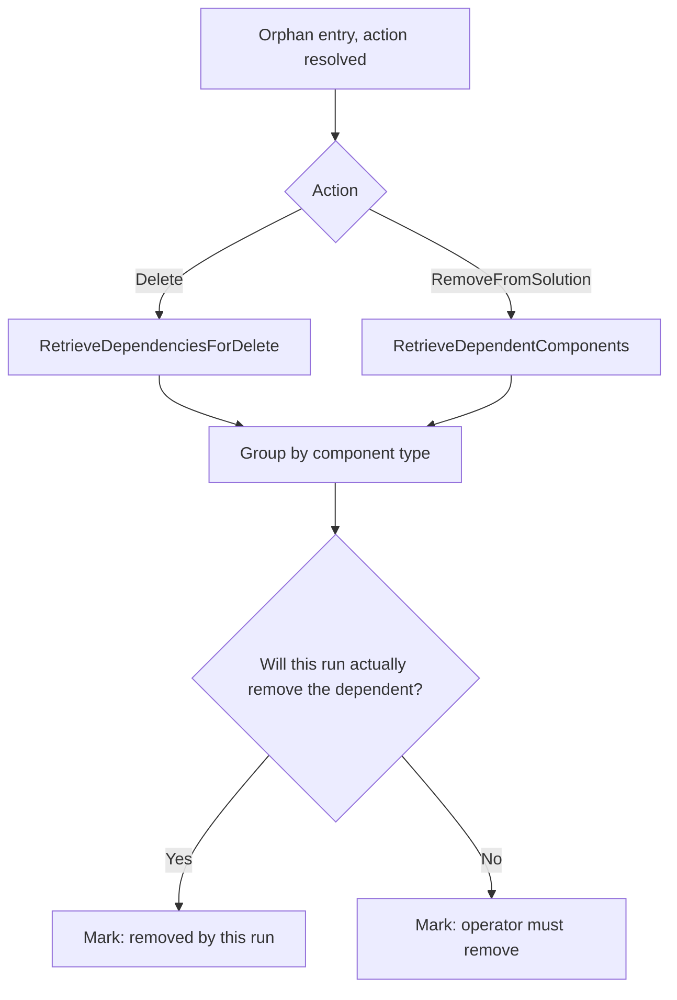

# Orphan Dependency Reporting - Plan

## Goal Capsule

- **Objective:** When Flowline reports an orphan component it is about to remove, the operator learns everything blocking that removal in one pass, instead of discovering the blockers one at a time across successive deploys. Blockers this run will remove clear on their own; the rest are named as the operator's to remove before the next deploy, and the removal itself can still fail until they do.
- **Product authority:** This plan owns dependency reporting for orphan cleanup entries of every component type, and the report and failure surfaces that render it. Dependency-derived execution ordering, `push`'s web resource sync path, a standalone inspect command, and deploy-time prediction of blocked deletes are not active scope.
- **Authority order:** A requirement wins on product behavior. A Key Decision wins on framing within its cited requirements.
- **Open blockers:** None.

---

## Product Contract

### Summary

Orphan cleanup asks Dataverse what still depends on every component it is about to remove, not only web resources, and reports the answer beside the entry. A delete is asked what would block it; a remove-from-solution is asked what references it. Each dependent says whether the same run will actually remove it.

### Problem Frame

A plugin assembly was deleted through a deploy and the delete failed, because plugin step registrations still pointed at it. Nothing in the output said which steps. The resolution was to delete the steps by hand, deploy, delete the assembly, and deploy again: two round trips to learn one fact Dataverse already knew.

Flowline can answer that question today, but only for one component type. `WebResourceDependencyChecker` (`src/Flowline.Core/WebResources/WebResourceDependencyChecker.cs:14`) asks Dataverse what blocks a delete, resolves each dependent's name, caps parallelism, and degrades a failed lookup to "unchecked" rather than "nothing depends on it". `OrphanEntry` already carries the result (`src/Flowline.Core/OrphanCleanup/OrphanCleanupService.cs:35`). The whole apparatus is gated behind a component type filter for 61.

Every other component type falls through to Dataverse's own error. A delete that faults on a dependency is deferred and retried after import (`src/Flowline.Core/OrphanCleanup/OrphanCleanupService.cs:916`); when the retry also fails, the operator gets `remove manually` and the raw fault text (`:921`). Neither names a single blocker. Plugin assemblies, workflows, forms, views, roles, and the site map all end there.

The second gap is the one that produced the original web resource bug. A remove-from-solution deletes nothing, so it never faults, so there is no error to attach a message to. The component survives in the current environment because another solution owns it, and the break surfaces one environment later.

### Key Decisions

- KD1. **Ask each path the question it actually faces.** (session-settled: user-approved - chosen over a single message for both paths: a remove-from-solution never deletes, so "what blocks the delete" is structurally the wrong question on exactly the path whose silence caused the original web resource bug.) Governs R1, R2.
- KD2. **Generalize the existing check rather than add a second mechanism.** (session-settled: user-directed - chosen over a standalone inspect command, a deploy-time prediction pass, and answering only after a failure: name resolution, fault degradation, the parallelism cap, and the carrier field already exist and are scoped only by a component type filter.) Governs R3.
- KD3. **Group dependents by component type in the default report.** (session-settled: user-approved - chosen over a flat list or a numeric overflow cap: an entity or global choice returns a dependency record per attribute, view, and form, and a bare "and 41 more" does not say what was cut.) Governs R6, R7.
- KD4. **Report, never block.** Carried unchanged from the web resource dependency check, whose KD3 settled it. Governs R9.
- KD5. **Say whether the operator has to act.** A dependent this run will actually remove needs nothing from the operator; one it will not does. Governs R8.
- KD6. **An unchecked entry stays distinguishable from a clean one.** Once every type is checked, component type no longer discriminates "never checked" from "lookup failed", so the distinction needs its own carrier. Governs R10.
- KD7. **`drift` pays the generalized cost unconditionally.** A read-only comparison that reports dependents for web resources only would answer a different question than the deploy it previews, and the request count tracks findings rather than solution size. Governs R12.

The action-to-message mapping KD1 sets:

### Requirements

**Detection**

- R1. Before an orphan entry is deleted, cleanup asks Dataverse which components would block that delete.
- R2. Before an orphan entry is removed from its solution, cleanup asks Dataverse which components reference it.
- R3. R1 and R2 apply to every component type orphan cleanup surfaces, not only web resources.
- R4. The check runs after the orchestrator has resolved delete against remove-from-solution, so each entry is asked the question matching the action it will actually take.
- R5. Entries the run reports but never executes are checked on the same terms as executed ones.

**Reporting**

- R6. The default report renders an entry's dependents grouped by component type, with a count per type.
- R7. Verbose output renders every dependent by name, falling back to its component type label and object id when the name cannot be resolved.
- R8. Each dependent states whether this run will actually remove it. Membership of the orphan set is not the test: an entry its handler only reports, or one held behind consent this run does not carry, stays put and is marked as the operator's. The mark reflects what the run's single deferred-retry pass clears, so a dependent needing more than one level of unblocking, or blocked from another handler family, can be marked as removed and still fail.
- R9. Dependents never block a removal, never change which entries execute, and never move an exit code.
- R10. An entry whose dependency lookup failed renders as unchecked, distinct from an entry that was checked and has no dependents.
- R11. When a delete still faults on a dependency, the failure message renders the dependents already resolved for that entry and issues no second lookup.

**Read-only surfaces**

- R12. `drift` pays one dependency request per finding of every component type, where today it pays one per web resource finding only. Its output follows R6 and R7.

### Key Flows

- F1. Blocked assembly delete
  - **Trigger:** A deploy's orphan cleanup finds a plugin assembly no longer declared in source.
  - **Steps:** The orchestrator resolves the entry to a delete. The check asks what blocks that delete and gets back plugin steps. Each step is checked against what this run will actually remove. The report names the entry, groups the blockers by type, and marks each as removed by this run or left to the operator. Execution proceeds unchanged.
  - **Outcome:** The operator learns in one run which steps hold the assembly and which of them they have to remove themselves.
  - **Covered by:** R1, R4, R6, R8, R9

- F2. Silent cross-environment reference
  - **Trigger:** Orphan cleanup finds a component another unmanaged solution also owns, so the entry resolves to a remove-from-solution.
  - **Steps:** The check asks what references the component. The references are reported against the entry. The removal succeeds, as it does today.
  - **Outcome:** The references that will be absent in the next environment are named before the deploy that exposes them.
  - **Covered by:** R2, R4, R6, R8

### Acceptance Examples

- AE1. **Covers R1, R8.** Given a plugin assembly orphan whose delete is blocked by three plugin steps, and two of those steps are entries this run will remove, when cleanup reports the assembly, then the two are marked as removed by this run and the third is marked as the operator's to remove.
- AE2. **Covers R8.** Given an orphan entry whose only dependent is an entry this run surfaces but never executes, because its handler reports rather than deletes, when cleanup reports the entry, then that dependent is marked as the operator's to remove, not as removed by this run.
- AE3. **Covers R2.** Given a web resource orphan another unmanaged solution owns, so the entry resolves to a remove-from-solution, when cleanup reports it, then the forms and ribbons referencing it are named even though nothing faulted.
- AE4. **Covers R6, R7.** Given an entity orphan with 40 dependents across attributes, views, and forms, when cleanup reports it, then the default report shows a count per component type, and verbose output names all 40.
- AE5. **Covers R10.** Given an entry whose dependency lookup fails, when cleanup reports it, then the entry reads as unchecked and is not reported as having no dependents.
- AE6. **Covers R9, R11.** Given a delete that faults on a dependency after its post-import retry, when the failure is reported, then it names the dependents already resolved for that entry, no second lookup is issued, and the run's exit code is the same as it is today.

### Scope Boundaries

- `push`'s web resource sync path keeps asking "what blocks the delete" on both its delete and its remove-from-solution buckets. That second one is the same structurally wrong question KD1 rejects, not a stylistic split: after this plan ships, the silent cross-environment break described in the Problem Frame is still reachable through `push`. Closing it needs a follow-on plan and is not this plan's to change.
- No new command, flag, or exit code. The dependency data rides the existing orphan report, verbose output, and failure messages.
- Per-dependent solution attribution is out. The case that motivated this work was blocked by the operator's own components, not by a foreign solution's.
- The limit R8 states on its own marking is accepted here, not solved. Closing it is the ordering work named below.

<!-- ce-section: work-relationships -->
### How This Work Fits Together

This plan owns reporting: asking Dataverse the right question per entry and rendering the answer. The breakdown below is the current understanding of the surrounding area, not a committed roadmap.

- Dependency-derived execution ordering
  - **Depends on** this plan, which produces the dependency data an ordering pass would sort on.
  - **Still to decide:** its value is narrower than it first appears. Within a family the order is already dependency-correct by declaration, so a derived sort would rederive the same sequence. Its real niche is across families, which neither the hardcoded family order nor the per-handler sequence hint can express.
- Standalone dependency inspect command
  - **Can proceed independently of** this plan, though it would reuse the same check.
  - **Shares** the grouping and marking behavior in R6 through R8.
- Deploy-time prediction of blocked deletes
  - **Depends on** this plan for the per-entry answer.
  - **Shares** a surface with the existing missing-component preflight.

### Outstanding Questions

**Deferred to Planning**

- The carrier for R10's unchecked state. The current field documents null as meaning either "not a web resource" or "lookup failed", disambiguated by component type; that disambiguation stops working once every type is checked.
- Whether the grouped and full renderings share one formatter across the orphan report, verbose output, and failure messages, or each surface renders its own.

### Sources / Research

- `src/Flowline.Core/WebResources/WebResourceDependencyChecker.cs:14` - the existing check, scoped to component type 61.
- `src/Flowline.Core/OrphanCleanup/OrphanCleanupService.cs:35` - `OrphanEntry.Dependents`, and the null-means-two-things comment R10 replaces.
- `src/Flowline.Core/OrphanCleanup/OrphanCleanupService.cs:470` - where the component type 61 filter gates the check today.
- `src/Flowline.Core/OrphanCleanup/OrphanCleanupService.cs:916` - dependency-fault deferral and the post-import `remove manually` dead end.
- `src/Flowline.Core/OrphanCleanup/Handlers/PluginAssemblyFamilyHandler.cs:36` - per-family sequence hints, deepest child first.
- `docs/plans/2026-08-12-001-feat-webresource-delete-dependency-check-plan.md` - the web resource check this generalizes, and the source of KD4.
- `CONCEPTS.md` - `Component dependency`, the canonical term for what these messages return.
- https://learn.microsoft.com/power-platform/alm/check-solution-dependencies - the four dependency messages and what each returns.
- https://learn.microsoft.com/power-apps/maker/data-platform/view-component-dependencies - the maker portal's Delete blocked by, Used by, and Uses tabs, which map to the messages in R1 and R2.

---

## Deferred / Open Questions

### From 2026-09-14 review

- **Deferred execution ordering may be what closes the objective, not a refinement** — How This Work Fits Together (P1, product-lens, confidence 75)

  A reader cannot tell how much of this plan's promise the deferred work carries. The case made for deferring dependency-derived execution ordering rebuts only the within-family situation, where the order is already correct by declaration, and concedes that blocking across handler families is real and unaddressed by anything shipping today. That is precisely the situation where a blocked removal cannot clear itself in a single run, so the deferred item may be the piece that delivers the objective rather than a later polish on it.

- **Unattended runs gain nothing from this work** — Goal Capsule (P2, product-lens, confidence 75)

  For a deploy nobody is watching, the run's outcome after this ships is identical to today: the same faults, the same exit code, and a human still has to open the log. The plan keeps dependents out of blocking and out of exit codes, and adds no machine-readable surface for them, so the value lands only on attended triage. Flowline's stated normal case is unattended, and its own agent-drivability guidance asks new output to be consumable headlessly, so whether this work needs a machine-readable form is unresolved.
