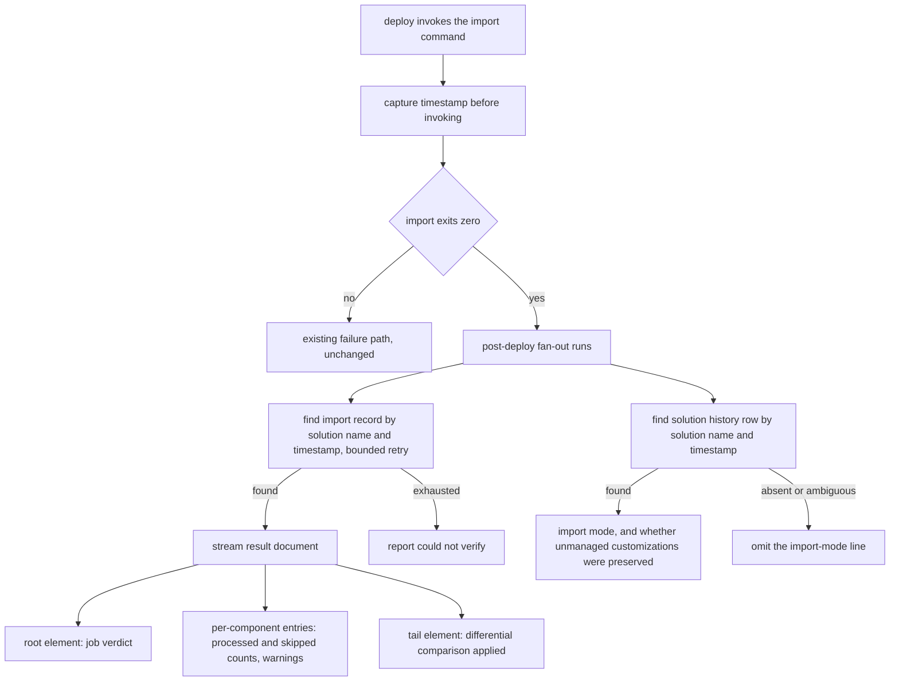

# Import Result Reporting - Plan

## Goal Capsule

- **Objective:** After a deploy, the user knows what the import did to the target environment from the terminal, and can see at a glance which environment last received a good deploy and when. Identifying which component a layer is masking still needs the admin center, since per-component layer inspection is out of scope (D4).
- **Means:** Read the import record the platform writes, and the solution history row beside it, after the import command returns (KTD1).
- **Product authority:** This plan owns import-result reporting on `deploy` and `status`. It supersedes the deferral recorded in `docs/plans/2026-07-04-001-feat-status-dashboard-grid-plan.md`, which parked the status-side import health badge because `status` had no Dataverse SDK path. That auth path is in scope here. Changing how the import runs is not in scope, only reporting what it did.
- **Product Contract preservation:** changed: R8, R9 - the user supplied a concrete display target (Power Platform Pipelines stage cards) after the brainstorm, which splits "last successful version" from "currently registered version" and adds relative age. R11 added for the outcome marker. All other Product Contract content unchanged.
- **Stop conditions:** Stop and ask if U1 shows the import record is not findable within the bounded retry, since that invalidates the correlation approach rather than degrading it. Stop if reading the import result requires a privilege the deploy principal does not hold in a normal environment.

---

## Product Contract

### Summary

`deploy` reports what the import engine did after a successful import: which components it applied, which it skipped, and whether it ran in a mode that left unmanaged layers standing over the solution's components. `status` gains a per-environment import health signal drawn from the same data, replacing version strings as the only evidence that a deploy landed.

### Problem Frame

A solution import can report complete success while leaving the target environment visibly unchanged. Microsoft documents this as the first cause of "changes aren't effective after solution import": an unmanaged customization sitting on the top layer keeps winning after the import writes a new value beneath it. The import did not fail, so there is nothing in an exit code to catch.

Flowline currently surfaces exactly that exit code. `deploy` shells `pac solution import` and checks whether the process returned zero (`src/Flowline/Commands/DeployCommand.cs:820-821`). Everything the platform recorded about the import is discarded: which components it processed, which it skipped because it judged them unchanged, and whether it ran in a mode that preserved unmanaged layers. Nothing in `src/` reads that data today.

The cost lands on the consultant mid-deployment. They have shipped to a client environment, the CLI said nothing was wrong, and the form still looks the way it did. The only way to find out what happened is a browser tab and the admin center, which is the workflow Flowline exists to remove.

`status` has the mirror problem at rest rather than at deploy time. It reports an installed solution version per environment (`src/Flowline/Commands/StatusCommand.cs:162`), which is a lagging indicator: a partially applied import leaves the version registered as updated while the environment holds something else.

### Key Decisions

- D1. **The import record is the primary source; solution history is secondary.** The import record carries the job verdict, the per-component results and the differential-comparison flag. Solution history carries the import mode and the history behind the status signal. Governs R1, R2, R3.
- D2. **Reporting degrades, it never fails the deploy.** An import that succeeded must not be reported as failed because a follow-up read was unavailable, unlicensed, or unpermitted. Governs R6, R7.
- D3. **Flowline reports what the import did; it never changes how the import runs.** Overwriting unmanaged customizations is available on the underlying tool and is not adopted here, so the masking case is surfaced rather than resolved. (session-settled: user-directed - chosen over exposing an overwrite flag on `deploy`: destroying a client's ad-hoc customizations is not something Flowline should offer, and on forms the option would not have worked anyway.)
- D4. **Layer inspection is out of scope, despite being the closest fit to the original symptom.** Detecting that a component resolves to something above your layer is a per-component verdict against a live environment, which is `drift`'s existing shape rather than a second implementation of it. (session-settled: user-directed - chosen over scoping this plan on layer masking detection: the import-result path works on both the managed and unmanaged model, and reuses a Dataverse connection `deploy` already holds.)
- D5. **Status carries its own environment SDK path.** The July plan deferred the status badge rather than pay for per-environment Dataverse authentication, since `status` reads versions through PAC CLI. This plan accepts that cost. (session-settled: user-directed - chosen over deploy-only scope leaving the status badge deferred: keeping the two halves in one plan stops them drifting apart.)
- D6. **Status mirrors what Power Platform Pipelines shows per stage.** Last successful version, when it was deployed in absolute and relative terms, and an outcome marker. Governs R8, R9, R11.

### Requirements

**Import result reporting on deploy**

- R1. After a successful import, `deploy` reports how many components the import processed and how many it skipped.
- R2. `deploy` reports whether the platform applied a differential comparison rather than importing every component, since that is what produces skipped components.
- R3. `deploy` reports whether the import ran in a mode that preserved unmanaged customizations, and on a managed deploy that did, states that a component that appears unchanged may be masked by a layer above it. The masking sentence is managed-only: an unmanaged import writes the single shared unmanaged layer, so nothing sits above it (`docs/ALM-strategy.md:47`). The mode itself is reported on both.
- R4. Components the import recorded as warnings are surfaced in the deploy output rather than left in the result document.
- R5. Import-result reporting runs on both managed and unmanaged deploys, reporting whatever applies to the mode that ran.

**Resilience**

- R6. When the import result cannot be read, `deploy` reports that it could not verify the import rather than reporting either success or failure, and preserves the exit status the import itself produced.
- R7. When the target environment does not expose the solution history table, `deploy` reports what the import record alone supports and says the import mode was unavailable.

**Import health on status**

- R8. `status` reports, per configured environment, the solution version of the most recent successful import, distinct from whatever version is currently registered there.
- R9. `status` reports when that import happened, as both an absolute timestamp and an elapsed age.
- R10. An environment whose import history cannot be read is shown as unknown, and does not prevent `status` from reporting the environments that could be read.
- R11. `status` marks the outcome of the most recent import, distinguishing success from failure or partial application.

### Key Flows

- F1. Deploy where changes are masked
  - **Trigger:** The user makes a managed deploy to an environment that holds unmanaged customizations over the solution's components.
  - **Steps:** The import succeeds; Flowline reads the import result; the result shows the import preserved unmanaged customizations.
  - **Outcome:** The user is told the import preserved unmanaged customizations and that an unchanged-looking component may be masked, before they go looking in the browser.
  - **Covered by:** R3, R5

- F2. Reporting unavailable
  - **Trigger:** The import succeeds but the follow-up read fails, is unpermitted, or the table is absent.
  - **Steps:** Flowline reports the import outcome it does have and states it could not verify the rest.
  - **Outcome:** The deploy's own success or failure is unchanged by the reporting gap.
  - **Covered by:** R6, R7

### Acceptance Examples

- AE1. **Covers R3.** Given a managed deploy to a target holding an unmanaged customization over a component in the solution, when the import succeeds, then the output states that the import preserved unmanaged customizations and that components may be masked.
- AE7. **Covers R3.** Given an unmanaged deploy, when the import succeeds, then the output reports the import mode and omits the masking sentence.
- AE2. **Covers R1, R2.** Given the platform skipped components it judged unchanged, when the import completes, then the output reports both the processed and the skipped counts rather than a single total.
- AE3. **Covers R6.** Given the import succeeded and the follow-up read throws, when `deploy` finishes, then it reports the import as succeeded-but-unverified and does not exit as a failure.
- AE4. **Covers R7.** Given a target environment that does not expose solution history, when `deploy` reports the import result, then it reports the component counts and states that the import mode could not be determined.
- AE5. **Covers R10, R11.** Given three configured environments where one's last import partially applied and one cannot be read, when the user runs `status`, then the first is marked as not clean, the second as unknown, and the third reports normally.
- AE6. **Covers R8, R9.** Given an environment whose last successful import was ten days ago at a version below the one currently registered, when the user runs `status`, then it shows the last successful version, the absolute timestamp, and the elapsed age.

### Scope Boundaries

- Overwriting unmanaged customizations on import. The underlying tool offers it and Flowline will not. It destroys a client's ad-hoc changes with no undo and no record of what it removed, it does not apply to forms, sitemap, ribbon or app modules at all, and it does nothing about a managed solution layered above. Reporting the masking is the response this plan makes.
- Layer masking detection. Reading which solution owns the resolved top layer of a component belongs in `drift`, which already compares per-component against a live environment.
- Structured output for the reported import data. Deferred with the rest of the `--json` work already parked in `docs/plans/2026-07-04-001-feat-status-dashboard-grid-plan.md`.
- Reporting on `diff`. It compares two points in git history and never contacts an environment (`src/Flowline/Commands/DiffCommand.cs:17-27`), so there is no import to report on.
- Retrieving or storing the full import result document for later inspection.
- Acting on what is reported. Flowline reports and exits; it does not re-import, repair, or remove layers.

#### Deferred to Follow-Up Work

- A deploy-here action on the status grid, which the Pipelines view offers and Flowline has no equivalent for.
- Reporting the per-component detail behind the counts. The counts land first; a verbose component listing is a separate decision against the payload cost.

---

## Planning Contract

### Key Technical Decisions

- KTD1. **Read the import record for the counts and the verdict; read solution history only for the import-mode line and for status history.** Microsoft documents no column on solution history that links it to an import record, so the two cannot be joined and are correlated independently. Governs R1, R2, R3.
- KTD2. **Parse the result document in one forward streaming pass, not through the shared XML helper.** `src/Flowline/Utils/XmlHelpers.cs:9-17` parses whole documents into memory, which does not survive a multi-megabyte result document. The job verdict sits on the root element and the differential-comparison flag sits at the very end, so a single forward pass reaches both plus the per-component counts in between.
- KTD3. **Correlate by solution name plus a timestamp captured before the import command is invoked, behind a bounded retry.** The retry is unconditional rather than gated on U1's finding, so the behavior is correct whether or not a lag exists. Cites R6 for what happens when the retry exhausts.
- KTD9. **When more than one record matches the correlation window, report the import as unverified rather than choosing one.** There is no join key, so a second import of the same solution into the same environment is indistinguishable, and attributing another run's outcome to this one is the failure the feature exists to prevent. Applies to both reads, matching how the solution-history read already declines to guess. Governs R6.
- KTD4. **Reporting is an additional post-deploy service, not a change to the deploy command.** The fan-out over `IPostDeployService` already runs after the import and already receives the Dataverse connection on its context (`src/Flowline.Core/Services/IPostDeployService.cs:24-53`). Instantiates D2.
- KTD5. **The reporting service returns a clean outcome unless the read failed or the import recorded warnings.** A masking notice is information, not a finding, so it must not change the command's exit status. A failed read returns inconclusive; recorded warnings return findings. Governs R4, R6.
- KTD6. **Status resolves credentials for every environment before opening its progress spinner.** Spectre throws when work inside a dynamic display prompts, and profile resolution can prompt. `TestConsole` does not reproduce the fault, so tests would pass while the real CLI breaks. See `docs/solutions/runtime-errors/spectre-console-status-prompt-exclusivity.md`.
- KTD7. **Status connects per environment inside its existing parallel fan-out.** `DataverseConnector.ConnectViaPacAsync` already takes an environment URL (`src/Flowline.Core/Services/DataverseConnector.cs:45-65`), so no new connector is needed. Nothing in the codebase connects to more than one environment in a single run today, so this is new wiring over an existing primitive.
- KTD8. **Ask for no column subset on solution history.** Virtual tables return all attributes and ignore the requested set, so a column set is dead code that misleads the next reader.

### High-Level Technical Design

Where each reported fact comes from, and what happens when a source is missing.

The status half reads only the solution history side, per environment, for the most recent successful import.

### Assumptions

- A1. An import record for the just-finished import is findable after the import command exits, correlated by solution name and a timestamp captured before the call. Unverified. U1 settles it; KTD3 makes the plan correct either way.
- A2. Solution history is a virtual table whose availability depends on the environment. It resolved on a Developer environment during planning. R7 exists because it may not resolve everywhere.
- A3. The result document is large: reading it across one environment's jobs returned over 100 MB. Any read targets a single record and must tolerate a multi-megabyte payload.
- A4. `status` currently reads solution versions through PAC CLI and holds no Dataverse connection per environment. R8 to R11 depend on giving it one, which is the cost D5 accepts.
- A5. `deploy` already holds a Dataverse connection for its post-import checks, so the deploy half carries no new authentication cost.
- A6. The result document's internal shape is undocumented. The element and attribute names this plan relies on were read from a live environment during planning, not from Microsoft documentation.

### Sequencing

U1 first and alone, because its finding tunes the retry bound the deploy half uses. U2 then U3 deliver the deploy half; U4 adds the import-mode line on top. U5 delivers the status half's access path and can proceed in parallel with the deploy half after U1. U6 needs both U4 and U5, since it extends the reader U4 creates. U7 last.

---

## Implementation Units

### U1. Spike the import-record correlation

- **Goal:** Establish whether the import record is findable immediately after the import command exits, and how long the lag is when one exists.
- **Requirements:** Settles A1; tunes KTD3's retry bound.
- **Dependencies:** None.
- **Files:** No production files. Record the finding in `docs/solutions/` following the existing format there.
- **Approach:**
  1. Capture a timestamp, run a real solution import against a live environment, and record when the import command returns.
  2. Immediately query the import record filtered on solution name and a start time at or after the captured timestamp. Record whether a row exists and its age.
  3. Repeat for the solution history row, which is a separate table with its own write path and may lag differently.
  4. Record both lags, or their absence, as a documented learning, along with the observed difference between the client clock and the server-recorded start time.
- **Execution note:** This needs a real import against a live environment. It is not runnable from the repo alone, and the user runs it. Treat U1 as blocked until that happens rather than substituting a simulated result.
- **Patterns to follow:** `docs/plans/2026-06-06-002-feat-dataverse-progress-tracking-plan.md` used a spike unit for the same class of unknown in this area, and `docs/solutions/documentation-gaps/dataverse-asyncoperation-no-progress-field-2026-06-06.md` is the learning it produced. Microsoft's entity reference was wrong about this area once already.
- **Test scenarios:** Test expectation: none -- this is an investigation, and its output is a recorded finding rather than behavior.
- **Verification:** A learning file exists recording the measured lag for both tables, or recording that no row was findable and naming what that implies for KTD3.

### U2. Import result reader

- **Goal:** Turn an import record into a typed summary: job verdict, processed and skipped counts, recorded warnings, and whether a differential comparison was applied.
- **Requirements:** R1, R2, R4.
- **Dependencies:** None. U1 tunes its retry bound but does not block it.
- **Files:**
  - `src/Flowline.Core/Deploy/ImportResultReader.cs` (new)
  - `src/Flowline.Core/Deploy/ImportResultSummary.cs` (new)
  - `tests/Flowline.Core.Tests/Deploy/ImportResultReaderTests.cs` (new)
- **Approach:**
  1. Find the import record by solution name and a caller-supplied timestamp, retrying on a bounded schedule per KTD3. When more than one matches, return ambiguous rather than choosing, per KTD9.
  2. Stream the result document in one forward pass per KTD2, reading the root element's attributes, then counting per-component entries, then the tail element.
  3. Treat a missing or renamed element as unknown rather than zero, per A6.
  4. Return a summary type whose fields are individually nullable, so a partially readable document still yields what it did carry.
- **Patterns to follow:** `src/Flowline.Core/Services/DataverseExtensions.cs:13-31` for any paged query. `src/Flowline.Core/Plugins/PluginReader.cs` for query-expression shape against a named table.
- **Test scenarios:**
  - A result document with both processed and skipped component entries yields the correct counts for each.
  - A result document whose tail records that a differential comparison was applied surfaces that as applied.
  - Covers AE2. A document with skipped entries yields a summary carrying both counts separately, never a single total.
  - A document missing the differential-comparison element yields unknown for that field, not false.
  - A document whose per-component entries use an unrecognized element name yields unknown counts, not zero.
  - A component entry recorded as a warning is carried into the summary's warning list with its component identity.
  - No import record matches the solution name and timestamp within the retry bound: the reader reports not-found rather than throwing.
  - Two import records match the window: the reader reports ambiguous, distinct from both not-found and success, and returns no summary.
  - An import record exists but its result document is empty: the reader reports the job verdict it has and unknown for the rest.
  - A multi-megabyte document is read without loading it whole. Assert on the reading mechanism, not just the result.
- **Verification:** The reader returns a correct summary for a representative captured document, and returns partial summaries rather than throwing for each malformed variant above.

### U3. Post-deploy import reporting service

- **Goal:** Report the import summary at the end of a deploy, without changing the deploy's own success or failure.
- **Requirements:** R1, R2, R4, R5, R6.
- **Dependencies:** U2.
- **Files:**
  - `src/Flowline.Core/Deploy/ImportReportService.cs` (new)
  - `src/Flowline/Program.cs` (register the service in the existing fan-out)
  - `src/Flowline/Commands/DeployCommand.cs` (capture the pre-import timestamp and carry it on the post-deploy context)
  - `src/Flowline.Core/Services/IPostDeployService.cs` (add the timestamp to the context record)
  - `tests/Flowline.Core.Tests/Deploy/ImportReportServiceTests.cs` (new)
- **Approach:**
  1. Implement the post-deploy contract with a no-op pre-import phase.
  2. Capture the timestamp in the deploy command immediately before the import is invoked, and carry it on the shared context so the service does not guess.
  3. On the post-import phase, call the reader and render the summary.
  4. Return a clean outcome for an informational report, findings for recorded warnings, and inconclusive when the read failed, per KTD5.
- **Patterns to follow:** `src/Flowline.Core/Deploy/PluginPackageAssemblyCheckService.cs` end to end: no-op pre-import, broad catch so a check failure never fails a committed import, outcome construction. Render through the console helpers in `src/Flowline.Core/Console/FlowlineConsoleExtensions.cs`, escaping any Dataverse-sourced text. Registration follows the block at `src/Flowline/Program.cs:253-277`.
- **Test scenarios:**
  - A summary with processed and skipped counts renders both, and the service returns a clean outcome.
  - Covers AE3. The reader throws: the service warns that the import could not be verified, returns inconclusive, and returns no preferred exit code.
  - The reader reports not-found after its retries: same inconclusive outcome, with a message distinguishing not-found from a failed read.
  - The reader reports ambiguous: the service says it could not tell which import belonged to this deploy, and returns inconclusive.
  - A summary carrying two component warnings renders both and returns a findings count of two.
  - A summary with unknown counts renders the job verdict and says the counts were unavailable, rather than rendering zeroes.
  - An unmanaged deploy and a managed deploy both produce a report, with the report naming only what applied to the mode that ran.
  - Dataverse-sourced component names containing markup characters are escaped in the rendered output.
- **Verification:** Deploying to a live environment prints the report, and an induced read failure leaves the deploy's exit status unchanged from today. Check the wording from a Release build, since a Debug build propagates exceptions instead of rendering them.

### U4. Import-mode line from solution history

- **Goal:** Tell the user when an import preserved unmanaged customizations, so a component that looks unchanged is explained rather than mysterious.
- **Requirements:** R3, R7.
- **Dependencies:** U3.
- **Files:**
  - `src/Flowline.Core/Deploy/SolutionHistoryReader.cs` (new)
  - `src/Flowline.Core/Deploy/ImportReportService.cs` (extend)
  - `tests/Flowline.Core.Tests/Deploy/SolutionHistoryReaderTests.cs` (new)
- **Approach:**
  1. Query solution history for the solution name with a start time at or after the same captured timestamp, restricted to import operations.
  2. Request no column subset, per KTD8.
  3. When exactly one row matches, read the preserved-customizations flag. When zero or more than one match, omit the line rather than guessing, per KTD1.
  4. Emit the masking sentence only on a managed deploy, per R3. The solution info on the shared context already carries whether the deploy is managed.
  5. When the table is unavailable, say the import mode could not be determined, per R7.
- **Patterns to follow:** The per-table try/catch discipline recorded in `docs/solutions/architecture-patterns/orphan-cleanup-two-phase-deploy-pipeline.md`, where one table's failure previously blanked out every other table's results.
- **Test scenarios:**
  - Covers AE1. On a managed deploy, a history row recording that unmanaged customizations were preserved renders the masking notice.
  - Covers AE7. On an unmanaged deploy, the same history row renders the import mode and no masking sentence.
  - A history row recording that they were not preserved renders no masking notice.
  - Covers AE4. The table is unavailable: the report says the import mode could not be determined, and the rest of the report is unaffected.
  - Two history rows match the solution name and window: no line is rendered, and the service does not pick one.
  - Zero rows match: no line is rendered, and the outcome is unchanged.
  - A solution history read that throws does not prevent the import-record half of the report from rendering.
- **Verification:** A managed import against an environment holding an unmanaged customization over a solution component produces the masking notice, an unmanaged import against the same environment does not, and an environment without solution history produces the rest of the report plus the could-not-determine line.

### U5. Per-environment Dataverse access on status

- **Goal:** Give `status` a Dataverse connection per configured environment without breaking its progress display.
- **Requirements:** Enables R8 to R11.
- **Dependencies:** None.
- **Files:**
  - `src/Flowline/Commands/StatusCommand.cs`
  - `tests/Flowline.Tests/Commands/StatusCommandTests.cs`
- **Approach:**
  1. Resolve the profile for every configured environment before the spinner opens, per KTD6.
  2. Connect per environment inside the existing parallel fan-out, using the connector's existing environment-URL parameter, per KTD7.
  3. Keep a per-environment failure local: a connection failure yields an unknown state for that environment and never aborts the command.
- **Execution note:** The Spectre prompt-exclusivity fault does not reproduce under the test console. Prove the ordering by asserting that resolution happens before the display opens, not by asserting the absence of a crash.
- **Patterns to follow:** `src/Flowline/Commands/FlowlineCommand.cs:313-327` for the resolve-then-connect shape, adapted because `StatusCommand` does not inherit that base class. The existing per-environment failure handling at `src/Flowline/Commands/StatusCommand.cs:164-167`.
- **Test scenarios:**
  - Profile resolution for all configured environments completes before the progress display opens.
  - One environment's connection fails: the other environments still report, and the failing one is marked unknown.
  - An environment with no configured URL is skipped without attempting a connection.
  - No environments are configured: the command behaves as it does today.
  - All four configured environments connect: four connections are opened, not one reused.
  - Four environments connect concurrently against a cold token cache without redundant cache initialization or error.
- **Verification:** `status` against a config with a reachable and an unreachable environment reports both, one normally and one as unknown, with no exception from the progress display.

### U6. Import health on the status grid

- **Goal:** Show, per environment, the version of the last successful import, when it happened, and whether it was clean.
- **Requirements:** R8, R9, R10, R11.
- **Dependencies:** U4, U5.
- **Files:**
  - `src/Flowline.Core/Deploy/SolutionHistoryReader.cs` (extend with a most-recent-import query)
  - `src/Flowline/Utils/StatusGrid.cs`
  - `tests/Flowline.Tests/Utils/StatusGridTests.cs`
- **Approach:**
  1. Query recent imports for the solution per environment and take two facts: the version and time of the last successful import, and the outcome of the most recent import whether or not it succeeded. R8 and R9 read the first, R11 reads the second.
  2. Render the last successful version as its own fact, separate from the currently registered version already shown.
  3. Render the time as an absolute timestamp followed by an elapsed age.
  4. Mark the outcome, and mark an unreadable environment as unknown rather than as failed.
- **Patterns to follow:** The cell-kind enum at `src/Flowline/Utils/StatusGrid.cs:10,17,62-63` is the shape to extend. Its existing non-normal state is auth-failure-specific, so this unit adds states rather than reusing it: history-unreadable and never-deployed are both distinct from a failed connection. The reference display is the Power Platform Pipelines stage card, per D6.
- **Test scenarios:**
  - Covers AE6. An environment whose last successful import was at an older version than the one registered shows both, distinctly labelled.
  - An import ten days old renders both the absolute timestamp and a ten-day age.
  - Covers AE5. An environment whose most recent import failed is marked not clean, while its last successful import still shows.
  - Covers AE5. An environment whose history cannot be read is marked unknown, and the other environments render normally.
  - An environment with no import history at all renders as never deployed, distinct from unknown.
  - History older than the platform's retention window is absent: the environment renders as no history rather than as an error.
- **Verification:** `status` against the configured environments shows, per environment, the last successful version, an absolute and relative time, and an outcome marker, matching the facts visible in the Pipelines view for the same environments.

### U7. Documentation

- **Goal:** Document the new deploy output and status columns where users will look for them.
- **Requirements:** None directly; required by the project's definition of done.
- **Dependencies:** U3, U4, U6.
- **Files:**
  - `README.md`
  - `CHANGELOG.md`
  - `../Flowline.wiki/04-Command-Reference.md` and any status or deploy page the wiki's `Home.md` page list names
- **Approach:**
  1. Read `../Flowline.wiki/AGENTS.md` before writing any wiki page; its rules differ from this repo's.
  2. Document what the deploy report says and what each state means, including the could-not-verify state.
  3. Document the status columns, including unknown and never-deployed.
- **Execution note:** If the wiki checkout is not present, report that rather than skipping it silently or creating a replacement folder.
- **Test scenarios:** Test expectation: none -- documentation only.
- **Verification:** README, CHANGELOG and the wiki pages describe the new output, and no documented behavior claim is unverified against the source.

---

## Risks & Dependencies

- The result document's internal shape is undocumented. `SmartDiffApplied` appears nowhere in Microsoft Learn, and the element and attribute names come from reading a live environment. Microsoft's entity reference was already wrong once for this area, in the opposite direction. Mitigation: KTD2's defensive parse plus U2's unknown-not-zero scenarios.
- Virtual-table query limits apply to solution history: results are capped, negative filter operators break paging past the first page, and a requested column subset is ignored. Mitigation: KTD8, and filters stay positive.
- The two tables age differently. Solution history is deleted automatically after 180 days; import records have no documented automatic cleanup and are removed only by an administrator. So a time-window query against import records is more likely to encounter old rows, not less, and the status history is bounded at 180 days.
- Correlation has no join key. A second import of the same solution into the same environment within the correlation window would be indistinguishable. Mitigation: U4 omits its line when more than one row matches.
- Status latency grows with the number of configured environments, since each now opens a Dataverse connection. See Open Questions.
- The correlation compares a client wall-clock timestamp against a server-recorded start time, so clock skew widens or misses the window. U1 records the observed skew; if it is material, the window needs a tolerance rather than an exact lower bound.
- U5 opens the first concurrent multi-environment connections in the codebase. The connector memoizes its token-cache setup and its profile cache without synchronization, which on a cold start risks redundant cache opens rather than corruption, and has no test coverage on that path today.

---

## Alternatives Considered

- **Import through the platform API instead of the CLI.** The SDK's import request accepts a caller-supplied job id, and the asynchronous form returns a job key, so correlation would be exact: no timestamp window, no retry, no ambiguity when two imports overlap. Rejected because the CLI does not expose either, so adopting this means reimplementing what the import command already does, including staging, upgrade-on-import, publish-on-success and settings files, and because wrapping the CLI is the premise `STRATEGY.md` sets. Named here as the escape hatch: if U1 shows correlation is unreliable, this is the alternative to reopen rather than layering more heuristics on the window.
- **Solution history as the primary source.** Rejected: it carries the import mode but not the per-component results, so the counts and the skip detection would have no source.
- **Reading the import result through the platform's formatted-results message.** Rejected: it returns a spreadsheet format intended for humans, which is a worse parse target than the raw document and carries the same undocumented-shape risk.

---

## Verification Contract

| Gate | Command | Applies to |
|---|---|---|
| Build | `dotnet build Flowline.slnx` | All units |
| Core tests | `dotnet test tests/Flowline.Core.Tests` | U2, U3, U4, U6 |
| CLI tests | `dotnet test tests/Flowline.Tests` | U5, U6 |
| Full suite | `dotnet test Flowline.slnx` | Before finishing; this change is cross-cutting |
| User-facing output | Run the built CLI from a Release build | U3, U4, U6 |

Check every user-facing message against `docs/tone-of-voice.md`. Verify deploy and status output from a Release build: a Debug build propagates exceptions instead of rendering the error output, so correct handling looks broken.

---

## Definition of Done

- Every requirement from R1 to R11 is either implemented or explicitly recorded as blocked, with U1's finding recorded either way.
- Each feature-bearing unit has its test scenarios implemented and passing.
- `dotnet test Flowline.slnx` passes.
- A deploy against a live environment prints the report, and an induced read failure leaves the deploy's exit status unchanged.
- `status` shows last successful version, absolute and relative time, and outcome per environment, and degrades to unknown for an unreachable one.
- No new user-facing message contradicts `docs/tone-of-voice.md`.
- README, CHANGELOG and the wiki are updated, or the wiki's unavailability is reported.
- Spike scaffolding and any abandoned parsing approaches are removed from the diff.

---

## Open Questions

**Deferred to implementation**

- Q1. Does `status` read import health on every run, or only when asked? Every run matches the Pipelines view the user named as the target, but adds a connection per environment to a command that is currently fast. Decide once U5 shows the real cost.
- Q2. How much of the result document is worth parsing beyond counts and warnings. The counts land first; per-component detail is deferred above.
- Q3. What the retry bound should be. U1's measured lag sets it; until then, pick a bound short enough not to stall a deploy.

---

## Sources / Research

- `docs/ideation/2026-07-03-flowline-dashboard-ideation.html` proposed the status-side import health badge, rated it the highest-novelty idea in that set, and recorded the fields it expected to use.
- `docs/plans/2026-07-04-001-feat-status-dashboard-grid-plan.md:50` deferred that badge and named the blocker this plan accepts.
- `docs/solutions/architecture-patterns/post-deploy-service-di-fanout-protocol.md` is the design rationale for the extension point U3 plugs into, including the silent-empty behavior when a registration is dropped.
- `docs/solutions/runtime-errors/spectre-console-status-prompt-exclusivity.md` is the incident KTD6 exists to avoid, including why the test console does not reproduce it.
- `docs/solutions/documentation-gaps/dataverse-asyncoperation-no-progress-field-2026-06-06.md` is the precedent for Microsoft's entity reference being wrong in this area, and for settling it with a spike.
- `docs/solutions/architecture-patterns/ai-agent-consumable-cli-contract-2026-06-07.md` defines the exit-code contract KTD5 selects within, including the existing partial-success and inconclusive codes.
- `docs/ALM-strategy.md` covers why Flowline treats PROD as unmanaged by default, which is why R5 requires reporting on both models.
- Microsoft, "Changes aren't effective after solution import", cause 1: an unmanaged active customization on the top layer. This is the condition R3 reports.
- Microsoft, "Upgrade or update a solution": the overwrite option does not affect merge-behavior components or a managed solution layered above. Part of the basis for D3, and R3's wording stays true under both exceptions.
- Microsoft's entity reference for the import record and for solution history supplies the column sets, the operation and status option values, and the 180-day history retention. It does not document the result document's internal shape, any link between the two tables, or the differential-comparison flag.
- `src/Flowline.Core/Services/IPostDeployService.cs:24-53`, `src/Flowline/Program.cs:253-277`, `src/Flowline/Commands/DeployCommand.cs:307-354` are the contract, registration and fan-out U3 joins.
- `src/Flowline.Core/Deploy/PluginPackageAssemblyCheckService.cs` is the closest existing post-import service to copy in shape.
- `src/Flowline/Commands/StatusCommand.cs:128-173` and `src/Flowline/Utils/StatusGrid.cs` are what U5 and U6 change.
