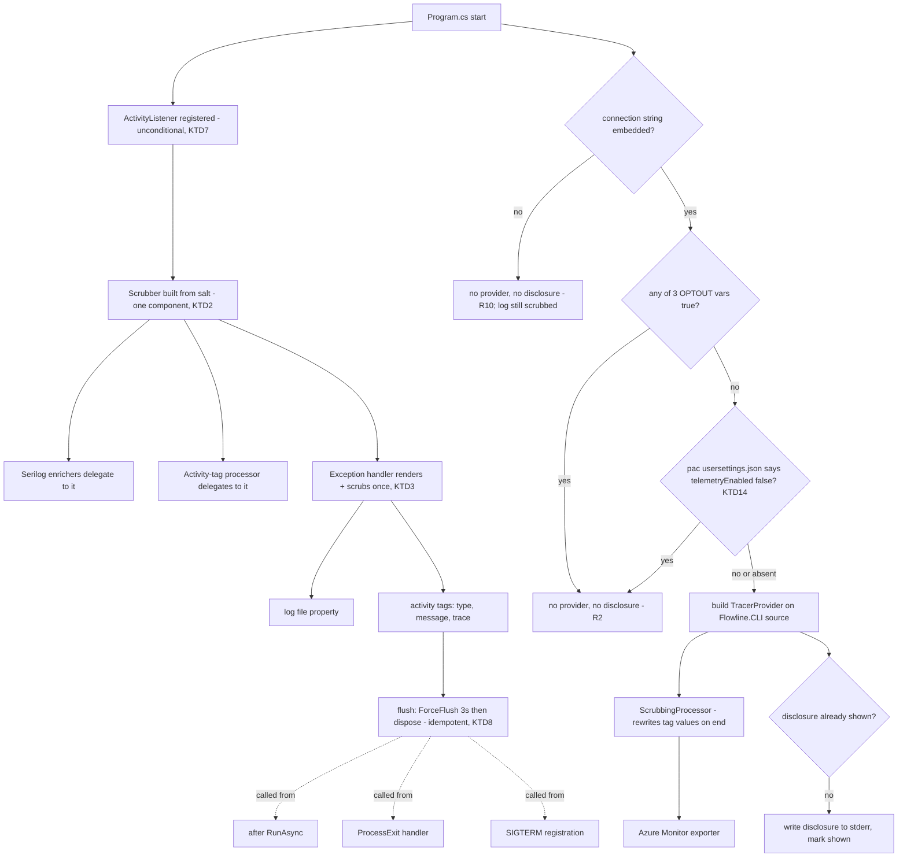

# App Insights Telemetry (Wave 4) - Plan

## Goal Capsule

- **Objective:** Flowline reports what is breaking across all installs, not only what users bother to file issues about: which commands fail, with which exit code, on which OS and CI platform, at which stage, and with the full exception behind it. In the early phase of the tool, fixing the bug matters more than minimising the payload.
- **Means:** Export the root and child Activities that Wave 2 already produces to Azure Application Insights through the OpenTelemetry OTLP path (`Azure.Monitor.OpenTelemetry.Exporter`), after passing every value through one shared scrubbing mechanism that also runs on the local log file.
- **Product authority:** This session's dialogue plus `docs/ideation/2026-06-25-cli-observability-ideation.html` (idea I7, Wave 4). No upstream brainstorm document; `product_contract_source: ce-plan-bootstrap`. This plan owns remote telemetry. It also extends local log scrubbing, because the same mechanism serves both and the log file is the user's view of the payload.
- **Consent decided this session:** opt-out with a first-run stderr disclosure (D1), controlled by two environment variables and by pac's own telemetry setting (D6). An interactive first-run prompt was ruled out before the choice was put: Flowline runs unattended on build servers, and the CI constraint is that a disclosure must write to stderr and must not block.
- **Infrastructure exists:** the Application Insights resource and the Log Analytics workspace behind it are deployed from `infra/main.bicep` and `infra/telemetry.bicep`, committed to this repo (D12). Nothing in the plan waits on Azure any more.
- **Connection string decided this session:** embedded in the assembly (D2). The ingestion key is write-only; the worst case from extraction is junk telemetry, not data exposure.
- **Stop conditions:** Stop and ask if U2 finds a value class the scrubbers cannot match reliably and that would carry client identity to Azure. Scrubbing fails open, so an unmatched shape ships, and that is the one failure this design cannot absorb quietly. Stop if the flush work in U4 cannot be made to survive the `Environment.Exit` paths: telemetry that silently drops the crash paths is worth less than no telemetry, and the plan should be re-scoped rather than shipped half-blind.

---

## Product Contract

### Summary

Flowline sends crash and usage telemetry to Azure Application Insights, including the full exception and stack trace behind a failure. It is on by default and disclosed on first run. Setting `FLOWLINE_TELEMETRY_OPTOUT` or `PP_TOOLS_TELEMETRY_OPTOUT` stops it, as does `pac telemetry disable`. Environment URLs, email addresses, filesystem paths, solution names and branch names are hashed before anything is written, in the log file and in the telemetry alike, so the log file on disk is a faithful preview of what Azure receives.

### Problem Frame

Wave 1 gave every invocation a local log file, and Wave 2 gave it a W3C trace with stage spans and command-level tags. Both are invisible to Flowline's author. They answer "what happened on this run" for a user who has already decided to file an issue and attach a log.

The failures that matter most never reach that point. A consultant hits a PAC auth edge case mid-deploy at a client, works around it, and moves on. Nothing about that reaches the backlog. Prioritisation currently runs on whichever users are loud, which for a tool in early adoption is a handful of people, none of them representative of the CI installs.

Aggregate signal answers questions local logs cannot: which command fails most in the wild, which exit codes are actually hit (the `ExitCode` enum has 17 values and no evidence about which ones fire), what share of runs are CI versus interactive, which OS and PAC CLI versions are in use, and which stage inside a deploy is the one that breaks.

The countervailing cost is real and specific to this product. Flowline's users are enterprise Power Platform teams, the segment most likely to have a corporate security review flag outbound data collection, and most likely to have GDPR obligations attached to the machines it runs on. The ecosystem precedent is clear that opt-out itself is survivable and silent enablement is not: GitHub CLI 2.91.0 turned on opt-out telemetry with no announcement and took sustained criticism for it, while the dotnet CLI's disclosed opt-out is the accepted .NET norm.

### Finding: what actually reaches Azure from a build server

Verified 2026-09-20 against current Microsoft and GitHub documentation, because the ideation asserted enterprise egress as a blanket risk and named a retired endpoint.

**The endpoint.** A connection string sends to a regional host, `{region}.in.applicationinsights.azure.com`, over 443. The ideation named `dc.services.visualstudio.com`, the legacy global instrumentation-key endpoint whose technical support ended 31 March 2025. The regional name is the one to give anyone who has to allowlist it.

| Runner / agent | Outbound egress | Telemetry arrives |
| --- | --- | --- |
| GitHub-hosted, standard | Public internet, no allowlist by default | Yes |
| GitHub larger runners, plain | Public internet by default | Yes |
| GitHub larger runners, outbound allowlist configured | Admin sets allowed IPs and domains per runner group; the rest is refused | Only if the ingestion host is listed |
| GitHub larger runners, Azure private networking | Customer VNET, customer NSG rules apply | Customer's call |
| Azure DevOps Microsoft-hosted | Azure public network, no public inbound address, outbound open | Yes |
| ADO self-hosted, scale-set, Managed DevOps Pools | Corporate network or customer VNET | Usually proxied, often filtered |

**What this changes.** The enterprise-egress risk is narrower than the ideation framed it: the default hosted configurations on both platforms send fine, so the CI dataset is not hypothetical. It does not disappear, because a Power Platform ALM pipeline is exactly the workload a client runs on a self-hosted agent inside their own network.

**The proxy case is the common one, not the blackhole.** A corporate agent rarely drops the traffic; it routes it through a proxy, and Azure DevOps documents that pipeline tasks must handle the proxy themselves rather than inheriting the agent's configuration. .NET's default HTTP client reads the standard proxy environment variables, so this most likely works with no code, but "most likely" is not a contract, and a proxy that answers with an authentication challenge fails differently from one that never answers at all. The first returns fast; the second is what the flush bound exists for. R12 and U1 step 5 settle it.

### Finding: what scrubbing the exception actually costs

Read from the shipped code during planning, because D7 depends on it. Three facts, and together they make this cheap.

**The scrubbers do not cover exceptions today.** Both enrichers walk the structured properties of a log event only (`src/Flowline/Logging/UrlScrubEnricher.cs:16`, `src/Flowline/Logging/EmailScrubEnricher.cs:44`). An exception reaches Serilog as its own field on the event, not as a property, so **today's log files already contain unscrubbed exception messages and stack traces**. R6 closes that as a side effect.

**A shipped install has no file paths in its stack traces.** Symbols are published as a separate symbol package (`src/Directory.Build.props:32-33`), and a `dotnet tool install` fetches only the main package. With no debug symbols deployed alongside the tool, stack frames carry namespace, type and method names and nothing else: no file paths, no line numbers, no home directory. Paths in traces are a local-build condition, not a user condition. The identifying risk in an exception is the **message**, where a URL or a path arrives by string interpolation.

**One scrub point covers both sinks.** The exception handler is a single switch (`src/Flowline/Program.cs:122-181`). Rendering the exception to text there, scrubbing that text once, and handing the same string to the log and to the activity means nothing unscrubbed ever enters either pipeline, so neither needs an interception hook for exceptions. Rendering walks inner exceptions, so the chain is covered by the one call. Logging the result as a structured property rather than as an exception object additionally puts it in reach of the two enrichers that already exist.

### Finding: how the neighbouring CLIs let users opt out

Checked 2026-09-20, prompted by the question of whether Flowline needs a per-command `--no-telemetry` flag.

| CLI | Control | Persisted | Per-command flag |
| --- | --- | --- | --- |
| dotnet | `DOTNET_CLI_TELEMETRY_OPTOUT` | Environment only | No |
| pac | `pac telemetry enable/disable/status`, `PP_TOOLS_TELEMETRY_OPTOUT` | Yes, a settings file | No |
| pa (Power Apps code apps) | `pa telemetry enable/disable/status`, `userSettings.json` | Yes, a settings file | No |

**No CLI in this neighbourhood has a per-command flag.** That settles the flag question, and it is also the weakest of the reasons: a per-run flag serves nobody, because a user who does not want telemetry does not want it for one run, and the run they forget to flag is the one that crashes.

**pac's state is readable, and is read.** On this machine it is `~/.local/share/Microsoft/PowerAppsCli/usersettings.json`, holding `"telemetryEnabled": true`, and `pac telemetry status` agrees with it. pac had already created the file before anyone touched a telemetry setting, and Flowline cannot function without pac, so the file is close to guaranteed present for any real user. That is what makes D10 workable. The file also carries pac's own `uniqueId`; Flowline must never reuse that, since it has its own salt (KTD11).

### Key Decisions

- D1. **Opt-out, with a one-time first-run disclosure written to stderr.** The dotnet CLI model. Opt-in by explicit action was weighed and rejected: the signal arrives exactly when the tool is least mature and most needs it, and opt-out can be relaxed from later while the reverse cannot. The disclosure is what makes it defensible; the failure mode to avoid is silence, not the default. The first run both discloses and sends, in that order, as the dotnet CLI does: withholding the first run's telemetry would lose the install-time failures, which are the ones a new user hits. This is the specific thing opt-out telemetry gets criticised for, and it is being chosen deliberately. (session-settled: user-directed.) Governs R1, R2.
- D2. **The connection string is embedded in the assembly.** Anyone can unzip the NuGet package and read it. That is accepted: an App Insights ingestion key is write-only, so extraction buys a spoofer the ability to send junk telemetry, not to read any. Matches what the dotnet CLI and FetchXmlBuilder do. (session-settled: user-directed.) Governs R10.
- D3. **Everything the Activity carries is sent, after scrubbing. There is no send-filter.** A send-side allowlist was planned and then dropped: in the early phase of the tool, a failure report missing the one tag that explains it costs more than the tag costs to send. The protection moves from "choose what leaves" to "make what leaves non-identifying", which is the same protection the log file already relies on. (session-settled: user-directed, chosen over an explicit allowlist, and marked *for now*: revisit once the crash patterns are understood.) Governs R4, R6.
- D4. **Telemetry never blocks, slows or fails a command.** A build agent that cannot reach the ingestion endpoint, or reaches it only through a proxy, is expected rather than exceptional. Every telemetry path is wrapped and swallowed, and the flush is bounded. Governs R7, R8, R12.
- D5. **Opting out disables the exporter, never the instrumentation.** The `ActivityListener` at `src/Flowline/Program.cs:35-41` is what makes `Activity.Current` non-null, which is what puts `TraceId` into local log files through `ActivityTraceEnricher`. If opting out removed the listener, opted-out users would silently lose trace correlation in their own logs. Governs R9.
- D6. **Two environment variables and pac's own setting. No command, no Flowline-specific file.** `FLOWLINE_TELEMETRY_OPTOUT` is Flowline's own switch, kept because without it every control would belong to another vendor: there would be no way to stop Flowline sending without also stopping Microsoft's collection, and the disclosure would have to tell users to disable pac telemetry as a side effect they never asked for. Every Microsoft satellite tool defines its own variable for the same reason. `PP_TOOLS_TELEMETRY_OPTOUT` is pac's, honoured because pac is the tool Flowline wraps and the one its users live in. `DOTNET_CLI_TELEMETRY_OPTOUT` was in an earlier draft and dropped: it is the most distant relative, the population it covers largely overlaps pac's, and losing it costs a user nothing they cannot get another way. A `flowline telemetry` command was planned and dropped: the log file shows what is sent, so the reporting half had no job left, and the toggle half is covered by `pac telemetry disable`, which Flowline honours (D10). A persistent per-user opt-out therefore exists; it just lives in pac rather than in Flowline, which suits a tool that already depends on pac for authentication. (session-settled: user-directed, chosen over duplicating `pac`'s enable/disable/status command surface.) Governs R2, R14.
- D10. **`pac telemetry disable` disables Flowline telemetry too, and pac's settings file is read to make that true.** Flowline already depends on pac for authentication, so depending on it for the opt-out is consistent rather than novel, and it means the documentation can point users at a command they already know instead of asking them to edit a shell profile. Read disable-only, per the asymmetry below. The undocumented location and schema are the accepted cost: Microsoft can rename either without it counting as a break, and the failure would be silent and in the wrong direction. The finding above records the exact path so a break is quick to fix, and U6 verifies the path on every platform that matters. (session-settled: user-directed, reversing an earlier decision in this plan not to read it.) Governs R2, R14.
- D11. **A foreign signal can turn telemetry off, never on.** A user who disabled telemetry in pac or in the .NET SDK refused this class of collection; a user who left it enabled there consented to that tool, not to this one. So `telemetryEnabled: false` in pac's file disables Flowline, while `true` is no signal at all and falls through to Flowline's own default. The same holds for every environment variable. An unreadable or absent file is also no signal, never a refusal. **A Flowline-specific config key was considered and dropped**: it would have covered a client repository in one commit, which pac's per-user setting cannot, but it duplicated a control that pac already provides and added a public contract to `.flowline` for it. (session-settled: user-directed.) Governs R2, R14.
- D12. **The Azure resources are defined in Bicep in this repo, not clicked together in the portal.** `infra/main.bicep` creates the resource group and calls `infra/telemetry.bicep`, which creates a workspace-based Application Insights resource and its Log Analytics workspace. Four properties of that deployment are load-bearing for this plan rather than incidental:
  - **The region is permanent.** The ingestion hostname is regional and ships embedded in the assembly, so changing region later breaks every installed client and every customer firewall entry naming the old host. Deployed region is West Europe; the ingestion host is `westeurope-5.in.applicationinsights.azure.com`. Note the `-5`: Microsoft documents the regional form as `{region}.in.applicationinsights.azure.com` with no stamp suffix, so the deployed host is narrower than the published pattern. R17 governs how that gets documented without handing customers a fragile allowlist entry.
  - **A daily ingestion cap keeps the resource inside the free allowance.** 0.1 GB per day, roughly 3.1 GB per month against the 5 GB monthly pay-as-you-go allowance. Reaching it stops ingestion until the next UTC day rather than generating cost, which is the right trade and a silent one. See the Risks section.
  - **IP masking is left on**, so Azure discards the sender address after a coarse geolocation lookup rather than storing it. That is the platform default and this plan keeps it, which matters because it is the one identifying value Flowline does not control from the client side.
  - **The connection string is a deployment output, not a value kept in a document.** It is re-read with `az deployment sub show -n <deployment-name> --query properties.outputs.connectionString.value -o tsv`, which makes the deployment name itself load-bearing and something that has to be written down. `infra/README.md` is where it goes (U7).

  (session-settled: user-directed; the resource was deployed from these files during planning.) Governs R16, R17.

- D7. **The full exception is sent: type, message and stack trace, scrubbed.** This reverses the earlier decision to send only the type name. In the early phase of the CLI the stack trace is the thing that actually fixes the bug, and a type name alone turns a report into a guess. The risk that a message carries an environment URL or a path is handled by scrubbing rather than by omission, and the finding above shows that costs one render-and-replace at one call site. (session-settled: user-directed, and marked *for now*: narrowing this once crash patterns are understood is the intended path.) Governs R5, R6.
- D8. **The disclosure is written on CI as well as locally.** CI storage is ephemeral, so the "once per machine" marker resolves to once per job, and a pipeline running four Flowline commands writes it once. Suppressing it on CI was weighed and rejected: a build server is where an enterprise reviewer is most likely to be reading, and one stderr line per job is the cost. Plan-level decision, not user-directed. Governs R1.
- D9. **One scrubbing mechanism serves the log file and the telemetry, and it runs at the source wherever it can.** Not two implementations held in sync by discipline. Scrubbing before a value enters either pipeline is preferred over intercepting it on the way out, because it removes a whole class of "the other sink forgot" bug. This is what makes the log file a truthful preview of the payload, which is what replaced the dropped reporting command. Governs R6, R11.

### Requirements

**Consent and disclosure**

- R1. On the first run that would send telemetry, Flowline writes a disclosure to stderr naming what is collected, that it is on by default, and which variable turns it off. It never blocks, and it appears once per machine.
- R2. Setting `FLOWLINE_TELEMETRY_OPTOUT` or `PP_TOOLS_TELEMETRY_OPTOUT` to a true value disables telemetry for that run and suppresses the disclosure.
- R14. A user who has disabled telemetry in pac is not sent from. pac's setting reading as enabled, unreadable, or absent is not consent and not a refusal: it leaves Flowline's own default in charge.

**What is sent**

- R3. A run sends: command name, exit code, duration, and the stage spans the run produced with their durations and success or failure.
- R4. A run sends every tag the root and child Activities carry, as dimensions. No tag *name* is withheld; every tag *value* passes the scrubber in R6 first. The two rules are not in tension: R4 governs which keys survive, R6 governs what their values read as.
- R5. A failing run sends the exception type, message and full stack trace, including inner exceptions, matching what the log file records for the same failure.
- R6. Before any value is written to the log file or sent as telemetry, these are replaced by a salted hash: environment and other HTTP URLs, email addresses, filesystem paths, solution names, and git branch names. This applies to activity tags, log properties and exception text alike.
- R11. The log file and the telemetry for one run carry the same scrubbed values, so reading the log is a faithful way to see what was sent.
- R13. A machine is identified only by a value derived from the existing per-machine salt, and is not reversible to any machine or user identity. It is stable across runs wherever the salt persists; on CI agents with ephemeral storage the salt is regenerated per job, so the dimension counts jobs rather than machines there and cannot be used to count distinct CI agents.

**Resilience**

- R7. A blocked, slow or failing ingestion endpoint does not change the command's exit code, its output, or its observable duration beyond a bounded flush.
- R8. Telemetry from a run that ends through a process-terminating path is flushed on the same terms as a run that unwinds normally, or is dropped without affecting that run.
- R9. Turning telemetry off leaves local logging, trace IDs, stage spans and scrubbing exactly as they are.
- R12. On an agent whose outbound traffic goes through a proxy configured by the standard environment variables, telemetry follows that proxy. A proxy that refuses, challenges or never answers is treated the same as a blocked endpoint under R7.

**Infrastructure**

- R16. The Application Insights resource this plan sends to is reproducible from the Bicep in `infra/`, including its region, its ingestion cap and its workspace. Nothing about it is configured only in the portal, and the documentation records how to re-read the connection string from the deployment.
- R17. The documentation tells a customer how to let Flowline's telemetry through a firewall in a way that survives Microsoft moving the resource between stamps. It names the concrete host as the current value, never as the contract.

**Documentation**

- R15. The README and the wiki state what is collected, that the exception and stack trace are included, every way to turn it off, and that the log file shows the payload. They lead with `pac telemetry disable` and state that a pac opt-in is not read as consent.

**Distribution**

- R10. A build with no connection string configured runs with telemetry silently absent, and no disclosure is written. Scrubbing still applies to the log file.

### Key Flows

- F1. First run, default state
  - **Trigger:** A user runs any Flowline command on a machine that has never run one.
  - **Steps:** The command runs normally; a disclosure is written to stderr; the run's telemetry is sent.
  - **Outcome:** The user has been told, in the same session, before the second run.
  - **Covered by:** R1, R3, R4

- F2. A crash worth fixing
  - **Trigger:** A command fails somewhere in a deploy against a client environment.
  - **Steps:** The failing stage span is marked; the exception is rendered and scrubbed once; the same text reaches the log file and the telemetry.
  - **Outcome:** The failure is diagnosable from Azure without asking the user for anything, and the user can read their own log file to see exactly what that was.
  - **Covered by:** R5, R6, R11

- F3. Enterprise build server with egress blocked or proxied
  - **Trigger:** A CI run on a self-hosted agent whose firewall drops the ingestion host, or whose proxy refuses it.
  - **Steps:** The command runs and completes; the export attempt fails; the flush hits its bound and returns.
  - **Outcome:** Exit code, output and duration are unchanged. Nothing is reported to the user.
  - **Covered by:** R7, R8, R12

- F4. Security review
  - **Trigger:** A user is asked by their security team what the tool sends.
  - **Steps:** They open the log file the CLI already prints a link to on failure, and read it.
  - **Outcome:** They see the payload in the form it was sent. If the answer is unacceptable, `pac telemetry disable` settles it, as does an environment variable in a CI image.
  - **Covered by:** R2, R11, R14, R15

- F6. Already opted out of Power Platform tooling telemetry
  - **Trigger:** A consultant ran `pac telemetry disable` at some point, for pac's own reasons, and later installs Flowline.
  - **Steps:** Flowline reads pac's setting during consent resolution and finds it disabled.
  - **Outcome:** Flowline never sends and never writes a disclosure. The user is not asked twice to refuse the same thing.
  - **Covered by:** R14

- F5. Opted out, still debugging
  - **Trigger:** A user with the variable set hits a bug and opens their log file.
  - **Steps:** The run produces its log file with a trace ID, stage spans and scrubbing, as it would otherwise.
  - **Outcome:** Opting out cost them nothing locally.
  - **Covered by:** R9

### Acceptance Examples

- AE1. **Covers R1.** Given a machine with no disclosure marker, when any command runs, then a disclosure naming the collection and the opt-out variable appears on stderr and not on stdout, and a second run produces no disclosure.
- AE2. **Covers R2.** Given `FLOWLINE_TELEMETRY_OPTOUT=1`, when a command runs, then no telemetry is sent and no disclosure is written.
- AE17. **Covers R2.** Given `PP_TOOLS_TELEMETRY_OPTOUT=1`, when a command runs, then no telemetry is sent.
- AE18. **Covers R14.** Given pac's settings file with `telemetryEnabled: false`, when a command runs, then no telemetry is sent and no disclosure is written.
- AE19. **Covers R14, D11.** Given pac's settings file with `telemetryEnabled: true`, when a command runs, then that is not treated as consent and Flowline's own default decides.
- AE20. **Covers R14, D11.** Given pac's settings file is absent, unreadable, or holds a shape the reader does not recognise, when a command runs, then it is treated as no signal rather than as a refusal, and the command is unaffected.
- AE4. **Covers R2.** Given either variable set to `0`, `false` or empty, when a command runs, then telemetry is sent, matching how the .NET SDK reads its own variable.
- AE5. **Covers R5, R6.** Given a command that fails with an exception whose message contains an environment URL, when the failure is exported, then the type, message and stack trace are all present and the URL does not appear in readable form.
- AE6. **Covers R5.** Given a failure whose exception has an inner exception, when it is exported, then the inner type, message and trace are present too.
- AE7. **Covers R6.** Given an activity tag holding an absolute project path, when the run is exported, then the user-identifying segment is hashed and the path is not reconstructable.
- AE8. **Covers R6.** Given an activity tag holding a solution unique name and another holding a branch name, when the run is exported, then both are hashed.
- AE9. **Covers R4.** Given an activity carrying a tag that no requirement anticipated, when the run is exported, then it is present as a dimension after scrubbing.
- AE10. **Covers R11.** Given one failing run, when its log file and its exported payload are compared, then the scrubbed values in each match.
- AE11. **Covers R7.** Given an ingestion endpoint that never responds, when a command completes, then it returns its own exit code and the process exits within the flush bound.
- AE12. **Covers R12.** Given the standard proxy environment variables pointing at a proxy that refuses the connection, when a command completes, then it returns its own exit code and reports nothing about telemetry.
- AE13. **Covers R9.** Given telemetry disabled by either variable, when a command runs, then its log file still carries a trace ID, still produces stage spans, and is still scrubbed.
- AE14. **Covers R10.** Given a build with no connection string, when a command runs on a machine with no disclosure marker, then no disclosure is written and no export is attempted.
- AE15. **Covers R13.** Given two runs sharing a persisted salt, when both are exported, then the machine dimension matches; given a run whose salt file was regenerated, then it does not, which is the CI case and is correct rather than a defect.
- AE16. **Covers R3.** Given a deploy that fails at its import stage, when the run is exported, then the root span carries the command's exit code and the failing stage span is identifiable by name and marked as failed.

### Scope Boundaries

- A per-command `--no-telemetry` flag. Rejected this session: no CLI in the neighbourhood has one (see the opt-out finding), and a per-run switch serves nobody, since the run a user forgets to flag is the one that crashes.
- A `flowline telemetry` command, in any form. Dropped this session (D6), against pac's precedent, which does have one.
- A Flowline-specific opt-out key in `.flowline`. Considered and dropped this session (D11): pac already provides a persistent per-user opt-out that Flowline now honours, and duplicating it would add a permanent public contract to the project config. Consequence worth knowing: there is no way to disable telemetry for a whole repository in one commit. A client who wants that sets the environment variable in their CI image and asks their developers to run `pac telemetry disable`.
- Writing anything to pac's settings file. Flowline reads it and never touches it.
- A send-side allowlist or field filter. Dropped this session (D3), and explicitly revisitable.
- A persistent per-user opt-out setting. Follows from D6: with no command, nothing writes it.
- Changing the default away from opt-out after release.
- Sending anything about what a command did to an environment: components deployed, records touched, solution contents. This plan sends how Flowline ran and how it failed, never what it ran against.
- Sending log events. The exporter carries Activities and their exception data, not the Serilog stream.
- A metrics or log signal on the OTel provider. Traces only.
- Publishing aggregate stats anywhere.
- Sampling. Flowline's volume does not need it, and a sampled dataset makes exit-code frequency questions harder to answer.
- Removing debug symbols from the symbol package, or changing how they are published. The finding above reads that configuration; it does not change it.

#### Deferred to Follow-Up Work

- Narrowing what is sent once crash patterns are understood. Both D3 and D7 are marked *for now*, and this is the intended follow-up for each.
- Pointing the same pipeline at a self-hosted OTLP collector for users who want their own telemetry without sending it to Flowline's. The exporter swap is one line; the configuration surface for it is not planned here.
- A `--no-telemetry` per-run flag.

---

## Planning Contract

### Key Technical Decisions

- KTD1. **Build the `TracerProvider` in `Program.cs` before `app.RunAsync`, registering only the `Flowline.CLI` source.** That is where the `ActivityListener` and the Serilog logger are already built (`src/Flowline/Program.cs:35-41`, `84-102`), and it is the one place that sees the whole process lifetime. Instantiates R3.
- KTD2. **Scrubbing lives in one component that owns the rules and the salt; every caller delegates to it.** The existing enrichers keep their shape and delegate their matching (`src/Flowline/Logging/UrlScrubEnricher.cs:20`, `src/Flowline/Logging/EmailScrubEnricher.cs:48`), so log behaviour is preserved while the rules gain a single home. Instantiates D9, R6, R11.
- KTD3. **The exception is rendered and scrubbed once, in the exception handler, and the same string goes to both sinks.** Not two interceptions. Rendering to text also avoids the unsolvable problem of reconstructing an `Exception` with a modified message and trace, which loses the type chain. The rendered text covers inner exceptions in one pass. Instantiates R5, R11, D9.
- KTD4. **The scrubbed exception text rides the log message, and the exception object is no longer passed to Serilog.** The four handler arms currently call the logger with the exception as its own argument (`src/Flowline/Program.cs:131`, `:148`, `:162`, `:175`), and the file sink renders that field through the `{Exception}` token in its output template. Passing the object would ship it unscrubbed, and passing nothing would leave the token empty. So the scrubbed text goes in as a named property inside the message template itself, which renders regardless of the output template and needs no change at the sink configuration (`src/Flowline/Program.cs:90-98`). The cost is that Serilog's own exception formatting is no longer used; the rendered text replaces it and reads the same.
- KTD5. **The path rule hashes the user-identifying segment, not the whole path.** A value reading `/home/<hash>/Projects/<hash>/Solution` still says which layout was in play, and a wholly hashed path says nothing. Solution and branch names are hashed whole, because no part of them is useful once identity is removed. This rule matters for activity tags rather than for stack traces: per the finding, a shipped install has no paths in its traces. Instantiates R6.
- KTD6. **Solution and branch names are scrubbed by value, not by pattern.** A branch name has no distinguishing shape, so a regex would either miss it or hit unrelated text. The run already knows both values (`src/Flowline/Commands/InvocationLogger.cs:34`, `:55`), so they are passed to the scrubber as known strings to replace. **They arrive late.** The logger and its enrichers are built at `src/Flowline/Program.cs:90-98`, before any command runs, while the solution and branch names are only known once config loads inside the command (`src/Flowline/Commands/FlowlineCommand.cs:150`). The scrubber therefore starts with the URL, email and path rules and gains the other two mid-run, so anything logged before config load is unscrubbed for those two values only. Accepted: nothing written that early carries a solution or branch name. U2 asserts it rather than assuming it. Instantiates R6.
- KTD7. **The `ActivityListener` stays registered unconditionally, above and independent of the provider.** Adding a `TracerProvider` does not replace it; both listen. When telemetry is off, the listener alone still populates `Activity.Current`. Instantiates D5, R9.
- KTD8. **Flush with `ForceFlush(3s)` then dispose, from a single idempotent call invoked from three places: after `RunAsync`, from the `ProcessExit` handler, and from the SIGTERM registration.** `src/Flowline/Program.cs:200-208` documents that five `Environment.Exit` call sites in `GitUtils`/`PacUtils`/`DotNetUtils` terminate without unwinding, and already registers `ProcessExit` and SIGTERM handlers for the tab-status indicator for exactly this reason. Telemetry rides the same three hooks. The 3-second bound is the worst case a blackholed endpoint can add to a command, paid once per invocation; U1 step 4 measures the real figure and the value is tuned down if the exporter returns sooner. Instantiates R7, R8.
- KTD9. **Read both variables with the .NET SDK's truth values.** `1`, `true` and `yes` disable; `0`, `false`, `no` and absent do not. pac documents `1` or `true` for its own variable, so the SDK's set is a superset and one parser serves both. Instantiates R2.
- KTD14. **pac's settings file is located through `SpecialFolder.LocalApplicationData`, read defensively, and only ever read.** .NET maps that folder to `~/.local/share` on Linux and to `%LOCALAPPDATA%` on Windows, which is how the observed Linux path resolves, and it is the same helper `FlowlineStoragePaths` already uses (`src/Flowline/Utils/FlowlineStoragePaths.cs:7`). The reader looks for `Microsoft/PowerAppsCli/usersettings.json` beneath it and for one boolean property. Every failure mode collapses to the same answer, no signal: absent file, unreadable file, malformed JSON, missing property, renamed property, unexpected type. Nothing pac writes can make a Flowline command fail or slow down, and Flowline never writes to that file. A8b records that the Windows and macOS paths are inferred rather than observed. Instantiates R14, D11.
- KTD10. **Only the disclosure marker is persisted, in the existing validation cache.** `ValidationCacheStore` already versions its schema, tolerates corruption by returning defaults, and resolves the same storage root (`src/Flowline/Validation/ValidationCacheStore.cs:26-50`). No consent state is stored, because D6 leaves nothing to store.
- KTD11. **Derive the machine dimension from the existing telemetry salt.** `TelemetrySaltStore` already creates and persists a 32-byte per-machine salt used by the scrubbing enrichers (`src/Flowline/Logging/TelemetrySaltStore.cs`). Hashing a fixed string with it yields a stable per-machine value not derived from machine name or user name, so there is nothing to reverse. The salt lives under the same storage root as the logs, so a CI agent with ephemeral disk regenerates it per job; R13 scopes the stability claim accordingly. Instantiates R13.
- KTD12. **The disclosure writes to stderr through `Console.Error`, not through `IAnsiConsole`.** `LoggingRenderHook` tees every Markup write into the log file and `VerboseFilterHook` filters them (`src/Flowline/Program.cs:186-190`); a disclosure is neither program output nor a log event. Stderr keeps it out of piped stdout on CI, which is the constraint the ideation recorded. It also stays separate from the existing first-run welcome screen (`src/Flowline/Commands/FlowlineCommand.cs:145`), which is gated on an interactive terminal and so never fires on the CI runs where the disclosure matters most.
- KTD13. **The connection string is a constant in a single internal class, absent-by-default.** Null or empty means telemetry is off before consent is even consulted, which is what makes a source build inert (R10) and what lets every test run with no endpoint.

### High-Level Technical Design

Everything on the activity leaves. The only thing standing between a value and Azure is the scrubber, which is also what stands between that value and the log file.

### Assumptions

- A1. `Azure.Monitor.OpenTelemetry.Exporter` supports the current target framework here and adds no dependency that conflicts with the Dataverse client packages already referenced. Unverified; U1 settles it.
- A2. A `BaseProcessor<Activity>.OnEnd` implementation can rewrite tag values such that the exporter sends the rewritten ones. Unverified in this SDK version; U1 settles it, and U2's tests assert on exported output rather than on the mechanism. KTD3 means this does not apply to exception text, which is already scrubbed before it becomes a tag.
- A3. `ForceFlush` on the Azure Monitor exporter is synchronous and bounded by its timeout argument, unlike the classic SDK's buffered channel. This is the stated reason the ideation chose the OTLP path.
- A4. The exporter's HTTP path honours the standard proxy environment variables through .NET's default proxy resolution, with no Flowline configuration. Unverified; U1 step 5 settles it, and R12 is written so a proxy failure degrades rather than hangs either way.
- A5. ~~An App Insights resource and its connection string will be supplied.~~ **Closed 2026-09-20**: deployed from `infra/`, connection string available from the deployment output. U6 is no longer blocked on it. The code path stays inert while the constant is empty (KTD13), which is what keeps source builds and the test suite from sending.
- A6. `ProcessExit` fires for the `Environment.Exit` paths. `src/Flowline/Program.cs:203` relies on this today for the tab-status indicator, so it is load-bearing already; U4 verifies it rather than assuming it.
- A7. The five value classes named in R6 are the ones that carry identity in Flowline's output. This is a judgment from reading the current tag and message shapes, not an exhaustive audit, and scrubbing fails open. The Risks section says what that means.
- A8b. pac stores its telemetry setting at `Microsoft/PowerAppsCli/usersettings.json` beneath the local application data folder, on every platform. The Linux path was observed directly on this machine; the Windows and macOS paths are inferred from how .NET maps that folder. U6 verifies at least the Windows one, since that is the primary development machine. A wrong path is a silent no-signal, which is why R14 and KTD14 treat that case as safe rather than as a refusal.
- A8. Debug symbols are not deployed with the installed tool, so shipped stack traces carry no file paths. Read from `src/Directory.Build.props:32-33`. It holds for Flowline's own frames in a packed install, and not for a locally built run, nor necessarily for a dependency that ships its own symbols. A8 is therefore a reason the path risk is small, not the control that contains it. **U6 step 2's full-text search over the arrived payload is the control**, and it catches all three cases at once.

### Sequencing

U1 first and alone: it settles the package and processor unknowns, and the shape of the tag processor depends on what it finds. U2 delivers scrubbing and is the load-bearing unit; it improves the log file immediately, with no telemetry attached, and can be verified on its own. U3 is independent and small. U4 needs U1, U2 and U3. U5 needs U4, since the disclosure must fire on exactly the runs that build a provider. U6 needs a real connection string. U7 is last on purpose: documenting what was observed arriving beats documenting what was intended to.

---

## Implementation Units

### U1. Spike the exporter and the tag-rewriting processor

- **Goal:** Confirm the exporter package integrates cleanly, that a processor can rewrite an activity's tag values on the way out, and that a proxy is honoured.
- **Requirements:** Settles A1, A2, A4. Shapes KTD2.
- **Dependencies:** None.
- **Files:** A throwaway console project outside the repo, or a temporary test in `tests/Flowline.Tests/`, removed before U2 lands. No production files.
- **Approach:**
  1. Add `OpenTelemetry` and `Azure.Monitor.OpenTelemetry.Exporter` to a scratch project on the same target framework as `src/Flowline/Flowline.csproj`, and confirm the restore graph does not conflict with the Dataverse client packages.
  2. Build a provider with an in-memory exporter and a processor that rewrites tag values on `OnEnd`. Assert on what the in-memory exporter received, not on the activity object.
  3. Confirm that a long string tag, the shape the rendered exception text will take, survives export without truncation, and record the limit if one exists.
  4. Time `ForceFlush` against an unroutable endpoint to confirm it honours its timeout rather than hanging (A3).
  5. Set the standard proxy environment variables to a local proxy that refuses connections, and confirm the exporter routes through it and that the refusal returns fast rather than costing the full flush bound (A4, R12).
- **Execution note:** Step 4 needs a deliberately unreachable endpoint, not a missing one: a blackholed address, not a refused connection. A refused connection returns immediately and proves nothing about the enterprise-firewall case.
- **Test scenarios:** Test expectation: none. This is an investigation whose output is a recorded finding.
- **Verification:** A note recorded under `docs/solutions/` naming the working processor shape, any size limit on a string dimension, the confirmed flush behaviour against a blackholed endpoint, whether the proxy variables were honoured, and any package conflict found.

### U2. One scrubber, serving the log file and telemetry

- **Goal:** No environment URL, email address, filesystem path, solution name or branch name is written in readable form, anywhere, in either sink.
- **Requirements:** R5, R6, R11. Instantiates D9, KTD2, KTD3, KTD4, KTD5, KTD6.
- **Dependencies:** U1.
- **Files:**
  - `src/Flowline/Logging/FlowlineScrubber.cs` (new: owns the five rules and the salt)
  - `src/Flowline/Logging/UrlScrubEnricher.cs`, `src/Flowline/Logging/EmailScrubEnricher.cs` (delegate their matching to it)
  - `src/Flowline/Diagnostics/ScrubbingProcessor.cs` (new: the OTel processor, tags only)
  - `src/Flowline/Program.cs` (render and scrub the exception once in the handler; log it as a property)
  - `tests/Flowline.Tests/Logging/FlowlineScrubberTests.cs` (new)
  - `tests/Flowline.Tests/Diagnostics/ScrubbingProcessorTests.cs` (new)
  - `CHANGELOG.md` (this unit changes what every existing user's log file contains, with no telemetry attached, so it carries its own entry rather than waiting for U6)
- **Approach:**
  1. Move the two existing regex rules into the shared component unchanged, so current log behaviour is preserved exactly, and add three rules: filesystem path, solution name, branch name. The path rule hashes the user-identifying segment and keeps the structure (KTD5); solution and branch are replaced by known value rather than by pattern (KTD6).
  2. Render the exception to text in the handler, scrub it once, and use that one string for both the log property and the activity tags (KTD3, KTD4). No exception interception on either pipeline.
  3. Implement the processor per U1's finding, rewriting every tag value on end and adding the machine dimension from the salt (KTD11).
  4. Keep one salt for all rules, so the same input hashes the same way in both sinks (R11).
- **Patterns to follow:** `src/Flowline/Logging/UrlScrubEnricher.cs:26` for the salted-hash shape, which the new rules reuse rather than reinvent.
- **Test scenarios:**
  - Covers AE7. A tag holding an absolute project path exports with the user-identifying segment hashed and the remaining structure intact.
  - Covers AE8. A tag holding a solution unique name, and one holding a branch name, both export hashed.
  - Covers AE5. An exception whose message holds an environment URL is rendered and scrubbed with type, message and trace present and the URL not readable.
  - Covers AE6. An exception with an inner exception renders both, and both are scrubbed.
  - Covers AE10. The same failing run's log text and exported tags carry identical hashes for the same input value.
  - Covers AE9. A tag name no rule anticipated still exports, with its value scrubbed by whichever rules match.
  - A tag value containing no matching shape exports byte-identical.
  - Existing URL and email behaviour on the log path is unchanged: the same input produces the same hash as before the refactor.
  - The scrubbed output contains neither `Environment.UserName` nor the machine name as a substring, in any casing.
  - A value logged before config load is scrubbed for URLs, emails and paths, and passes through unchanged for solution and branch names, per KTD6.
  - A null or empty tag value, and a null exception, are handled without throwing.
  - A scrubbing failure on one value does not abort the export or the log write.
- **Verification:** `dotnet test tests/Flowline.Tests` passes. Plus a manual Release-build run of a failing command against a real environment, confirming by eye that the resulting log file contains no readable URL, email, home path, solution name or branch name, and that the exception is still readable enough to diagnose from.

### U3. Consent resolution

- **Goal:** One place decides whether telemetry is on, and it decides before anything is built.
- **Requirements:** R2, R10, R14.
- **Dependencies:** None.
- **Files:**
  - `src/Flowline/Diagnostics/TelemetryConsent.cs` (new)
  - `src/Flowline/Diagnostics/TelemetryConnectionString.cs` (new: the embedded constant, KTD13)
  - `src/Flowline/Diagnostics/PacTelemetrySetting.cs` (new: locate and read pac's file, never write it)
  - `src/Flowline/Validation/ValidationCache.cs` (add the disclosure-shown marker only)
  - `tests/Flowline.Tests/Diagnostics/TelemetryConsentTests.cs` (new)
- **Approach:**
  1. Treat an absent or empty connection string as off, resolved ahead of everything else (R10).
  2. Read both variables with the SDK's truth values (KTD9). Either one disables.
  3. Read pac's setting, honouring it only when it disables (D11, KTD14). Every failure mode resolves to no signal, never to a refusal and never to an exception reaching the caller.
  4. Add one field to the existing validation cache for the disclosure marker (KTD10). No consent state is stored.
- **Patterns to follow:** `src/Flowline/Validation/ValidationCacheStore.cs:26-50` for the load-tolerates-corruption pattern. `src/Flowline/Logging/TelemetrySaltStore.cs` for a store that must never throw on a normal run.
- **Test scenarios:**
  - Covers AE2. `FLOWLINE_TELEMETRY_OPTOUT=1` resolves to off.
  - Covers AE17. `PP_TOOLS_TELEMETRY_OPTOUT=1` resolves to off.
  - Each variable independently disables when the other is absent.
  - Covers AE4. `0`, `false`, `no` and empty do not disable, for either variable.
  - `yes` disables, matching the SDK's accepted values.
  - No variable set, and no pac signal, resolves to on.
  - Covers AE18. pac's file holding `telemetryEnabled: false` resolves to off.
  - Covers AE19. pac's file holding `telemetryEnabled: true` does not resolve to on by itself; Flowline's own default decides, and a variable that disables still wins.
  - Covers AE20. An absent file, an unreadable file, malformed JSON, a missing property, a renamed property, and a property of the wrong type each resolve to no signal rather than to a refusal, and none of them throws.
  - The reader never writes to pac's file, asserted against the file's last-write time and contents.
  - pac's `uniqueId` is not read into anything Flowline sends.
  - Covers AE14. An empty connection string resolves to off regardless of every other input.
  - A corrupt cache file resolves to the default rather than throwing.
- **Verification:** `dotnet test tests/Flowline.Tests --filter TelemetryConsent` passes for the full precedence matrix.

### U4. Provider wiring and flush

- **Goal:** Activities and their exceptions reach App Insights, and the flush survives every way the process ends.
- **Requirements:** R3, R4, R5, R7, R8, R9, R12.
- **Dependencies:** U1, U2, U3.
- **Files:**
  - `src/Flowline/Diagnostics/FlowlineTelemetry.cs` (new: build, expose the idempotent flush)
  - `src/Flowline/Program.cs` (build the provider after consent resolves; call flush from the three exit hooks; attach the scrubbed exception text and exit code)
  - `tests/Flowline.Tests/Diagnostics/FlowlineTelemetryTests.cs` (new)
- **Approach:**
  1. Build the provider on the `Flowline.CLI` source with the scrubbing processor and the Azure Monitor exporter, only when consent resolved to on (KTD1).
  2. Leave the `ActivityListener` at `src/Flowline/Program.cs:35-41` registered unconditionally and untouched (KTD7, D5).
  3. Expose one idempotent flush that force-flushes with a 3-second bound then disposes, called from after `RunAsync`, from the `ProcessExit` handler at line 203, and from the SIGTERM registration at line 208 (KTD8).
  4. In the exception handler switch (lines 122-181), set the exit code and the already-scrubbed exception text from U2 onto the current activity, in the same arm that logs it.
  5. Wrap provider construction and flush so that a failure in either is swallowed (D4).
- **Patterns to follow:** `src/Flowline/Program.cs:84-102` for the build-wrapped-in-try-with-a-commented-swallow pattern already used for Serilog. `src/Flowline/Services/UpdateNoticeChecker.cs:63-67` for a network path that must never fail a command.
- **Test scenarios:**
  - Covers AE16. A run with a failing stage exports a root span carrying the exit code and a named child span marked failed.
  - Covers AE5. A failing command exports the exception type, message and stack trace, all scrubbed.
  - Covers AE11. An unreachable endpoint returns from flush within the bound, and the command's exit code is unchanged.
  - Covers AE12. A refusing proxy named by the standard environment variables leaves the command's exit code and output unchanged.
  - Covers AE13. With consent off, a run still produces a trace ID in its log output, still produces stage spans, and its log is still scrubbed.
  - Flush called twice runs its work once and does not throw.
  - Flush called with no provider built does not throw.
  - A provider whose construction throws leaves the command running normally.
  - `ProcessExit` fires the flush: assert on the registration, and verify the `Environment.Exit` path manually per the verification note below.
- **Verification:** `dotnet test Flowline.slnx`. Plus a manual Release-build run of a command that hits one of the `Environment.Exit` call sites in `GitUtils`/`PacUtils`/`DotNetUtils`, confirming the flush ran. That is A6, and it cannot be asserted in-process.

### U5. First-run disclosure

- **Goal:** No user's second run is their first notice.
- **Requirements:** R1, R10.
- **Dependencies:** U4.
- **Files:**
  - `src/Flowline/Diagnostics/TelemetryDisclosure.cs` (new)
  - `src/Flowline/Program.cs` (call it on the path that built a provider)
  - `tests/Flowline.Tests/Diagnostics/TelemetryDisclosureTests.cs` (new)
- **Approach:**
  1. Write to `Console.Error` directly, not through `IAnsiConsole` (KTD12).
  2. Fire only when a provider was built, so an opted-out or key-less run writes nothing (R2, R10).
  3. Mark shown in the validation cache before writing, so a failure mid-write cannot produce it twice.
  4. Wording per `docs/tone-of-voice.md`: what is collected, that it includes the exception and stack trace, that the log file shows it, and the one variable to set to turn it off. Name `FLOWLINE_TELEMETRY_OPTOUT` only; the other variables and the pac route are documented, not recited in a one-off notice.
- **Test scenarios:**
  - Covers AE1. First run writes the disclosure to stderr; a second run writes nothing.
  - Covers AE1. The disclosure appears on stderr and stdout is unchanged.
  - Covers AE2, AE14, AE18. A run with telemetry off by any variable, by pac's setting, or by absent connection string writes nothing and leaves the marker unset.
  - The disclosure text names `FLOWLINE_TELEMETRY_OPTOUT` and points at the log file.
  - A cache that cannot be written still writes the disclosure and does not throw: repeating it beats failing a command.
- **Verification:** `dotnet build -c Release`, then two consecutive runs against a fresh temporary storage root with stdout and stderr captured separately.

### U6. End-to-end verification

- **Goal:** Telemetry demonstrably arrives, and nothing readable arrives with it.
- **Requirements:** R3, R4, R5, R6, R11, R16. Is the control behind A8 and A8b.
- **Dependencies:** U5. The resource already exists (A5 closed), so nothing external gates this.
- **Files:**
  - `src/Flowline/Diagnostics/TelemetryConnectionString.cs` (populate from the `connectionString` output of the `infra/` deployment, not from a value pasted into a document)
- **Approach:**
  1. Populate the connection string and run several commands against a real environment, including one that fails and one under a simulated CI environment.
  2. Query App Insights and search the whole arrived payload for the tenant domain, the environment URL, the solution name, the branch name and the OS username. None may appear. This search is the guarantee behind R6, not A8.
  3. Confirm the exception and stack trace did arrive, and are still useful after scrubbing. If they are not, that is a finding about KTD5, not a pass.
  4. Confirm a run with each variable set, and a run after `pac telemetry disable`, each produce nothing in the resource.
  5. Verify the pac settings path resolves on Windows, which A8b infers rather than observes. A wrong path fails silently by design, so only this check catches it.
- **Test scenarios:** Test expectation: none beyond what U2 to U5 cover. This unit verifies against the live resource.
- **Verification:** Telemetry visible for a normal run, a failing run and a CI-flagged run; nothing for any of the three opt-out paths; the pac path confirmed on Windows; a full-text search of the arrived payload returns no identifying value.

### U7. Documentation

- **Goal:** Every place a user or a reviewer would look tells the same true story about what is collected and how to stop it.
- **Requirements:** R15, R17, and the documentation half of R16.
- **Dependencies:** U6 for the telemetry half. **The scrubbing half is not gated on U6** and lands with U2: that unit changes every existing user's log file on its own, and shipping a changelog line with no prose describing the change is the gap this split would otherwise create. If U2 ships alone, its documentation ships with it.
- **Files:**
  - `README.md` (new telemetry section)
  - `CHANGELOG.md` (the telemetry entry; U2 already carries its own for the scrubbing change)
  - `docs/auth.md` if it is where the pac relationship is described, since honouring pac's telemetry setting is another place Flowline defers to pac
  - `infra/README.md` (new, short): what the Bicep deploys, how to deploy it, the deployment name, the command that re-reads the connection string, and the four constraints from D12 that a future maintainer must not casually change
  - `../Flowline.wiki/` (the page list in `Home.md` decides whether this is a new numbered page or a section on an existing one)
- **Approach:**
  1. README: what is collected including the exception and stack trace, that the log file is the payload preview, and how to turn it off. Lead with `pac telemetry disable`, because it is the one users already know and it persists; name the two variables after it, for CI. Say why the default is on. Link the wiki page rather than duplicating it.
  2. Wiki: the full field story for a reader who is answering their security team. Read `../Flowline.wiki/AGENTS.md` first, and take the page list from `Home.md` rather than from any copy of it.
  3. State plainly that a pac opt-out is honoured and a pac opt-in is not consent, and that there is no way to disable telemetry for a whole repository in one commit. A client wanting that sets the variable in their CI image and asks developers to run the pac command.
  4. Check whether the command reference needs a line saying telemetry has no per-command flag and why, so the absence reads as a decision rather than an oversight.
  5. Firewall guidance in the wiki, in this order (R17). Prefer the `AzureMonitor` service tag, which is what Microsoft recommends for firewalls that support service tags and which survives stamp and region changes. For firewalls that cannot use them, allow the ingestion host on 443, stating that the current host is `westeurope-5.in.applicationinsights.azure.com` while Microsoft's published pattern is `{region}.in.applicationinsights.azure.com` without the stamp suffix, so an entry matching only the published form will not match. **Do not publish the stamped host as the contract.** Mark the wildcard-on-suffix approach as inferred from the observed host rather than documented, so a reader knows which part is solid.
  6. Record in `infra/README.md` the deployment name used and the command that re-reads the connection string from it.
- **Execution note:** The wiki checkout normally lives at `../Flowline.wiki` and is absent on this machine. Per `AGENTS.md`, report that rather than skipping it silently or creating a replacement folder. If it cannot be written here, the wiki half of R15 is outstanding and must be stated as such rather than counted as done.
- **Test scenarios:** Test expectation: none. Documentation.
- **Verification:** README, CHANGELOG and `docs/folder-structure.md` updated and consistent with each other; the field list in each matches what U6 observed arriving; wiki page written, or its absence reported with the reason.

---

## Risks

- **Scrubbing fails open, and it is now the only protection.** The dropped allowlist failed closed: an unanticipated tag was withheld. Scrubbing is the inverse: a value whose shape no rule matches is sent as written. A7 says the five rules cover what Flowline produces today, and that is a judgment, not an audit. The exposure grows every time a new tag or a new interpolated message is added without a matching rule, and nothing in the build will catch it. This is the cost of D3 and D7, accepted deliberately and marked for revisit.
- **Hitting the daily ingestion cap loses data silently.** The cap stops ingestion until the next UTC day rather than costing money (D12), which is the right trade, but nothing tells you it happened. With full stack traces at a few kilobytes per failing run, the 0.1 GB cap is roughly twenty thousand failing runs in a day, so this is not a near-term concern. It becomes one if adoption grows or if a single bug starts firing in a loop on many machines at once, which is exactly the situation where the data matters most.
- **The persistent opt-out depends on an undocumented file, and it fails in the wrong direction.** `pac telemetry disable` is the opt-out the documentation will lead with, and it works by reading a path and property name Microsoft never published as a contract. If either is renamed, Flowline reads no signal and resumes sending from machines whose users believe they opted out, with nothing visible to say so. This is the accepted cost of D10. Two things bound it: the path is recorded in this plan so a fix is small, and U6 step 5 confirms it on Windows. Nothing detects a later break except a user noticing.
- **There is no repository-level opt-out.** Dropping the `.flowline` key (D11) means a client who wants telemetry off across a team and a pipeline needs a CI variable plus a per-developer pac command, rather than one commit. This is the one capability the plan gives up relative to the previous draft, and it is the scenario Flowline's audience actually encounters.
- **The no-paths-in-traces finding is narrower than it reads** (A8). It covers Flowline's own frames in a packed install. A locally built run has symbols, and a dependency may ship its own, so a trace can still carry a path. The path rule in R6 is what handles those, and U6 step 2 is what proves it. Someone embedding symbols into the tool package later would widen this with no test failing.
- **The CI dataset will under-represent enterprise self-hosted agents.** Hosted runners on both platforms send by default, so the CI signal is real, but the clients most likely to run Flowline from behind a corporate proxy are the ones most likely to be missing from it. Read CI numbers as hosted-runner numbers unless the reach finding above has been re-checked.
- **`ProcessExit` on the `Environment.Exit` paths is assumed, not proven** (A6). The tab-status indicator already depends on it, so it is not a new risk, but U4's manual verification is the only thing that confirms it for telemetry.
