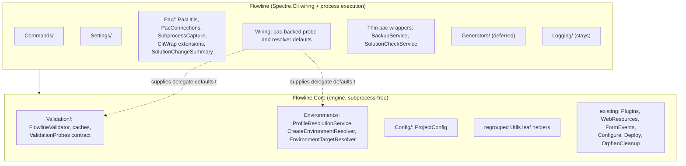

# Core Engine Boundary and Command Constructor Shape - Plan

## Goal Capsule

- **Objective:** `Flowline.Core` holds Flowline's ALM logic free of subprocess execution and CLI-framework coupling, so it can be reasoned about and tested without a terminal, pac or git; and a contributor opening the repo can tell from a file's folder what role it plays. Today neither holds: profile resolution, environment targeting and setup validation live in the CLI project beside the commands that call them, and a reader cannot tell engine code from wiring without opening the file. Driving a complete ALM operation from Core alone is a later step, not this one: it needs the environment-resolution facade deferred under KTD2, because after U5 every concrete pac binding is supplied by a `Flowline`-side factory.
- **Means:** Move orchestration logic into `Flowline.Core` while subprocess execution stays in `Flowline`, using the delegate seams the codebase already has (KTD3). Bundle the base command's infrastructure dependencies into one parameter object (KTD1), which is independent of the moves. Regroup files by role inside both projects (KTD6).
- **Authority:** `AGENTS.md` owns the project boundary rule and the "Core must never reference Flowline" constraint. This plan refines where the line falls; it does not move it.
- **Stop conditions:** Stop and ask if a move would require `Flowline.Core` to reference `Flowline`, if `Flowline.Core.csproj` would need `CliWrap`, `Serilog` or a DLaB package, or if a unit's test-relocation cost exceeds the move it serves.
- **Execution profile:** Behaviour-preserving refactor. No user-facing CLI text changes, no new commands or flags. Every unit is independently shippable and independently revertible.
- **Finishes the work:** `ce-work` or a human, unit by unit, in the sequence below.

---

## Product Contract

### Summary

Split Flowline's two projects along the role each file plays rather than along which NuGet package it happens to import. Orchestration logic moves to `Flowline.Core`; process launching stays in `Flowline`. One enabling refactor unblocks the moves: engine signatures stop taking a Spectre.Cli-derived settings type. A second, collapsing the command base's six infrastructure dependencies into one parameter object, is sequenced first only because it edits the same file, and can be descoped without affecting anything else. Folder structure inside both projects is regrouped by role in the same pass.

### Problem Frame

`Flowline.Core` was created so the dependency direction would be compiler-enforced: Core is the engine, `Flowline` is Spectre.Cli wiring. `AGENTS.md` already records that four areas are misfiled today (`Flowline/Services/`, `Flowline/Generators/`, `Flowline/Validation/`, engine parts of `Flowline/Utils/`) and asks for opportunistic moves rather than a big-bang refactor.

Two things have kept those moves from happening. Engine classes take `FlowlineSettings` as a parameter, and that type derives from `CommandSettings`, so a file with no `using Spectre.Console.Cli` at all is still hard-coupled to the CLI framework. Separately, most pac-touching classes bind `PacUtils` as an inline default value, which makes a large logic body look like a subprocess dependency.

The command constructors show the same pressure from the other side. `FlowlineCommand` takes six infrastructure parameters and every derived command re-declares and forwards all six, so `PushCommand` and `InitCommand` reach eleven parameters of which six carry no command-specific meaning.

### Key Decisions

- **Core stays free of subprocess execution.** (session-settled: user-directed — chosen over moving pac orchestration and `CliWrap` into Core: Core's tests currently run on a machine with no `pac` and no `git` on PATH, and that property is worth keeping by construction rather than by convention. The build tool stays available, because it runs the tests.) Governs R1, R2, R7.
- **Logic and process binding split, rather than the whole class staying put.** (session-settled: user-directed — chosen over leaving all pac-touching classes in `Flowline`: the alternative leaves `ProfileResolutionService` outside the engine while its direct collaborator `DataverseConnector` is inside it, for the sake of one delegate default.) Governs R2, R3.
- **Behaviour is preserved throughout.** No requirement in this plan changes what a command prints, accepts, or returns. Governs R1 through R9.

### Requirements

**Project boundary**

- R1. `Flowline.Core.csproj` gains no reference to `CliWrap`, `Serilog`, or any DLaB package.
- R2. Orchestration classes whose only tie to a subprocess is a default delegate value move to `Flowline.Core` with that default removed; the binding moves to a wiring site in `Flowline`. `Services/ProjectScaffolder.cs` is an explicit exception: U7 moves it if taken, and leaving it in `Flowline` is an accepted outcome that does not fail R2.
- R3. Classes that are thin wrappers over a subprocess call, with no logic of their own, stay in `Flowline`.
- R4. No file in `Flowline.Core` references any type in the `Flowline` assembly.

**Enabling refactors**

- R5. `FlowlineRuntimeOptions` carries every runtime value engine code reads from a settings object: verbosity, force specifiers, cache bypass, and auto profile switching.
- R6. No class in `Flowline.Core` takes a parameter whose type derives from `Spectre.Console.Cli.CommandSettings`.
- R7. Every command class constructor declares only its own dependencies plus one shared infrastructure parameter.

**Structure**

- R8. Each folder in both projects holds files of one role, and a file's folder is enough to predict what it does.
- R9. A test moves to the project matching the code it covers, or stays where it is with only its `using` lines changed. No test is rewritten to accommodate a move, with one named exception: `tests/Flowline.Core.Tests/EnvironmentRoleInferenceTests.cs` takes a mechanical rename of 38 `InferredRole` references to `EnvironmentRole` when U6 collapses the duplicated enum. No assertion, case or expected value changes there.

### Scope Boundaries

**In scope.** Two of the four areas `AGENTS.md` names in full (`Flowline/Services/` and `Flowline/Validation/`), and the third (`Flowline/Utils/`) only for its dependency-free leaf helpers. Intra-project folder regrouping in both projects. The two enabling refactors. Test relocation as a follow-on pass.

The `Utils/` qualifier matters, because `AGENTS.md` defines that area by naming exactly the three files the subprocess boundary keeps in place. Its "engine parts of `Flowline/Utils/`" is annotated `(PacUtils, GitUtils, SolutionChangeSummary)`, and none of the three moves here. What does move from that folder is the seven leaves U4 lists.

**Deferred for later.**

- `Utils/PacUtils.cs`, `Utils/GitUtils.cs` and `Utils/SolutionChangeSummary.cs` stay in `Flowline`. The first two launch subprocesses directly and the third calls `GitUtils`, so R1 excludes all three. These are the files `AGENTS.md` names for the `Utils/` area, so that area is the one the plan deliberately covers least.
- `Flowline/Generators/` stays where it is. Moving it would drag the DLaB Early Bound Generator package and the `AddEbgRuntimeData` MSBuild target out of `Flowline.csproj`, which is separable and much more expensive than everything else here. This deferral also keeps three files in `Flowline/Services/` that would otherwise be move candidates: `DataverseContextGenerator.cs` (634 lines), `XrmContextRunner.cs` and `XrmContextToolProvider.cs` are early-bound-generation machinery and travel with `Generators/`.
- `Services/GitComponentProvenanceLookup.cs` stays in `Flowline`. It uses `CliWrap` directly to read git history, so R1 excludes it. It implements Core's `IComponentProvenanceLookup`, which is already the correct seam.
- Facading the environment-resolution cluster (`ProfileResolutionService`, `CreateEnvironmentResolver`, `EnvironmentTargetResolver`, `DataverseConnector`) into one injected dependency. It is a real cluster and would cut another parameter from six commands, but it is a new abstraction and its shape depends on where those four classes land, so it is designed once, after the moves (KTD2).
- Replacing the `FlowlineRuntimeOptions` parameter with constructor injection of the singleton. Safe today, but it trades an explicit argument for a mutable process-wide singleton and belongs in its own change (KTD5).

**Outside this work.** `Flowline/Logging/` stays in `Flowline`. The Serilog enrichers configure the composition root; they are not engine behaviour.

### Success Criteria

- `grep -rn "CliWrap\|Process.Start\|ProcessStartInfo" src/Flowline.Core/ --include=*.cs` returns nothing.
- `src/Flowline.Core/Flowline.Core.csproj` has the same `PackageReference` list it has today.
- Every command class takes one shared infrastructure parameter and declares no infrastructure dependency individually. A parameter count alone does not establish this: a command holding five separate infrastructure dependencies would pass a six-parameter threshold, and a compliant command with six of its own dependencies would fail it.
- `grep -rn "CommandSettings" src/Flowline.Core/` returns nothing.
- `Flowline.Core/Services/EnvironmentRoleInference.cs` no longer declares its own `InferredRole` enum.

### Sources

- `AGENTS.md`, "Project boundary rule" and its named list of misfiled areas.
- `src/Flowline/Validation/ValidationProbes.cs`. The delegate-bag pattern this plan generalises.
- `src/Flowline/Commands/FlowlineCommand.cs:119`. `InitializeRuntimeOptions` runs before project-root resolution (`:133`), `CheckSetupAsync` (`:148`) and config load (`:151`). This ordering is what makes KTD5's deferred option safe to take later.
- `src/Flowline.Core/Flowline.Core.csproj`. `InternalsVisibleTo` already covers both `Flowline.Core.Tests` and `Flowline.Tests`, so moved internals stay visible to existing tests.

---

## Planning Contract

### Key Technical Decisions

- KTD1. **Bundle the base command's six infrastructure dependencies into one DI-registered parameter object.** (session-settled: user-directed — chosen over an `IServiceProvider` on the base class: service location hides dependencies and turns a missing registration into a runtime failure instead of a compile error.) `FlowlineCommand` currently takes console, runtime options, profile resolution, logger factory, subprocess capture and NuGet version client, and each of nineteen derived classes re-declares and forwards all six. Property injection is not an option: Microsoft DI is constructor-only and `Infrastructure/TypeResolver.cs` resolves commands through `provider.GetService(type)`. Covers R7.

- KTD2. **Defer the environment-resolution facade until after the moves.** Named in Scope Boundaries; recorded here because it is the natural second step on KTD1 and a reader will otherwise propose it mid-implementation.

- KTD3. **Invert pac bindings rather than moving or abstracting them.** (session-settled: user-directed — chosen over moving `CliWrap` into Core, and over leaving the pac-touching classes in `Flowline`.) The seams already exist: `ValidationProbes` is a bag of `Func<>` properties, and `CreateEnvironmentResolver:106` and `ProfileResolutionService:194` each use an `?? PacUtils.X` fallback. In every case the tie is a default value, not the logic. Removing the default and supplying it from a `Flowline`-side wiring site is the whole change. No new interface is introduced. Covers R1, R2.

- KTD4. **Swap the engine's settings parameter type; do not remove the parameter.** Engine code reads exactly three things from a settings object: `Verbose` (ten sites across `FlowlineValidator` and `ProjectConfig`), `HasForce` (two sites in `SettingsConsoleExtensions`), and one `(settings as DataverseSettings)?.NoCache` downcast at `Services/CreateEnvironmentResolver.cs:87`. Nothing reads a Spectre.Cli member. Changing the parameter type to `FlowlineRuntimeOptions` preserves current timing semantics exactly, because the value still arrives as an argument. Covers R5, R6.

- KTD5. **Constructor-injecting the runtime options singleton is a later step, not this one.** It is safe today, because the ordering cited in Sources confirms the copy runs before every engine read. It still replaces an explicit argument with a mutable process-wide singleton, and that is a separate decision from removing the CLI coupling.

- KTD6. **Regroup by role inside both projects in the same pass as the cross-project moves.** Four findings drive this, each verified: `Flowline/Commands/` holds three CLI-free helpers (`InvocationLogger`, `CancellablePrompt`, `ConnectionPicker`) while `SettingsSupport` is genuinely CLI-bound; the three settings types sit loose at the `Flowline` project root while everything else is foldered; `EnvironmentRole.cs` is CLI-free domain vocabulary sitting at that same root; and `Flowline.Core/Services/` is a sixteen-file leftover bucket holding at least four concerns, while every other Core folder is feature-named.

### High-Level Technical Design

Where each part lands, and what the reference direction is afterwards.

The dotted edges are the KTD3 inversion: Core declares the delegate, `Flowline` supplies the pac-backed implementation at composition time. Nothing in Core knows `PacUtils` exists.

### Assumptions

- `FlowlineValidator.Default` (`Validation/FlowlineValidator.cs:21`) is the class's only pac tie, through the `new ValidationProbes()` it constructs. Its thirteen call sites are enumerated in U6 and the static is removed in favour of injection, so no assumption remains here.
- `Flowline/Services/EnvironmentTargetResolver.cs` and `Flowline/Validation/FlowlineValidator.cs` were each confirmed to have zero real `PacUtils`, `GitUtils` or `CliWrap` references; their only matches are comments. They are treated as settings-gated only.

### Sequencing

U1 and U2 are logically independent and both mechanical, but they rewrite the same file: U1 replaces the `FlowlineCommand` constructor and U2 extends `InitializeRuntimeOptions` inside it. Run U1 first and U2 second. That is a file-level ordering, not a conceptual dependency, and neither can run in parallel with the other.

U3, U5, U6 and U7 depend on U2; U4 depends on nothing. U8 and U9 are structural and depend only on whatever has already moved. U10 is the follow-on test pass and runs last.

U7 is the one unit that can be dropped without weakening any other. Nothing depends on it.

---

## Implementation Units

| U-ID | Title | Key files | Depends on |
|---|---|---|---|
| U1 | Bundle base command dependencies | `src/Flowline/Commands/FlowlineCommand.cs`, all command classes | none |
| U2 | Complete `FlowlineRuntimeOptions`, swap engine signatures | `src/Flowline.Core/FlowlineRuntimeOptions.cs`, `Validation/`, `Config/`, `Services/` | U1 (same file) |
| U3 | Collapse the settings-aware console helpers | `src/Flowline/Infrastructure/SettingsConsoleExtensions.cs` | U2 |
| U4 | Move the dependency-free `Utils` helpers | `src/Flowline/Utils/` | none |
| U5 | Invert the pac delegate defaults | `Validation/ValidationProbes.cs`, `Services/CreateEnvironmentResolver.cs`, `Services/ProfileResolutionService.cs` | U2 |
| U6 | Move validation, config, environment resolution and the role enum to Core | `EnvironmentRole.cs`, `Validation/`, `Config/`, `Services/` | U3, U5 |
| U7 | Invert `ProjectScaffolder`'s pac calls (deferrable) | `src/Flowline/Services/ProjectScaffolder.cs`, `src/Flowline/Utils/PacUtils.cs` | U5 |
| U8 | Regroup the `Flowline` project by role | `src/Flowline/Commands/`, project root | U3, U6 |
| U9 | Split `Flowline.Core/Services/` into feature folders | `src/Flowline.Core/Services/` | U4, U6 |
| U10 | Relocate tests to match | `tests/Flowline.Tests/`, `tests/Flowline.Core.Tests/` | U1-U9 |

### U1. Bundle base command dependencies

- **Goal:** No command constructor carries infrastructure parameters it does not use itself.
- **Requirements:** R7
- **Files:** `src/Flowline/Commands/FlowlineCommand.cs`, `SettingsCommandBase.cs`, `SettingsComponentCommands.cs`, and every other class under `src/Flowline/Commands/`; `src/Flowline/Program.cs` for the registration. `StatusCommand.cs` is the exception: it derives from `AsyncCommand` directly rather than from `FlowlineCommand` and takes no runtime options, so it neither inherits the bundle nor forwards it. Leave its constructor alone here and in U2, or bring it onto the base first as a separate decision.
- **Approach:** Introduce one sealed record holding the six values `FlowlineCommand` takes today, register it as a singleton beside the values it aggregates, and have the base class take it in their place. Each derived command then declares that one parameter plus its own dependencies. Keep the existing protected properties on the base (`Console`, `RuntimeOptions`, `ProfileResolutionService`, `Logger`, `_capture`) reading through the record, so no command body changes. Expected result: `PushCommand` and `InitCommand` 11 to 6, `GenerateCommand` 10 to 5, `CloneCommand` 9 to 4, `DeployCommand` 8 to 3, `ScaffoldCommand` 7 to 2.
- **Test scenarios:** Every command still resolves from the container. Assert by running the existing command tests, which construct commands directly. `FlowlineCommandTests` and `FlowlineCommandStandaloneTests` cover the base pipeline; their `TestCommand` subclasses change signature with it.
- **Verification:** `dotnet test tests/Flowline.Tests/`. Then confirm structurally that every command takes the shared infrastructure parameter and declares no infrastructure dependency individually.

### U2. Complete `FlowlineRuntimeOptions` and swap engine signatures

- **Goal:** Engine classes take runtime values, not a parsed-command type.
- **Requirements:** R5, R6
- **Files:** `src/Flowline.Core/FlowlineRuntimeOptions.cs`, `src/Flowline/Validation/FlowlineValidator.cs`, `src/Flowline/Config/ProjectConfig.cs`, `src/Flowline/Services/CreateEnvironmentResolver.cs`, `src/Flowline/Services/EnvironmentTargetResolver.cs`, `src/Flowline/Commands/FlowlineCommand.cs`.
- **Approach:** Add `NoCache` to `FlowlineRuntimeOptions` and move `HasForce` onto it from `FlowlineSettings`. Extend `FlowlineCommand.InitializeRuntimeOptions` to copy `NoCache`, which lets the static `NoCacheOf` helper go. Of the four runtime values R5 names, verbosity, force specifiers and auto profile switching are already copied there, so the cache-bypass flag is the only one this unit adds. Change each engine signature from `FlowlineSettings settings` to `FlowlineRuntimeOptions options` and update the call sites, which are all in `Commands/`. `FlowlineSettings` keeps its `[CommandOption]` attributes and stays in `Flowline`; it becomes purely a parse target. The downcast at `CreateEnvironmentResolver.cs:87` disappears.
- **Test scenarios:** `-v` still produces verbose output for a config read and for a setup probe. `--force config` still bypasses the config-overwrite confirmation. `--no-cache` still bypasses the validation cache. Force validation still rejects an unknown specifier with the existing message.
- **Verification:** `dotnet test tests/Flowline.Tests/`, particularly `FlowlineSettingsTests`, `FlowlineValidatorTests`, `ProjectConfigTests`, `ValidationCacheTests`. Then `grep -rn "FlowlineSettings" src/Flowline/Validation src/Flowline/Config src/Flowline/Services` returns nothing.

### U3. Collapse the settings-aware console helpers

- **Goal:** One confirmation helper, in Core, for every caller.
- **Requirements:** R6
- **Files:** `src/Flowline/Infrastructure/SettingsConsoleExtensions.cs`, `src/Flowline.Core/Console/FlowlineConsoleExtensions.cs`.
- **Approach:** After U2 the `Confirm`/`ConfirmAsync` pair takes `FlowlineRuntimeOptions`, which Core can see, so the reason for the split named in the file's own remarks no longer holds. Fold both into `FlowlineConsoleExtensions` next to `ConfirmGated`. `WriteWelcomeScreen` has no settings dependency and is presentation, not engine, so it moves to the `Flowline` presentation home chosen in U8 rather than into Core. Delete the emptied file.
- **Test scenarios:** A gated confirmation still auto-accepts under the matching `--force` specifier, still prompts without it, and still throws the existing non-interactive message when neither applies.
- **Verification:** `dotnet test Flowline.slnx`. `grep -rn "SettingsConsoleExtensions" src/` returns nothing.

### U4. Move the dependency-free `Utils` helpers

- **Goal:** Leaf helpers with no CLI and no subprocess dependency live in the engine project.
- **Requirements:** R4, R8
- **Files:** `src/Flowline/Utils/StatusGrid.cs`, `src/Flowline/Utils/TemplateWriter.cs`, `src/Flowline/Utils/NamespaceDeriver.cs`, `src/Flowline/Utils/XmlHelpers.cs`, `src/Flowline/Utils/FlowlineVersion.cs`, `src/Flowline/Utils/FlowlineStoragePaths.cs`, `src/Flowline/Utils/PluginWebResourceDriftChecker.cs`.
- **Approach:** Move the seven files and change their namespace. Each was confirmed to reference no `PacUtils`, `GitUtils`, `DotNetUtils`, `CliWrap` or settings type. `SolutionChangeSummary`, `CommandExtensions` and `ArgumentsBuilderExtensions` are deliberately excluded: all three use `CliWrap`, and `SolutionChangeSummary` also calls `GitUtils`. Place each file in the Core folder matching its role rather than creating a `Utils/` bucket in Core; U9 defines those folders, so a unit landing before U9 may park them and U9 finishes the placement.
- **Test scenarios:** None beyond compilation and the existing tests. These are pure moves with no behaviour change.
- **Verification:** `dotnet build Flowline.slnx`, then `dotnet test Flowline.slnx`.

### U5. Invert the pac delegate defaults

- **Goal:** No orchestration class names `PacUtils`, `GitUtils` or `DotNetUtils` in a default value.
- **Requirements:** R1, R2
- **Files:** `src/Flowline/Validation/ValidationProbes.cs`, `src/Flowline/Services/CreateEnvironmentResolver.cs`, `src/Flowline/Services/ProfileResolutionService.cs`, plus a new wiring file per cluster in `Flowline`.
- **Approach:** Move each pac-bound delegate's default out of the class, keeping the property itself optional. Do not use the `required` keyword: 28 sites construct `ValidationProbes` today and several pass no properties at all (`tests/Flowline.Tests/UpdateNoticeWiringTests.cs:72`, `tests/Flowline.Tests/UpdateNoticeTests.cs:35`) or set only `GetEnvironmentByProfileAsync` (`tests/Flowline.Tests/FlowlineCommandTests.cs:270`), so making the properties required would fail to compile at every one of them and break both R9 and this unit's own commitment that existing overrides keep working. Default each inverted property instead to a Core-safe stub that throws a named error if invoked, so a caller that forgot to wire it fails loudly rather than silently shelling out. Invert only the ones whose default names `PacUtils`, `GitUtils` or `DotNetUtils`, which is seven of `ValidationProbes`'s eight. `GetEnvironmentByProfileAsync` binds `s_defaultDataverseConnector`, a Core type, so its default stays where it is and `s_defaultDataverseConnector` needs no home in the `Flowline` factory. `s_defaultCapture` feeds only pac-bound defaults and goes with them. `CreateEnvironmentResolver:106` and `ProfileResolutionService:194` each collapse to the delegate alone once the `?? PacUtils.X` arm moves out. Add one `Flowline`-side factory per cluster that constructs the pac-backed instance, and register that factory's output in `Program.cs`. Delegate signatures stay identical, so every existing test that sets an override keeps working unchanged. `ProfileResolutionService` also calls `PacUtils.BuildAuthSelectArgs` at `:212`; confirm that method is pure argument construction with no process launch, and if so move it to Core with the service rather than behind a delegate.
- **Test scenarios:** `FlowlineValidator.Default` still probes the real tools. A test-supplied `ValidationProbes` still overrides every probe. `ProfileResolutionServiceTests` overrides still intercept profile selection. `CreateEnvironmentResolverTests` overrides still intercept environment listing.
- **Verification:** `dotnet test Flowline.slnx`. Then `grep -rn "PacUtils\.\|GitUtils\.\|DotNetUtils\." src/Flowline/Validation src/Flowline/Services` returns only `ProjectScaffolder.cs`, `BackupService.cs` and `SolutionCheckService.cs`.

### U6. Move validation, config, environment resolution and the role enum to Core

- **Goal:** The classes that decide which environment, which profile and whether setup is valid are engine code.
- **Requirements:** R2, R3, R4
- **Files:** moving: `src/Flowline/EnvironmentRole.cs`, `src/Flowline/Validation/FlowlineValidator.cs`, `ValidationCache.cs`, `ValidationCacheStore.cs`, `ValidationProbes.cs`, `src/Flowline/Config/ProjectConfig.cs`, `ProjectSolution.cs`, `GenerateConfig.cs`, `GeneratorType.cs`, `src/Flowline/Services/EnvironmentTargetResolver.cs`, `CreateEnvironmentResolver.cs`, `ProfileResolutionService.cs`, `SecretResolver.cs`, `UpdateNoticeChecker.cs`, `src/Flowline/Diagnostics/FlowlineActivitySource.cs`. Also touched: `src/Flowline.Core/Services/EnvironmentRoleInference.cs`. Staying: `BackupService.cs` (20 lines), `SolutionCheckService.cs` (31 lines), both thin pac wrappers with no logic of their own.
- **Approach:** `EnvironmentRole.cs` moves in this unit, not in U8, and it moves first. `ProjectConfig.cs:47` takes an `EnvironmentRole` and `EnvironmentTargetResolver` takes `EnvironmentRole?` at `:97`, `:118` and `:154`; moving either without it would make Core reference a `Flowline` type, which is the one thing the split exists to prevent. Moving it also collapses a duplicate: `Flowline.Core/Services/EnvironmentRoleInference.cs` declares its own `InferredRole` enum whose comment states it mirrors `EnvironmentRole` precisely because Core cannot reference it. Once the real enum is in Core, delete `InferredRole` and retarget its seventeen usages. Then move the remaining files and change namespaces. `SecretResolver` and `FlowlineActivitySource` are dependency-free and move cleanly; `UpdateNoticeChecker` depends on `Flowline.Validation` and must move after it. Delete the `FlowlineValidator.Default` static and inject the validator instead. A `Flowline`-side factory builds the pac-backed `ValidationProbes`, `Program.cs` registers the resulting validator as a singleton, and every consumer takes it as a constructor dependency. This reaches all thirteen call sites: only `FlowlineCommand.Validator` goes through the overridable property today, while `SettingsCommandBase`, `ProvisionCommand` (two), `DriftCommand`, `DeployCommand` (three), `StatusCommand` (four) and `CreateEnvironmentResolver` call the static directly. `FlowlineCommand.Validator` becomes a property over the injected instance, keeping the existing test override seam. `StatusCommand` gains the dependency directly, since it does not derive from the base.
- **Test scenarios:** Setup validation still caches and still reports each tool. Environment role inference still returns the same role and source string for every input covered by `EnvironmentRoleInferenceTests`, now expressed in `EnvironmentRole` rather than `InferredRole`. Saving an inferred role to `.flowline` still writes the same value with the same "(inferred from …)" suffix. Profile auto-switch under `-a` is unchanged. Standalone mode still skips the project-root requirement.
- **Verification:** `dotnet test Flowline.slnx`. Then `grep -rn "InferredRole" src/` returns nothing, and `src/Flowline.Core/Flowline.Core.csproj` is unchanged.

### U7. Invert `ProjectScaffolder`'s pac calls (deferrable)

- **Goal:** Project scaffolding logic is engine code, and every pac invocation in the repo goes through `PacUtils`. R2 exempts this class by name, so skipping this unit is an accepted outcome rather than an incomplete one.
- **Requirements:** R2
- **Files:** `src/Flowline/Services/ProjectScaffolder.cs`, `src/Flowline/Utils/PacUtils.cs`.
- **Approach:** The class launches subprocesses at six sites, not three. Two are inline pac calls that bypass `PacUtils` entirely (`pac solution clone` at `:362`, `pac plugin init` at `:585`), one goes through `PacUtils`, and the remaining three at `:602`, `:613`, `:629` plus one at `:757` launch `dotnet` directly. Extract the two inline pac calls into `PacUtils`, and the four `dotnet` launches into `DotNetUtils`, beside the operations each already owns; both extractions are worth doing regardless of the move. Then apply the U5 inversion to every one of the six and move the class. Missing the `dotnet` launches would move a class into Core that still shells out, violating R1. This is 847 lines with substantial file-scaffolding logic, so it is the highest-risk unit here; nothing else depends on it and dropping it costs only that `ProjectScaffolder` stays in `Flowline`.
- **Test scenarios:** Scaffolding a web resources project and a plugins project both still produce the documented folder shape. Cloning a solution into a scaffolded folder still works. Existing `ProjectScaffolderWebResourcesTests` and `ProjectScaffolderPluginsTests` cover the shape.
- **Verification:** `dotnet test Flowline.slnx`. Then `grep -n "Cli.Wrap" src/Flowline/Services/ProjectScaffolder.cs` returns nothing, covering all six sites, the pac ones and the `dotnet` ones alike.

### U8. Regroup the `Flowline` project by role

- **Goal:** A file's folder in `Flowline` predicts its role.
- **Requirements:** R8
- **Files:** `src/Flowline/Commands/InvocationLogger.cs`, `CancellablePrompt.cs`, `ConnectionPicker.cs`; `src/Flowline/FlowlineSettings.cs`, `DataverseSettings.cs`, `EnvironmentSettings.cs`.
- **Approach:** Move the three CLI-free helpers out of `Commands/` into role-named folders: `InvocationLogger` with diagnostics, `CancellablePrompt` and `ConnectionPicker` with the console and prompt helpers. `SettingsSupport.cs` is CLI-bound and stays in `Commands/`. Create `Settings/` at the `Flowline` project root and move the three settings types into it; they stay in `Flowline` because `AGENTS.md` places `CommandSettings` types there. `EnvironmentRole.cs` is not in this unit, because U6 has to move it to compile, so this unit inherits an already-empty project root apart from `Program.cs`. `WriteWelcomeScreen` from U3 lands in the console-helpers folder here.
- **Test scenarios:** None. Pure moves.
- **Verification:** `dotnet build Flowline.slnx`, then `dotnet test Flowline.slnx`. Confirm no `.cs` file sits loose at the `src/Flowline/` root except `Program.cs`.

### U9. Split `Flowline.Core/Services/` into feature folders

- **Goal:** Core has no leftover bucket folder.
- **Requirements:** R8
- **Files:** the sixteen files under `src/Flowline.Core/Services/`, plus whatever U4 parked.
- **Approach:** Core's other folders are feature-named (`Plugins/`, `WebResources/`, `FormEvents/`, `Configure/`, `Deploy/`, `OrphanCleanup/`); `Services/` is the exception and holds at least four concerns. Group solution-file handling (`SolutionReader`, `SolutionFileLayout`, `SolutionNameValidator`, `SolutionCreateService`, `DataverseSolutionProjectResolver`, `WebResourcesProjectResolver`), MSBuild read and write (`MsBuildSolutionReader`, `MsBuildSolutionWriter`), Dataverse connection (`DataverseConnector`, `DataverseExtensions`), and update and version checking (`NuGetVersionClient`, `UpdateVersionComparer`). Place every arrival by the map below rather than by inspection, and use the map as the acceptance check for R8:

| Destination | Files |
|---|---|
| `Solutions/` | `SolutionReader`, `SolutionFileLayout`, `SolutionNameValidator`, `SolutionCreateService`, `DataverseSolutionProjectResolver`, `WebResourcesProjectResolver` |
| `MsBuild/` | `MsBuildSolutionReader`, `MsBuildSolutionWriter` |
| `Dataverse/` | `DataverseConnector`, `DataverseExtensions` |
| `Updates/` | `NuGetVersionClient`, `UpdateVersionComparer`, `UpdateNoticeChecker` (from U6) |
| `Environments/` | `ProfileResolutionService`, `CreateEnvironmentResolver`, `EnvironmentTargetResolver`, `EnvironmentRoleInference`, `CiPlatform` |
| `Validation/` | `FlowlineValidator`, `ValidationCache`, `ValidationCacheStore`, `ValidationProbes` (all from U6) |
| `Config/` | `ProjectConfig`, `ProjectSolution`, `GenerateConfig`, `GeneratorType` (all from U6) |
| `Diagnostics/` | `FlowlineActivitySource` (from U6) |
| `Deploy/` | `IPostDeployService`, `PlanReportFormatting` (existing folder) |
| `Console/` | `StatusGrid` (from U4, existing folder) |
| `Utils/` | `TemplateWriter`, `NamespaceDeriver`, `XmlHelpers`, `FlowlineVersion`, `FlowlineStoragePaths`, `PluginWebResourceDriftChecker` (from U4) |

The validation, config and diagnostics arrivals get their own folders rather than joining `Environments/`, matching the architecture diagram.
- **Test scenarios:** None. Pure moves.
- **Verification:** `dotnet build Flowline.slnx`, then `dotnet test Flowline.slnx`.

### U10. Relocate tests to match

- **Goal:** Each test sits in the project matching the code it covers.
- **Requirements:** R9
- **Files:** `tests/Flowline.Tests/FlowlineValidatorTests.cs`, `ProjectConfigTests.cs`, `ValidationCacheTests.cs`, `CreateEnvironmentResolverTests.cs`, `Services/ProfileResolutionServiceTests.cs`, `ProfileResolutionServiceStandaloneTests.cs`, `StatusGridTests.cs`, `TemplateWriterTests.cs`, `NamespaceDeriverTests.cs`, `FlowlineVersionTests.cs`, `PluginWebResourceDriftCheckerTests.cs`.
- **Approach:** `Flowline.Core.csproj` already grants `InternalsVisibleTo` to both test projects and `Flowline.Tests` references `Flowline` which references Core, so every one of these tests compiles unchanged after its subject moves, and only the `using` lines need updating. That is why this is a follow-on pass rather than part of each move: doing it per-unit would churn the same files repeatedly. Move a test only when its subject moved and the test has no remaining dependency on a `Flowline` type. A test that exercises both sides stays in `Flowline.Tests`.
- **Test scenarios:** None beyond the tests themselves continuing to pass, with no assertion changed.
- **Verification:** `dotnet test Flowline.slnx`. Confirm the pass and fail counts per test project account for every relocated file, and that no test body changed beyond its `using` lines.

---

## Verification Contract

| Gate | Command | Applies to |
|---|---|---|
| Build | `dotnet build Flowline.slnx` | every unit |
| Full suite | `dotnet test Flowline.slnx` | every unit |
| Core isolation | `grep -rn "CliWrap\|Process.Start\|ProcessStartInfo" src/Flowline.Core/ --include=*.cs` returns nothing | U5, U6, U7 |
| Core isolation, runtime | `dotnet test tests/Flowline.Core.Tests/` passes with `pac` and `git` unreachable on PATH | U5, U6, U7 |
| Boundary | `grep -rn "CommandSettings" src/Flowline.Core/` returns nothing | U2, U6 |
| Package | `src/Flowline.Core/Flowline.Core.csproj` gains no `PackageReference` | U4, U5, U6, U7 |
| CLI output | run the changed commands from a `-c Release` build | any unit touching a command |

The Release-build requirement is not optional polish. `Program.cs` calls `PropagateExceptions()` inside `#if DEBUG`, so a Debug build prints a raw stack trace for every `FlowlineException` and correct error handling looks broken.

`.github/workflows/ci.yml` stays the source of truth for CI configuration; no unit here changes it.

---

## Definition of Done

**Global**

- Every requirement R1 through R9 holds.
- `dotnet test Flowline.slnx` passes, with no test assertion changed to accommodate a move.
- `Flowline.Core.csproj` has the same `PackageReference` list it has today.
- No `.cs` file sits loose at the `src/Flowline/` project root except `Program.cs`.
- `AGENTS.md`'s "Known misfiled today" list is updated to reflect what actually moved, and what deliberately did not.
- No dead code from an abandoned approach remains in the diff. A partially-inverted delegate or an orphaned wiring file is not done.

**Per unit**

Each unit is done when its own verification passes and the full suite still passes. Units are independently shippable; a unit that cannot land cleanly is reverted rather than carried forward half-applied.

`AGENTS.md` is the one document this work changes, per the global checklist above. No README, wiki or CHANGELOG change is required, because nothing here alters a command, flag, exit code or user-facing message.
