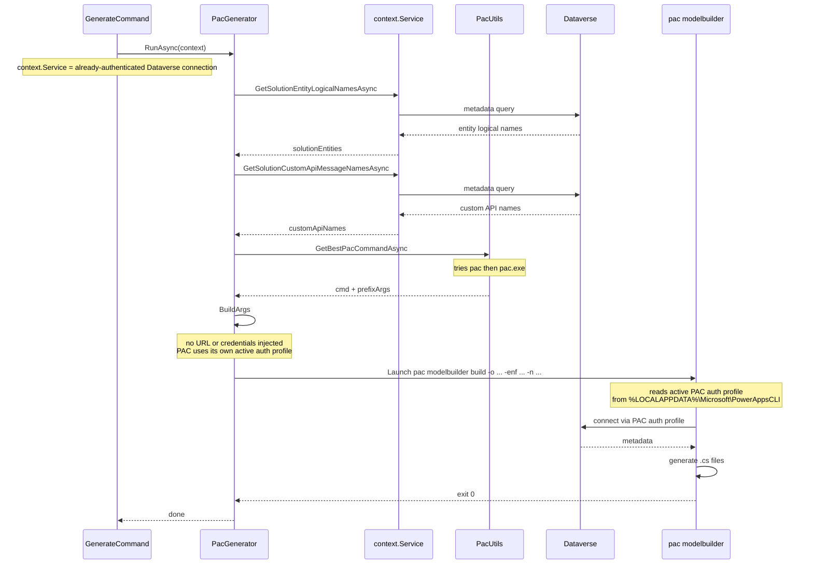
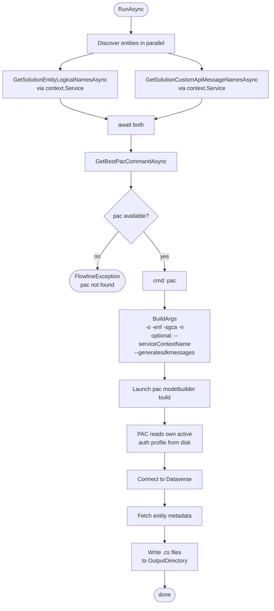

# PAC Auth Flow

```mermaid
sequenceDiagram
    participant GC as GenerateCommand
    participant PG as PacGenerator
    participant SVC as context.Service
    participant PU as PacUtils
    participant DV as Dataverse
    participant PAC as pac modelbuilder

    GC->>PG: RunAsync(context)
    Note over GC: context.Service = already-authenticated Dataverse connection

    PG->>SVC: GetSolutionEntityLogicalNamesAsync
    SVC->>DV: metadata query
    DV-->>SVC: entity logical names
    SVC-->>PG: solutionEntities

    PG->>SVC: GetSolutionCustomApiMessageNamesAsync
    SVC->>DV: metadata query
    DV-->>SVC: custom API names
    SVC-->>PG: customApiNames

    PG->>PU: GetBestPacCommandAsync
    Note over PU: tries pac then pac.exe
    PU-->>PG: cmd + prefixArgs

    PG->>PG: BuildArgs
    Note over PG: no URL or credentials injected<br/>PAC uses its own active auth profile

    PG->>PAC: Launch pac modelbuilder build -o ... -enf ... -n ...
    Note over PAC: reads active PAC auth profile<br/>from %LOCALAPPDATA%\Microsoft\PowerAppsCLI
    PAC->>DV: connect via PAC auth profile
    DV-->>PAC: metadata
    PAC->>PAC: generate .cs files
    PAC-->>PG: exit 0
    PG-->>GC: done
```

## Flowchart

```mermaid
flowchart TD
    A([RunAsync]) --> B[Discover entities in parallel]
    B --> C[GetSolutionEntityLogicalNamesAsync\nvia context.Service]
    B --> D[GetSolutionCustomApiMessageNamesAsync\nvia context.Service]
    C --> E[await both]
    D --> E
    E --> F[GetBestPacCommandAsync]
    F --> G{pac available?}
    G -->|no| ERR([FlowlineException\npac not found])
    G -->|yes| H[cmd: pac]
    H --> I[BuildArgs\n-o -enf -sgca -n\noptional: --serviceContextName\n--generatesdkmessages]
    I --> J[Launch pac modelbuilder build]
    J --> K[PAC reads own active\nauth profile from disk]
    K --> L[Connect to Dataverse]
    L --> M[Fetch entity metadata]
    M --> N[Write .cs files\nto OutputDirectory]
    N --> O([done])
```
