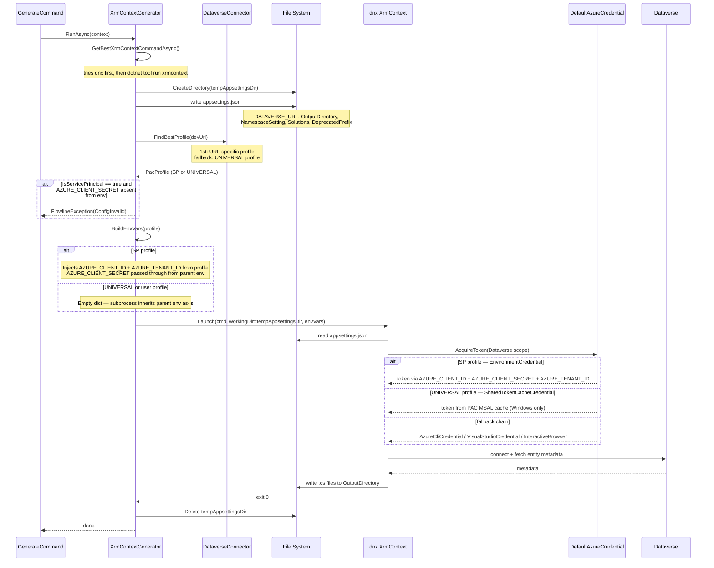
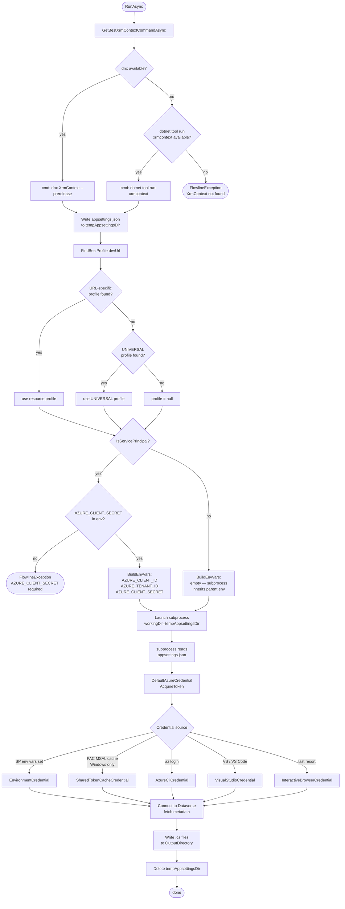

# XrmContext v4 Auth Flow

```mermaid
sequenceDiagram
    participant GC as GenerateCommand
    participant XG as XrmContextGenerator
    participant DC as DataverseConnector
    participant FS as File System
    participant SUB as dnx XrmContext
    participant DAC as DefaultAzureCredential
    participant DV as Dataverse

    GC->>XG: RunAsync(context)
    XG->>XG: GetBestXrmContextCommandAsync()
    Note over XG: tries dnx first, then dotnet tool run xrmcontext
    XG->>FS: CreateDirectory(tempAppsettingsDir)
    XG->>FS: write appsettings.json
    Note over FS: DATAVERSE_URL, OutputDirectory,<br/>NamespaceSetting, Solutions, DeprecatedPrefix
    XG->>DC: FindBestProfile(devUrl)
    Note over DC: 1st: URL-specific profile<br/>fallback: UNIVERSAL profile
    DC-->>XG: PacProfile (SP or UNIVERSAL)

    alt IsServicePrincipal == true and AZURE_CLIENT_SECRET absent from env
        XG-->>GC: FlowlineException(ConfigInvalid)
    end

    XG->>XG: BuildEnvVars(profile)

    alt SP profile
        Note over XG: Injects AZURE_CLIENT_ID + AZURE_TENANT_ID from profile<br/>AZURE_CLIENT_SECRET passed through from parent env
    else UNIVERSAL or user profile
        Note over XG: Empty dict — subprocess inherits parent env as-is
    end

    XG->>SUB: Launch(cmd, workingDir=tempAppsettingsDir, envVars)
    SUB->>FS: read appsettings.json
    SUB->>DAC: AcquireToken(Dataverse scope)

    alt SP profile — EnvironmentCredential
        DAC-->>SUB: token via AZURE_CLIENT_ID + AZURE_CLIENT_SECRET + AZURE_TENANT_ID
    else UNIVERSAL profile — SharedTokenCacheCredential
        DAC-->>SUB: token from PAC MSAL cache (Windows only)
    else fallback chain
        DAC-->>SUB: AzureCliCredential / VisualStudioCredential / InteractiveBrowser
    end

    SUB->>DV: connect + fetch entity metadata
    DV-->>SUB: metadata
    SUB->>FS: write .cs files to OutputDirectory
    SUB-->>XG: exit 0
    XG->>FS: Delete tempAppsettingsDir
    XG-->>GC: done
```

## Flowchart

```mermaid
flowchart TD
    A([RunAsync]) --> B[GetBestXrmContextCommandAsync]
    B --> C{dnx available?}
    C -->|yes| D[cmd: dnx XrmContext --prerelease]
    C -->|no| E{dotnet tool run\nxrmcontext available?}
    E -->|yes| F[cmd: dotnet tool run xrmcontext]
    E -->|no| ERR1([FlowlineException\nXrmContext not found])

    D --> G[Write appsettings.json\nto tempAppsettingsDir]
    F --> G

    G --> H[FindBestProfile devUrl]
    H --> I{URL-specific\nprofile found?}
    I -->|yes| J[use resource profile]
    I -->|no| K{UNIVERSAL\nprofile found?}
    K -->|yes| L[use UNIVERSAL profile]
    K -->|no| M[profile = null]

    J --> N{IsServicePrincipal?}
    L --> N
    M --> N

    N -->|yes| O{AZURE_CLIENT_SECRET\nin env?}
    O -->|no| ERR2([FlowlineException\nAZURE_CLIENT_SECRET required])
    O -->|yes| P[BuildEnvVars:\nAZURE_CLIENT_ID\nAZURE_TENANT_ID\nAZURE_CLIENT_SECRET]

    N -->|no| Q[BuildEnvVars:\nempty — subprocess\ninherits parent env]

    P --> R[Launch subprocess\nworkingDir=tempAppsettingsDir]
    Q --> R

    R --> S[subprocess reads\nappsettings.json]
    S --> T[DefaultAzureCredential\nAcquireToken]

    T --> U{Credential source}
    U -->|SP env vars set| V[EnvironmentCredential]
    U -->|PAC MSAL cache\nWindows only| W[SharedTokenCacheCredential]
    U -->|az login| X[AzureCliCredential]
    U -->|VS / VS Code| Y[VisualStudioCredential]
    U -->|last resort| Z[InteractiveBrowserCredential]

    V --> AA[Connect to Dataverse\nfetch metadata]
    W --> AA
    X --> AA
    Y --> AA
    Z --> AA

    AA --> AB[Write .cs files\nto OutputDirectory]
    AB --> AC[Delete tempAppsettingsDir]
    AC --> AD([done])
```
