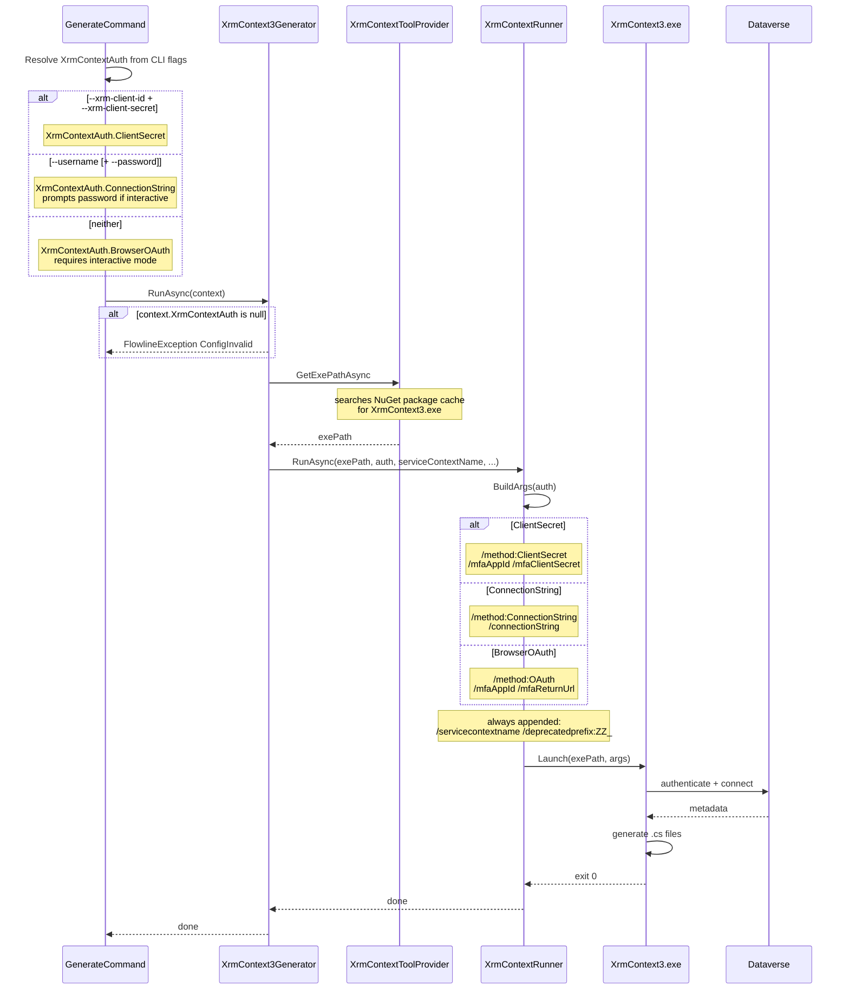
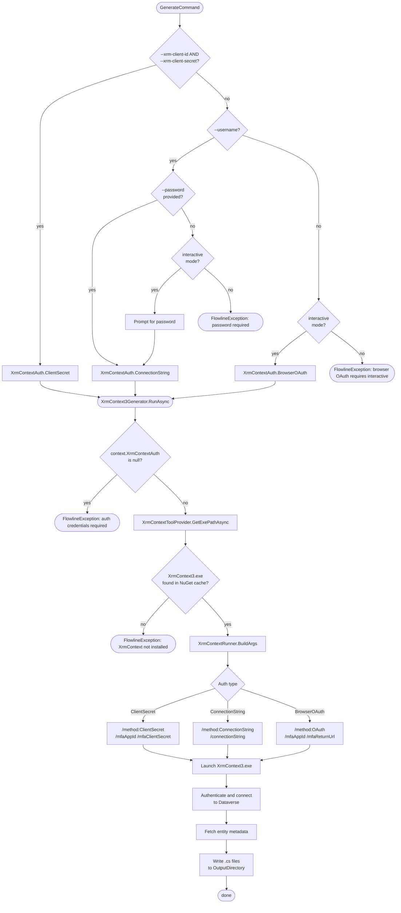

# XrmContext3 Auth Flow

```mermaid
sequenceDiagram
    participant GC as GenerateCommand
    participant XG as XrmContext3Generator
    participant TP as XrmContextToolProvider
    participant XR as XrmContextRunner
    participant XCX as XrmContext3.exe
    participant DV as Dataverse

    GC->>GC: Resolve XrmContextAuth from CLI flags

    alt --xrm-client-id + --xrm-client-secret
        Note over GC: XrmContextAuth.ClientSecret
    else --username [+ --password]
        Note over GC: XrmContextAuth.ConnectionString<br/>prompts password if interactive
    else neither
        Note over GC: XrmContextAuth.BrowserOAuth<br/>requires interactive mode
    end

    GC->>XG: RunAsync(context)

    alt context.XrmContextAuth is null
        XG-->>GC: FlowlineException ConfigInvalid
    end

    XG->>TP: GetExePathAsync
    Note over TP: searches NuGet package cache<br/>for XrmContext3.exe
    TP-->>XG: exePath

    XG->>XR: RunAsync(exePath, auth, serviceContextName, ...)
    XR->>XR: BuildArgs(auth)

    alt ClientSecret
        Note over XR: /method:ClientSecret<br/>/mfaAppId /mfaClientSecret
    else ConnectionString
        Note over XR: /method:ConnectionString<br/>/connectionString
    else BrowserOAuth
        Note over XR: /method:OAuth<br/>/mfaAppId /mfaReturnUrl
    end

    Note over XR: always appended:<br/>/servicecontextname /deprecatedprefix:ZZ_

    XR->>XCX: Launch(exePath, args)
    XCX->>DV: authenticate + connect
    DV-->>XCX: metadata
    XCX->>XCX: generate .cs files
    XCX-->>XR: exit 0
    XR-->>XG: done
    XG-->>GC: done
```

## Flowchart

```mermaid
flowchart TD
    A([GenerateCommand]) --> B{"--xrm-client-id AND
--xrm-client-secret?"}
    B -->|yes| C[XrmContextAuth.ClientSecret]
    B -->|no| D{"--username?"}
    D -->|yes| E{"--password
provided?"}
    E -->|yes| F[XrmContextAuth.ConnectionString]
    E -->|no| G{"interactive
mode?"}
    G -->|yes| H[Prompt for password]
    H --> F
    G -->|no| ERR1([FlowlineException: password required])
    D -->|no| I{"interactive
mode?"}
    I -->|yes| J[XrmContextAuth.BrowserOAuth]
    I -->|no| ERR2([FlowlineException: browser OAuth requires interactive])

    C --> K([XrmContext3Generator.RunAsync])
    F --> K
    J --> K

    K --> L{"context.XrmContextAuth
is null?"}
    L -->|yes| ERR3([FlowlineException: auth credentials required])
    L -->|no| M[XrmContextToolProvider.GetExePathAsync]
    M --> N{"XrmContext3.exe
found in NuGet cache?"}
    N -->|no| ERR4([FlowlineException: XrmContext not installed])
    N -->|yes| O[XrmContextRunner.BuildArgs]

    O --> P{Auth type}
    P -->|ClientSecret| Q["/method:ClientSecret
/mfaAppId /mfaClientSecret"]
    P -->|ConnectionString| R["/method:ConnectionString
/connectionString"]
    P -->|BrowserOAuth| S["/method:OAuth
/mfaAppId /mfaReturnUrl"]

    Q --> T[Launch XrmContext3.exe]
    R --> T
    S --> T

    T --> U[Authenticate and connect
to Dataverse]
    U --> V[Fetch entity metadata]
    V --> W[Write .cs files
to OutputDirectory]
    W --> X([done])
```
